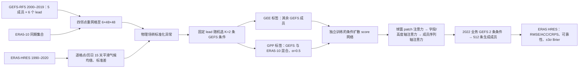

# 88｜SEEDS：两条 GEFS 轨迹条件下的扩散集合扩充与偏差订正

> Lizao Li、Robert Carver、Ignacio Lopez-Gomez、Fei Sha、John Anderson，*Generative emulation of weather forecast ensembles with diffusion models*，2024-03-29 发表于 *Science Advances* **10(13):eadk4489**，[DOI/正式论文](https://doi.org/10.1126/sciadv.adk4489)、[PMC 正式版](https://pmc.ncbi.nlm.nih.gov/articles/PMC10980268/)、[正式版开放 XML](https://www.ebi.ac.uk/europepmc/webservices/rest/PMC10980268/fullTextXML)。同一工作的早期题名为 *SEEDS: Emulation of Weather Forecast Ensembles with Diffusion Models*，2023-06-24 [arXiv:2306.14066v1](https://arxiv.org/abs/2306.14066)，2023-10-08 [v3 全文与附录](https://arxiv.org/html/2306.14066v3)。2024 年正式发表，故纳入 2024–2026 回溯，**不把预印本和期刊版重复计篇**。[作者研究页](https://research.google/pubs/seeds-emulation-of-weather-forecast-ensembles-with-diffusion-models/)；[官方代码/演示](https://github.com/google-research/google-research/tree/master/seeds)、[检查点](https://doi.org/10.5281/zenodo.10420420)。阅读日期：2026-09-24。

> 证据层级：正式版正文、主图 1–8 和表 1 以 *Science Advances* 的 PMC/XML 为准；预印本附录用于补充轴向注意力、样本构造与超参数，但**正式独立补充 PDF 图 S1–S15 尚未逐页核对**。正式版与 v3 在图号和部分文字上有差别，下面不把早期图 8 的 ±2σ 写成正式版主图 7 的 ±3σ。

## 为什么需要它，究竟预测什么

GEFS v12 业务集合有 31 条物理预报轨迹，计算很多真实成员很贵，少数成员又难采到尾部事件。SEEDS 学习一个条件扩散采样器：给它同一起报、同一目标 lead 的 **K=2 条 GEFS 成员预报场**，再生成大量具有空间与变量联合结构的预报场。它不是“从当下观测独立积分到未来”的天气底座；没有两条物理预报输入，就没有本文检验过的这套 512 成员输出。[正式版引言、方法、讨论](https://www.ebi.ac.uk/europepmc/webservices/rest/PMC10980268/fullTextXML)

作者拆开两种目标。**SEEDS-GEE**（generative ensemble emulation）学习 GEFS 自身的成员分布，目的是廉价扩充成员、尽量保持 GEFS 的统计结构；**SEEDS-GPP**（generative postprocessing）在训练目标中混入 ERA5 十成员再分析，学习一个向分析分布靠近的集合，意在减少 GEFS 系统偏差。两者网络家族一样，却是按目标分别训练的模型，不是“先训 GEE 再对它做一次微调”；论文没有报告从 GEE checkpoint 初始化 GPP 或冻结若干层。[正式版方法 §Setup、§Data](https://www.ebi.ac.uk/europepmc/webservices/rest/PMC10980268/fullTextXML)

正式版给 **1、4、7、10、13、16 天**六个离散 lead，直接包含中期第 10/13 天和 S2S 前段第 16 天。每个 lead 有单独的条件扩散模型，而不是一个以 6h/24h 步长自回归滚动 16 天的统一预报器。两条 GEFS 种子先要由 NWP 系统算出，这一上游开销和模型升级风险不能从“扩散采样快”中消掉。[正式版方法 §Data](https://www.ebi.ac.uk/europepmc/webservices/rest/PMC10980268/fullTextXML)

## 数据、筛选和标准化：可复验的输入链

| 资料或环节 | 论文实际处理 | 结论边界 |
| --- | --- | --- |
| GEE 训练目标 | GEFS **v12 五成员 reforecast**（GEFS-RF5），**2000-01-01–2019-12-31**；每个起报日与固定 lead 的五个成员组成一个小集合。 | 使用二十年版本一致的 reforecast 扩展天气型覆盖，而不是拿 2022 年 GEFS-Full 主测试当训练标签。 |
| GPP 额外目标 | 同期 **ERA5 十成员再分析集合**（ERA5-10），与 GEFS-RF5 组成混合目标；GEE 不使用 ERA5 集合作生成目标。 | ERA5 是模式—同化产品，不是无误差观测；“向 ERA5 订正”不保证所有物理量和站点实际观测都改善。 |
| 条件与独立核验 | 推理时从 GEFS v12 **31 成员业务集合**中随机取 **2** 条作条件；以 ERA5 HRES/单值再分析作真值。验证期使用 2020-09-23–2021-12-31 业务 GEFS/ERA5，**2022 年**留作测试；为满足 16 天 lead，统一测试起报到 **2022-12-15，共 349 天**。 | GEFS-RF5 与业务 GEFS-Full 被视为分布近似，但并非逐日同初值、完全同样本的两个产品。模型性能仍依赖选到的上游条件成员。 |
| 空间/时间配准 | 全部字段用 **四邻点反距离权重**重网格到六面体 (6×48×48)、约 **2°**；每个自然日只取 **00 UTC** 场。 | 这是全球粗网格、日采样；不证明局地高分辨率降水、对流、台风内核技巧。 |
| 八个预报字段 | MSLP（Pa）、T2M（K）、U850/V850（m/s）、Z500（m²/s²）、T850（K）、整层水汽 TCWV（kg/m²）、Q500（kg/kg）。 | **没有降水字段**；作者理由是验证用 ERA5 降水有重要偏差，不应从 SEEDS 论文本身推断其降水 CRPS 优势。 |
| 气候标准化 | 用 ERA5 HRES **1990–2020** 逐格点、逐历日均值/标准差，跨年循环的 **15 天居中平滑**；2 月 29 日取 2 月 28 日与 3 月 1 日平均。网络输入/输出为标准化异常，条件另输入历日气候均值，评分前转回物理量。 | 气候统计期含 **2020 年验证窗口**，但不含 2022 测试；需要将这一处理与模型权重训练期分开描述。 |

正式版主文表 1 给上述八变量及单位；主图主要展示 MSLP、T2M、U850，不能把主图三变量的排序逐项套到另五变量。数据来源及作者处理后的资料链接见文末。[正式版“Data for learning and evaluation”、表 1](https://www.ebi.ac.uk/europepmc/webservices/rest/PMC10980268/fullTextXML)

## 网络与训练：两种采样器为什么不一样

*依据正式版方法与早期预印本附录 B 自行重绘，不转载论文插图。网络按目标、lead 和条件数分别训练；流程图的两条目标分支不表示 GPP 对 GEE 权重做继续训练。*

在每个起报日/lead 的五成员 GEFS-RF5 中，GEE 随机选两条做条件，再从剩余成员取一条作去噪学习目标；反复组合使有限成员的配对方式变多。GPP 的条件仍来自 GEFS，但去噪目标以概率 `α=(5−K)/(5−K+K′)` 从剩余 GEFS 成员抽，或以 `1−α` 从同日 ERA5-10 抽；主设置 **K=2、K′=3、α=0.5**。这是**训练样本目标分布的混合**，不是在推理时把 50% 已生成的 GEFS 成员与 50% ERA5 真值拼接，也不是使用未来 ERA5 作为推理输入。主评分只计 512 条新生成成员，早期方法附录明说种子成员未混入输出，构成较严格的对照。[正式版 Setup；预印本附录 B.1–B.2](https://arxiv.org/html/2306.14066v3)

扩散训练把目标标准化异常加不同噪声，学习由噪声场、扩散时间、两条 GEFS 条件场及历日气候态共同决定的 score/去噪方向；推理从随机噪声迭代采样，扩散“时间”不等于天气预报 lead。主干是轴向注意力 ViT：六面体每面 (48×48)，空间 patch 边长 **12**，总 **96 个 patch**，嵌入维 **768**；分别用 **6/4/6 层**注意力处理空间 patch、物理变量/高度、序列成员轴，前馈层宽 **4×768**。字段与高度为可学习类别嵌入，成员用类型/相对物理时间嵌入，扩散时间用 Fourier 特征 token；这样的构造尽量让两条条件成员可交换，同时学习跨空间、跨字段的相关结构。作者预印本附录给精确 **113,777,296 个可训练参数**，正式主文写约 **114M**。[正式版“Learning method and architecture”；预印本附录 B.3](https://arxiv.org/html/2306.14066v3)

| 训练或推理参数 | 原文数值/流程 | 不能补造的部分 |
| --- | --- | --- |
| 训练日程 | 每个 `lead×K×任务/混合权重` 模型独立训练；**batch 128、200,000 steps**，从历史日期和 GEFS 小集合随机采样。 | 正式主文及可访问的 v3 附录未列明具体优化器、初始/末端学习率、衰减、随机种子、噪声调度/精确采样步数或各轮选模准则；不能将其他扩散模型设置代入。 |
| 模型与硬件 | 约 **114M 参数**；每个模型在 **2×2×4 TPUv4** 集群上训练略少于 **18 小时**。 | 这是单模型时间，不是全部 lead/两任务总训练成本；芯片数量与采购成本不能直接与 GEFS 核时等同。 |
| 生成开销 | **4×8 TPUv3**、推理 batch **512**，一批耗时不到 **3 分钟**；个例可生成 **16,384** 条场。 | 这些是生成步骤的实测吞吐，不包含先跑出两条 GEFS 物理轨迹、数据传输、训练摊销或业务保障。 |
| 微调 | 文中没有“先预训练 GEE，再冻结/解冻模块以 ERA5 微调”的实验；GEE 与 GPP 是**不同监督目标下分别训练**。 | 微调起点、冻结比例、微调学习率等因此**不适用/未披露**，不可把 GPP 错写成已验证的迁移微调。 |

## 评测口径与正式版主图逐项阅读

对四套系统统一比较：两条原始条件成员 **GEFS-2**、完整 **GEFS-Full 31 成员**、**SEEDS-GEE 512 成员**、**SEEDS-GPP 512 成员**。ERA5 HRES 是格点验证参照；集合均值用 RMSE/ACC，概率场用 CRPS、rank histogram 及不可靠度指标 `δ`（越低越好）。极端事件把每成员是否超过逐格点气候均值 **±3σ** 变成事件概率，再用 Brier 分数评分；不同变量/lead、正负阈值不能混成一个总排名。模型整体采样成本优势与概率技巧改善应分开检验。[正式版结果图 5–7](https://www.ebi.ac.uk/europepmc/webservices/rest/PMC10980268/fullTextXML)

| 正式版图 | 经核对的可报告结果 | 同时保留的反证/限制 |
| --- | --- | --- |
| 图 1：2022-07-14 全球水汽 | 第 7 天同起报 GEFS 条件、真实 GEFS、SEEDS-GEE 输出在全球水汽形态上可对照。 | 单日可视化不构成全球时序技巧评分。 |
| 图 2：欧洲热浪 stamp map | 在里斯本以西低槽案例，GEE 的 MSLP–Z500 联合空间结构接近 GEFS/ERA5；只按逐格点均值和方差抽样的独立 Gaussian 破坏空间/跨变量相关。 | 此对照 Gaussian 刻意丢弃协方差，不代表所有传统统计后处理或所有多变量校准器。 |
| 图 3：全球谱 | 2022 年 1 月、第 7 天，MSLP/T2M/V850 的 SEEDS-GEE 谱整体与 GEFS-Full/ERA5 接近。 | 低层风等场仍有系统差异；谱一致不等于每个极端个例或守恒量正确。 |
| 图 4：里斯本极端高温 | 2022-07-07 的第 7 天起报，业务 GEFS 31 成员无一达到 7 月 14 日 ERA5 温度；16,384 条生成样本的 T2M–TCWV 联合分布能覆盖该事件，GPP 较 GEE 更偏向较暖真实值。 | 这是一个高影响**案例**，覆盖真值不等于单例概率校准；作者用 GEFS 核密度估计该事件概率 **<1%**，未提供“生成样本有极端值即预报一定准确”的结论。 |
| 图 5：rank histogram/δ | 加州–内华达第 7 天 GEFS 的 MSLP/T2M/U850 有偏、T2M 离散不足；GPP 缓解这些问题。全球 δ 对三字段各 lead 的方向也支持 GPP 更可靠，首周最明显。 | rank histogram/δ 衡量边缘校准，不能单独证明多变量动力一致性；GEFS-Full、512 生成成员数不同，使用论文的标准化比较。 |
| 图 6：RMSE/ACC/CRPS | 两种 SEEDS 都显著好于只拿两条种子的 GEFS-2；GEE 与 GEFS-Full 总体接近、**多数指标略差**；GPP 在 T2M 明显优于 GEFS-Full，MSLP/U850 大致相当。 | “SEEDS 全字段、全指标战胜 GEFS-Full”与正式正文不符。GPP 收益与 GEFS 近地面冷偏差有关，不能跨变量复制。 |
| 图 7：±3σ 极端 Brier | GEE 对极端分类稍好于 GEFS-Full、远好于 GEFS-2；GPP 对 T2M/U850 明显更好，其他字段多数 lead 较优；第 7 天与对 GEFS-Full 做 quantile mapping 的后处理对照仍持平或占优。 | 主图阈值是 **±3σ**，不是早期预印本文字的 ±2σ；Brier 优势受 2°/ERA5 定义约束，没有独立站点超纪录事件检验。 |
| 图 8：spread 信息 | 第 **4–10 天** GEE/GPP 的逐格点离散度与 GEFS-Full 相关高于两种子及模式气候态；≥10 天时除 GEFS-2 外连模式气候态也达到 **≥90%** 相关。 | 长 lead 的高相关不能证明还携带当天独特可预测信息；论文明确说“填补分布空隙”是合理假说，个体样本幻觉无法由这些诊断排除。 |

正式版主图没有给上述全部曲线逐 lead 精确数值表，本表故只转写正文可核对的方向、阈值、成员数及明确数字，**不从低分辨率曲线估造 RMSE/CRPS 数字**。正式补图 S1–S15 尚未逐张读取；预印本附录中编号 13–27 是另一版图号，不把它们冒充正式版补图。[正式全文 Results/Discussion](https://www.ebi.ac.uk/europepmc/webservices/rest/PMC10980268/fullTextXML)

## 版本纠偏、局限和复现步骤

正式版题名省去“SEEDS:”，但研究、作者及 DOI/预印本是同一成果。正式主文采用 lead **1/4/7/10/13/16 天**，早期 v3 的附录 B.2 却写 **1/3/6/10/13/16 天**，与其本身主文也冲突；本笔记按正式版主文与作者正式数据协议编目，复现时仍需检查代码配置/检查点的实际 lead 标识。正式图 7 评分的是 **±3σ**，早期预印本文字/图号存在 ±2σ 的位置；不能跨版复用图号或门槛。[正式方法与图 7](https://www.ebi.ac.uk/europepmc/webservices/rest/PMC10980268/fullTextXML)｜[预印本附录 B.2](https://arxiv.org/html/2306.14066v3)

复现应先核查公开的 [处理后数据](https://console.cloud.google.com/storage/browser/gresearch/seeds/data)、[checkpoint](https://doi.org/10.5281/zenodo.10420420)、[演示 Colab](https://doi.org/10.5281/zenodo.10420266) 对应的 lead/变量和归一化文件；以 2022 年 349 次起报、固定两条 GEFS 种子及独立随机采样，先跑 GEE 512 成员的正式图 6/7，再替换 GPP、GEFS-Full 和 GEFS-2，对 1/4/7/10/13/16 天分别计分。为检验业务价值，仍应以多年/跨版 GEFS、独立站点与雷达、实际极端事件和物理预算指标重评，并把两条上游物理轨迹的成本算进去；这些是**建议的追加实验**，并非作者已交付的 2024 正式结果。[正式版数据可用性、讨论](https://pmc.ncbi.nlm.nih.gov/articles/PMC10980268/)

## 阅读来源

- [*Science Advances* DOI](https://doi.org/10.1126/sciadv.adk4489)、[PMC 正式开放版](https://pmc.ncbi.nlm.nih.gov/articles/PMC10980268/)、[Europe PMC 正式全文 XML](https://www.ebi.ac.uk/europepmc/webservices/rest/PMC10980268/fullTextXML)：正式发布日期、标题、方法/表 1/图 1–8 的文字与图注；主结果以此为准。
- [作者 2023 v3 开放全文与附录](https://arxiv.org/html/2306.14066v3)：B.1–B.3 的配对样本、GPP 混合、轴向 ViT 与参数；与正式版冲突处已显式标注。
- [Google Research 作者页](https://research.google/pubs/seeds-emulation-of-weather-forecast-ensembles-with-diffusion-models/)、[开源项目](https://github.com/google-research/google-research/tree/master/seeds)：书目、数据/权重入口。本次未运行作者训练或推理，未声称本仓库独立重复出原文曲线。
