# 89｜Huge ensembles Part 1：SFNO–BVMC 的 15 天集合预报设计与极端诊断

> Ankur Mahesh、William D. Collins、Boris Bonev、Noah Brenowitz、Yair Cohen、Joshua Elms、Peter Harrington、Karthik Kashinath、Thorsten Kurth、Joshua North、Travis O'Brien、Michael Pritchard、David Pruitt、Mark Risser、Shashank Subramanian、Jared Willard，*Huge ensembles – Part 1: Design of ensemble weather forecasts using spherical Fourier neural operators*，*Geoscientific Model Development* **18**, 5575–5603，**2025-09-04 正式发表**，[期刊开放全文](https://gmd.copernicus.org/articles/18/5575/2025/)，[DOI](https://doi.org/10.5194/gmd-18-5575-2025)。同一论文先于 **2024-08-06** 发布 [arXiv:2408.03100v1](https://arxiv.org/abs/2408.03100)，2025-02-18 更新 v2、2025-04-03 更新 v3；**版本不重复计篇**。阅读日期：2026-09-24。

> 本笔记以同行评审后的期刊正文、图 1–15 和附录 A–E 为依据；图表下文以中文逐项转述，流程图由本文重绘，不转载原图。没有逐条执行作者代码/训练；源代码与权重的开放链接不等于本文结果已由本仓库复现。[期刊正文及代码可用性](https://gmd.copernicus.org/articles/18/5575/2025/)

## 研究问题、时效与核心区别

传统物理集合通常几十个成员，而极罕见高影响事件的分布尾部需要更多抽样；直接把物理模式扩大到几千成员成本很高。本篇**先设计并验证**可扩容的机器学习集合系统 SFNO–BVMC：确定性 SFNO 负责每 **6 小时**向前预报，多套独立训练权重表示模型不确定性，随流场变化的 bred vector（繁殖向量，BV）表示初值不确定性。下一篇 Part 2 才分析 **7424 成员**的巨大回报集合；不能把 Part 2 的尾部统计实验当作本篇的 58 成员主评测结果。[引言、§2、§4](https://gmd.copernicus.org/articles/18/5575/2025/)

每个成员自回归积分至 **360 小时＝15 天**，覆盖中期预报的完整后段；主评测有 2020 全年的 CRPS、spread–error 和集合均值 RMSE，也有 2023 夏季热极端可靠性与判别力。其问题不是 S2S 第 3–4 周技巧，也不是从卫星原始观测直接做同化：输入为 ERA5 再分析的大气状态，且论文不预报降水。[§2.3、§3、§4](https://gmd.copernicus.org/articles/18/5575/2025/)

## 数据、处理与隔离验证

| 环节 | 正式论文可核验的做法 | 阅读/复现边界 |
| --- | --- | --- |
| 状态资料 | ECMWF **ERA5，0.25°**规则经纬网；附录 C 明确全球 **721×1440** 格点。输入的 **74 个预报变量通道**与输出的 74 通道相同，均预测 6 小时后状态；另加 **3 个只作输入**的字段：太阳天顶角余弦、地形、陆海掩膜。 | 不能把 3 个静态/外强迫字段算成 77 个被预测的气象变量。 |
| 地表湿热 | 相比所沿用 SFNO 的 73 个预报通道，本文**新增 ERA5 2 m 露点温度**，与 2 m 气温联用以计算湿热/heat index。 | 这不是降水预测；作者明确指出 SFNO–BVMC 不输出降水。 |
| 时间切分 | **1979–2016** 训练；**2018** 验证，调 BV 幅度与 checkpoint 数；**2020** 留出测试，用 00/12 UTC 每天两次、全年 **732 次**起报；另以 **2023-06 至 2023-08 的 92 个 00 UTC 起报日**评测高温极端。 | 2018 上的调参消融不应冒充独立测试；2023 的极端统计也不能与 2020 全年评分混作同一测试集。 |
| 损失与字段权重 | 一步目标为 **6h 后 ERA5**；纬度加权的确定性 MSE，对不同变量还按**气压层与训练集中时间变化幅度**加权。 | 正文未给所有 74 通道的归一化均值/方差、缺测填补、优化器、学习率日程与随机种子具体数值；需查公开代码配置，不能由相近 SFNO 论文补造。 |
| 比较系统 | SFNO–BVMC 用 ERA5 初始状态与 **ERA5 验证**；IFS ENS 用它自己的 ECMWF **业务分析作初值和真值**，业务分数来自 WeatherBench 2。 | 两系统 **58 vs 50 成员**、初值/验证真值并不完全相同。可报告论文给出的同图比较，但不是严格“同初值同真值”公平竞赛。 |

这些切分、字段和验证协议来自期刊 [§2 与 §3](https://gmd.copernicus.org/articles/18/5575/2025/)；预处理没有披露的部分明确留空。文中 2020 年 732 次起报说明一年完整日历 × 2，而 2023 极端实验的 92 次是每天 00 UTC 一次，不能把两者的样本量相加做同一种显著性检验。

## 模型结构、参数与训练全过程

```mermaid
flowchart LR
  A["ERA5 1979–2016：0.25°、74 个状态通道"] --> B["加 3 个输入：太阳天顶角余弦、地形、陆海掩膜"]
  B --> C["逐格点 MLP 编码 → 8 个球谐 SFNO 块 → 逐格点 MLP 解码"]
  C --> D["下一时刻 74 通道；6h 单步纬度/气压/时间变化加权 MSE"]
  D --> E["从不同随机初值各自训练 70 epoch：共 34 个 1.1B checkpoint"]
  E --> F["2018 年验证：选 29 套权重表示模型不确定性"]
  F --> G["每套权重另做 500 km 相关噪声与 3 步 BV breeding"]
  G --> H["每个 BV 对 t0 状态分别 +/−，得到 29×2＝58 成员"]
  H --> I["每 6h 滚动至 360h／15 天"]
  I --> J["2020 全年/2023 夏季：CRPS、离散度、谱、极端概率"]
```

*据正式论文图 1、4 和 §2–3 自行重绘；训练是确定性模型**分别从随机权重重新开始**，BV 与多 checkpoint 是训练后的集合化操作，不是端到端概率损失训练或先训后微调。* [原文图 1/4、§2.1–2.4](https://gmd.copernicus.org/articles/18/5575/2025/)

SFNO 前后分别用逐格点 MLP 编码/解码；中间 **8 个**球面傅里叶神经算子块。每块在球谐变换后的谱空间作可学习滤波，再用 MLP 更新隐态；首块按 `scale factor` 下采样、末块恢复原分辨率。球面谱结构适于经纬球面上的全局相互作用。作者用 **9 个邻近起报时刻组成 lagged ensemble** 来筛选大/中/小模型的离散度，不是正式 SFNO–BVMC 的 58 成员评测。[§2.1、图 2](https://gmd.copernicus.org/articles/18/5575/2025/)

| 架构候选 | `scale factor` | 隐空间 `embedding dimension` | 可学习参数 | 论文的选择依据 |
| --- | ---: | ---: | ---: | --- |
| Small | 6 | 220 | 48M | 下采样较强，lagged ensemble 离散度与第 15 天小尺度谱表现较弱。 |
| Medium | 4 | 384 | 218M | 介于两者之间；只作架构消融。 |
| **Large（最终）** | **2** | **620** | **1.1B/个** | 第 15 天谱退化最小，lagged ensemble spread–error 更接近 1，遂采用。 |

最终每个 large SFNO 在 **256×80GB NVIDIA A100** 上训练约 **16 小时、70 epochs、batch 64**；数据并行分 batch，空间模型并行把场分为 **4 个纬度带**。作者明确**没有穷举网格搜索**，而把预算投入多次从头训练。总共训练 **34 个**不同随机初始权重的 1.1B 模型；在 2018 年每周一次的 52 个验证初值上，比较 4 到 34 个 checkpoint（间隔 5），对每档做 bootstrap 估计，5 天预报离散度约在 **29 个**趋于饱和，正式集合取 29 个。34 个权重均公开，但“34 可用”与“29 进入本文主集合”要分清。[§2.1–2.2、图 2–3](https://gmd.copernicus.org/articles/18/5575/2025/)

作者**没有多步自回归微调**：理由是多步 MSE 会强化场的模糊，破坏单成员谱及小尺度扰动的增长。这里的一步训练与 15 天推理要分开；“没有微调”不是缺漏的训练阶段。若以后对该模型做区域微调，属于作者讨论的后续可能性，本文没有可转写的冻结层、微调轮数或区域验证成绩。[§3.2、§4](https://gmd.copernicus.org/articles/18/5575/2025/)

## BV 初值扰动：逐步到可重现的细节

在目标起报时刻 `t0` 之前的 `t−2`（两个 6h 时间步）先给 **500 hPa 位势**加球面空间相关的随机噪声，相关长度 **500 km**；不直接独立噪声化温度、湿度、近地场，以减少场间不一致。对该 checkpoint 同时跑受扰与无扰的一步预报，取差场；把差场按变量/气压层缩放后，用于下一时刻输入，并在 `t−1`、`t0` 再做相同步骤。初始只扰动 Z500，后续差场已传播到全部 **74 个通道**。[§2.3、图 4–5](https://gmd.copernicus.org/articles/18/5575/2025/)

每通道的目标扰动 RMS 为该确定性 SFNO **48h RMSE ×0.35**（在 2018 年验证集调得）；南北半球域外各自缩放，热带跨约 20°N/20°S 做线性插值避免跳变，对水汽量作非负裁切。同一个终态 BV 既加到 `t0` 又从 `t0` 减去，构成中心对称的两个初值；**29 套权重×每套 1 个 BV×2 个符号＝58 成员**，不是在一个 checkpoint 上复用同一条扰动，也不是 58 套独立训练权重。论文指出中心对称扰动改善 2018 年集合均值 RMSE。[§2.3、图 4–5、附录 B](https://gmd.copernicus.org/articles/18/5575/2025/)

图 6 的消融是归因关键：**仅 29 checkpoint** 的 29 成员集合早期欠离散；**仅 1 checkpoint＋29 对 BV** 的 58 成员集合在天气尺度 **3–5 天**仍欠离散；同时使用两类不确定性，58 成员 spread–error 才更接近 1。因此“多模型本身就校准了”或“只加初值噪声就够”均不符合论文消融结果。[§2.4、图 6](https://gmd.copernicus.org/articles/18/5575/2025/)

## 性能图表的逐项内容：量化、方向与不能外推处

| 原文图/附录 | 试验口径与论文可复核结论 | 不能省略的反面结果/解释 |
| --- | --- | --- |
| 图 1 | 29 套 SFNO 权重代表模型扰动；每套自生 BV 的 `+/−` 初值代表初始状态扰动。 | 是模型**结构示意**，不是直接的评分图。 |
| 图 2 | small/medium/large 的 **9 时刻滞后集合**比较：850hPa 温度 spread–error 与 360h 相对 ERA5 功率谱均支持 large。 | 不能把图 2 的滞后集合视为正式 58 成员 BVMC，也不能仅凭谱证明局地极端预报命中。 |
| 图 3 | 2018 验证年、52 个起报、**120h**、总柱水汽/10m 风/2m 气温：随模型数增加，离散度在约 **29 checkpoint** 趋平台。 | 选择数目是验证集设计决策，不是独立 2020 测试期的优化结论。 |
| 图 4–5 | 图 4 给出 500km 噪声→繁殖→中心对称初值；图 5 展示湿度、风、压、温、位势等六字段的扰动空间结构。 | 图 5 单一时刻的海陆/纬度幅度是机制说明，不是“所有天气型都物理一致”的系统检验。 |
| 图 6 | 2018 52 次起报的模型-only/BV-only/组合消融；两种不确定性共同支撑校准。 | 组合的不同成员数 **29 vs 58** 需随图注一起读。 |
| 图 7：CRPS | 2020 全年 **732 次**起报；T850、T2M、Q850、Z500 的 BVMC 大致比 **IFS ENS 落后 12–18h**；U10 与 IFS ENS 大致相当。 | 不可写成“全字段优于 IFS”；58/50 成员且各验各的分析场。 |
| 图 8–9 | 同一 732 次、所有 lead：图 8 离散度/误差比在长 lead 近 1；图 9 集合均值 RMSE 与 IFS 接近，至 **360h** 靠近气候基线。 | BVMC 对 Z500 以外字段在短 lead **仍欠离散**；业务实用技巧不能由“接近气候”推出。论文图 9 正文把 360h 写成“14d”，与数学换算 **15d** 不符，以小时数为准。 |
| 图 10–12：谱 | 图 10–11 中单成员 24–360h 谱近乎恒定；图 12 中集合均值随 lead 变模糊，3–5 天约 **1000km** 天气尺度能量下降形态近 IFS ENS。 | 单成员在**前 24h**已较 ERA5 损失小尺度能量，之后稳定不等于从零时刻就无模糊；作者未解决 MSE 与 6h 步长产生的全部谱退化。 |
| 图 13–14：EFI | 基于各自模式气候态的极端预报指数：2023-08-19 起报 **第 4 天**的两系统全球纬度加权 EFI 相关 **0.89**；夏季 **92 个 00 UTC** 起报期保持较高相关。 | EFI 只衡量相对各自气候态的“异常程度”，**两系统 EFI 彼此相似不等于命中真实极端**；SFNO EFI 视觉上较平滑。 |
| 图 15：极端 | 2023 夏季 92 日：2m 高温 **95 百分位**的可靠性曲线、EFI ROC-AUC 与极端加权 **twCRPS**；BVMC 与 IFS 的热极端概率表现近似，twCRPS 略好。 | 用于可靠性/twCRPS 的月×UTC 时次 **48 套阈值**，用于日均 EFI ROC 的月阈值是 **12 套**；IFS EFI 只取得 **第 7 天**，不可称 14 天两者均已同图比 AUC。 |
| 附图 D1–D4 | 48/96h 近地气温及 heat index、冬季冷端和风极端的可靠性；多数较短 lead 与 IFS 接近。 | **240h** 时风/冷端给出 >70% 高概率极端时**过度自信**，不过此类高概率样本很少；全局 CRPS 好不代表尾部所有概率档校准。 |

表内为图题/正文支持的数值与方向；正式文章没有把全部图 7/15 的各 lead 曲线给成数据表，故不从图像目测捏造 CRPS、AUC 或 RMSE 小数。图 13 的 **0.89** 是**两个 EFI 场的相关**，不是对实际发生极端的 AUC。[正式论文图 1–15 与附录 D](https://gmd.copernicus.org/articles/18/5575/2025/)

## 极端评分为什么要这样算

普通 CRPS 对每格点集合概率分布相对验证值的误差积分，兼顾位置与离散度；spread–error 比期望约为 1，但它不测是否抓住特定尾部事件。作者对极端 2m 气温另定义逐格点、逐月、逐 UTC 时次的 95 百分位门槛，以 **1992–2016 ERA5** 估计；概率为 58 成员中超过门槛的占比，再对照是否实际超过。热指数还需 T2M 与露点字段，体现新增字段的目的。[§3.1、§3.3.2](https://gmd.copernicus.org/articles/18/5575/2025/)

EFI 需模式自身回报气候态。SFNO–BVMC 模仿 ECMWF M-Climate 的多年/多起报样本，但由于中心对称扰动，每个回报用 **12 个成员**，而 IFS 气候态用 **11 个**。EFI 值在 −1 到 1 之间，表示比该模式气候态更冷/热，并非独立的概率预报准确率。作者进一步用 ROC-AUC 验证判别力；对暖端 `twCRPS`，将预报和验证分别变换为 `max(x,t)`、`max(y,t)` 再算 CRPS，门槛 `t` 以下的常态差异不计分，超过门槛的假阳性与假阴性仍会受罚。这避免只在已经发生极端的样本上评分所造成的“预报者困境”。[§3.3.1–3.3.3](https://gmd.copernicus.org/articles/18/5575/2025/)

## 勘误、局限与复现实验顺序

最容易忽略的是**正式版附录 E 的代码错误披露**：原实验在 BV breeding 的前两个时间步 `t−2/t−1` 错将 `t0` 的太阳天顶角余弦喂给 SFNO；最终 `t0` 一步正确，15 天正式 rollout 未受该错误直接影响。作者给出修正前后 CRPS、均值 RMSE、spread 的附图 E1–E2，称差别几乎不可辨；项目 GitHub 已改正，但归档 DOI 代码保留原错误以精确对应论文结果。复现应先指定究竟运行**归档原版**还是**修正版**，不能默默混用。[附录 E、代码可用性](https://gmd.copernicus.org/articles/18/5575/2025/)

局限还包括：一步确定性 MSE 带来的初始谱模糊、短 lead 轻度欠离散、10 天风/冷极端高概率档过度自信、没有降水、不同验证真值与成员数的比较、主要全球平均而非区域站点或实际警报效益。作者也明言 GenCast/NeuralGCM 的集合 CRPS 与 spread–skill 通常更强；本文优势偏向廉价扩展集合，而非全面最优技巧。作者给约 **1 分钟**生成同分辨率 SFNO 2 周预报、对照 GenCast 约 **6 分钟**，但硬件分别为 GPU/TPU，不能直接当作统一硬件的严格 6× 速度基准。[§3.2、§4](https://gmd.copernicus.org/articles/18/5575/2025/)

复验建议先从 [归档代码/数据/权重](https://doi.org/10.5061/dryad.2rbnzs80n) 与[作者项目代码](https://github.com/ankurmahesh/earth2mip-fork)核对 74 通道顺序、归一化和 BV 实现版别；用公开的 34 个模型挑出文中 29 个，分别重复 2018 的图 2/3/6 验证消融、2020 年 732 次 58 成员主评分、2023 夏季 92 次极端评分。若要做跨模型公平结论，应另追加**相同初值、相同真值、相同成员数**以及区域/站点和极端稀有概率桶评测；这些是读者提出的**后续实验**，不是论文已完成的证明。[正式论文与开放材料](https://gmd.copernicus.org/articles/18/5575/2025/)

## 阅读来源

- [*GMD* 正式开放全文](https://gmd.copernicus.org/articles/18/5575/2025/)：元数据、数据、网络、超参数、图 1–15、附录 A–E、勘误及代码链接；本笔记主依据。
- [arXiv:2408.03100 版本记录](https://arxiv.org/abs/2408.03100)：2024 v1、2025 v2/v3 的日期；与期刊版去重。
- [归档代码/数据/权重](https://doi.org/10.5061/dryad.2rbnzs80n)、[作者代码库](https://github.com/ankurmahesh/earth2mip-fork)：复现实验所需入口；本次仅核对原文链接，尚未跑训练或推理。
