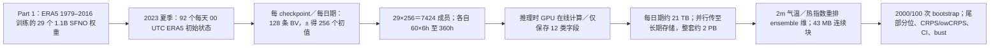

# 90｜Huge ensembles Part 2：7424 成员 HENS 的中期极端尾部与抽样不确定性

> Ankur Mahesh、William D. Collins、Boris Bonev、Noah Brenowitz、Yair Cohen、Peter Harrington、Karthik Kashinath、Thorsten Kurth、Joshua North、Travis A. O'Brien、Michael Pritchard、David Pruitt、Mark Risser、Shashank Subramanian、Jared Willard，*Huge ensembles – Part 2: Properties of a huge ensemble of hindcasts generated with spherical Fourier neural operators*，*Geoscientific Model Development* **18**, 5605–5633，**2025-09-04 正式发表**：[期刊开放全文](https://gmd.copernicus.org/articles/18/5605/2025/)、[DOI](https://doi.org/10.5194/gmd-18-5605-2025)。同一论文于 **2024-08-02** 首发 [arXiv:2408.01581v1](https://arxiv.org/abs/2408.01581)，2025-04-03 更新至 v3；版本不重复计篇。本篇与[Part 1 的集合方法设计](89-huge-ensembles-part-1-sfno-bvmc.md)是**两篇独立论文**，各自有实验和图表。阅读日期：2026-09-24。

> 证据层级：以下按同行评审期刊正文、表 1、图 1–12 与附录 A–H 记录；表 1 的官方 PNG 已逐项核对。图表内容以中文重构表格和原创流程图同步到本文件，未转载原作者插图，也未在本仓库重复运行训练或 2 PB 回报。[期刊正式版](https://gmd.copernicus.org/articles/18/5605/2025/)

## 问题、定位和与 Part 1 的分工

Part 1 证明 **29 个独立 SFNO checkpoint×每个 1 对 BV** 的 58 成员系统具有一定校准能力；Part 2 把每个 checkpoint 扩为 **128 对中心对称 bred vector（256 条初值轨迹）**，故 **29×256＝7424** 条成员。它要回答的问题不是“再训练一个更准的底座”，而是：巨大集合能否更稳定地抽到罕见高温尾部、缩窄极端发生概率的**有限样本误差**、减少验证值落在集合范围外的漏报？系统仍每 **6 小时**滚动，最长 **360 小时＝15 天**；但大部分量化尾部实验集中 **第 10 天**，有些在第 4/7 天复核，并非证明第 3–4 周 S2S 技巧。[引言、§2、§3–4](https://gmd.copernicus.org/articles/18/5605/2025/)

“巨大集合内有一个成员碰巧接近真值”是研究极端事件的资料价值，不等同于起报前就能知道哪一条轨迹正确；“概率估计更窄”也不等于天气本身不确定性变小。本文在这些统计层次间反复区分，因此下文按**尾部分布、评分、有限样本置信区间、漏报**四条线解读。[§3.2、§4.1–4.3](https://gmd.copernicus.org/articles/18/5605/2025/)

## 模型、数据与训练／微调到底做了什么

*依据 Part 2 §2、附录 B 自行重绘。第一框是**继承 Part 1 已训练权重**，不是 Part 2 新训 29 个底座；本文没有报告额外预训练、继续训练或微调。* [Part 2 §2](https://gmd.copernicus.org/articles/18/5605/2025/)｜[Part 1 训练细节](https://gmd.copernicus.org/articles/18/5575/2025/)

SFNO 模型训练设置需从 Part 1 继承：ERA5 **0.25°**、74 个预报状态通道加 3 个外强迫/静态输入，输出 6h 后的 74 通道；编码 MLP＋**8 个**球谐 SFNO 块＋解码 MLP，最终 `scale factor=2`、`embedding dimension=620`、约 **1.1B 参数/模型**。29 套权重由不同随机初始化、确定性一步加权 MSE、每套 **70 epochs/batch 64/256×80GB A100 约 16h**训得；**没有多步微调**。500km 相关 Z500 初噪声经 3 步繁殖，在各变量上按 **0.35×48h 确定性 RMSE** 缩放并分别做半球调幅、水汽非负裁切。Part 2 只是为每个初始日期、每个 checkpoint 换不同随机种子，独立生成 **128 个 BV，再正负使用成 256 个成员**；没有更改权重或用 2023 验证值作训练目标。[Part 1 §2](https://gmd.copernicus.org/articles/18/5575/2025/)｜[Part 2 §2.1–2.2](https://gmd.copernicus.org/articles/18/5605/2025/)

| 数据／处理节点 | 正式论文明确报告 | 容易混淆的边界 |
| --- | --- | --- |
| 起报与真值 | 2023 年 **6、7、8 月共 92 天**，每天 **00 UTC** 从 ERA5 状态起报；HENS 评分用 ERA5 验证。其他年份属于底座训练或气候门槛资料，非这 92 天的回报样本。 | IFS ENS 个别对照用自己的 **ECMWF 业务分析真值**，不是与 HENS 共用 ERA5 的严格同真值竞赛。 |
| 预测维度 | **7424 成员×92 日期×61 个时次（初值＋60×6h）×721 纬度×1440 经度**，单成员积分到 15 天。 | 论文主要可核验的巨大集合收益在 **4/7/10 天**或第 10 天；不应把 61 个输出时次误写为第 61 天。 |
| 表 1：实际保存 12 类字段 | 高空：**T850、T500、Z500、Z300**；地表：**T2M、Td2M、总柱水汽、海平面气压、地面气压**；在线派生：**整层水汽输送 IVT、2m 热指数、10m 风速**。 | “保存 12”不等于 SFNO 只预报 12：母模型有 **74 个预报通道**，派生量是推理时在 GPU 合成，不另作预报通道。 |
| 储存／计算 | 32-bit 浮点保存 12 类字段，整套约 **2 PB**（单类约 173 TB、单起报约 21 TB）；若全部通道保存，估算约 **25 PB**。每个起报用 **256×80GB A100 约 45 min**；全部 **18,432 GPU 小时**、256 GPU 连续约 3 天。 | 这些是 **回报生成**成本，未包含 Part 1 训练的 29 套模型、ERA5/IFS 的上游生产、全量长期储存与后处理经济成本。 |
| 存储重排 | 推理关闭 PyTorch autograd，逐日期写 Perlmutter Lustre scratch；因 scratch 分配 **100 TB**，每次 21 TB 用 Globus 并行转 CFS，约 **25 GB/s、15 min**，可与下一天 45min 生成重叠。附录 B 将 T2M/热指数原顺序 `(ensemble, lead, lat, lon)` 改为 `(lead, lat, ensemble, lon)`，每 lead/纬带 7424×1440 成员约 **43 MB 连续块**。 | 这不是气象场的重网格或训练标准化，而是为极端统计的集合维约减提供可行 I/O。 |
| 气候门槛 | 对每格点、每月、每小时的 ERA5 近地气温建均值、标准差及分位阈值；作者声称“24 年”气候期。 | **§3.2 正文写 1992–2016，而图 6 图注写 1993–2016**；前者按含首尾年份计算是 25 年，后者才是 24 年。复验必须先查公开代码，不能在笔记里替作者消除冲突。 |

以上 12 类输出来自[期刊表 1 官方图](https://gmd.copernicus.org/articles/18/5605/2025/gmd-18-5605-2025-t01.png)；生成、数据流与气候门槛来自[期刊 §2–3 和附录 B](https://gmd.copernicus.org/articles/18/5605/2025/)。随机种子被固定且作者曾重生特定成员，但 PyTorch/RNG 版本和 GPU 非确定性可能妨碍跨硬件逐位复现；应保存代码版别、种子与 checksum。表 1 的字段“IVT、热指数、风速”是预报通道组合计算，不能把推理保存字段当成新的监督标签。[§2.2](https://gmd.copernicus.org/articles/18/5605/2025/)

## 为什么是 7424 成员：尾部抽样与统计量收敛

论文把信息增益 `G_n` 定义成 n 成员中相对**该 n 成员集合均值**最远的标准差距离。全球陆地均值上的高温、水汽、T850、Z500、U10 的第十天回报，约 **7000 成员**才抽到距均值约 **4σ** 的轨迹；29×256＝7424 也受 GPU、内存和搬运预算约束。高斯假设只用于提出规模量级与全球空间均值的参照曲线；图 3 表明局地格点显著偏离高斯，不能推出所有站点的 4σ 事件都稳定抽到。原文估算 5σ 需约百万成员，只是正态近似下的量级，不是本文已经运行了百万成员。[§3.1、图 2–3、附录 G3](https://gmd.copernicus.org/articles/18/5605/2025/)

第十天图 4 以完整 HENS 为参考“总体”，每档子集合做 **2000 次 bootstrap**：集合均值约 **10 个成员**即接近无偏，标准差约 **200 个**接近无偏，但不确定度仍可比全体大 6 倍以上；10/90 百分位要约 **1000 个**才减小偏差，1000 个时抽样不确定度仍近全体 3 倍。经验法直接估 **0.1/99.9 百分位**需接近 **7000 个**才近无偏；极值理论拟合可在约 **3000 个**接近无偏，但小集合仍偏向不够极端。这里的“无偏”是**相对同一 HENS 完整 7424 条分布**的子抽样统计，不证明真实自然气候极值已无偏。[§3.1、图 4、附录 G4–G5](https://gmd.copernicus.org/articles/18/5605/2025/)

## 正文图表的可核对性能与反面结果

| 期刊图/附录 | 主要口径与结果 | 必须保留的解释限制 |
| --- | --- | --- |
| 图 1、表 1 | 说明 HENS 在物理／ML 集合规模中的位置；表 1 列明 **12 类保存字段**，其中 3 类在线派生。 | 图 1 是规模比较，不能当模式预报技巧排名。 |
| 图 2–3 | 第 **10 天**，7424 成员全球陆地均值信息增益约 **4σ**，局地格点与理想高斯参照有差异；50 成员约 **2σ**。 | `G_n` 相对**模型集合本身**均值/标准差，和 ERA5 的月小时气候 `z` 分数不是同一基准。 |
| 图 4 | 全集作参照，2000 次子抽样重估均值、标准差及 0.1/10/90/99.9 分位；约 10/200/1000/3000–7000 成员分别对应不同统计量的近无偏量级。 | 小集合的均值好，并不代表其 99.9 百分位好；全体 HENS 只是估计参照，不是真实无限成员分布。 |
| 图 5：Kansas City | **2023-08-23 18 UTC** ERA5 的 T2M/Td2M 为 **307/298 K**，热指数 **316 K（43°C）**；10 天起报 HENS 有同时达到高温和高露点的成员，IFS 对照成员没有。 | 一地一天的“有成员覆盖”不是全球可靠性或事件因果归因证据；HENS、IFS 各用不同分析场表示真值。 |
| 图 6 | ERA5 日时次格点 `z` 分数表明，第 10 天 4σ 极端多数地点可在 HENS 找到约 **O(10)** 级别同样/更极端的成员；2–3σ 有数百成员。 | 图注仍显示部分 whisker 为 **0**，即存在所有 7424 成员都未覆盖的事件；气候期年份表述有冲突。 |
| 图 7、附图 F3–F4 | 第 10 天（**240/246/252/258h**）及第 4 天的每格点“事后选最接近真值成员”RMSE 随成员数扩大可下降**最高约 50%**，极端 ERA5 值收益更显著。 | 这是 **oracle best-member**，起报前无法知道哪条成员最好，因此不能宣称实际可用的确定性预报误差下降 50%。 |
| 图 8–9 | 在第 **4/7/10 天**，HENS 相对 Part 1 的 58 成员普通 CRPS 与阈值加权 twCRPS 改善均 **<约 5%**；尾部条件分布的 owCRPS 改善约 **20%**。Shreveport 个例中 owCRPS 从 **0.63 降到 0.50 K**，超门槛成员 **10→1340**。 | owCRPS 仅在验证端已发生极端时计分，**非 proper scoring rule**，需与 CRPS、twCRPS、可靠性一起读，不能用它独自证明业务概率系统全面更准。 |
| 图 10、附图 D1 | Shreveport **99 分位**超阈事件：HENS **1340/7424≈18%**，95% bootstrap 区间 **17.1–18.9%**；58 成员概率约 **17%**，区间 **8.6–28%**；第 10 天全域非零极端预报区间宽度大致缩窄一个量级，第 4/7 天也有对照。 | 区间仅代表有限成员**抽样误差**，不消除模型偏差、初值/自然变率的不确定性；概率本身仍可在 50% 附近。 |
| 图 11–12、附图 E1 | 第 10 天，7424 成员的 bootstrap 版 outlier 指标对 ERA5 约 **99%** 可覆盖；夏季两系统均覆盖 **96%** 格点/时次，IFS 漏覆盖约 **3.5%**，HENS 对其中大多数有成员覆盖，但另有 **0.32%** 场合 HENS 漏、IFS 覆盖。 | 图 11 的定义是**100 次 bootstrap 中至少 95% 子集合**覆盖真值；图 12 则直接比集合最大值，且 IFS/HENS 真值不同。不能把 99%/96%/3.5%/0.32% 当一个定义下的互补比例。 |
| 附图 C1–C3、G1 | HENS 与 58 成员的可靠性、均值 RMSE、spread 与 spread–error 比总体相近；G1 用 checkpoint 间/同 checkpoint 内 spread 比评估可交换性。 | 扩容显著降低尾部采样噪声，却**不修复同一模型的系统误差**；G1 比值定义依统计模型，不能当作业务 58 对 7424 的确定性改进。 |

上述是正文给出的明确数字与方向，不从图上估造各 lead 的绝对 CRPS 小数或未公开的置信区间端点。[期刊图 1–12/附录 C–G](https://gmd.copernicus.org/articles/18/5605/2025/)

## 指标与版本冲突：复现实验不能一笔带过

`CRPS` 对**完整预报分布**计分；`twCRPS` 把门槛以下的预报/真值钳到门槛，再对完整分布评分，仍惩罚错误预报尾部；`owCRPS` 则把预报分布**条件化到超过门槛的成员**，并仅在实际极端发生时计分，因此受“预报者困境”影响。作者在图 8 给出两种全分布评分变化不到约 5%、而条件尾部评分改善约 20% 的原因：58 成员已足以表示分布主体，**超门槛的有效成员数**却可能只有 10；扩大到 7424 后该尾部子样本可达 1340。附录 H 用经验 CDF 的 DKW 界讨论全分布采样误差约随 `1/√n` 缩小，但模型偏差并不按此律自动消失。[§4.1、图 8–9、附录 H](https://gmd.copernicus.org/articles/18/5605/2025/)

**门槛的正式版内部不一致**：图 8/9 图注把 twCRPS/owCRPS 示例称为 **95 百分位**；§4.1 在写 `owCRPS` 权重公式时又说 `t` 为 24 年 ERA5 **99 百分位**。图 10 的事件概率则明确为 **99 百分位**。因此本笔记仅按相应图注转写图 8/9、按图 10 转写 99 百分位，**不假装已核清图 8 实际代码门槛**。同样，§3.2 的“1992–2016/24 年”与图 6 的“1993–2016”不一致；重现图 6、8、9、10 时必须读归档评分配置/阈值文件。[§3.2、§4.1、图 6/8–10](https://gmd.copernicus.org/articles/18/5605/2025/)

Part 1 正式论文还在附录 E 披露原 BV breeding 的前两步误用 `t0` 太阳天顶角，作者已在项目代码修复、归档代码保留论文原设置且评分近似不变。Part 2 继承该母系统时，复现要先区分归档原版与后修复版，不能把不同版种子和图表混用。[Part 1 附录 E](https://gmd.copernicus.org/articles/18/5575/2025/)｜[Part 2 可用性](https://gmd.copernicus.org/articles/18/5605/2025/)

## 局限、复现与下一步

研究只在 2023 夏季和 ERA5 0.25° 训练/验证格网上大量评估近地高温；更冷季节、极端降水、站点健康影响和第 15 天预警价值尚待独立检验。**2 PB 的保存与搬运**虽可在作者的 HPC 环境内处理，但公开“模型权重＋种子按需重生”不是已开放一个所有用户可立即查询的 2 PB 数据门户；还需相容运行时、初值和缓存/校验。论文也明确 HENS 依赖 ERA5 再分析，因而不消除上游数值模式与集合资料同化的需要。若比较实际应急效益，还需相同真值/初值/成本口径、跨年份验证及用户 cost–loss 模型；这些是建议的**后续检验**，不是论文已经证明的经济收益。[§2.2、§5](https://gmd.copernicus.org/articles/18/5605/2025/)

复验顺序宜为：先按 [Part 1 笔记](89-huge-ensembles-part-1-sfno-bvmc.md)核对 29 个 checkpoint、74 通道顺序、BV 调幅及代码勘误；再从[归档代码/权重/数据](https://doi.org/10.5061/dryad.2rbnzs80n)锁定 RNG/版本，为 2023 夏季 92 个日期按 29×128×± 生成成员；核验表 1 的 12 保存字段、维度和 checksum，重排集合维；按图 2–12 分别用 2000 次或 100 次 bootstrap，避免混淆信息增益、气候 `z` 值、oracle best member、真实可用概率与两种 bust 定义。[正式论文](https://gmd.copernicus.org/articles/18/5605/2025/)

## 阅读来源

- [*GMD* Part 2 正式开放全文](https://gmd.copernicus.org/articles/18/5605/2025/)及[表 1 官方图](https://gmd.copernicus.org/articles/18/5605/2025/gmd-18-5605-2025-t01.png)：书目、HENS 配置、12 字段、图 1–12/附录 A–H 与内部冲突。本笔记主依据。
- [arXiv:2408.01581 版本记录](https://arxiv.org/abs/2408.01581)：2024 首发与 2025 版本更新，与正式版去重。
- [*GMD* Part 1 正式全文](https://gmd.copernicus.org/articles/18/5575/2025/)：继承模型的训练流程、BV 参数与附录 E 勘误；[原作者归档](https://doi.org/10.5061/dryad.2rbnzs80n)、[代码库](https://github.com/ankurmahesh/earth2mip-fork)为复现入口。
