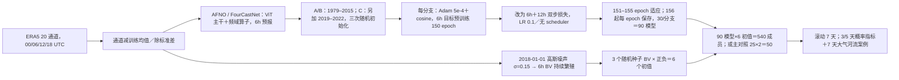

# 91｜EnAFNO：微调期多 checkpoint＋繁殖向量的 50/540 成员集合

> Jorge Baño-Medina、Agniv Sengupta、Duncan Watson-Parris、Weiming Hu、Luca Delle Monache，*Toward Calibrated Ensembles of Neural Weather Model Forecasts*，*Journal of Advances in Modeling Earth Systems* **17(4)**, e2024MS004734，**2025-04-07 首次正式发表**：[期刊开放全文](https://agupubs.onlinelibrary.wiley.com/doi/full/10.1029/2024MS004734)、[DOI](https://doi.org/10.1029/2024MS004734)。此前 2024 年 ESS Open Archive 预印本题名作 *Towards calibrated ensembles of neural weather model forecasts*，[预印本 DOI](https://doi.org/10.22541/essoar.171536034.43833039/v1)；与期刊版为**同一成果、不重复计篇**。[作者机构介绍](https://cw3e.ucsd.edu/cw3e-publication-notice-toward-calibrated-ensembles-of-neural-weather-model-forecasts/)、[正式版引用的代码与复现材料](https://doi.org/10.5281/zenodo.14768691)。阅读日期：2026-09-24。

> 证据层级：本笔记按 AGU 期刊开放正文、图 1–10 与附录 A–F 写作；结构图为原创重绘，性能表是图注/正文可核查的中文整理，未转载原图或从曲线目测补出小数。部分正文自相矛盾的成员数、格点数和时长已单列，不能为了表面整齐而擅自修正。[正式全文](https://agupubs.onlinelibrary.wiley.com/doi/full/10.1029/2024MS004734)

## 论文问题与真实预报时效

确定性 FourCastNet/AFNO 很快，但单个模型不是概率分布。只给初值场加白噪声，集合常因快速衰减模态而欠离散；若把几十套大模型全都从零训练，离线成本又太高。EnAFNO 将**模型不确定性**交给几条训练分支的微调期 checkpoint，将**初值不确定性**交给按 AFNO 动力持续繁殖的 bred vector（BV），组合成 **50 成员**的主公平对照或 **540 成员**的规模扩展。[引言、§3.1](https://agupubs.onlinelibrary.wiley.com/doi/full/10.1029/2024MS004734)

模型每次预报 **6 小时**并自回归滚动，作者对 2018 年每天 00 UTC 起报生成 **7 天**轨迹；论文的主要多样本概率指标——spread–skill、CRPS/CRPSS——展示到 **第 3/5 天**，第 7 天证据主要是一个美国西部大气河流的流域水汽案例。因此它归“中期前段/过渡集合方法”，**未证实第 10–15 天的集合技巧**，也不能因为方法可扩成员就自动算作 S2S 论文。[§4、图 4–8](https://agupubs.onlinelibrary.wiley.com/doi/full/10.1029/2024MS004734)

## 数据、输入链与验证边界

| 部分 | 原文可核对处理 | 解释边界 |
| --- | --- | --- |
| 训练资料 | ERA5 全球 **0.25°**再分析，每日 **00/06/12/18 UTC**、20 个气象通道；每通道减训练期均值、除训练期标准差。 | 正文称场维度 **780×1440**，但全球 0.25° 的纬向格点数与它不相符；重现应查作者代码的实际裁剪/网格，不宜在索引里直接沿用 780。 |
| 20 通道组成 | U/V 风在 **500/850/1000 hPa** 共 6；位势在 **50/500/850/1000 hPa** 共 4；温度和相对湿度各在 **500/850 hPa** 共 4；近地 U/V 风、近地气温、地面气压、海平面气压、总柱水汽共 6。 | 论文主图仅分析 U10、T2M、Z500、TCWV 四字段，不能把其排序外推到 20 通道所有场。未报告降水通道或站点订正。 |
| A/B 分支训练 | **1979–2015** 年 ERA5，随机初始权重各自训练，微调期各取 30 个 checkpoint。 | A/B 是两次从头训练的分支；每分支内 30 个模型来自**同一次运行的不同微调 epoch**，不是 60 次独立训练。 |
| C 分支训练 | 在 **1979–2015＋2019–2022** 年上另训一支，微调期取 30 个 checkpoint。 | C 分支用了被评年份 **2018 之后的资料**；虽未直接用 2018 做权重训练，却不是“2018 年当时可实时运行”的严格历史业务回报。 |
| 繁殖、调参与评测 | BV 自 **2018-01-01** 起每 **6h**繁殖到 **2018-12-25**；主回报从 **2018-01-10 至 2018-12-25** 每天 00 UTC 起报、滚动 7 天。附录 A 对方案的调节使用 **2018-01-10 至 02-28**，正文图 4–10 再用 2018 更长窗口。 | 设计调参和汇报评测同属 2018，不能把整年 2018 主图称为完全独立于选择过程的盲测；特别是前两个月。 |
| 基线/真值 | G-AFNO：**1 个 AFNO＋50 个独立高斯初值扰动**，标准差 **0.3**；IFS ENS：**50 成员**；近地等评分有 ERA5 及 IFS 业务分析两种真值口径。 | IFS 初值来自业务分析，AFNO 初值来自 ERA5；换用业务分析真值后部分近地优势减弱或消失。 |

通道、标准化、年份与基线以[正式版 §2–4](https://agupubs.onlinelibrary.wiley.com/doi/full/10.1029/2024MS004734)为准；关于 780 纬度点的判断为原文数字与常规 0.25° 全球网格的**推断性冲突标记**，不是已经查明了代码实际网格。

## 网络和训练：微调如何同时承担预报与模型扰动

*由正式版图 1–3、附录 A 重绘。微调是**真实训练阶段**：目标从单步 6h 变为 6h＋12h，自回归两步；高 LR 使不同 epoch 权重覆盖新损失面的区域。90 个 checkpoint 并非 90 次独立从零训练，也不是对模型权重做 SWA-G 高斯后验采样（正文明确说未实施 SWA-G）。*[§3.1、图 1–3](https://agupubs.onlinelibrary.wiley.com/doi/full/10.1029/2024MS004734)

| 训练/集合参数 | 可核查的具体值或步骤 | 不能擅填之处 |
| --- | --- | --- |
| AFNO 基座 | FourCastNet AFNO：ViT 主干与频域算子，输入/输出 20 通道，每步 6h。预训练 **Adam、初始 LR 5×10⁻⁴、cosine annealing、150 epochs**。 | 本文未给嵌入维、层数、逐块头数、参数总量、batch、权重衰减和完整采样种子；不能从其他 FourCastNet 版本直接复制。 |
| 权重分支 | A/B 两条独立随机起点都用 1979–2015；C 在其基础上加 2019–2022；三支各 **30 个**微调期模型，总 **90**。 | “分支独立”不等于分支内每个 epoch 的样本独立；相邻 checkpoint 参数相关。 |
| 两步微调 | 从 epoch **151–155** 先适应新目标；**156 起每 epoch**保存 30 套。损失由 6h 一步误差改为 6h/12h 双步误差；微调 **LR 0.1、无 scheduler**。 | 论文没有给两步损失相对权重、层冻结策略或优化器是否在微调时显式改为 SGD 的完整设置；不能把 0.1 当成所有阶段 LR。 |
| 训练成本 | **约 7 天/分支**，三支合计 **21 天**；作者比较若把 90 模型逐个从零训练约 **630 天**。 | 该 630 天是按单分支时长外推的估算，并非实际消耗 630 天。 |
| BV | 2018-01-01 由逐格点 **N(0, 0.15²)** 初始化、每 6h 扰动/对照两步分差并缩放到初噪幅度；三套随机种子、每套正负两种符号。 | 与[Huge ensembles Part 1](89-huge-ensembles-part-1-sfno-bvmc.md)的 **500km 球面相关 Z500 噪声、48h RMSE×0.35**不同，不能混写为同一种 BV 实现。 |
| 大小集合 | EnAFNO540＝**90 模型×6 BV**；EnAFNO50 应为 **25 模型×2 符号**以便与 50 IFS/G-AFNO 同成员对照。 | 正文在 EnAFNO50 一段却写“8＋7＋7 模型来自 A/B/C”，**和=22**，与同段 25 模型/50 成员矛盾；确切分支取样需以代码或作者勘误核对。 |

来源为[正式版 §3.1.1–3.1.5 与附录 A](https://agupubs.onlinelibrary.wiley.com/doi/full/10.1029/2024MS004734)。正文引言称在 64×P100 上生成 540 成员约 **10 分钟**，结论处又说约 **5 分钟**；本笔记只保留“数分钟级、同配置文字不一致”的事实，不据此精算与 IFS 的统一硬件能耗优势。[§3.1、§5](https://agupubs.onlinelibrary.wiley.com/doi/full/10.1029/2024MS004734)

## BV 与多模型来源为什么都重要

BV 以白噪声开始，但每个 6h 繁殖周期都先把受扰/无扰分析场分别输入 AFNO，再取下一时刻预报差，按原始扰动幅度重新缩放；如此让扰动逐渐与模型自身快速增长方向对齐。对比的 G-AFNO 始终直接对同一初值采 50 个标准差 0.3 的高斯扰动。图 9 的早期 **≤24h** 段中，EnAFNO spread 增长，而白噪声版本的 spread 反而先缩小；24h 后后者也可投射到增长模态而逐渐增长。这支持“BV 扰动更有动力有效性”，但不能说 BV 已无条件等价于现实同化误差分布。[§3.1.2、§4.3、图 2/9](https://agupubs.onlinelibrary.wiley.com/doi/full/10.1029/2024MS004734)

模型端的消融图 10 将 AFNO-0 与 AFNO-A 都置于**未扰初值**，隔离 checkpoint 选择策略：AFNO-0 从旧损失面收敛后继续选权重，AFNO-A 则从单步变双步的微调新损失面选权重。约第 3 天之后 AFNO-A 的误差增速更低、离散度增长更明显，AFNO-0 离散度增长较慢。附录 A 进一步试分支数与 BV 数：模型数增至每支约 **30** 后收益很少，三支共 **90 模型**再加分支也基本无益；3 对正负 BV 与 σ0.15 为作者所选大集合方案。这是 2018 方案选择结果，不能当独立跨年稳健性结论。[§4.4、图 10、附录 A](https://agupubs.onlinelibrary.wiley.com/doi/full/10.1029/2024MS004734)

## 正文性能图表逐项核对

| 图/附录 | 经期刊文字/图注可报告的结果 | 同一图必须读出的限制 |
| --- | --- | --- |
| 图 1–3 | 图 1 是 90×6 的集合结构；图 2 是持续 BV 周期；图 3 对比**旧损失面继续取 checkpoint**和**双步微调新损失面取 checkpoint**。 | 这些是方法图，不是性能数字；AFNO-A/B/C 的参数来源不一样。 |
| 图 4 | 2018 年 4 月美国西部大气河流，Feather River 流域总柱水汽的 **7 天** 540 成员轨迹包住 ERA5；78h 全球水汽场呈合理形态。 | 仅一件大气河流**案例**，不能推出全球第 7 天 CRPS 或极端降水校准；本文不预报降水。 |
| 图 5 | 四字段 U10/T2M/Z500/TCWV 的 **0.5–1、2.5–3、4.5–5 天** spread–skill；EnAFNO540 比白噪声 G-AFNO 更近 1:1，个别 T2M/Z500 时效接近或胜 IFS 的校准。 | 540 成员与 IFS/G-AFNO 50 成员规模不同；更接近 1:1 很多来自**更高 spread**，误差下降不一样大。 |
| 图 6 | 按纬度的 spread/error 形态：EnAFNO540 在不同纬度较能跟随误差、改善 G-AFNO 系统欠离散；近地温度短 lead 一些纬度误差较 IFS 小。 | Z500 等仍有 NWM 误差大于 IFS 的区域；IFS 用业务分析真值，不能把不同初值/真值的曲线直接判成全域绝对胜负。 |
| 图 7、附图 F1 | EnAFNO50 对 IFS 的 **第 3/5 天 CRPSS**：陆地 U10/T2M/TCWV 多处有优势，海洋与非热带 Z500 明显较差；换 IFS 分析真值，陆地 T2M 优势减弱、U10 优势可消失，TCWV 较稳。 | 全球/纬度汇总中 IFS 整体误差和 spread–skill 常更好。局地红色不能改写成“EnAFNO 全球全面胜 IFS”。 |
| 图 8 | 540 对 50 成员的 CRPSS 只在局部温度、风、TCWV 略有改善，对 Z500 未见同样方向；正文称最大约 **0.3**（CRPSS 图色标）。 | 增加约 10 倍成员后普通概率技巧增益**很小**，极端尾部的潜力仍未在本文系统量化。 |
| 图 9 | BV 与白噪声在最初 24h 的 spread 演变相反，随后两者都增长。 | 不等于 BV 一定代表所有分析误差或无需模型扰动；噪声幅度、成员数也影响离散度。 |
| 图 10、附图 A1/B1 | 新损失面微调期 checkpoint 比旧损失面收敛后选 checkpoint 更分散且第 3 天后误差增长较慢；约 30 模型/分支、3 分支后离散度收益平台；G-AFNO 白噪声成员超过 50 后 spread 增益很小。 | 消融所用初值/窗口与主 2018 评测部分重叠，图 10 还刻意不用 BV，不能将其分数直接当最终 EnAFNO540 分数。 |

指标正文在附录 C 给定义：RMSE 衡量集合均值误差；SES 为区域汇总 spread；CRPS 衡量整个概率分布；`CRPSS=1−CRPS(EnAFNO)/CRPS(reference)`，**正值**表示 EnAFNO 在对应格点更好。作者的部分全局/纬度 RMSE 计算不加纬度权重，图 6 逐纬度则单独算，不能与使用 `cos(latitude)` 全球权重的其他论文不加说明地直接拼排名。[§4、附录 C/F](https://agupubs.onlinelibrary.wiley.com/doi/full/10.1029/2024MS004734)

## 关键限制、版本纠偏与可复现检查

本篇真正把“微调怎么做”写清：单步预训练 **150 epoch**，微调把目标变成 **6h＋12h 两步**，以 **LR 0.1** 在新损失面先跑 **5 epoch**，随后每 epoch 取一套模型；而 [SFNO–BVMC Part 1](89-huge-ensembles-part-1-sfno-bvmc.md) 则不做多步微调、29 套模型全部从头独立训练。两条路线可作为“计算换多样性”的对照，但数据年份、变量、BV 结构、评测时效都不同，不能把两篇的 CRPS 排成一个严格公平榜。[本篇 §3](https://agupubs.onlinelibrary.wiley.com/doi/full/10.1029/2024MS004734)｜[SFNO–BVMC](https://gmd.copernicus.org/articles/18/5575/2025/)

复验需首先核查[作者 Zenodo 包](https://doi.org/10.5281/zenodo.14768691)或[代码库](https://github.com/CW3E/EnAFNO)中的实际网格纬度数、EnAFNO50 的 25 模型分支列表、微调损失权重/优化器配置及 2018 调参日期；锁定 A/B/C 的训练切分后再运行 50 成员同规模 IFS/G-AFNO 对照，分别以 ERA5/IFS 分析计 CRPS。训练 C 分支的 2019–2022 资料使这套 2018 回报是**研究性事后重建**，不是 2018 年实时可运行系统；若要证明 10–15 天、中期极端事件或业务化收益，需要未来年份、统一分析真值以及真正的第 10–15 天概率评分。当前期刊文中尚无这些结论。[正式全文与可用性](https://agupubs.onlinelibrary.wiley.com/doi/full/10.1029/2024MS004734)

## 阅读来源

- [JAMES/AGU 正式开放全文](https://agupubs.onlinelibrary.wiley.com/doi/full/10.1029/2024MS004734)：首次正式发布日期、方法 §2–3、图 1–10、附录 A–F、性能和正文冲突；本笔记主依据。
- [2024 ESS Open Archive 预印本](https://doi.org/10.22541/essoar.171536034.43833039/v1)：题名和早期版本来源，与期刊论文不重复编目。
- [作者机构出版说明](https://cw3e.ucsd.edu/cw3e-publication-notice-toward-calibrated-ensembles-of-neural-weather-model-forecasts/)、[Zenodo 代码/复现材料](https://doi.org/10.5281/zenodo.14768691)、[项目代码](https://github.com/CW3E/EnAFNO)：作者、实现入口；本次未运行原训练或推理。
