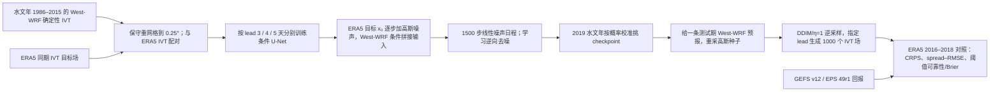

# 92｜北太平洋水汽输送：West-WRF 单值预报条件下的千成员扩散集合

> Timothy B. Higgins、William E. Chapman、Aneesh C. Subramanian、Luca Delle Monache，*Generating a 1000-Member Ensemble of Integrated Water Vapor Transport Forecasts with Diffusion*，*Artificial Intelligence for the Earth Systems* **5(3)**, e250075，印刷版标注 **2026-07-01**、线上正式发表 **2026-08-18**，[AMS 正式全文](https://journals.ametsoc.org/view/journals/aies/5/3/AIES-D-25-0075.1.xml)，[DOI](https://doi.org/10.1175/AIES-D-25-0075.1)。[作者代码](https://github.com/timbhiggins/Diffusion_Ensemble)｜[作者公开的数据/权重入口](https://scholar.colorado.edu/concern/datasets/3197xn88s)。阅读日期：2026-09-24。

> **证据层级与分类**：以下以期刊正式开放全文及图 1–9 的正文/图注、作者公开训练与推理脚本为依据。期刊 PDF/独立补图 S1–S3 和表 1 的图像值未逐页/逐格取得，故不转写未见的表格数字；所有性能数字都来自正文而非目测曲线。本文仅训练并验证 **第 3、4、5 天**的 IVT 场，是“中期前段的区域概率后处理方法”，**不是第 10–15 天全球中期预报，也不是 S2S**。论文把任务称作 *medium-range*，此处按实际时效加边界。[正式全文 §2–5](https://journals.ametsoc.org/view/journals/aies/5/3/AIES-D-25-0075.1.xml)

## 研究问题：把单条确定性预报变为条件概率分布

大气河流（AR）的窄带强水汽输送对风暴位置和强度高度敏感。单条 West-WRF 数值预报只有一个 IVT 场，即使局地平均误差较低，也不能表示强 AR 的发生概率；从零做千条动力成员的算力开销则很高。论文的核心问题是：能否学习 **West-WRF 条件预报与 ERA5 分析真值的历史配对关系**，从一条确定性条件场反复采样，形成空间上更真实、概率上较校准的千成员 IVT 分布？这是一种**单时效场后处理**，不是重训 West-WRF，也不是让扩散模型推进大气状态。[引言与 §3](https://journals.ametsoc.org/view/journals/aies/5/3/AIES-D-25-0075.1.xml)

重要区别在于，文中第 3、4、5 天**各训练一套模型**，每次采样产生某个指定 lead 的 IVT 空间图像；不同 lead 生成的成员不绑定成一致轨迹。1000 个成员可以支持尾部概率估计，但不能据此说已解决连续时空演变、降水或第 6–15 天的集合动力一致性。作者在讨论中也把自回归 IVT 集合作为未来工作。[§1、§2、图 1、§5](https://journals.ametsoc.org/view/journals/aies/5/3/AIES-D-25-0075.1.xml)

## 数据和处理链：哪些信息在训练时可见

| 环节 | 正式论文/作者代码中可核查的设置 | 对解释和复现的影响 |
| --- | --- | --- |
| 条件与监督 | 输入是 NCAR **West-WRF 确定性 IVT 预报**；目标是真值代理 **ERA5 IVT**。West-WRF 被保守重网格到 ERA5 的 **0.25°×0.25°**；区域为北太平洋东北部及北美西岸，**28.25–60°N、115–146.75°W**。 | 这是从动力模式预报到再分析的**条件生成/偏差订正**；ERA5 不是独立原位观测，不应把 ERA5 一致性直接等同于实测河流量/降水收益。区域不是全球。 |
| 时间切分 | **水文年 1986–2015** 的 **12–3 月**训练；**2019 水文年**验证选模型；**2016–2018 水文年**封存测试。每日 **00 UTC** 初值，lead **3、4、5 天±3h**，每个 lead 约 **21,600** 训练图像。 | 论文称只因时间和计算限制于 3–5 天，不能外推第 10 天。2017 极端大气河流季属于测试期。不同 lead 各自训练/选择。 |
| 数据网格与图像尺寸 | 正式正文给 0.25° 和上述边界；作者脚本将图像设为 **128×128**，与两方向端点间隔对应。 | 仅将 128×128 当作代码实际输入尺寸；论文表 1 的完整各资料行未逐格取得，不补造分辨率以外的表值。 |
| 物理集合对照 | GEFS **v12、20 成员**；ECMWF EPS **Cycle 49r1、50 成员**。两者档案回报以 **0.5°×0.5°** 保存，原生分辨率分别约 **25km、9km**；仅取相同测试日期/区域。 | 与扩散 **1000 成员、0.25°** 的规模/网格不同；这是所选产品的实际对照，不是等成员/等网格消融。EPS Cycle 49r1 在 2024 投入业务，而 2016–2018 是回报期，不能理解为当年实时业务可得。 |
| 作者脚本的缩放 | 推理脚本对 forecast/analysis 均先算 **(IVT−152.1673)/147.7351**，再用 **min=−1.0300009、max=15.220598**作线性缩放；训练脚本末尾也出现相同常数。 | 这些是**仓库当前脚本中硬编码值**，不是正式正文对全训练数据预处理来源的完整披露；若重现须检查 processed NetCDF 的单位、是否已做前置处理，以及训练/测试无信息泄漏。 |

来源：[正式论文 §2、表 1 提及、§4](https://journals.ametsoc.org/view/journals/aies/5/3/AIES-D-25-0075.1.xml)；[Run_Training.py](https://github.com/timbhiggins/Diffusion_Ensemble/blob/main/Run_Training.py) 和 [Inference.py](https://github.com/timbhiggins/Diffusion_Ensemble/blob/main/Inference.py)。论文并未声称把 EPS/GEFS 成员作为扩散训练条件；它们只用于测试集评分对照。

## 模型结构、训练与采样：哪些参数真正在执行

*依据正式版图 1、§2–4 与作者训练/推理脚本原创重绘。箭头表示**单一指定 lead 的条件图像生成**，绝非每 6h 自回归滚动到第 5 天。*[正式图 1](https://journals.ametsoc.org/view/journals/aies/5/3/AIES-D-25-0075.1.xml)

论文将原始 ERA5 IVT 场记为 x₀，经 **1500 步线性噪声日程**生成带噪 xτ；卷积 U-Net 在每步接收带噪场及拼接的 West-WRF 条件。正文以“预测添加的高斯噪声，MSE 学习”为方法描述，采样采用 DDIM 表述，逆向步骤重新注入随机项，**η=1** 以维持成员差异。由同一条件场采不同初始噪声得到大集合。作者先试 cosine/sigmoid 噪声日程，最后选 linear，因为它在校准/离散度上更合适。[§3、图 1、§5](https://journals.ametsoc.org/view/journals/aies/5/3/AIES-D-25-0075.1.xml)

| 训练/生成设置 | 确认信息 | 不能直接合并的版本边界 |
| --- | --- | --- |
| 三个独立 lead | 3、4、5 天分别训练，每个 lead **约 10,000 epochs／约 21,600 图像**；训练用 **4×A100**。 | “epoch”是论文叙述，不等于代码里的 gradient step；正文未给每个 lead 精确批次/总参数量/耗时。 |
| 作者训练脚本的活动对象 | `Unet(channels=1, dim=64, dim_mults=(1,2,4,8), flash_attn=True, self_condition=False)`；`GaussianDiffusion(image_size=(128,128), timesteps=1500, auto_normalize=True, objective="pred_v", ddim_sampling_eta=1)`。 | 该脚本在上方还定义未传入模型/Trainer 的 `config` 字典，其中 400 epochs、LR 0.01、1000 timesteps 等**不是本段实际构造器参数**，不可误抄为训练设置。 |
| 作者训练脚本传入 Trainer | `train_batch_size=32, train_lr=8e−5, train_num_steps=100000, gradient_accumulate_every=2, ema_decay=0.995, amp=True, max_grad_norm=1.0`。 | 这是代码入口的参数，不证明发表版每次实际运行都走满 100,000 steps；与正文“约 10,000 epochs”换算需要知道 loader/样本迭代定义。没有另行报告对下游任务微调或冻结层。 |
| 论文采样与脚本差异 | 正文说 DDIM、η=1，千成员**单 lead <2h／1×A100**；推理脚本也设 η=1 与 1500 timesteps，但写 `is_ddim_sampling=True`，未显式设置 `sampling_timesteps`。 | 不运行代码或检查所用库版本，不能确认这行属性修改后的真实采样步数/路径。推理脚本的 `train_num_steps=10000` 是构造 Trainer 用于加载/推理，并非对正式训练步数的修订。 |

**重要源码—正文冲突**：正文称噪声预测/MSE；作者当前 `Run_Training.py` 和 `Inference.py` 的活动 `GaussianDiffusion` 对象却是 **`objective="pred_v"`**（速度参数化），而非显式 `pred_noise`。这可能是文字简化、后续代码变更或两套试验配置；未经 checkpoint/config 验证，**不能断言公开脚本与发表评测逐项一致**。在复现时必须固定仓库提交、扩散库版本、原权重和实际目标，再比较两种参数化。[正式 §3](https://journals.ametsoc.org/view/journals/aies/5/3/AIES-D-25-0075.1.xml)｜[训练脚本](https://github.com/timbhiggins/Diffusion_Ensemble/blob/main/Run_Training.py)

## 图表与性能：把整体好评拆成可核验的限定结论

| 正式图/项目 | 正文明确给出的结果 | 不可越过的边界 |
| --- | --- | --- |
| 图 1 | 条件扩散训练/推理结构图；指定 3/4/5 天分别训练。 | 结构图不是连续时间轨迹或多变量预报证明。 |
| 图 2、补图 S1 | **2017-02-07** Oroville 大坝危机相关 AR 的 **第 5 天**个例：1000 成员中随机展示 24 个；集合均值相对 ERA5 的 RMSE 比原 West-WRF **低 16.5%**，成员能给出更强、更细的 IVT 羽流。 | 一件个例，不是全域/全年 16.5% 改善；补图 S1 的“锐度/forecast activity”仅按正文结论记录，补图未逐页核对。 |
| 图 3：极端冬季 | 2017 年 1–3 月旧金山附近定点，ERA5 落入千成员 **2.5–97.5%**区间的比例 **94%**；均值 ERA5 **168.3**、West-WRF **176.4**、扩散均值 **171.2 kg m⁻¹ s⁻¹**；扩散均值 RMSE 比 West-WRF **低 8%**。 | 名义 95% 区间的 94% 覆盖并非完美校准；定点/异常季不等于全域；集合均值低估最尖峰不意味着所有成员缺峰。 |
| 偏差与区间尾部 | 全域 West-WRF 平均偏差幅度在训练/测试均 **7–8%**，正式正文称扩散后测试偏差幅度比原场“低 **3%**”；旧金山点测试 West-WRF 相对 ERA5 **+5%**，扩散均值 **+1%**。2016/2017/2018 年 1–3 月真值落在 2.5–97.5%区间外分别 **7/6/7%**；超出者 **58% 在上尾、42% 在下尾**。 | 原文“低 3%”未在该句说明是相对降幅还是百分点，不能擅自换算，更不能误写为偏差只剩 3%。区间外比例高于理想 5%，有轻微**高 IVT 上尾低覆盖**。 |
| 图 4 | 1000 成员 ranked histogram 对 2016–2018 全域测试总体接近平坦；第 3 天略**过离散**，第 4/5 天略**欠离散**。 | 平坦度由 2019 验证集帮助挑 checkpoint；单一全域图可能掩盖局地或极端失准。 |
| 图 5–6 | 原文称扩散集合在**第 3、4、5 天**的全域平均 **CRPS** 与 **10 档 spread–RMSE**关系优于所选 GEFS/EPS 回报。 | 正文未给三系统三时效的可直接转写逐点数表；这里仅保留方向，不从曲线瞎补小数。成员规模 1000/20/50、档案网格不相同。 |
| 图 7 | **IVT>500 kg m⁻¹ s⁻¹**（约 98 分位）的可靠性：第 3/4 天扩散概率更接近对角线；**第 5 天 EPS 在部分概率段最好**，是原文明确负例。 | 阈值可靠性应逐概率段读，不能写成所有天、所有阈值扩散全面领先。 |
| 图 8 | IVT **250–500 kg m⁻¹ s⁻¹**多阈值的 Brier skill 与 **resolution**，扩散在 3–5 天均最高；reliability 第 3/4 天好，第 5 天混合。误差条用 **1000 次 bootstrap**。 | Brier 分数由可靠性与分辨率共同决定，第 5 天 BSS 领先并不表示当日概率校准也全面领先。 |
| 图 9、补图 S3 | 扩散集合均值相对 West-WRF 全域 **RMSE 降 3.9%**、**ACC 升 2.6%**；ACC 三天差异达 95% 显著性，RMSE 仅**第 4 天**显著。相对 EPS/GEFS 集合均值，ACC 三天显著更高、RMSE **第 3/4 天**显著更低。 | 西部域内部分区域 West-WRF 较好；第 3/5 天相对 West-WRF 的 RMSE 差异未达论文 95% 显著水平。补图空间细节未逐页核对。 |

图 4–9 的主要概率评分以 **2016–2018 三个测试水文年、全空间 ERA5**作真值；CRPS 按格点/预报算后作区域均值，spread–RMSE 分为十个等量离散度档。图 9 报 **348 样本、1000 次 bootstrap**的误差条。图 7/8 评的是 IVT 极端门槛，不是直接的洪水发生率或降水量预报技巧。[§4、图 4–9](https://journals.ametsoc.org/view/journals/aies/5/3/AIES-D-25-0075.1.xml)

## 阅读判断、复现路线与尚缺证据

这篇论文的贡献是用 West-WRF 的**动力结构条件**限制扩散采样，再用历史 ERA5 配对关系修正系统偏差，从而以单 A100、单 lead 小于 2 小时的成本生成 1000 个 **空间场**。其价值尤其在高 IVT 事件的概率分辨率：第 5 天虽有校准退步，但分辨率与 Brier 技巧仍可超过所选物理集合。它与 [SEEDS](88-seeds-generative-ensemble-emulation.md) 都是条件扩散的集合扩充，却有不同条件源、地区、字段、时效及评分协议，不能从两文拼一个“千成员普遍优于物理集合”的排名。[正式 §4–5](https://journals.ametsoc.org/view/journals/aies/5/3/AIES-D-25-0075.1.xml)

复验应先保存论文/代码/权重版本，确认代码 `pred_v` 与正文“预测噪声”的关系；审计 processed NetCDF 的数据单位、重网格、标准化常数是否完全由训练期估计。再按水文年隔离训练/2019 验证/2016–2018 测试，在**相同日期、区域、真值和网格**上同时给 1000/50/20 成员 CRPS、reliability、resolution 与 bootstrap 区间；另做等成员降采样以分开“模型质量”与“成员数”效应。最后需要跨 lead 成员配对、降水/站点观测、区域外和 **6–15 天**独立回报，才能检验是否可扩为完整中期业务系统。以上是**阅读建议，不是原文已做实验**。

## 原始来源与获取情况

- [AMS 正式期刊全文及图 1–9](https://journals.ametsoc.org/view/journals/aies/5/3/AIES-D-25-0075.1.xml)：书目、数据切分、方法、正文数值和正负结果。正式页的线上日期为 **2026-08-18**，印刷期号日期为 **2026-07-01**；避免把两者混为论文两个版本。
- [作者训练脚本](https://github.com/timbhiggins/Diffusion_Ensemble/blob/main/Run_Training.py)、[推理脚本](https://github.com/timbhiggins/Diffusion_Ensemble/blob/main/Inference.py)：活动参数、硬编码缩放和代码—正文差异；本次是**静态核对，未运行权重**。
- [作者数据/预训练权重入口](https://scholar.colorado.edu/concern/datasets/3197xn88s)：论文声明公开；本次未下载数据包、独立补充 PDF 或原始权重，故对表 1 图像值、补图 S1–S3、代码实际推理路径保持边界。
