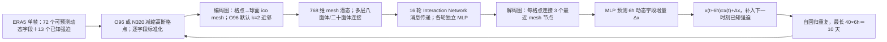

# 93｜FastNet v1.0：O96/N320 多尺度图网络的十天确定性全球预报

> Eric G. Daub、Tom Dunstan、Thusal Bennett、Matthew Burnand、James Chappell、Alejandro Coca-Castro、Noushin Eftekhari、J. Scott Hosking 等，*Technical overview and architecture of the FastNet Machine Learning weather prediction model, version 1.0*。**2025-09-22 arXiv v1，2025-10-03 v2**；本笔记阅读 [arXiv:2509.17658v2 正文与附录](https://arxiv.org/html/2509.17658v2)，[版本记录](https://arxiv.org/abs/2509.17658)。阅读日期：2026-09-24。

> **证据范围**：这是 Met Office/Alan Turing Institute 的 **v1.0 技术论文**，以原稿图 1–9、表 1、正文与附录 A/B 为依据。另有 Dunstan 等的 [FastNet v1.1 损失函数正式论文](https://journals.ametsoc.org/view/journals/aies/5/3/AIES-D-25-0090.1.xml)，它研究 MSH、梯度与风表示的新增实验，**不是 v1.0 本篇的期刊版本，也不能把 v1.1 的 150 epoch 或改良性能直接归到本篇**。图为原创重绘，结果表只转写正文与图注可核查内容，不从曲线猜小数。

## 问题、真实时效与模型定位

这篇文章主要回答“FastNet v1.0 到底如何构造、训练以及与英国气象局全球动力模式（GM）比较”。模型是**确定性全球天气预报**：从一帧 ERA5/分析初值出发，6 小时预测一次**状态增量**并自回归回灌，能运行到 **240h/10 天**。但是与 GM 的主 RMSE/ACC 对比只到 **168h/7 天**，十天证据主要是示例场、微调消融和频谱诊断；不能把“可滚动十天”改写为“所有变量第十天已全面超过 GM/GraphCast”。[摘要、§3–6](https://arxiv.org/html/2509.17658v2)

v1.0 的主实验是 **O96 约 1°** 减缩高斯格点版本；另训 **N320 约 0.25°** 版。原文称 O96 在统一 1.5° 评分下目前效果最好，且计算更经济；这不等于空间细节与全球 0.25° 产品等价。文章没有概率集合、数据同化新方法或卫星原始观测直达预报的实验。[§1–3、§7](https://arxiv.org/html/2509.17658v2)

## 数据、字段与预处理：O96/N320 不能混成一套

| 部分 | v1.0 原文设置 | 复现/解释边界 |
| --- | --- | --- |
| 时间/真值 | ERA5 **1980–2021** 的逐 **6h** 场作模型开发资料；**2022 整年**为留出回报/评分。原文没有另给明确的独立验证年配置。 | ERA5 是同化再分析，含数值模式和事后可得观测，不是纯原位“真值”；不能把 ERA5 初值回报直接等同实时业务起报。 |
| 网格 | 原生 ERA5 约 **N320/0.25°/542,080 点**与重网格 **O96/1°/约 104 km**两版。N320 对比常规 0.25° 经纬网的 **1,038,240 点**，靠减缩高斯格网避免极区纬向冗余。 | O96/N320 对应不同采样密度与训练成本；主评分再保守重网格到 1.5°，不能据此评判 0.25° 小尺度空间质量。 |
| 压力层目标 | 位势、水平 U/V 风、比湿、温度 **5 类×13 层＝65 字段**；层为 50、100、150、200、250、300、400、500、600、700、850、925、1000 hPa。 | 变量在所有 13 层都有输入/输出；不是仅训练图中展示的 T850、Z500 等几个场。 |
| 近地目标 | 地面气压、海平面气压、皮肤温度、2m 温度、2m 露点、10m U/V 风共 **7 字段**。 | 原文明确没有“仅输出不输入”的诊断场，降水不在这 7 个目标里。 |
| 已知外强迫 | 陆海掩膜、地形、亚网格地形标准差/坡度、TOA 太阳辐射、太阳时角 cos/sin、年周期 cos/sin、纬度 cos/sin、经度 cos/sin，共 **13 字段**；合计 **65＋7＋13＝85**。 | 强迫可在未来时刻预先计算/给定，与要预测的动态变量区别对待。 |
| 标准化 | 每压力层/近地变量按**时空训练资料分别求均值与标准差**做 z-score；地形缩放到 [0,1]；掩膜、周期和经纬度三角编码不再变换。 | 原文未给全部 85 字段的具体均值/方差表、缺测处理及再网格算子实现细节；不能臆造配置。 |

以上来自[原文 §2、表 1](https://arxiv.org/html/2509.17658v2)。正文和表 1 都可直接查 85 字段的分解，地面字段不应误计为所有目标都在压力层上。资料大类是 **ERA5 再分析输入→6h ERA5 下一帧目标**，不是 1980–2021 的业务 GM 预报当训练标签。

## 结构：两类格点映射和 16 轮多尺度消息传递

*依据原稿图 1–2 与 §3/附录 B 原创重绘；图中的“40×6h”由 240h/6h 直接算出，不是训练 unroll 步数。编码图采用 k=2 邻居，解码图 k=3；不要与 v1.1 或 GraphCast/AIFS 的连边策略互换。*[结构原文](https://arxiv.org/html/2509.17658v2)

| 组件 | v1.0 实际说明 | 与其他常见图模型的边界 |
| --- | --- | --- |
| icosahedral multimesh | 从 12 顶点二十面体递归细分；N320 用 **6 层**到 **40,962 节点/约 1.26°**，O96 用 **5 层/约 2.52°**，并合并各层长/短边。 | mesh 间距并不等于输入 N320/O96 格点间距；长边促成较少消息步数内传播大尺度信息。 |
| 编码器 | 将格点通过方向二部图送到 mesh；默认每个格点连接 **2 个最近 mesh 节点**，一次消息汇聚中把输入映到 **768 维**。 | 也试半径法：N320 **89 km**、O96 **178 km**。O96 两法近似；N320 半径法可有约 2–10% 的变量/时效 RMSE 差异，不能说 KNN 普遍最好。 |
| 处理器 | 每节点 **768 latent**，**16 次** Interaction Network 边/节点消息传递，各轮有各自参数。 | 原文没有公开总参数量与逐层 MLP 隐宽，不把 GraphCast 的参数数目抄过来。 |
| 解码器/预测量 | 每个格点聚合 **3 个最近 mesh 节点**，MLP 回到动态目标；预测 **增量 Δx**，再加到输入状态。 | 每次只取一帧天气状态，作者说加历史帧没有改善而增加成本；不是多帧输入模型。 |

来源：[§3.1 与图 1–2、附录 B 图 9](https://arxiv.org/html/2509.17658v2)。附录 B 的图 9 是连边入度分布，而非预报技巧图；N320 半径/近邻结果是消融，不是核心 v1.0 O96 主评分的另一个业务版别。

## 训练与微调：预报十天不代表训练损失展开十天

模型用所有动态目标的**加权 MSE**，时间维对训练展开步数取平均，再对字段求和。压力层权重与气压层值成比例（低层权重更大），2m 温度地面权重 **1.0**，其余地面字段 **0.1**；每字段再按 6h 时间差方差的**倒数**缩放。由于减缩高斯格点间距较均匀，训练损失**没有另加纬度面积权重**；评分时则要对纬度加权。[§4.1 式 1–3、§5](https://arxiv.org/html/2509.17658v2)

| 阶段 | O96/约 1° | N320/约 0.25° | 不能混淆的点 |
| --- | --- | --- | --- |
| 单步预训练 | ERA5→6h，一步目标；**AdamW、100 epoch、peak LR 1×10⁻³、cosine**；8×A100、每卡 batch2，总 batch16，约 **2.25 天**。 | 同一类型一步目标，peak LR **2.5×10⁻⁴**；24×GPU、每卡 batch1，总 batch24，约 **5.75 天**。 | 两版的峰值 LR/显卡与 batch 不同；v1.1 损失改进论文的 “150 epoch”不是本篇 v1.0 值。 |
| 多步微调 | 从预训练权重继续，将训练损失中自回归步数 T_train 从 **2 逐级加至 12**，每个 T_train 阶段 **1 epoch**，固定 LR **1×10⁻⁷**；8×A100 数据并行，全套约 **76h**。结果重点使用 **T_train=7** 的 O96 checkpoint。 | 固定 LR **1×10⁻⁶**、最多 **7 步**，24×GPU **FSDP 参数切分**，约 **47h**。 | 微调仍用同一 ERA5 资料，不是站点/卫星或业务 GM 标签微调；具体冻结层未说明，不得自行说只调头层。 |
| 为何停在 T_train≈7 | 图 3 说明多步训练提高 72/144/240h RMSE，代价是 6h（继而 24h）损失变差；超过约 7–8 步长 lead 收益平台甚至退化。图 4 显示 200–2000 km 的谱 RMSE/模糊同时变差。 | N320 在作者止于的 7 步附近仍有提高，未测试更多步的同等结论。 | “训练展开最多 12×6h＝3 天”与“推理 40×6h＝10 天”不同。原文另用“7 个额外步＝48h”与选定 `T_train=7`，计数基准有一步差，重现需按 checkpoint 配置而非文字混算。 |

更细的权重衰减、训练批次采样、随机种子及模型总参数量在本文没有可直接核对的完整数表，不用其他模型的配置补洞。[训练全文及图 3–4](https://arxiv.org/html/2509.17658v2)

## 评测协议与图表结果：把第十天示例和七天公平比较分开

| 图/表 | 原文可确认的内容 | 重要限制或负例 |
| --- | --- | --- |
| 表 1 | 13 个压力层×5 变量、7 近地目标、13 外强迫＝**85**；所有动态目标既输入也输出。 | 无降水输出、不直接从原始观测起报；不把 85 写成 85 个同性质可预测字段。 |
| 图 1–2 | 图 1 为格点→mesh→增量→自回归的结构，图 2 为 O96/N320 multimesh 长短边。 | 结构图不是技巧证据。 |
| 图 3 | 微调展开步数增加，长 lead T850 RMSE 初期改善，到约 **7–8 步**平台/退化；短 lead 6h 常退步。 | 不把“越多步越好”当规则；N320 只测试至 7 步。 |
| 图 4 | O96 的 200–2000 km 谱 RMSE随更长展开上升，显示**模糊代价**；超过约 8 步恶化明显。 | 较低点位 RMSE 可能通过平滑取得，谱细节并非同步改善。 |
| 图 5 | 展示 O96 q500 同一有效时刻的短 lead 至 **240h/10 天**场；大尺度结构保持，长 lead 越来越模糊。 | 正文叙述的最短 lead 为 12h，图注写 6h，原文内部不一致；图 5 是个例场，不是第十天多样本统计胜负。 |
| 图 6 | 2022 全年、00/12 UTC、至 **168h/7 天**：O96 对 GM 的 Z500/T850/10m U/V/T2M/MSLP 多数 RMSE 比较为优；**Z500 在 <96h 反而 GM 更好**。 | FastNet 以 ERA5 初始化并对 ERA5 验证，GM 以其业务分析初始化并对自身业务分析验证，**真值/初值不统一**，不能称严格同条件全面超越。 |
| 图 7 | 将 O96/N320、GM、IFS-HRES、GraphCast 统一到 **1.5°**展示多字段 RMSE；原文承认 FastNet 未追上 GraphCast。 | 各系统按“适当”分析真值评分，重新网格后仍有初值/真值差异；曲线未给可转写的完整数表，不估小数。 |
| 图 8 | T850/MSLP 的 NHET、SHET 与热带 ACC，FastNet 多数区域领先 GM，**南半球温带 MSLP 例外**。 | ACC>0.6 通常作天气形势技巧参考阈值，不能把不同区域 ACC 简化为全球单一值。 |
| 附录图 9 | KNN `k=2` 与半径编码图在 mesh 入度分布上的差异，N320 半径法部分 RMSE 改善。 | 这是图结构敏感性，不是第九张主性能图。 |

表中性能方向见[原文 §4–6、图 3–8 与附录 B](https://arxiv.org/html/2509.17658v2)。本文使用 WeatherBench 2，FastNet/GM 各自先保守重格到 **1.5°**，各格点按面积权重评 RMSE/ACC。严格的相同初值和真值联合回报仍是后续必要步骤。O96 的 **240h** 频谱/示例存在，但最关键的 GM 对照窗口止于 **168h**，这比“十天全面胜业务 GM”的表述保守且符合证据。

## 复现重点与系列边界

若重做本篇，先锁定 `arXiv:2509.17658v2`、N320/O96 原始与重网格 ERA5、85 字段表以及训练期均值/方差；分别建立 O96 与 N320 的 6h 单步 AdamW 预训练，再按对应 LR/并行策略逐级扩展 loss 展开步数，保留每阶段 checkpoint 和 **T_train=7** O96 重点版。随后在 2022 年复算同一批 00/12 UTC 有效时刻的至 7 天对照，再给独立的第十天样本集合评分、不同真值敏感性和长期跨年测试。论文第 7 节仅提到英国气象局当时有 3 天实验预报监测，**不是本文 10 天业务上线证明**。[§4–7](https://arxiv.org/html/2509.17658v2)

**系列去重**：v1.0 本文负责技术结构、O96/N320 与单步→多步训练；Dunstan 等的 v1.1 正式论文负责 MSH 谱损失、水平梯度和风表示消融/长滚动稳定性，二者各有独立实验，应各自阅读并分开编目。不能把 v1.1 的 150 epoch、谱改善或一年稳定性拿来填 v1.0 的图表空白。[v1.0](https://arxiv.org/html/2509.17658v2)｜[v1.1 正式论文](https://journals.ametsoc.org/view/journals/aies/5/3/AIES-D-25-0090.1.xml)

## 原始阅读来源

- [arXiv:2509.17658v2 原文/附录](https://arxiv.org/html/2509.17658v2)：数据、完整字段表、模型/损失、训练与微调、图 1–9。此文为**预印本技术报告**，未冒称同行评审期刊版。
- [arXiv 版本页](https://arxiv.org/abs/2509.17658)：v1 2025-09-22、v2 2025-10-03。
- [FastNet v1.1 后续正式论文](https://journals.ametsoc.org/view/journals/aies/5/3/AIES-D-25-0090.1.xml)：仅用于区分系列关系，不将该文结果归入本篇。
