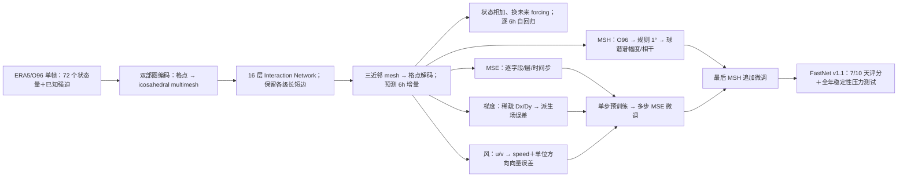

# 94｜FastNet v1.1：用谱、水平梯度与风速/风向损失改善中期预报的物理一致性

> Tom Dunstan、Oliver Strickson、Thusal Bennett、Jack Bowyer、Matthew Burnand、James Chappell、Alejandro Coca-Castro、Kirstine Ida Dale、Eric G. Daub 等 34 位作者，*FastNet: Improving the Physical Consistency of Machine Learning Weather Prediction Models through Loss Function Design*。2025-09-22 [arXiv:2509.17601v1](https://arxiv.org/abs/2509.17601)，**2026-07-08 在线发表于** *Artificial Intelligence for the Earth Systems* **5(3)**，DOI [10.1175/AIES-D-25-0090.1](https://doi.org/10.1175/AIES-D-25-0090.1)。阅读日期：2026-09-24。

> **版本/证据声明**：以下以[AMS 正式期刊正文](https://journals.ametsoc.org/view/journals/aies/5/3/AIES-D-25-0090.1.xml)的章节、主图 1–19 与附录 A/B 描述为主；期刊站点的可检索 HTML 已核对，但独立图像像素与补充文件未逐张下载，因此不从曲线估造小数。预印本[完整 HTML](https://arxiv.org/html/2509.17601)用于核实公式、表 1–2 和方法细节；**预印本图号与期刊正式版不同**，表中一律按期刊图号写。arXiv 页面把相关期刊参考年份误列为“2006”，与期刊第 5 卷（2026）不符，不沿用。另见独立的 [#93 FastNet v1.0 技术报告](93-fastnet-v1-technical-overview.md)：两篇不能合并计数或混用预训练 epoch。

## 研究问题与真正的预报范围

本篇不是发布另一套观测同化系统，而是以已有的确定性 FastNet 图网络为实验平台，问：在通常的逐格点 MSE 之外，能否同时改进小尺度谱能量、消除网格伪影并减少极端风速偏慢，而不大幅牺牲点位 RMSE？这三个问题对应三种**损失或损失中变量表示**的修改：modified spherical harmonic（MSH）谱损失、水平梯度约束，以及把风的 `(u,v)` 误差拆成风速与单位方向向量误差。最终把三者组合为 **FastNet v1.1**。[AMS 摘要与 §1–4](https://journals.ametsoc.org/view/journals/aies/5/3/AIES-D-25-0090.1.xml)

模型每次预测 **6h** 增量，可自回归至 **10 天**，正式正文的 v1.1–英国气象局全球确定性模式（GM）主 RMSE/ACC 对比至 **7 天**；附录 A 列全部变量对 ERA5 至 **10 天**的 RMSE。这里的“全年滚动”是**稳定性压力测试**，并不是具有一年天气技巧的季节预报。该模型仍从 ERA5/现成分析场起报，不直接处理卫星原始观测、不训练数据同化、不输出概率集合。[AMS §2、§4 与附录 A](https://journals.ametsoc.org/view/journals/aies/5/3/AIES-D-25-0090.1.xml)

## 数据与处理：每个损失究竟看到什么

| 项 | 论文实际设置 | 解释与可复现边界 |
| --- | --- | --- |
| 基础资料/划分 | ERA5 **1980–2020** 每日 00/06/12/18 UTC、逐 6h 分析作训练；**2021** 验证，**2022** 主要留出评测。另用 **2023-11-02 00 UTC** 的 Ciarán 风暴作为网格伪影案例。 | 2023 个例不应被写成 2022 全年评分组成；ERA5 是同化再分析，不是独立观测真值。v1.0 报告的开发年份写法与本篇不同，应按各自版本记录。 |
| 网格 | 主实验 **O96** 八面体减缩高斯格点、约 **104 km/1°**，球面 mesh 细分 **N=5**、约 2° 节点间距；文中用 N320/0.25° 说明减缩高斯格网可节省点数（542,080 对规则 0.25° 的 1,038,240）。 | 本篇 MSH、梯度和风目标的主要证据均是 **O96**；不能把 N320 网格解释成 v1.1 的这些实验已在 0.25° 主评分中验证。 |
| 可预测变量 | 位势、水平 `u/v`、比湿、温度在 **50/100/150/200/250/300/400/500/600/700/850/925/1000 hPa** 13 层；近地地面气压、MSLP、skin T、T2m、Td2m、10m `u/v`。 | 5 类×13 层＝65 个高空量，7 个近地量，共 **72 个动态预测量**；风的替代表示只改损失，网络输入仍为归一化 `u/v`。 |
| 已知输入 | 陆海掩膜、地形及亚网格地形标准差/坡度、顶层太阳辐射、日/年周期和经纬度三角编码。 | 属静态/已知未来时刻的 forcing，并非模型须预测的 72 个动态量。对应 v1.0 的 13 个辅助量，合计 85 字段；本篇表 1 按变量族列，不另给逐场完整处理配置。 |
| 标准化/重网格 | 基础动态量标准化采用 FastNet v1.0 方案，详见[#93](93-fastnet-v1-technical-overview.md)；**梯度导出场**单独归一化到零均值/单位方差。MSH 的球谐变换须规则经纬网，预计算稀疏权重，将 **O96→1° 规则格**，每训练批用稀疏矩阵乘法重格预报与真值。 | 谱损失只在重格后的场上计算；不把评测 1.5° 网格误当训练输入。原文未列所有字段均值/标准差、缺测补齐方案、稀疏插值权重矩阵。 |
| 评测统一 | 2022 年的比较图一般将各模式**重格到 1.5°**，与 ERA5 比较；频谱图则重格到规则 **1°** 后作功率谱。 | GM、其他 AI 模型与 FastNet 的起报分析、原始分辨率/运行配置未完全相同；相同展示网格也不自动构成严格控制变量实验。 |

来源：[期刊 §2/表 1、§3.1–3.2、图 3–4/11–14](https://journals.ametsoc.org/view/journals/aies/5/3/AIES-D-25-0090.1.xml)；[预印本 §2.5–2.6、§3.1.1、§3.2.1](https://arxiv.org/html/2509.17601)。

## 结构与训练逻辑：同一图网络，改变学习目标

*原创归纳图。箭头表示论文的依赖与目标进入训练的位置，并非作者原图复制；梯度从预训练开始加入，而 MSH 是 MSE 微调之后的追加阶段。风输入并未在编码器侧改成极坐标。*[期刊图 1、§2–4](https://journals.ametsoc.org/view/journals/aies/5/3/AIES-D-25-0090.1.xml)

FastNet 先通过格点→球面 mesh 二部图聚合，每个格点向最近的若干 mesh 节点传递信息；核心是 **16 层** Interaction Network，保留 mesh 各细分级的局地和长程边。解码时每个格点寻找 **3 个最近 mesh 节点**，MLP 融合后只输出天气状态增量 `Δx`，回加到当前场得到下一 6h 场。N=6 的多尺度 mesh 可达 40,962 节点，但 **O96 主实验用 N=5**；本文未单列 v1.1 网络总参数量或新的宽度消融，不能把 v1.0 的 768 维之外额外参数假定为已公布。[期刊 §2a–d](https://journals.ametsoc.org/view/journals/aies/5/3/AIES-D-25-0090.1.xml)

### 基线损失与数值权重

基线对每个训练起报、展开 lead 与字段/压力层的预测－ERA5 目标差取平方，沿训练展开步数取平均。字段权重是 `s_j×w_j`：`s_j` 为该字段 **相邻 6h 时间差方差的倒数**；压力层的 `w_j` 随 `P_j / ΣP` 加权，地面 T2m 给 **1**、其他近地字段给 **0.1**。原文公式符号将 `s_j` 放在字段和中，格点平均的具体实现未在公式中完全展开；这里不自行增加纬度面积权重。[预印本式 (1)、(5)–(7)](https://arxiv.org/html/2509.17601)

### MSH：不仅是“加一点频谱损失”

MSH 先用球谐变换得到每个总波数 `k` 的谱系数，分别计算功率谱密度 `PSD_k` 与预报—真值的相干 `Coh_k`；每个 `k` 的 AMSE 同时惩罚 **谱幅度的平方根差**和**相位/相干不足**，因此不是只匹配平均功率谱。再对每字段/层乘上述 `s_j w_j`、以训练年相邻时次 AMSE 倒数估计的 **`β_j`**，并乘波数权重 **`γ_k=max(N_k·k^√3,1)`**，后者保留总损失规模同时提升高波数权重。此设计针对逐格点 MSE 在位置略偏时倾向抹平纹理的“双重惩罚”；增加小尺度能量未必降低点位 RMSE。[预印本式 (2)–(10)](https://arxiv.org/html/2509.17601)

论文用 `torch-harmonics`，但该实现要求规则经纬网，故先把 O96 预测/目标投影到 1°。谱图中的 `k≈10–100` 改善不是“分辨率突然增至 0.25°”，仍受 O96 底座限制；`k≈100` 的异常谱峰对应约 **2° 内部 mesh** 尺度。作者以 log10 功率谱差平方均值开根号定义 **LSE**，并另画截到 `k=50` 的 LSE，以避免网格伪峰恰好抬高高波数能量、表面改善全谱 LSE。[预印本 §3.1.1–3.1.5、式 (11)](https://arxiv.org/html/2509.17601)

### 梯度：处理“蜂窝”伪影，而非预测梯度变量

先按 O96 几何预计算 zonal/meridional 微分算子 `D_x,D_y`；每批通过矩阵乘法求预报与目标的水平导数，把**导出场**并入原来损失的特征维。东西向沿同纬圈用四阶中心差分；南北向因经度不对齐，从相邻纬圈找近邻、考虑球面投影，再用 Fornberg 有限差分权重，极区可用前/后向差分。导数场归一化到零均值、单位方差，字段层权重与原场相同。这不需要额外输出头；被监督的仍是天气状态，只是导出梯度也必须合理。[预印本 §3.2.1、式 (12)](https://arxiv.org/html/2509.17601)

导数方案在 O96 的内存增加据作者测算为 **MSE 最多 6 步平均 +0.6%，MSH +1.2%**，训练速率影响很小。重要的是**从预训练阶段**加入梯度比只在末端微调加入更有效：后者 RMSE 很快退化，伪影却要约 **30% 的预训练日程**才明显消失。单独梯度约束虽能压制蜂窝图案与 `k≈100` 谱峰，也会令 Ciarán 风暴中心明显偏西、平均 RMSE 恶化；这就是组合损失必要的反证。[预印本 §3.2.1–3.2.2](https://arxiv.org/html/2509.17601)

### 风速/方向：仅换损失表示，优先高风速

网络**仍输入标准化的 `u,v` 分量**。计算损失时，对 10m 和 13 个高空层的 14 对 `u/v`，改以风速 `s=√(u²+v²)` 与单位方向 `(u/s,v/s)` 误差约束。方向的单位圆坐标避免角度跨 ±π 不连续；原 `u/v` 权重分配给两个方向分量，新增的 `s` 权重取原 `u` 权重的 **5 倍**，损失侧因而新增 **14 个速度通道**。原文没有逐项公开近零风速时分母稳定化的 epsilon，因此复现要核对实现，不应擅写数值。[预印本 §3.3.1、式 (14)–(15)](https://arxiv.org/html/2509.17601)

## 真正的训练阶段与微调参数

| 阶段 | 公开可核对设置 | 不应误认 |
| --- | --- | --- |
| O96 单步预训练 | 1980–2020 ERA5，预测下一 **6h**；**150 epoch**，峰值学习率 **1×10⁻³**、cosine annealing；作者用 **8×A100**、每卡 batch **2**，约 **2.25 天**。组合版的梯度导出约束在此阶段即加入。 | 这是**本篇**的预训练叙述；[#93 v1.0 报告](93-fastnet-v1-technical-overview.md)则是 **100 epoch**。文章没有将差异设计为同条件 epoch 消融，不可归结成“v1.1 因多 50 epoch 必胜”。 |
| MSE 自回归微调 | 在较小学习率下把训练展开从短步逐级加至 **最多 12×6h＝72h/3 天**；仍用 ERA5。 | 不是“微调十天”；本文仅概括日程，精确每一级 epoch/LR、冻结层、随机种子等不完整，不能把 v1.0 的分阶段数字直接挪来。 |
| MSH 追加微调 | **MSE 微调完成后**才做；同一 1980–2020 ERA5，batch **8**。表 2：训练展开 1 步 **36,525 optimizer steps / LR 1×10⁻⁵**；展开 **2、4、8、12 步各 7,305 steps / LR 1×10⁻⁷**，各阶段 LR 固定。 | 合计 **65,745 optimizer steps**（由表 2 算术求和）。`36,525` 是 step，不是 epoch；5 个分段的展开步数也不是推理时效。 |

训练基线与追加微调的参数来自[期刊 §2f、§3.1.4/表 2](https://journals.ametsoc.org/view/journals/aies/5/3/AIES-D-25-0090.1.xml)及[预印本 §2.6、表 2](https://arxiv.org/html/2509.17601)。论文没有给完整 Adam/AdamW 优化器配置、权重衰减、所有变体独立显卡时长或风目标分支单独 epoch 数表；不能把预印本正文“fixed learning rate for all steps”误解成全五阶段同一 LR：表 2 明列第一阶段 1e-5、后四阶段 1e-7，合理解释是**每阶段固定**。

## 原图/表内容重排：结构、性能、反例都保留

下表是**正式期刊图号**的可核查内容，不复制原图、也不从曲线伪造数值。期刊多图为曲线或分布，未给完整逐 lead 数表；需要精确数字时应取作者原始数据或数字化图线并标误差。

| 正式图表 | 主要可见结论 | 负面/口径边界 |
| --- | --- | --- |
| 图 1、表 1–2 | 图 1 是 O96 单帧→mesh→6h 增量→自回归至 10 天的架构；表 1 列 13 层高空、近地、forcing 字段；表 2 给上方 MSH 追加微调步数/LR。 | 架构/训练表不是 10 天技巧曲线；图 1 的 10 天是 rollout 能力。 |
| 图 3 | O96 MSE 与 MSH 版对 GM：多数 lead/量好于 GM，**Z500 初期 GM 更好，约第 6 天后 FastNet 才反超**；MSH 的 RMSE 仅比 MSE 稍高，作者说差几个百分点。 | 图 3 比较的是 **MSH 单项追加**，不能把差异完全归于三种损失组合版。不同业务分析/ERA5 初值与真值条件需分开。 |
| 图 4 | 6/24/72h 功率谱、预测/ERA5 功率比与 LSE；MSE 在 `k≳10` 逐渐丢高波数功率，MSH 恢复 `k≈10–100` 的结构。截到 `k=50` 的 LSE 证实改善不是全靠高波数伪峰。 | **MSH 不会自动消除 `k≈100` 的非物理谱抬头**；T850/q700 某些全谱 LSE 随 lead 变好，可由伪峰“碰巧”使 PSD 靠近真值，不代表天气预测真的越来越准。 |
| 图 5–6 | 飓风 Ian 2022-09-28 18 UTC 个例：MSH 在较长 lead 保持更明显环流/850hPa 风强，约 5 天后的峰值风更接近 ERA5；另按 **ws850>30 m/s/99.5 百分位** 统计 mslp–风速联合误差。 | 两版仍低估气旋中心压降；O96 粗网格限制极值。图 6 的联合 PDF 是特定阈值和 72h 样本，不是 10 天所有风暴的校准证明。 |
| 图 7–8 | Ciarán 2023-11-02 个例的 24/72/120h 派生 850hPa 地转风与 MSLP：基线蜂窝伪影随 lead 强化，加水平梯度可压低；图 8 显示谱峰改善。 | 单独梯度模型使风暴中心西偏，RMSE 不如基线；部分位势的高波数异常仍在，不能说伪影对所有变量完全归零。 |
| 图 9–10 | 替代风损失的 2022 年 6h 10m 风 PDF/偏差、72h 全层速度和单位向量误差：弱风过多/整体慢速偏差下降，许多压力层的中位相对误差更近零。 | 两种损失在**最高风速尾部**均低估；高风速时基线有时方向更准——作者有意用 5×速度权重交换这一维度。 |
| 图 11–14 | **组合 v1.1** 对 GM 的相对 RMSE、上层/地面 RMSE 和 NHET/SHET/热带 ACC；多数变量–lead 至第 7 天 v1.1 胜 GM；附录 A 才覆盖全部变量到第 10 天。 | **Z500 早期**和**热带 Z500/MSLP ACC**是明确弱项。不能只援引总体“超过 GM”隐藏这些负例；模型还没有垂直速度等对流相关字段，作者只是提出可能的改进方向，未实验确认。 |
| 图 15–16 | 组合版在 Ciarán 个例保留了梯度消除蜂窝伪影的效果，并在 2022 年风速/方向分布保留替代风损失的收益。 | 组合并非每一指标都优于所有分支；个例结构改善与长 lead 平均点位技巧应分开读。 |
| 图 17–19 | 从 2022-01-01 00 UTC 连跑 **1460×6h** 至 2023-01-01：v1.0 MSE 版约 30 天开始生伪影，一年末 U10/Z500 RMSE 比 v1.1 高 **1–3 个数量级**；v1.1 误差前 1–3 月上升后较稳定，场图无同类强蜂窝。 | v1.1 **仍逐渐失去大尺度功率，纬向/赤道–极地温差变弱**。这仅证明数值稳定/较物理一致，不意味着一年后对真实天气有可用可预报性。 |

图表、正文解读依据[AMS 正式全文与图注](https://journals.ametsoc.org/view/journals/aies/5/3/AIES-D-25-0090.1.xml)。[预印本 HTML](https://arxiv.org/html/2509.17601)无正式版后加的全年滚动 §4 及图 15–19，不要用预印本图 1–14 的号码对照此表。除明确的 5×、+0.6%/+1.2%、36,525/7,305、1460 步、1–3 数量级等正文数字外，性能曲线均以方向性文字记录。

附录图也不能略过：**A1** 把 v1.0/v1.1 全部大气变量对 ERA5 的 RMSE 延伸到第 **10 天**；**B1** 扩展全年滚动 RMSE，**B2** 用 T2m 预报异常的空间标准差核验前 120 步/30 天的活动度，**B3–B6** 分别展示 T2m、U10、V10、Z500 的全年场。B3–B6 为画图把场值裁剪到 ERA5 气候分布的第 **1–99 百分位**，不能误以为模型输出本身有此约束；B 系列也不是次季节或季节天气技巧检验。[AMS 附录 A/B](https://journals.ametsoc.org/view/journals/aies/5/3/AIES-D-25-0090.1.xml)

## 解释、局限与复现检查点

1. **损失互补，但不等于免费升级**：MSH 改善谱幅度/极值结构却略降点位 RMSE，梯度约束单用消伪影却可能错位并降 RMSE，风速权重可减少慢风偏差但高风时方向精度可能让步。组合模型大体保留好处，不能把三条各自最优指标同时宣称成严格 Pareto 优势。[期刊 §3–5](https://journals.ametsoc.org/view/journals/aies/5/3/AIES-D-25-0090.1.xml)
2. **版本边界**：v1.1 论文是独立的损失研究，不是 v1.0 论文的“v2 修订”。其 **150 epoch**、MSH 表 2 与梯度从预训练加入属于本篇；v1.0 技术报告的 **100 epoch** 和 O96/N320 微调表属于[#93](93-fastnet-v1-technical-overview.md)。正式版附录 A 有 10 天 RMSE，但主文跨系统胜负只有 7 天，全年滚动只是稳定性试验。
3. **评测和可复现性**：公开正文没有所有配置超参、完整场标准化统计量、梯度矩阵、风速零值稳定常数，以及逐变量十天数表的机器可读数据。作者正式版“Data availability”给 [Anemoi ERA5/O96 下载说明](https://anemoi.readthedocs.io/projects/training/en/latest/user-guide/download-era5-o96.html)，训练权重和样例推理脚本在期刊页面仍写“will be made available from TBC before publication”；这句是出版社保留文本，**不能据此断言今天仍完全没有权重**，复现时须另核最新发布页。本文没有新的站点/卫星微调实验。[期刊数据声明](https://journals.ametsoc.org/view/journals/aies/5/3/AIES-D-25-0090.1.xml)

**一句结论**：FastNet v1.1 提供了一个很有价值的可检验配方：在自回归图网络中，从预训练就给水平导数约束，MSE 多步微调后按明确表 2 加谱损失，并在损失侧强调风速；其证据最强的是**七天内结构、谱和伪影质量的多维权衡**，而不是“模型已有全年天气预报技巧”。
