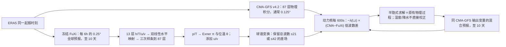

# 95｜CMA-GFS × FuXi：大尺度在线谱约束的十天混合预报

> Yong Su、Jincheng Wang、Xueshun Shen、Couhua Liu、Xingliang Li、Jin Zhang、Hao Jing、Yingying Hu，*An online spectral nudging-based correction system: improving physical model forecasts by incorporating large-scale circulations derived from machine learning models*。2026-03-03 [GMD 讨论稿](https://gmd.copernicus.org/articles/19/8673/2026/index.html)开始公开讨论，**2026-09-17 正式发表于** *Geoscientific Model Development* **19:8673–8691**，[正式全文](https://gmd.copernicus.org/articles/19/8673/2026/index.html)，[DOI 10.5194/gmd-19-8673-2026](https://doi.org/10.5194/gmd-19-8673-2026)。阅读日期：2026-09-24。

> **证据边界**：依据出版社开放的[正式 HTML 主文、表 1–3、图 1–11、完整 XML](https://gmd.copernicus.org/articles/19/8673/2026/index.html)重排；表格和正文数字可以核对，未从图线猜细小数。本篇和 [#48 IFS–AIFS 集合](48-hybrid-ifs-aifs-ens.md)、[#49 IFS–AIFS 确定性](49-hybrid-ifs-aifs-single.md)、[#50 GEM–GraphCast](50-gdps-graphcast-spectral-nudging.md)及 [#65 Pangu–WRF 台风](65-pangu-wrf-2week-tc.md)是**不同物理底座/AI 底座/试验协议的独立论文**，不是一篇的四个版本。

## 问题与模型身份：这是在线混合预报，不是重新训练 FuXi

FuXi 的大尺度高度场常比 CMA-GFS 更准，但确定性深度学习场随时效变得过于平滑；CMA-GFS 有更丰富的动力/物理过程和极端降水、台风强度细节，却可能把天气形势放错位置。本研究在**CMA-GFS 动力核积分过程中**不断加入 FuXi 的**低波数环流**差值，仅约束选定垂直层和大尺度，让物理模式自己演化小尺度、湿物理及极端强度。方法属于数值积分的“在线谱约束（spectral nudging，SN）”，不是将 FuXi 输出做一次事后插值，也不是用 FuXi 伪标签训练新的神经网络。[正式摘要、§1–2](https://gmd.copernicus.org/articles/19/8673/2026/index.html)

**模型预测至 10 天**，主批量回报是**2024 年 7 月与 2025 年 1 月**每日 12 UTC 各约 31 次；北方强降雨另用 2025 年 7 月个例，台风用 2024 年西北太平洋/南海 **10 场**。因此论文有直接的中期证据，但没有完整 2024/2025 全年样本，也没有 11–15 天验证，更不是已业务运行的循环同化系统。[§3.1–3.4](https://gmd.copernicus.org/articles/19/8673/2026/index.html)

## 数据与处理：两个底座的格网、垂直层和真值不能混

| 环节 | 原文资料/处理 | 边界 |
| --- | --- | --- |
| 物理底座 | **CMA-GFS v4.2**（原 GRAPES-GFS），业务规格 **0.125°、87 个模式层、顶高 0.1hPa**，全球经纬 C 格点、地形跟随混合高度坐标、半隐式半拉格朗日动力核；预报三维 `u/v/w`、位温 `θ`、Exner 气压 `π`、水汽 `q` 等。 | 不是 GraphCast/AIFS，也不将 CMA-GFS 物理参数化替换成神经网络。高雨量/台风个例的比较又专门统一到 **0.25°**，不能把所有图都称 0.125° 实验。 |
| AI 底座 | **FuXi 原公开确定性级联**，两个前时次→下一 6h 的 U-Transformer；三段模型覆盖 0–5、5–10、10–15 天。本篇只从 ERA5 起报，运行其中至 **10 天**、6h 间隔、原生 **0.25°**。 | 原 FuXi 约 39 年 ERA5 训练是已有模型背景。**本研究没有重训/微调 FuXi**，作者也未取得其训练代码；不能填写本篇新增 optimizer、epoch 或可训练参数量。 |
| FuXi 输出/供 SN 场 | FuXi 有 13 标准等压层的位势高度、温度、`u/v`、相对湿度，另有 T2m、10m `u/v`、MSLP、6h 降水。谱约束实际选 **h、T、u、v** 转成 CMA-GFS 可用的 `π、θ、u、v`；**湿度/降水不直接 nudging**。 | FuXi 提供降水用于对比，但混合系统降水来自 CMA-GFS 物理演化；不把 FuXi 降水当训练标签或每步灌入动力核。 |
| 水平/垂直映射 | 13 层 h/T/u/v 先从 FuXi **0.25° 双线性插值**到 CMA-GFS 对应网格（批量可为 0.125°；个例试验统一 0.25°）。再依据两种高度坐标对 87 模式层用**三次样条**求 `p,T,u,v`，通过 `π=(p/p₀)^(R/cp)`、`θ=T(p₀/p)^(R/cp)` 转成核心变量。 | 50–1000hPa 之外需外推，但垂直权重在这部分为零，作者称外推值不进模式内部强迫。FuXi/物理模式不同竖层结构与插值误差仍是复现风险。 |
| 起报/核验 | 四套试验（原 CMA-GFS、原 FuXi、T21/T42 混合）**全部用 ERA5 起报**。环流高度/温度等对 **ERA5**，中国降水用约 **2515 个国家站**的 6h/24h 累积，与网格预报双线性插值到站点、按时间窗配对；台风用中国气象局上海台风研究所最佳路径数据。 | **不是实时 CMA 4D-Var 起报验证**。若 FuXi 改吃 CMA-GFS 分析初值，作者称 2024 年 7 月 Z500 技巧阈值时效在南/北半球分别缩短 **2.0/0.7 天**；此实验不能被写成已解决业务分布偏移。 |

来源：[正式 §2.1–2.3、§3.1、§3.3–3.4、表 3](https://gmd.copernicus.org/articles/19/8673/2026/index.html)。

## 在线算法：六小时 FuXi 参考怎样进入 600 秒积分步

*根据正式式 (1)–(4)、表 2–3 和 §2.3 原创重绘；箭头仅表示操作依赖。原 CMA-GFS 原业务规格为 0.125°，个例/台风比较为保证与 FuXi 同分辨率设为 0.25°。*[方法全文](https://gmd.copernicus.org/articles/19/8673/2026/index.html)

对变量 `ψ∈{π,θ,u,v}`，动力核中的趋势项改成 `dψ/dt=S_dyn+S_phy−λ(ψ−ψ_ref)_LS`。其中 `_LS` 并非对格点差直接乘常数，而是借 CMA-GFS 4D-Var 已有的**经纬网→高斯网→球谐展开**模块只保留指定波数的差，再逆变换；校正项进入半隐式线性化时的非线性项求解。第一版只 nudging `π,θ`，扩到 `u,v` 可进一步改进风场尤其热带风；未 nudging 水汽，因为风场约束会通过平流调节被动标量，并避免额外的大量水汽变量计算。[§2.3 式 (1)、(4)、表 2](https://gmd.copernicus.org/articles/19/8673/2026/index.html)

**时间系数是可复现的关键**：FuXi 每隔 `L_ref=21,600s`（6h）给一帧，CMA-GFS 示例步长 `dt=600s`，区间有 **36 步**；作者取强度 `λ_S=1`，`λ_time=λ_S/[L_ref−(N−1)dt]`。所以第 1 步 `λ_time·dt=1/36`，到第 36 步为 **1**，6h 结束时大尺度逐渐完全向该 FuXi 目标收敛；下一 6h 换 FuXi 下一帧并重置 `N=1`。这和线性插两帧 FuXi 到每 600s 后约束效果类似，但只需同时保留一帧目标。[§2.3 式 (2)–(3)](https://gmd.copernicus.org/articles/19/8673/2026/index.html)

**竖向权重**是另一道阀门：层序号 `k1/k2/k3/k4=25/29/38/46`，约对应 **600/500/300/200hPa**；`k≤25` 与 `k≥46` 为零，25→29 用正弦爬升，29–38 为 1，38→46 用余弦下降。主要在**600–200hPa 的中高对流层**强迫，而非将 FuXi 较粗等压层结果塞进边界层、上平流层。四个层边界据不同季节典型案例的第 5 天高度/温度偏差调出，**不是用全部留出年份做严格超参搜索**。[§2.3 式 (4)、图 1](https://gmd.copernicus.org/articles/19/8673/2026/index.html)

| 方案/表 2–3 | 物理 × AI | 谱处理/截断/松弛/变量 | 在本篇的角色 |
| --- | --- | --- | --- |
| CMA-GFS | v4.2 物理基线；原 FuXi 另独立跑 | 只有 CMA-GFS 动力/物理过程；FuXi 是纯 ML 对照 | 四实验中的两条基线，不与混合模型共享新权重训练。 |
| CMA-SN21 | CMA-GFS × FuXi | 球谐变换来自 **CMA 4D-Var**；**T21/约 2000km 及以上**；`π,θ,u,v`、600–200hPa、6h 松弛 | 谱选择后主要分析的混合系统。 |
| CMA-SN42 | 同上 | 截断改为 **T42/约 1000km 及以上**，余项相同 | 检验约束过多中尺度会不会继承 FuXi 的长 lead 平滑。 |
| 相关但非本论文试验 | ECCC GEM×GraphCast；ECMWF IFS×AIFS | ECCC 用 DCT/约 2250–2750km 软截断、850–250hPa/12h；ECMWF 用 IFS 球谐/T21/约模式层 50–137/12h | 表 2 是与既有工作设计的**并列表**，这些系统的分数**不是本篇重新回报**。 |

T42 最初因 24h 动能谱在 850/500hPa 的 `k<63` 接近而被尝试；但图 3 的 2024-07-01 个例到第 10 天时，T21 在 `k≈20–30` 只有轻微谱衰减，T31/T42 分别影响到更宽的 `20–40`/`20–60` 区段。作者据此改选 **T21**；注意图 3 是特别选择谱衰减**最明显**的个例，不是全样本平均值。图 5 的 T21/T42 Z500 ACC 却几乎相同，因此不能只凭一天谱图断言 T42 在所有评分上显著落败。[§2.3 图 2–3、§3.3 图 5](https://gmd.copernicus.org/articles/19/8673/2026/index.html)

## 训练与微调：本篇什么都没有重训

作者使用**公开、冻结的 FuXi** 做参考轨迹，用现有 **CMA-GFS v4.2** 数值模式的动力核增加谱强迫项。**没有训练新网络、没有 LoRA、没有梯度更新、没有 FuXi 业务分析微调**，因而本篇不存在可报告的新增参数量、学习率、优化器、batch、epoch 或训练验证 loss。要复现本研究，应复现的是**输入/格点转换、动力核位置、层权重、时间系数、T21/T42 截断、模式积分与公平回报**；FuXi 原论文已有的训练属于背景，不能冒充本研究的模型训练。[§2.2–2.3、表 2–3、代码声明](https://gmd.copernicus.org/articles/19/8673/2026/index.html)

## 原表与图 1–11：数值、性能、失效边界

| 正式图/表 | 可靠结论 | 反例/适用范围 |
| --- | --- | --- |
| 表 1 | 不同平台/季节的北半球 Z500 ACC>0.6 时效背景：ECMWF 平台夏季 IFS **8.2d**、FuXi **9.6d**、AIFS **8.9d**；冬季 IFS **9.8d**、Aurora **10.6d**、GraphCast **10.3d**、AIFS **10.2d**。 | 原文说明这些值由 **ECMWF/CMA 展示平台曲线估读**，且各季可用模型名单不同，**不是本篇四实验的统一评分表**。 |
| 图 1、表 2–3 | 图 1 为 600–200hPa 竖向约束权重；表 2 把 CMA/ECCC/ECMWF 谱方法、变量、竖层、松弛并列；表 3 是 CMA-GFS、FuXi、SN21、SN42 四组设计。 | 结构/实验表不直接证明中期增益；也不是三地方法在同一代码/样本中消融。 |
| 图 2–3 | 图 2 的 24h 850/500/100hPa 动能谱：前两层 FuXi/CMA-GFS 在 `k<63` 近似，100hPa 仅 `k<21` 近似。图 3 给 T21/T31/T42 在第 5/10 天的谱代价，遂选 T21。 | 图 2 只有四个指定日期；图 3 是作者挑**衰减最强的个例**，不能换算成全年平均谱收益。 |
| 图 4 | 2025-07-20 12UTC 起报、120h 有效期的华北暴雨：ERA5 5880gpm 脊至约 **112°E**、实测 24h 峰值 **100–200mm**；CMA-GFS 脊约 **115°E**、雨峰 **50–75mm**；FuXi 雨峰 **<50mm**，虽位置较好仍平滑；SN21/42 雨峰 **100–150mm**，位置也改善。 | 这是**一个** 2025 个例、且四系统统一 0.25°；不自动证明所有极端过程/全球降水强度优于两底座。 |
| 图 5–6 | 2024 年 7 月、2025 年 1 月每日 12UTC→10d，原 CMA-GFS 北/南半球 Z500 阈值时效夏季约 **8.5/10d**、冬季 **9.3/8.8d**；FuXi 相对 CMA-GFS 夏约长 **2d**、冬约长 **1.5d**，SN21/42 ACC 近 FuXi。图 6 的日别第 5 天 ACC 波动比物理底座平稳。 | 作者文中称原业务 CMA-GFS 夏 7d、冬 9d，但**本试验 ERA5 起报**的上述数值更高，不能把两协议混为一个业务提升数字；只覆盖两个月。T21/T42 平均 ACC 差很小。 |
| 图 7–9 | 第 5 天 Z 高度 ACC 从 925hPa 到 10hPa 改善，温度夏约至 5hPa、冬主要在 100hPa 以下；850–50hPa 热带风 RMSE 多有下降。第 7 天 Z/温度纬圈偏差：500hPa 以上混合版接近 FuXi，低层仍像 CMA-GFS。 | 高度 **10hPa 以上有负贡献**；低于 500hPa 的 Z 偏差部分更负，不能声称全层全面改进。竖向改善上延并不等于在那里直接 nudging。 |
| 图 10 | 中国大陆 **约 2515 站**、73–136°E/18–54°N，网格雨量双线性到站、24h 时间窗匹配，比较第 **2/5/9 天**多阈值 **ETS**；SN21 普遍较 CMA-GFS 高，改善随 lead 增大，非参数 bootstrap 给 **95% CI**。 | ETS 是站点阈值事件列联评分，不能直接等同雨量 RMSE/分布校准；图中不宜按肉眼提取未列的小数；第 9 天只是延长端证据。 |
| 图 11 | 2024 年 10 场寿命>5天的台风、统一 **0.25°/ERA5 起报**、上海台风所最佳路径：第 5 天 CMA-GFS 路径 MAE 约 **365km**，FuXi **206km**，SN21 近 FuXi、相对 CMA-GFS 路径改善约 **30–40%**。FuXi 强度偏弱：最低中心气压 MAE 约 **30hPa**、最大风 **15–20m/s**；CMA-GFS 相应约 **20hPa/10m/s**，SN21 保持物理底座的强度水平，长 lead 某些指标更好。 | 台风样本只有十场，随 lead 有效数量下降；路径/强度的真值与变量含义不同。中心算法是先用上一时次附近的 **1.5km 最低气压扰动**找初猜，再以周围 **300km** 涡度质心细化，不应直接以最低海平面气压格点当作者路径算法。 |

上表据[正式 §2–3/表 1–3/图 1–11](https://gmd.copernicus.org/articles/19/8673/2026/index.html)整理。“更平稳”说的是这些回报日的 ACC 变化，不是概率集合的可靠度；本篇完全没有集合预报或独立概率校准。

## 复现资源与方法局限

- [CMA-GFS v4.2 在线校正系统 Zenodo](https://doi.org/10.5281/zenodo.18226973)、[绘图脚本](https://doi.org/10.5281/zenodo.18227191)、[公开 FuXi 权重/样例](https://doi.org/10.5281/zenodo.10401602)均为原文**代码与数据声明**所列；完整生成回报因体量过大未公开，作者承诺保存至少五年并按合理请求提供。复现应固定 FuXi checkpoint、转换算子和 CMA-GFS 构建版本。[正式代码声明](https://gmd.copernicus.org/articles/19/8673/2026/index.html)
- **最大外推风险是起报分布**：所有主结果以 ERA5 起报，作者实测 FuXi 换 CMA 自身分析会掉 0.7/2.0 天。未来业务循环 4D-Var 必须处理切线/伴随、背景误差协方差及 FuXi 对 CMA 分析域的适配；“先把 CMA 分析变成 ERA5 风格”或“用 CMA 重分析微调 FuXi”只是展望，**本篇均未实施**。[§3.1、§4](https://gmd.copernicus.org/articles/19/8673/2026/index.html)
- **谱尺度/极端互换**：T42 更强地把 FuXi 的平滑带到中尺度，T21 因此是本文选择；但图 5 Z500 ACC 对两种截断区分不强。不能把这篇概括成“FuXi 直接替代 CMA-GFS”或“给物理模式所有层硬约束”，其关键是保留小尺度数值动力与原物理降水/台风强度。[§2.3、§3](https://gmd.copernicus.org/articles/19/8673/2026/index.html)

**一句结论**：这项研究给出真正可复现的傅里叶/球谐在线耦合细节，并在 10 天、两个月批量回报和台风/暴雨个例中展示“FuXi 定大形势，CMA-GFS 留细结构”的互补性；离业务结论仍差循环同化、全季节独立回报和更严格的极端概率验证。
