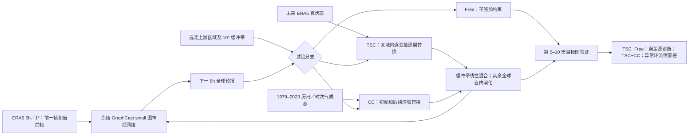

# 96｜冻结 GraphCast 的逐步约束实验：诊断中期极端天气误差从哪里传播

> Yanbo Nie、Agniv Sengupta、Jorge Baño-Medina、Benjamin Moore、Luca Delle Monache，*Diagnosing Forecast Error Propagation and Large-Scale Dynamics of Weather Extremes With an AI Weather Model*，*Geophysical Research Letters* **53(18), e2026GL123505**，**2026-09-14 首次发表**。[正式全文](https://agupubs.onlinelibrary.wiley.com/doi/10.1029/2026GL123505)｜[DOI](https://doi.org/10.1029/2026GL123505)｜[作者实验代码](https://github.com/CW3E/AI-experiments)。阅读日期：2026-09-24。

> **证据边界**：已直接核对出版社开放的正文、方法式 (1)、主图 1–3 图注及作者代码仓库的项目说明。出版社列出的 3.7 MB [Supporting Information S1（DOCX）](https://agupubs.onlinelibrary.wiley.com/doi/10.1029/2026GL123505)此次无法直接下载（访问返回 403）；下文涉及图 S3/S4/S5 的数值和图意，**只依据已核对的正式主文对补图的描述**，未逐张独立核对补图或 Text S1/S2。不能据此填入未见的每个滑窗步长、显著性校正或全部个例参数。

## 一、问题：从“预报得准不准”转到“误差如何到达极端事件”

这篇不是训练一个更大的天气基础模型，也不是报告某个新 GraphCast 权重。它使用冻结的全球图神经网络 **GraphCast small** 做可干预的中期天气实验：在每个自回归步，对已知上游区域注入再分析“真状态”，看数千公里外的事件目标区误差是否改变。两个事件分别是 **2021 年 6 月北美西部极端热浪**和 **2016 年 3 月斯堪的纳维亚阻塞**。这样能够问：一个模型的远端误差是否通过可识别的大尺度动力过程传播，而不只是展示相关系数或梯度热图。[正式摘要与 §1](https://agupubs.onlinelibrary.wiley.com/doi/10.1029/2026GL123505)

研究的中期相关性是明确的：两个案例均考察 **第 5–10 天**内自由预报失效和持续约束后的变化，热浪重点是 **超过第 7 天及第 8–10 天**，阻塞重点是 **超过第 5 天**；最长 10 天，**未验证第 11–15 天，也非 S2S 多周预报**。其性能百分比来自选定个例的干预诊断，不能推广成 GraphCast 全球平均业务技巧提升。

## 二、数据、预处理、模型版别

| 环节 | 原论文可核验设置 | 对结论的影响 |
| --- | --- | --- |
| 起报和真值 | **ERA5** 每 **6 小时**、**1.0°** 格点，用作 GraphCast 的初值、自由预报核验及 TSC 逐步替换的“真状态”。 | TSC 在试验中持续使用**未来时刻的 ERA5**；这是事后已知事件的诊断，不是实时可部署的预报订正。 |
| 气候态 | ERA5 **1979–2023**，按历日和日内时次计算随时间变化的气候态，异常为状态减此气候态；分位阈值同一时期计算。 | CC 逐时刻注入的不是全年固定平均场；不同季节/日内时次可有不同背景。正文未列平滑窗口与闰日处理，不自补设定。 |
| 物理模式对照 | ECMWF **IFS 确定性**，原始 **0.25°**、每 **12 小时**起报；主图与 GraphCast 对照。 | 模型分辨率、起报频次及物理系统都不一样，不能把其差值当严格同分辨率架构消融。 |
| AI 底座 | **GraphCast small**，全球 **1°×1°** 图神经网络；给当前和前 **6h** 状态，预测下一 **6h**，滚动至第 10 天。原权重由原作者用 **1979–2015 ERA5 6h** 资料训练。 | 作者特意使用 small：2016 阻塞发生在其训练期外，而高分辨率 GraphCast 的训练期含该事件。本文没有给出原底座全部通道清单、参数量或原训练优化器；这些不能从其他 GraphCast 版别挪来。 |
| 区域和变量 | 热浪目标区 **40–60°N、130–110°W**，用 2m 温度及 850hPa 温度；阻塞目标区 **55–77°N、0–40°E**，关注 500hPa 高度等。 | 区域平均、格点场及不同变量的百分比并非同一个评分；比较前须同时标注事件、变量和起报。 |

正文未列 ERA5 到模型字段的所有插值和标准化张量细节，不能推定作者用某一未报告的缺测填充值。作者公开的代码仓库把 `data_preparation` 用于 ERA5 下载、CC 气候态调整和 GraphCast 输入格式转换，`graphcast` 中有修改后的 rollout，`inference` 执行自由/约束推理，`diagnosis` 求视热源 `Q1`，`figures` 绘制主图；这说明资料转换与约束推理是两个不同阶段，**不是端到端训练新模型**。[正式 §2.1–2.2](https://agupubs.onlinelibrary.wiley.com/doi/10.1029/2026GL123505)、[代码项目说明](https://github.com/CW3E/AI-experiments)

## 三、模型结构与完整推理干预流程

*依正式 §2.2–2.4 原创重绘；它展示研究逻辑而非论文原图的像素复制。CC 分支在**初值**及每一步都替换，TSC 在每一步预报**之后、下一步输入之前**替换。*

### TSC：真状态约束

TSC（true-state constraint）不是传统物理模式里连续时间的松弛趋势，而是在 GraphCast 每次 **6h** 自回归计算之后，把上游区域**全部预测的预报变量**替换成同一时刻 ERA5；边界外的 **10° 经纬度缓冲带**对每变量/每层单独作线性权重混合，ERA5 权重从内区 `1` 逐渐降到外界 `0`，余区继续自由演化。如此下一步输入既含被纠正的上游，又含自由响应的下游。能使目标区误差下降，说明上游状态误差可传播并影响该目标，但下降幅度**不是所有潜在误差源贡献的上界**。[§2.3](https://agupubs.onlinelibrary.wiley.com/doi/10.1029/2026GL123505)

论文给出的计算量是一个 10 天 GraphCast 自由或 TSC 预报约 **4 CPU 核上 5 分钟**，或 **单 GPU 几秒**；这描述其试验环境的速度，不含把全球所有滑窗、所有案例和资料下载算进去的端到端成本。

### GSS：全球敏感区扫描

GSS（global sensitivity scanning）对全球各个 **20°×20°** 候选方框重复 TSC，再以目标区误差减少量制图，选潜在上游误差源。其优点是把区域假设从“前人告诉我们梅雨区/湾流区”扩成搜索；局限是用**未来 ERA5**改写每块区域后再回看已发生事件，因此它是 **post hoc** 灵敏度图，不能直接输出未来实时预报。原文说更小尺度过程可能需要更细窗；**扫描步长、重叠处理和并行配置在未取得的补充 Text S1**，这份笔记不补造。[§2.3、图 2](https://agupubs.onlinelibrary.wiley.com/doi/10.1029/2026GL123505)

### CC：气候态约束与异常环流对照

CC（climatology constraint）把同一区域替换为随历日和日内时次变化的 ERA5 气候态，不只替换后续滚动输出，还替换**初始条件**。在相同起报时刻比较 TSC 和 CC，得到“保持该区域事件真实异常”相对于“移除该区域异常”的下游情景差。本文两案例均设 **5 个错时起报成员、8 天** TSC/CC 配对集合。该差值有事件过程解释力，但 CC 有意改变真实天气背景，**6 K 不是一个可从自由预报中实际回收的业务误差减少值**。[§2.4、图 3](https://agupubs.onlinelibrary.wiley.com/doi/10.1029/2026GL123505)

### 视热源 `Q1`：机制诊断而非网络训练目标

作者从 ERA5 与 GraphCast 预报的温度、水平风和垂直压力速度等场**离线**按大尺度热力方程残差估算 `Q1 = c_p(∂T/∂t + V·∇T − ωσ)`；其中 `σ` 是静力稳定度。它是净非绝热加热的代理量，可用于检查梅雨/大气河及湾流气旋附近潜热释放与罗斯贝波响应是否匹配，并非显式对流方案的直接输出，也不是 GraphCast 的新损失函数。[§2.5 式 (1)](https://agupubs.onlinelibrary.wiley.com/doi/10.1029/2026GL123505)

## 四、训练、参数和微调：哪些是原模型，哪些是本篇实验

| 项目 | 可确认信息 | 未报告／不可混用 |
| --- | --- | --- |
| 原 GraphCast small 训练 | 原作者以 **1979–2015 ERA5 6h** 数据训练 **1° GNN**；本篇下载并调用这个已训练版。 | 正文没有给本篇新参数数、学习率、batch、epoch、优化器、参数冻结层。不能拿 0.25° GraphCast 原论文的训练超参冒充 1° small 或本研究的训练。 |
| 本文参数更新 | **没有**反向传播、权重更新、监督再训练、LoRA 或微调。 | TSC/CC 替换的是**推理状态张量**，不改神经网络参数；不能称为“ERA5 微调 GraphCast”。 |
| 需要复现的实验参数 | 6h 时间步、1° 格网、TSC 的每步全预报变量替换、10° 线性缓冲区、CC 的 1979–2023 随时间气候态、GSS 的 20°×20° 方框、5 成员/8 天对照；两事件的起报/区域见下表。 | 补充 Text S1/S2 的更细实现此次无法逐项核对；不补猜约束变量索引、GPU 型号、每窗步距或正式显著性校正。 |

## 五、主图和性能：两个事件分别读，不能合并成平均分

| 证据 | 实验及可核验数字 | 该证据并未说明什么 |
| --- | --- | --- |
| **图 1a–c：北美热浪的起报敏感性** | 2021-06-19 00 UTC 至 06-28 18 UTC **每 6h**起报，验证 06-29 00 UTC，热浪区 2m 温度异常超过约 **15–20°C**。自由 GraphCast 在 **≤7 天**能较好捕捉，>7 天迅速恶化；IFS 在 >8 天的误差比该 GraphCast 低。TSC 约束 **15–45°N、100–160°E** 梅雨/西北太平洋区域；对 06-20 00 至 06-21 00 起报，目标区面积加权 T2m 误差下降 **10.8%–30.7%**。 | 不是全部起报时刻都得到此幅度；IFS 比较也非同格点/同频起报的严格架构测试。 |
| **图 1d–f：误差空间传播** | 以 06-21 00 起报、06-29 00 有效的 T850/Z500 场看，自由轨迹有沿副热带急流的罗斯贝波型误差及高纬弧形误差；TSC 明显压低前者及北美西部 T850 误差，**高纬弧形残差仍在**。 | 一片误差下降不能说明整个热浪完全被梅雨区控制；别的误差源和耦合反馈可能存在。 |
| **图 1g–i：视热源过程链** | 06-25 ERA5 可见东亚/西北太平洋加热、北太平洋异常低压、大气河附近 `Q1` 与北美脊的联系；自由预报低估中太平洋异常低压及大气河加热，TSC 轨迹更接近 ERA5，约四天后热浪预报随之改善。 | 这是动力机制一致性的**个例**证据；`Q1` 是诊断代理，不能当直接实测凝结潜热。 |
| **图 S3（仅正式正文转述）：斯堪的纳维亚阻塞** | 2016-03-03 至 03-12 **每 6h**起报；目标 **55–77°N、0–40°E**，自由预报 **<5 天**尚好、早起报阻塞幅度迅速减弱。TSC 把**25–50°N、75–50°W** 湾流区拉向 ERA5；对 >5 天，正文报告阻塞误差下降 **63.3%–88.8%**，湾流气旋及约 **50°N、30°W** 潜热加热更合理。 | S3 原图及成员/指标逐张未取得；这一范围是主文所报，而非本笔记独立从补图量取。2016 个例在 small 训练期外，版别选择是刻意控制泄漏。 |
| **图 2：全球敏感区** | 两案例各取四个起报时刻平均：热浪 **2021-06-20 00/06/12/18 UTC**、阻塞 **2016-03-06 同四时次**；前者以 T850、后者以 Z500 的目标区误差减少绘图。原预设的东亚与湾流区均在强敏感区域。热浪还找到西—中北太平洋 **25–55°N、155–185°E** 与热带中太平洋 **5–25°N、165–135°W**。 | 两个新增候选区的 TSC 在 **8–10 天**分别减少热浪 T2m 误差 **58.3%–81.4%** 与 **28.1%–80.2%** 是**正文转述图 S4**，补图未独立核验；作者明确尚未完成这些候选区的过程级物理归因。 |
| **图 3：TSC−CC 配对集合** | 热浪案例 06-21 00 至 06-22 00 **每 6h 五成员**起报，每两天显示 T850/Z500 配对集合均值差；跨太平洋冷暖相间的波列逐渐影响北美，第 **8 天**北美 T850 面积加权差 **6.0±1.9 K**。图注对 Z500 的阴影线/斜线用双侧 Student t 检验标 **99%**；阻塞对应波列结果见主文转述的图 S5。 | 这是有/无东亚异常的**情景对照**，不是自由预报的 RMSE 改善量。仅五个相邻 6h 起报成员可能相关；正文未给有效样本量/多重比较调整，不宜扩大显著性解释。 |

数字和图注来自[正式 §3/主图 1–3](https://agupubs.onlinelibrary.wiley.com/doi/10.1029/2026GL123505)。GSS 新候选区比预设梅雨区的百分比有时更高，**不等于新候选区比梅雨“更因果”**：扫描发现的是模型对局部 ERA5 替换的敏感性，物理成因仍需过程验证。

## 六、方法价值、负面结果与外推边界

1. **模型可作为低成本动力学试验台，但本研究不是可用未来真值的业务产品。** 与动力模式 nudging 的松弛趋势不同，TSC 在每个离散步直接替换张量；其速度使大量区域实验可行。可行性来自冻模型推理快和 ERA5/模型共用 1°/6h 格网，而非已解决原始观测摄取或实时偏差订正。[§2.3、§4](https://agupubs.onlinelibrary.wiley.com/doi/10.1029/2026GL123505)
2. **误差并没有被单一上游区完全解释。** 热浪的高纬弧形残差在 TSC 后尚存；作者还指出 GraphCast 缺乏土壤湿度等边界强迫耦合，热浪中的土壤—大气反馈可能贡献未解释误差。这是可能解释，论文没有对所有候选因素做定量分解。[§3.1](https://agupubs.onlinelibrary.wiley.com/doi/10.1029/2026GL123505)
3. **两个案例共享中高纬急流/罗斯贝波主导机制。** 它们与既有物理模式约束实验方向一致，支持 GraphCast 的部分大尺度过程一致性；但论文未对热带气旋、季风转换或各种极端做样本外统计，所以不能将这两个案例写成广泛验证。[§4](https://agupubs.onlinelibrary.wiley.com/doi/10.1029/2026GL123505)
4. **统计对象必须说清。** 10.8–30.7% 是选定热浪起报的 **T2m 区域平均误差**变化；63.3–88.8% 是阻塞事件特定指标、且目前仅能由主文转述核实；6.0±1.9 K 是 TSC−CC 的 **T850 情景差**。三者的分母、变量、事件与试验设计都不同，不可并成“模型性能提高 X%”。

## 七、复现核对清单

- 下载与整理 ERA5 **1979–2023** 的 6h/1°资料，清楚分开原 GraphCast small 权重训练期 **1979–2015**、2016/2021 案例期和气候态计算期。2016/2021 案例虽都不在 small 训练期内，但气候态包含案例年是异常基准的设计，不能误说成模型权重被重新训练。
- 校验原始 GraphCast small 输入/输出字段、6h 配对与单位，然后在每个 `rollout` 步后做 TSC/CC 区域写回、10° 缓冲带逐变量/层加权；要确认连续两帧输入如何随每步更新。代码仓库的 `graphcast/rollout.py` 修改与 `inference` 脚本可作为实现起点，但本文未报告的新超参仍需源码逐项检查。
- 使用图 1b/1c 的**同一有效时刻、不同起报时刻**比较，保留 IFS 12h 与 GraphCast 6h 起报频次区别。每幅地图核对变量、气压层、面积权重和有效期；千万别把 T850 的格点绝对误差下降标为 T2m 百分比。
- 若要复现图 2 的 GSS，需另取得补充 Text S1/S2 确认滑窗网格和集合细节；若要完整复核图 S3–S5，应先取得正式 DOCX。当前笔记给这些补图保留**未逐图核验**状态，不能因为正文转述了数值就声称全部补图复现通过。
- 扩大到更多年份/事件、同分辨率 IFS 对照、其它 AI 模型及无未来真值的可部署上游改进方案，才可检验这种机制诊断对真实预报改进的泛化性。

## 来源与版本

1. [AGU/Wiley 正式开放论文，2026-09-14](https://agupubs.onlinelibrary.wiley.com/doi/10.1029/2026GL123505)：作者、日期、§1–4、式 (1)、主图 1–3、补图的正文转述。
2. [CW3E 作者代码仓库](https://github.com/CW3E/AI-experiments)：数据准备、GraphCast rollout、推理、`Q1` 诊断与绘图模块；项目说明已查，不代表所有脚本/依赖和补充材料已经完整运行验证。
3. [出版社补充材料目录](https://agupubs.onlinelibrary.wiley.com/doi/10.1029/2026GL123505)：列有 3.7 MB DOCX。此次访问受限，**未把其图片/表格当已直接核对的一手证据**。
