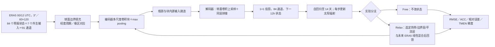

# 97｜ConvCastNet：分层真值约束与输入梯度共同诊断中期预报误差

> Uroš Perkan、Gregor Skok、Žiga Zaplotnik，*Forecast-Error Diagnostics in Neural Weather Models*。2025-06-13 [arXiv:2506.11987v1](https://arxiv.org/abs/2506.11987) 首发，2025-07-22 修订为 [v2](https://arxiv.org/abs/2506.11987v2)；**2026-06-02** 首次发表于 *Quarterly Journal of the Royal Meteorological Society* **152(779), e70212**。[正式开放全文](https://rmets.onlinelibrary.wiley.com/doi/10.1002/qj.70212)｜[DOI](https://doi.org/10.1002/qj.70212)。阅读日期：2026-09-24。

> **核验口径**：以正式期刊 HTML 的正文、表 1、主图 1–11、附录 A 的表 A1/图 A1、附录 B 图 B1 及附录 C 指标公式为准。预印本只用于核对首发/修订日期，不能把预印本早期“两作者”与正式“三作者”的书目混用。公开页面没有给出作者的完整训练代码和全部原始实验数组；下面只对正文和表中明确写出的数字给精确值，图线未逐像素数字化。

## 一、研究对象和结论应怎样理解

文章有两个互补的问题：一是如果把热带、边界层或平流层的模型状态在**每一个 12h 自回归步**替换为 ERA5“真值”，其它区域的中期预报误差会怎样变化；二是通过对初值自动微分，哪些初始变量/地区对末端的误差范数最敏感。二者分别测量**有限幅度、持续干预后的结果**和**给定轨迹附近的局部梯度**，并不自动相等，作者用它们交叉检查物理解释。[正式 §1、§3](https://rmets.onlinelibrary.wiley.com/doi/10.1002/qj.70212)

这是对作者自行训练的 **ConvCastNet（88M 参数、3° 全球 U-Net 类模型）**的实验，不是 GraphCast、AIFS 或 FuXi 的新版。模型推理/评分至 **14 天**，直接触及中期上限；主要因果干预图按 **第 2、4、8 天**给出，热带气旋 Ian 的梯度图按 **第 8、10、12 天**给出。若只引用“14 天”，会掩盖第 10 天以后公开定量对照主要是模型技巧曲线和个例敏感性、而非全变量改进。[§2.3、§4](https://rmets.onlinelibrary.wiley.com/doi/10.1002/qj.70212)

## 二、数据来源、变量、空间/时间处理与切分

| 项目 | 正式论文给出的操作 | 阅读时需保持的边界 |
| --- | --- | --- |
| 原始资料 | ERA5 的 **1970–2022 共 53 年**，选每天 **00/12 UTC** 两个时次；以**双三次样条**插到 **3° 全球经纬网、纬度 ±88.5°、60×120 网格**。压力层为 **50/100/150/200/250/300/400/500/600/700/850/925/1000 hPa**。 | 最顶只到 50 hPa，平流层过程被截断；山地以下某些等压层来自 ERA5 外推，不等于真实大气观测。0.25° 原生 ERA5 或业务分析评分不能直接等同于该 3° 插值问题。 |
| 动态输入/输出 | **6 个**压力层变量：位势、比湿、温度、纬向风、经向风、垂直速度，各 **13 层**，合计 **78 通道**；另有地表温度、2m 温度、10m u/v、海平面气压、总降水 **6 通道**。因此输出 **84 通道**。 | 作者“15 个输入变量、8 个预报变量”的文字按**变量族**计；84 是按层和近地字段展开后的模型输出通道数。降水是模型目标，但不代表 3° 已能解析对流小尺度。 |
| 非预报输入 | 海冰覆盖、雪深、土壤体积含水量、顶层入射太阳辐射、纬度、陆海掩膜、海拔 **7 通道**，加上 84 目标场使输入 **91 通道**。 | 海冰/雪/土壤水在每条 rollout 中**持久不更新**；纬度、掩膜、海拔为静态；太阳辐射随有效时间变化。该设计会限制更长时效与强海气陆耦合推论。 |
| 标准化 | 对字段/格点用 `S(X)=(X−c_mean)/(c_std+1e−7)`；`c_mean/c_std` 取 **1979–2014** 气候期，绝大多数字段按**每个网格点**分别估计。海冰、雪、土壤体积含水量三项例外：均值/标准差对全球经纬度聚合。 | 附录 C4 的气候态用有效日附近 **±5 天窗口**；不能把它写成一套所有格点和日期共用的全局均值。需要注意原式 C4 年份计数的记号与端点数可能不完全一致，复现要按数据代码核对。 |
| 训练/验证/测试 | 表 A1 逐阶段换时间块；最初各阶段用 **2015–2019** 验证，最后 4 步阶段改为 **2018–2019** 验证。完全留出的测试期是 **2020–2022**。图 2–11 的评估每 **5 天**抽一个起报日，并在 00/12 UTC 交替，共 **214 次**。 | 不能概括成固定的“1970–2014 训练、2015–2019 验证”：最后一步四步训练包含 **2015–2017**，但不包含 2018–2019；作者实际上是**多阶段变化切分**。测试 2020–2022 仍在各训练窗口外。 |

详细字段见[正式表 1 和 §2.2](https://rmets.onlinelibrary.wiley.com/doi/10.1002/qj.70212)。质量控制、缺测填补、降水累积窗、冰雪变量的原始采样/重网格边界等没有给完整可运行配置；不能假定已有逐变量标准化脚本。输入输出单位对原始资料与标准化后张量要分开写。[附录 C](https://rmets.onlinelibrary.wiley.com/doi/10.1002/qj.70212)

## 三、架构：原文图 1 的九块编码—解码器

*依据正式图 1、表 1、§2–3 和附录 A 原创重绘；示意阶段关系，不复制出版社原图。*

模型总计 **9 个网络块**，每块 **4 个子块**，使用**深度可分离卷积**：先对各输入通道分别做空间 depthwise 过滤，再以 **1×1** pointwise 融合通道；随后 Leaky ReLU 与二维 BatchNorm。一般 depthwise 核为 **3×3**，第一块第一层为 **7×7**，在 3° 格对应 **21°×21°**，便于学习天气尺度场；编码/解码块间用 max pooling 和转置卷积，含跨层 U-Net skip 和块内 source skip，最后以 pointwise 层投影到 84 通道。**球面填充**要使反经线与极区附近卷积仍对地表相邻区域取值，不能视作普通图像零填充。**88M 权重**是本篇 ConvCastNet，不能错记成 GraphCast small 的参数量。[正式图 1、附录 A/图 A1](https://rmets.onlinelibrary.wiley.com/doi/10.1002/qj.70212)

原文图 1 图注中的 `(91,60,120)→(84,60,120)` 是**通道×纬×经**，而非时间长度。数值实验在标准化空间作模型前向，约束时先反标准化，再按真值和预测加权；这顺序写在§3.1 的表达式中。[正式式 (1)–(2)](https://rmets.onlinelibrary.wiley.com/doi/10.1002/qj.70212)

## 四、完整训练流程与逐段微调：表 A1 必须整体看

| 顺序 | 自回归训练展开 `n` | epoch | 该阶段训练资料 | 验证资料 | 含义 |
| --- | ---: | ---: | --- | --- | --- |
| 1 | 1 步＝12h | 20 | 1970–1984 | 2015–2019 | 在较早年代先学单步基本映射。 |
| 2 | 1 步 | 20 | 1985–1999 | 2015–2019 | 继续单步训练、更换时间块。 |
| 3 | 1 步 | 20 | 2000–2014 | 2015–2019 | 共 **60** 个单步 epoch，但不是同一资料块重复 60 次。 |
| 4 | 2 步＝24h | 18 | 1980–1999 | 2015–2019 | 以前阶段验证最佳 checkpoint 初始化，改为两步展开。 |
| 5 | 2 步 | 20 | 2000–2014 | 2015–2019 | 两步阶段合计 **38** 个 epoch。 |
| 6 | 4 步＝48h | 18 | 1985–1999 | 2015–2019 | 再以上阶段验证最佳权重初始化，四步自回归损失。 |
| 7 | 4 步 | 20 | 2002–2017 | 2018–2019 | 四步阶段合计 **38** epoch，验证窗移后；**2015–2017 已进入训练**。 |

这构成 **60＋38＋38＝136 个分段 epoch**，每段数据时间窗不同；不能写成在单一不变全集上 136 epoch。每阶段保留验证集 **ACC 最高**的 checkpoint，作为下一阶段起点。若用“微调”称呼第 4–7 段，应具体说明它是**同一 ERA5 任务上训练展开长度逐步增加，延续前阶段权重，并非新观测/业务分析适配或冻结骨干的小参数微调**。正文没有说明冻结任何层。[§2.2、附录表 A1](https://rmets.onlinelibrary.wiley.com/doi/10.1002/qj.70212)

全部训练阶段用 **Adam**、batch **5**、初始学习率 **0.001**；`ReduceLROnPlateau` 在 loss 六个 epoch 无可见改善后把 LR 乘 **0.01**。训练损失写成 **`0.1×MSE(y_{0..n},ŷ_{0..n})^(1/256)`**，其中逐阶段把 `n` 从 1 提到 2 再到 4。`1/256` 是作者经验证集选的**MSE 幂指数**，不是 256 个集合成员或 256 个训练步；极小指数减弱大误差区域在梯度中的相对权重。原文未给 weight decay、各阶段实际步数、GPU 型号、每段训练耗时、随机种子、深度可分离卷积的全部通道宽度及每轮学习率轨迹，不能补造。[附录 A 表 A1 及段落](https://rmets.onlinelibrary.wiley.com/doi/10.1002/qj.70212)

**训练只展开最多 4×12h＝2 天，推理却运行到 14 天。** 作者把有限热带对中纬度影响的一部分归因于训练目标没有覆盖较慢遥相关，这是作者提出的可能机制，**未做以更长展开训练的直接消融**，不能写成已证明的唯一原因。[§4.1](https://rmets.onlinelibrary.wiley.com/doi/10.1002/qj.70212)

## 五、真值约束的数学操作及三组消融

令 `X_f` 为本步输出，`X_t` 为对应**未来有效时刻** ERA5，作者定义 `X_new(r)=Λ(r)·X_f(r)+(1−Λ(r))·X_t(r)`。**`Λ=1` 完全自由，`Λ=0` 完全替换真值**；边缘用 `tanh` 使约束平滑过渡。它在**每一个 12h 步**应用于状态，并把混合状态再喂入下一步，不是在初始时刻只做一次修正，也不同于对动力方程加 `−(X−X_ref)/τ` 的传统连续 nudging。对预测误差的相对变化定义为 **`E_rel=E_relaxed/E_free−1`**，因此负数是改进。[正式 §3.1 式 (2)–(5)](https://rmets.onlinelibrary.wiley.com/doi/10.1002/qj.70212)

| 实验 | `Λ` 过渡与注入字段 | 探索的物理问题/注意点 |
| --- | --- | --- |
| **热带对流层** | 纬带中心范围 **19.5°S–19.5°N**，`Δφ=4.5°`；热带区域的**全部预报变量**，包括 MSLP 与降水，都逐步向 ERA5 靠近。 | 测快速增长的热带误差能否显著影响中纬度；和其它两试验约束字段集合不同。 |
| **全球边界层** | 压力中心 **`p0=850 hPa`**、过渡 **`Δp=100 hPa`**，式 (3) 取负号；低层大气场加 MSLP、地表/2m 温度、10m 风；**不直接约束降水**。 | 检验下层形势修正能否沿垂直方向进入急流层和平流层；降水不是直接灌入的真值。 |
| **平流层** | 在**逐格点动态求出的热带对流层顶以上**约束高空变量，`Δp=100 hPa`、式 (3) 取正号。温度剖面先三次样条插值，用温度导数极值找预期对流层顶，再以水平二维 **σ=2** 高斯平滑过滤离群。 | 第 8 天对下层的延迟影响与顶层位置有关；模型顶只有 **50 hPa**，并未模拟完整平流层。 |

作者以测试样本每五天一次、00/12 交替的预报作比较；按标准化字段绝对误差的垂直或纬向平均，使用 **Mann–Whitney U** 检验，以 **95%** 水平标示显著区域。该检验和图 5 的面积加权 **RMSE** 是不同统计对象，不能将图 4 的颜色值当图 5 的均方根改善百分比。地区/层次的多重比较校正并未在正文明确披露。[§3.1、图 4–5](https://rmets.onlinelibrary.wiley.com/doi/10.1002/qj.70212)

## 六、输入梯度诊断：TMEN 范数、个例与样本均值

作者使用目标区的**总湿能误差范数 TMEN**：按垂直层厚 `Δp/g`、网格面积和目标区面积加权，对 `u/v` 动能误差、温度误差、比湿误差的平方项求和。公开常数为 `c_pd=1005.7 J kg⁻¹ K⁻¹`、`L_v=2.5104×10⁶ J kg⁻¹`、`g=9.8065 m s⁻²`、参考温度 **300 K**、湿度缩放 **`w_q=0.3`**；压力层间线性插值，地面场不进 TMEN；单位 **J m⁻²**。随后自动微分求 `∂TMEN(t)/∂X(t0)`。湿度权重为经验设置，平方误差偏重极端样本，故这张“重要性图”**依赖范数定义**，并非无条件的因果证据。[§3.2 式 (6)](https://rmets.onlinelibrary.wiley.com/doi/10.1002/qj.70212)

两个研究层级必须分开：图 8 是 **2022 年飓风 Ian** 的一次起报梯度，图 9–11 是 **2020–2022 测试期**多个起报的平均绝对梯度 `AMES=mean(|∂E/∂X0|)`；平均**绝对值**后已丢失正负方向，不可用其判断把风加一点还是减一点会改进。三条误差域为赤道带 **4.5°S–4.5°N**、副热带 **28.5–34.5°N**、中纬带 **40.5–49.5°N**，经度均 0–360°、垂直全柱。[§4.2.2](https://rmets.onlinelibrary.wiley.com/doi/10.1002/qj.70212)

## 七、模型性能与图 1–11、附图的逐图证据

| 图/表 | 可核验的实验与性能 | 负结果/边界 |
| --- | --- | --- |
| **表 1、图 1、图 A1** | 输入 **91**、输出 **84**、3°/60×120；九网络块、四子块、深度可分离卷积、球面填充与 skip；图 A1 展示经线/极区的填充逻辑。 | 结构图不含训练成绩；表 1 的 15 是字段族而非 15 个张量通道。 |
| **图 2：全球平均技巧** | **2020–2022、214 次**测试起报，指标为纬度面积权重 RMSE/ACC，评至 **14 天**。**Z500 ACC>0.6 至 8.5 天、T850 至 7.5 天**；相对 1979–2014 气候态，Z500 RMSE 至约 **10 天**较好、T850 至约 **9 天**较好；对 persistence 则 14 天均优。 | 降水、垂直速度 ACC 明显更低；不能因 Z500 一项推断所有 84 字段都在第 10/14 天有技巧。图中没有 IFS/GraphCast 同条件分数，不能称 ConvCastNet 击败业务系统。 |
| **图 3、附图 B1：误差空间** | 图 3 是第 **2 天**，绝对误差大值常在中高纬及强急流、湿度大值在湿润热带；以局地自然变率归一后，**热带和下平流层**更早突显。附图 B1 对第 **10 天**显示标准化误差扩到温带。 | 绝对误差和“除以气候标准差”的误差热点不同；论文只推测 50hPa 顶层截断、地形下压力层外推与部分失效有关，未做相应消融。 |
| **图 4–5：热带约束** | 图 4 选第 **2/4/8 天**、纬向和垂直剖面；真值影响到约束带外 **10–15°**，100–500hPa 扩散较明显。图 5 对北半球温带 Z500、500hPa 风的 RMSE 曲线：热带约束影响小；局地最多约 **5%** 好转但**不显著**。 | 不能概括成“热带对温带无物理影响”；这是 3° ConvCastNet、具体时效/字段/约束设置下的结果，可能受 48h 最大训练展开和分辨率限制。 |
| **图 4–5：边界层／平流层约束** | 边界层真值影响主要**向上**扩到中纬急流，平流层约束有**延迟向下**的中期信号；图 5 的北半球温带 RMSE 较自由运行明显好转，边界层的垂直传播一般较强。 | 平流层→下层效果对动态对流层顶的选取**敏感**；两层双向耦合使“约束平流层得到的改善”高估仅修好平流层参数化的纯收益。 |
| **图 6–7：第 4 天各变量** | 图 6 是边界层约束，Z/T 及中纬海洋斜压区收益较强，`q`/`ω` 增益较弱；图 7 是平流层约束，Z/T 改善清楚，`q`/`ω` 只有轻微且**不显著**的好转。 | 边界层方案在**热带中高对流层与全球平流层的位势场**可退步；不能将“多数区域改善”改写为“全变量、全层改善”。作者还说明 3° 真值注入引起初期误差尖峰，结论受网格尺度影响。 |
| **图 8：Ian 2022 个例梯度** | 2022-09-23 00 UTC 起报，Ian 路径前约 **8 天**较准，8/10/12 天 TMEN 梯度对初始 500hPa `u` 的敏感区从加勒比向上游北太平洋、亚洲/欧洲扩展；地表温度梯度对 **SST** 强于陆面/冰面。 | 3° 模型下气旋约一个格点，只能诊断大尺度位置/环流敏感性，**不能**说明解析了眼墙、强度或精细降雨；10/12 天路径已明显偏离。 |
| **图 9–11：2020–2022 平均梯度** | 第 8 天中纬带误差对初始 1000/400/150hPa `u` 的敏感分布不同；图 10 第 4/8 天对海温敏感，尤其大陆东侧海流锋区，8 天幅度和范围扩大；图 11 用 850hPa 比湿比较赤道、副热带、中纬带，显示热带影响向北减弱。 | 图 10 两幅**色标不同**，不可肉眼直接比原色深；图 11 的中纬带仍对部分热带区有梯度，却在真值约束实验中不显著，说明“梯度非零”不等于“有限幅度干预能显著改进”。赤道误差还出现作者称意外的南极敏感区，未作过程级验证。 |
| **表 A1、附图 B1、附录 C** | A1 给 7 段训练、**136 名义 epoch**和 1→2→4 步；B1 是第 10 天空间误差；C 给面积权重 RMSE/ACC 与 1979–2014 **±5 天**气候态，明确 `N_forecasts=214`。 | 论文公开数据可以向通讯作者申请；在没有原始评分数组和可运行作者代码时，不能从彩色图填虚假的精确小数或声称独立复现。 |

以上均据[正式 §2–4、图 1–11、附录 A–C](https://rmets.onlinelibrary.wiley.com/doi/10.1002/qj.70212)。图 5 是少数变量的北半球温带 RMSE；图 4 是各层温度标准化绝对误差比；图 8 是单个强天气过程，它们三者不能汇成一个“中期预报精度提高百分比”。

## 八、方法评价和仍需检验的问题

1. **有真值驱动的诊断，不是实时生产预报。** 每步 ERA5 真值在起报当下不可获得，图 4–7 的改进应解读为“如果这个子系统的状态总是正确，别处可以怎样响应”，不是一个可直接上线的 ConvCastNet-ERA5 混合预报。作者自己也提醒两向耦合意味着对平流层修正贡献的估计可能偏大。[§3.1、§5](https://rmets.onlinelibrary.wiley.com/doi/10.1002/qj.70212)
2. **和 #96 是互补、不是重复。** [#96 的 GraphCast 个例诊断](96-graphcast-extreme-error-propagation.md)用已训练 1° GraphCast small、6h 步、远端热浪/阻塞和 20° 全球上游扫描；本篇用新训练的 3°/12h ConvCastNet、全球纬带/层带约束及 TMEN 初值梯度，统计多年的第 8 天中纬度响应。两篇都依赖未来 ERA5 作事后约束，但训练、模型、控制区域、真值格网、指标与问题不同，不可共享一个收益百分比。
3. **物理解释受模型表征和梯度目标限制。** 3° 格网难解析热带气旋、海洋锋面、小尺度对流；Leaky ReLU 在 0 不可导，自动微分实际使用框架的分段次梯度；平方 TMEN 对极端事件偏重且 `w_q=0.3` 为经验选取。极地的意外敏感性、热带有限影响以及边界层约束下的个别负收益值得进一步跨模型/分辨率测试。[§4–5](https://rmets.onlinelibrary.wiley.com/doi/10.1002/qj.70212)
4. **平均技巧与具体天气风险不同。** Z500/T850 达 ACC 0.6 的 8.5/7.5 天说明该粗分辨率底座有中期大尺度技巧，却不证明降水或台风第 8–14 天有可用业务技巧；Ian 一例也未提供与全球风暴样本/最佳路径统一评估。

## 九、复现清单和来源

- 按原表 1 配齐 ERA5 15 个变量族、**91→84** 通道；双三次样条到 3°/60×120、处理反经线/极区，按 1979–2014 每格气候均值/标准差标准化，只有海冰/雪/土壤水做空间聚合；检验地形下等压层外推和降水窗口。
- 重建图 1/图 A1 的 DS 卷积与球面填充，而非普通 U-Net 零填充；验证 **88M** 参数数目。逐段按表 A1 的时间窗和 1→2→4 步、20/20/20/18/20/18/20 epoch、Adam/batch5/LR0.001、验证 ACC 选 checkpoint、loss 的 `1/256` 指数执行；未报告的硬件、种子、层通道宽度与实测步数不能凭此还原。
- 对 2020–2022 测试集每 5 天交替 00/12 UTC 起报，核对总样本 **214**；自由运行到 14 天。按附录 C 的纬度权重和 ±5 天气候态分别复现 Z500/T850 RMSE/ACC。测试年份不可混进权重训练或气候标准化期。
- 每个 12h 步反标准化后按 `Λ·模型＋(1−Λ)·未来 ERA5` 做三类约束，逐变量保留“热带含降水、边界层不含降水”的差别；比较自由/约束而非把真值当实时可用输入。TMEN 对选定误差域自动微分时保留权重 `w_q=0.3` 与面积/层厚，分别输出有符号个例梯度和平均绝对梯度。
- **来源**：[期刊正式全文、表 1/A1、图 1–11/A1/B1、附录 C](https://rmets.onlinelibrary.wiley.com/doi/10.1002/qj.70212)；[arXiv 首发/修订书目](https://arxiv.org/abs/2506.11987)。正式版没有提供可直接逐项核查的公开代码仓库；可获取数据声明为向通讯作者合理请求。
