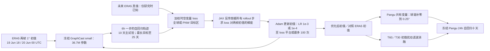

# 98｜固定 GraphCast 权重、反向优化初值：2021 北美热浪十天与约 23 天可预报性

> P. Trent Vonich、Gregory J. Hakim，*Predictability Limit of the 2021 Pacific Northwest Heatwave From Deep-Learning Sensitivity Analysis*。2024-06-07 [arXiv:2406.05019v1](https://arxiv.org/abs/2406.05019) 首发；**2024-10-03** 发表于 *Geophysical Research Letters* **51(19), e2024GL110651**。[正式开放全文](https://agupubs.onlinelibrary.wiley.com/doi/10.1029/2024GL110651)｜[DOI](https://doi.org/10.1029/2024GL110651)｜[作者公开的两套优化初值](https://zenodo.org/records/13694959)。阅读日期：2026-09-24。

> **证据等级**：正文和主图 1–3、图注、方法公式、数据可用性声明均已直接核验。出版方列有 3.3 MB 独立 Supporting Information S1 PDF，但此次下载返回 403；表 S1 与图 S1–S5 的结果**仅可按正式正文的转述记录，未逐页/逐图独立核验**。不要把图 S1 迭代曲线、表 S1 初值幅度或图 S5 的分支效果描述成已亲自复测。

## 一、核心问题：找“事后最优初值”，不是训练天气模型

传统 adjoint 估计小初值扰动影响，通常受围绕一条控制轨迹线性化及昂贵模式积分限制。作者利用 JAX 对已训练天气模型的**所有自回归步做反向传播**，计算“若想让未来某时段/区域更接近已知 ERA5，应该怎样改当前大气初值”，并以 Adam 迭代优化两帧初值。模型参数保持不变。主要案例是 **2021-06-20 00 UTC 起报、2021-06-30 00 UTC 验证**的北美西北部极端热浪十天预报；另从 6 月 1 日起报探索不同目标 lead **2.5–25 天**，估计该案例在模型中的事后可预报性上界。[正式 §1–4](https://agupubs.onlinelibrary.wiley.com/doi/10.1029/2024GL110651)

“十天误差下降约 94%”说的是**已知十天后 ERA5 真值时，通过直接最小化同一预报误差得到的事后优化初值**，不是能在 6 月 20 日实时获得的业务成绩，也不是 GraphCast 基准模型训练后的普通测试技巧。其 22.5–23 天结果同样是单个热浪案例、已知后验真值下对优化解的比较，**绝不是证明所有天气都能提前 23 天高准确度确定性预报**。这是整篇阅读最重要的因果和部署边界。[摘要、§4.3–5](https://agupubs.onlinelibrary.wiley.com/doi/10.1029/2024GL110651)

## 二、模型版别、数据和处理：两种格网不可混写

| 环节 | 论文直接给出的设置 | 影响 |
| --- | --- | --- |
| 主底座 | **GraphCast small**，已训练 **36.7M 参数**，原权重来自 ERA5 **1979–2015**、**1°**训练。六种高空字段——位势高度、温度、比湿、垂直速度、`u/v`——在 **13 等压层**；近地 MSLP、T2m、10m `u/v`，及 6h 累积降水。以相隔 6h 的**两帧大气状态**预测后续 6h，逐步滚动。 | 不是 0.25° 全分辨率 GraphCast；2021 事件在 small 训练期外。本文**不重训或微调任何 GraphCast 权重**。输入场只调整被预报的大气状态，陆海掩膜和顶层太阳辐射等指定强迫保持不动。 |
| 主起报/核验 | 以 2021-06-19 **18 UTC**与 06-20 **00 UTC** 的 ERA5 状态作 GraphCast 初始双帧；主优化目标是 06-30 00 UTC 的十天过程。ERA5 是初值、未来验证真值和图 1 的参照，气温距平相对 ERA5 **1979–2020 的 6 月月平均**。 | 图 1 的 ERA5 原始空间场 **0.25°**，GraphCast 为 **1°**；模型 loss 在 GraphCast 1° 格计算。不可把原 ERA5 高分辨图的纹理和 GraphCast 1° 结果当同尺度细节比较。 |
| 目标区域 | 一组目标为全球，另一组只给北美西北部 **42–60°N、130–110°W** 的格点误差加权，二者都用全球初值变量作可优化参数。 | “PNW 区域优化”指**损失在 PNW 区域计**，不是只允许改该区的初始格点；图 1c 与 1d 优化的目标不同。 |
| Pangu 跨模型试验 | 现成 **Pangu-Weather 0.25°** 权重，单帧输入、每 **24h** 前进一步；与 GraphCast 同压力层/大多字段，但**无垂直速度和降水**。把 GraphCast 优化初值的共有变量球谐展开，**小尺度谱系数补零**到 Pangu 分辨率后逆变换到 0.25°；Pangu 只取 06-20 00 UTC 那帧。 | Pangu 不参加输入梯度求解，也没有新训练/微调。它与 GraphCast 的分辨率、时步、初帧数和变量不同，迁移好转支持“不完全是 GraphCast 专属扰动”，却不单独证明与所有物理模式或所有事件通用。 |
| 公开数据/代码 | 作者在 Zenodo 放出全球与 PNW 两套**十天优化初值**；GraphCast 与 Pangu 基础推理代码分别在[官方 GraphCast](https://github.com/google-deepmind/graphcast)和[Pangu 仓库](https://github.com/198808xc/Pangu-Weather)。 | 正式声明没有直接给出一份可立即运行的本文**初值反向优化代码/全部超参配置**；“基础模式代码可用”不等于本文所有图可独立重跑。 |

原文 §2.2 的多时效段写从 **2021-06-01 06 UTC**起报，但正式 §4.3 与图 3 图注写 **12 UTC**；这是**正文内部时间戳不一致**。本笔记在描述图 3 时依其图注使用 12 UTC，并将精确复现起报时刻列为待作者/数据核查，不擅自消除矛盾。[正式 §2.2、§4.3、图 3](https://agupubs.onlinelibrary.wiley.com/doi/10.1029/2024GL110651)

## 三、完整算法：冻结预报器、只更新初值状态

*按正式 §2–4 原创重绘；“多时效”分支换另一 6 月 1 日起报和各目标 lead，不与图 1 十天试验共享起报时刻。*

令 `x_i` 是第 `i` 次初值候选，GraphCast 连续推出目标时刻后得损失 `L`；梯度更新可以写为 `x_{i+1}=x_i−η ∂L/∂x_i`，实际由 **Adam** 调整有效步长。每次迭代都必须重新做**完整前向轨迹→对未来 ERA5 算 loss→穿过多个 6h 步反传到初值→更新初值**；至 loss 停滞或 **100 次**即停。**≤14 天目标**用 `β1=0.9, β2=0.999, LR=1e−3`，**>14 天目标**降为 `1e−4`；作者没有公开各目标的实际停止步数、随机种子、全部优化初值投影/物理约束或机器用时，不能从“最多 100 次”推成每个实验恰好跑 100 次。[§3.1–3.2](https://agupubs.onlinelibrary.wiley.com/doi/10.1029/2024GL110651)

损失沿用 GraphCast 原训练的**加权平方误差**：先对选择的预报时刻平均，再按目标区域格点和压力层/变量求和，权重含**网格面积 `a_i`、层/字段权重 `w_j`、训练期时间差标准化因子 `s_j`**。全球与 PNW 仅在空间目标域不同，优化变量仍是初始状态。由于误差随 lead 增大，虽然形式上逐时平均，数值贡献会更偏末期；论文逐时画的 loss 曲线则**取消时间平均**，不能直接与优化标量混同。[§3.3 式 (2)](https://agupubs.onlinelibrary.wiley.com/doi/10.1029/2024GL110651)

### 训练与微调边界：Adam 在这里训练的是“初值”，非网络

| 参数对象 | 本篇是否更新 | 已披露内容 |
| --- | --- | --- |
| GraphCast small 36.7M 权重 | **否** | 原模型 ERA5 1979–2015 训练只是**背景**；本篇没有新的 epoch、batch 或神经网络 loss 训练。 |
| Pangu-Weather 权重 | **否** | 只把 GraphCast 产生的优化初值做变量筛选/球谐插值后输入；没有 Pangu 梯度更新。 |
| 两帧 GraphCast 大气初值 | **是** | JAX 自动微分加 Adam，最多 100 次，按 lead 分 `1e−3/1e−4` LR；固定原模式的陆海、日照等外生强迫。 |
| 初值优化所用“标签” | **未来 ERA5 真值** | 事后上界研究，**非实时观测同化**；文末提到延长 4DVar 窗口是未来应用设想，未在本论文实现。 |

因此不能把该研究归为“以 2021 热浪数据微调 GraphCast”或“已完成深度学习 4DVar 同化”。它使用梯度优化物理初始状态，和神经网络微调的参数对象、目标及部署条件都不同。[§1、§3、§5](https://agupubs.onlinelibrary.wiley.com/doi/10.1029/2024GL110651)

## 四、主图 1–3 的性能与消融：把数字和语境放一起

| 证据 | 正式论文直接陈述/图注 | 不能推出的结论 |
| --- | --- | --- |
| **图 1a–d：十天热浪** | ERA5 06-30 的 Z500 强脊峰值 **>5940 m**，局地 T2m 相对六月气候态 **>25°C**；06-20 00 起报的自由 GraphCast 在 PNW 是低槽、热浪幅度弱。全球最优初值把脊恢复，PNW 目标最优更接近 ERA5 的 500hPa 脊/槽和温度结构。 | 这是**已知 06-30 真值**条件下找初值的单例，不是预报本身对未知未来有 94% 提升。GraphCast 图为 1°，ERA5 图为 0.25°。 |
| **PNW loss 改善（§4.1）** | 在第 **10 天**，全球优化初值使 PNW 即时 loss 比控制**约低 85%**，PNW 目标优化**超过约 90%**；结论章节对后者给**约 94%**。作者按第十天曲线推一个平均指数误差倍增时标，分别**约 2.5/3.5 天**。 | 85%、>90%、94%分别是不同目标/不同概括，不能合并成一个所有变量通用 RMSE 降幅；误差倍增时标仅由本个例和选定 loss 反推，不是独立气候统计常数。 |
| **图 2a–b：跨模型迁移** | Pangu 自由十天也是 PNW 槽；采用 GraphCast 的 PNW 最优初值后，Z500 脊与 T2m 热浪改善。仍有不足：东华盛顿/俄勒冈 T2m 异常比 ERA5 小约 **3–5°C**，脊也略弱。 | 迁移成功支持“重要扰动非只补 GraphCast 模型误差”，但两个模型都用 ERA5 训练、共享大尺度变量；尚未在物理 NWP 底座验证，也不能据此证明 ERA5 初值误差已被真实观测定位。 |
| **图 2c–d：谱截断消融** | 将优化初值扰动截为 **T60（约 3°）**，谱空间自由度去掉 **>99%**，Pangu 十天结果仍接近完整扰动；降至 **T30（约 6°）** 脊/热异常变弱，但仍显著胜控制。 | 对该案例有效的是天气尺度/行星尺度扰动，不能声称所有小尺度扰动在所有天气中永不重要；初值中的高波数噪声部分也可能源于 Adam 或底座平滑。 |
| **图 3：长目标 lead** | 第二组从 2021-06-01 起报，取 **2.5–25 天的 10 个优化目标时效**，全部运行至 06-30 00；100 条“控制集合”有**同一 ERA5 初值**，只是 GPU 计算非确定性使其分叉。12.5 天优化轨迹到 06-14 00 误差低，超过目标期后仍约至 **23 天**优于控制；总体作者把此个例的长期极限表述为约 **22.5 天**。 | 这不是 100 个独立初值扰动成员，更不是对未知年份的 23 天业务技巧；许多长 lead 优化轨迹在目标后快速发散，2.5 天目标在更长时效仅延缓早期增长。§2.2 的起报 06 UTC 与图 3 的 12 UTC 还矛盾。 |
| **正文对补图 S1–S5 的转述** | S1 展示优化迭代 loss；S2 展示十天两版初值的 PNW loss 随时效；表 S1 量级被主文称接近观测/分析误差；S3 初值扰动从白噪声演化为大尺度结构；S4 初始 <1 天可能先增误差、随后多数区域改善；S5 用多次相同优化初值检验长时效。 | 本次**未取得补充 PDF**，不能报表 S1 精确幅度、图 S5 散度、图 S3 谱数值或额外未见超参。 |

图 1–3 均见[正式全文 §4](https://agupubs.onlinelibrary.wiley.com/doi/10.1029/2024GL110651)。PNW 区域误差是模型加权 loss，不是独立站点最高温/死亡率等影响指标。观察真值到优化目标的时间窗在真实起报时尚不可用。

## 五、三个关键推论的强弱

**初值比模式权重更重要？** 该案例中 Pangu 也受益，说明优化改动的一个重要部分对模型迁移稳健；但 GraphCast/Pangu 都是 ERA5 训练的 AI 底座，且 Pangu 的温度仍低估 3–5°C。更强的结论“模式误差可以忽略”需要同场物理模式、其它季节/事件和可获得观测约束验证。作者对 2021 极端事件不是训练泄漏作了解释：它发生在 GraphCast small 1979–2015 训练期外。[§2.1、§4.2](https://agupubs.onlinelibrary.wiley.com/doi/10.1029/2024GL110651)

**大尺度扰动意味着现有观测网可以改进？** T60/T30 结果排除了“只有极端微小尺度蝴蝶才能做到”的狭窄解释，作者认为观测网可能约束天气尺度误差。但论文**没有**把优化初值同化真实独立观测、没有给一致的分析误差协方差/平衡约束，也没有前瞻盲测。因此“可能”不能改写成“已证实现有观测一定可提前 10 天预警”。[§4.2](https://agupubs.onlinelibrary.wiley.com/doi/10.1029/2024GL110651)

**22.5 天是可预报性上界还是实际操作期？** 这来自单个已知轨迹、可见未来真值、按目标时效寻找最优初值的实验；反映该底座/损失/事件存在至少一部分接近真轨迹的初值，但远不能代表现实业务系统能识别它。100 条控制轨迹同初值却因 GPU 非确定性分叉，提醒“可预报性”还有数值实现和扰动集合定义的差异；应与真实 EDA/物理集合分开。[§4.3–5](https://agupubs.onlinelibrary.wiley.com/doi/10.1029/2024GL110651)

## 六、与其它两篇诊断论文的明确区分

- [#96 Nie 等 GraphCast 中期热浪/阻塞](96-graphcast-extreme-error-propagation.md)：**固定初值和模型权重**，每个 6h 步在选定上游区域注入**未来 ERA5**，诊断误差的远端来源与遥相关；另有气候态约束和 20° 全球扫描。本篇则**优化起报初值**，预报过程中自由滚动，不逐步灌入真状态。两者虽用 GraphCast small 和 2021 热浪，验证有效日、目标区与性能数字都不同（本篇主要 06-30；#96 主要 06-29）。
- [#97 Perkan 等 ConvCastNet](97-convcastnet-forecast-error-diagnostics.md)：自行训练 **3°/88M** 卷积模型，以热带/边界层/平流层的**逐 12h 真值约束**和 TMEN 梯度诊断大尺度中期误差。本篇用原始 **1°/36.7M GraphCast small**，Adam 优化大气初值、再交叉测试 Pangu，不能把 #97 的 136 epoch 或误差响应写给 GraphCast。

三者都向“在已知事件/已知真值时，模型为什么会失败或可以多好”提问，但不等于三条可直接部署的实时同化或中期预报产品。

## 七、复现与后续核验

1. 固定 GraphCast **small 1°/36.7M/1979–2015 ERA5**版与 Pangu 24h/0.25°版，确认两帧 06-19 18、06-20 00 的时间索引和 ERA5 变量/压力层单位，保持太阳辐射等指定强迫不动。不得拿 0.25° GraphCast 的权重/通道配置替代。
2. 按原 GraphCast 加权时空 MSE 原样构建全球和 42–60°N、130–110°W 两个目标，按公式区分**用于反传的时间平均 loss**和图 3 的**逐时非平均 loss**。JAX 只对大气初值求导，Adam 更新≤100 次；记录每个 lead 的实际停止步数、LR、数值设备与 nondeterminism。
3. 将共同字段的 1°优化初值用球谐零填充移至 Pangu 0.25°，只喂 06-20 00 单帧；另外对**扰动**而非整个天气背景分别施加 T60/T30 截断，避免把海陆/日照或全部状态错误平滑。比较 ERA5 控制、全球优化、区域优化与滤波四组，而不只展示最佳例。
4. 检查[Zenodo 两套初值数据](https://zenodo.org/records/13694959)的变量、元数据与时间戳；若要核验 Table S1 / Fig S1–S5，须先取得出版社补充 PDF。6 月 1 日多 lead 实验以**正文 §2.2 的 06 UTC 与图 3 的 12 UTC 不一致**为复验问题，不盲选其一。
5. 推广需要多事件/多年盲测、观测可获得性与真实同化约束；本文尚未完成联合优化模型权重与初值，文末谈及长窗口 4DVar 只是未来研究方向。即便以未来真值作为反事实，仍应严守事后研究与可部署技巧的界线。

**一手来源**：[AGU/Wiley 正式全文与图 1–3](https://agupubs.onlinelibrary.wiley.com/doi/10.1029/2024GL110651)；[arXiv v1 首发书目](https://arxiv.org/abs/2406.05019)；[作者公开优化初值](https://zenodo.org/records/13694959)。正式补充 PDF 访问受限，当前笔记对其数字只报告正文转述。
