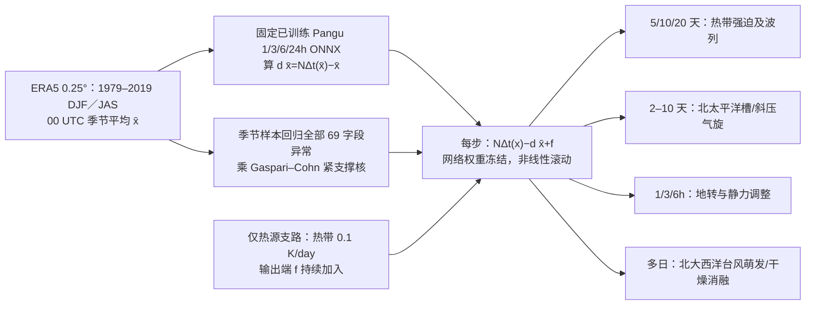

# 99｜Pangu-Weather 的动力学压力测试：稳态热源、气旋、地转调整与飓风

> Gregory J. Hakim、Sanjit Masanam，*Dynamical Tests of a Deep Learning Weather Prediction Model*。**2024-07-31** 在线发表于 *Artificial Intelligence for the Earth Systems* **3(3)**，DOI [10.1175/AIES-D-23-0090.1](https://doi.org/10.1175/AIES-D-23-0090.1)；[期刊正文](https://journals.ametsoc.org/view/journals/aies/3/3/AIES-D-23-0090.1.xml)｜[2023-09-19 arXiv:2309.10867v1 开放预印本全文](https://arxiv.org/abs/2309.10867)｜[作者可复现实验代码、配置及资料指引](https://github.com/modons/DL-weather-dynamics)。阅读日期：2026-09-24。

> **版本/证据口径**：期刊官网确认正式年份、摘要、方法关键段和作者代码入口；开放 arXiv v1 可读全文、式 (1)–(3) 与图 1–7。期刊页面的直接全文抓取返回 403，因此下文图 1–7 的逐项说明主要依据 v1，不把它们宣称为已经逐页复核的期刊最终图。已确认的正式版差异明确列出：飓风增强门槛**约 4 hPa**（v1 摘要约 5 hPa），DJF 基态为 **1979–2019、00 UTC**，正式方法还称“地转与静力调整”；如需精确复刻正式排版图/补图，应继续从机构订阅或作者处取正式 PDF。此文发表在 2024 年，虽然预印本首发于 2023 年，因而按**正式出版年**纳入三年库。

## 一、研究问题与可回答的边界

Pangu-Weather 在 ERA5 多年逐时天气状态上学习时间推进，但通常的低 RMSE 只说明对独立天气样本预测得准，不能独立证明它学到了可迁移的动力约束。本研究直接把**空间局地、偏离训练样本的扰动**加到平滑季节平均大气上，问它会怎样随时间传播：赤道持续加热是否激发 Matsuno–Gill 型响应和中纬行星波；北太平洋局地槽是否发展斜压气旋；仅改 500 hPa 位势高度能否在数小时内调到风–压平衡；北大西洋弱低压是否有强度/水汽门槛。判别主要是**与已知动力学特征的定性对照**，不是独立多年回报预报技巧测试。[正式摘要及方法](https://journals.ametsoc.org/view/journals/aies/3/3/AIES-D-23-0090.1.xml)、[v1 §1–3](https://arxiv.org/abs/2309.10867)

时间尺度同时跨 **1–6 小时、2–10 天与 20 天**。归入 `medium-range` 是因为其稳态热源和波列实验明确延伸到第 10/20 天，并用 Pangu 24h 预报器做多日演化；**它没有提供未知天气初值下第 10–15 天的 ACC/RMSE、概率技巧或业务胜负**。把 20 天理想化强迫试验等同于“20 天可用预报”会误读证据。

## 二、底座、数据与处理：已有模型，不是从零训练

| 组件 | 原文可核验信息 | 对解释的影响 |
| --- | --- | --- |
| 底座网络 | 使用公开预训练 **Pangu-Weather**，三维 Earth-specific vision-transformer 架构；四套分别训练的 **1/3/6/24 小时**时效模型。本文只调用现成 ONNX 权重；24h 长步版本负责多日滚动，小时级调整用短步版本。原始底座模型和分层时间聚合参见 [Bi 等原始论文](https://arxiv.org/abs/2211.02556)。 | 不能把本研究的基态修正/初值扰动写成“重新训练了 Pangu”或给它虚构 epoch、batch、学习率、loss、LoRA、fine-tune 步数。原文也没有报告本研究专属参数量。 |
| 预训练资料 | Pangu 原权重在 **ERA5 1979–2017**上训练；作者实验使用 ERA5 **0.25° 全球经纬网**，期刊方法写 DJF 00 UTC **1979–2019**平均。JAS 另构筑夏季平均背景。期刊所用 DJF/JAS 异常来自同季节样本与参考格点的标准化时间序列回归。 | **1979–2019 平均态与底座 1979–2017 训练期不同**；前者是本文试验背景场，后者才是原网络权重训练期资料。季节平滑背景不等同于一张真实业务初值。 |
| 状态字段 | 13 层：**1000、925、850、700、600、500、400、300、250、200、150、100、50 hPa**；高空五变量为位势高度 `z`、比湿 `q`、温度 `t`、东西/南北风 `u/v`，即 **65 层字段**；近地 `msl`、`t2m`、`u10m/v10m` **4 字段**，合计 **69 个预报字段**。 | 输入不是卫星原始亮温，也不是地面站直接观测；ERA5 已经过物理同化。只有 500 hPa 位势场扰动的实验，是把其他变量的**扰动设为零**，并非把完整背景中的温度/风输入清零。 |
| 基态与局地化 | 先按季节和 00 UTC 计算 ERA5 平均态 `x̄`；以特定参考点回归全部 69 字段的条件异常，再乘 Gaspari–Cohn 紧支撑距离核；核半径以扰动**归零距离** `L` 给出，而非高斯标准差。 | 回归保留观测到的垂直耦合/温湿风协变结构，避免人为任意画一个圆形位势场就宣称真实气旋生成机制。只有地转/静力调整特意去掉这份耦合。 |
| 可复现资料 | [作者仓库](https://github.com/modons/DL-weather-dynamics)提供四个 `run_*.py`、`data_prep`、ONNX 环境与配置模板，并提供下载原权重/季节均值/回归扰动文件的机构链接。README 称论文结果用 **Intel CPU、64-bit 浮点**跑出，硬件/库不同可能改变结果，稳态加热尤其敏感。 | 作者代码可作为精确复现实验的起点，但并不表示本文提供了新底座训练脚本/训练权重。 |

字段、回归与基态见[正式 §2](https://journals.ametsoc.org/view/journals/aies/3/3/AIES-D-23-0090.1.xml)；代码的 `config_template.yml` 和 `data_prep` 实际把近地四字段、13 层、季节平均→基态趋势→回归扰动的链条逐项写出。[作者代码](https://github.com/modons/DL-weather-dynamics)

## 三、完整方法：使平均大气保持静止，再施加异常

令预报器为 `N_Δt`，`x̄` 为季节平均态。原始 Pangu 直接滚动 `x̄` 通常会使其漂移，因而作者先计算一模型步的基态漂移 `d x̄ = N_Δt(x̄) − x̄`，实际积分改为：

`x(t+Δt) = N_Δt[x(t)] − d x̄ + f`。

其中 `f` 只在稳态热源实验非零；若 `x(t)=x̄` 且 `f=0`，则下一步恰为 `x̄`。这是**推理时的诊断性漂移订正/外加源项**，不改变 `N_Δt` 的神经网络权重。文中为阐释机制写过 `N` 在 `x̄` 附近的一阶展开，但**真实实验运行的是完整非线性 `N(x)`**，不可把结果叫作线性化 Pangu 解。[正式式 (1)–(3)](https://journals.ametsoc.org/view/journals/aies/3/3/AIES-D-23-0090.1.xml)、[v1 §2](https://arxiv.org/abs/2309.10867)

*根据正式 §2 和开放 v1/作者程序原创重绘；四个右端分支是**不同初始条件的独立实验**，不是同一条轨迹。`δx̄` 须针对调用的 24h/6h 等步长分别计算。*

| 试验 | 背景与初值/强迫的构造 | 关键可复现参数 |
| --- | --- | --- |
| 热带持续加热 | DJF 平均态起报，`f` 的温度分量在 **1000–200 hPa** 加正热源；经度中心 **120°E**、Gaspari–Cohn `L=10,000 km`，纬向在赤道 **±15°** 内按 `cos(6φ)`。其余变量强迫为零。 | 峰值 **0.1 K/day**；每推进一天相当于施加对应步长的热增量；诊断第 **5/10/20 天**。 |
| 温带气旋 | DJF 500hPa 高度在 **40°N, 150°E** 的标准化时间序列，与所有字段做线性回归；回归场乘 **`L=2000 km`** 距离核，叠于 DJF 均态。 | 以完整三维回归扰动作种子，观察第 **0/2/3/4 天**；另试带状平均背景到第 **10 天**及 JAS 对照。 |
| 地转/静力调整 | 用温带气旋同一 500hPa 回归高度异常，但其它所有层/变量**异常设零**；因此初态风与温度不相应变化，处于不平衡。 | 用 **1/3/6h** 模型观察水平风旋转和高度异常衰减；赤道对照检验科氏力的不同。正式方法称“地转与静力”，开放 v1 详细展开的是地转响应。 |
| 大西洋台风 | JAS 平均态上，以 **15°N, 40°W** 的 MSLP 标准化序列回归所有字段，乘 **`L=1000 km`** 核，再按倍数缩放整个异常。 | 作者 [运行脚本](https://github.com/modons/DL-weather-dynamics/blob/main/run_hurricane.py) 实际列出幅度 `1,5,7,8,10,10,20`，第二个 `10` 为把水汽比湿改为 0 的干试验；这不是多成员概率集合。 |

**训练/微调结论**：本研究的可调整量是人为设定的**初始状态、背景态修正和持续热源**，而非神经网络参数。没有“本篇 2024 新训练日程”，也没有以四种理想化样本再训练、微调、蒸馏或校准 Pangu。原始 Pangu 四种时效权重分别学习并采用较少步数拼接长预报，例如 32h 可用 24+6+1+1h；该信息是**底座设计背景**，本篇实验主要调用 24h 版和小时级版。[正式 §2](https://journals.ametsoc.org/view/journals/aies/3/3/AIES-D-23-0090.1.xml)

## 四、图表与“性能”：这里是过程值，不是预报评分

| 证据 | 原文可核验的现象/数值 | 正确解释与未证明之处 |
| --- | --- | --- |
| v1 **图 1**，稳态加热 500hPa 高度 | 热源加在 DJF 平均态后，局地高度第 **5 天**已有正响应；第 **10/20 天**下游向中高纬传播，20 天中纬波列高度异常峰值 **>100 m**，北半球冬季波导更强。图 1 的异常等值距分别为第 5 天 **0.3 m**、第 10 天 **2 m**、第 20 天 **20 m**。 | 符合局地热源激发 Rossby 波列的形态；不是“未知第 20 天天气预报准确 100 m”。稳态强迫持续施加，和自由预报机制不同。 |
| v1 **图 2**，850hPa 风 | 第 **20 天**热源西侧赤道向热源汇合，赤道两侧气旋式旋涡，呈经典 Matsuno–Gill 结构。 | 证明**定性**风场响应有预期空间结构；不能从矢量图倒推出量化动力守恒、完整湿对流机理或与物理模式一致的振幅。 |
| v1 **图 3–4**，北太平洋斜压气旋 | 第 **2 天**上层槽向东并扩散、下游发展表面气旋；第 **4 天**上层波包抵北美西岸，主地面低压接近上层槽进入锢囚阶段，另有上游次级小尺度低压；近地温度/湿度锋面见正文/补图说明。 | 结构和时间顺序符合斜压波包/温带气旋生命周期；没有用独立观测真值对这类人造初值计算 track error、RMSE 或极端发生概率。 |
| v1 **图 5**，500hPa 不平衡调整 | 初始高度异常极小值约 **−100 m**、风异常为零；**1h** 风速约 **5 m/s**，中心高度变约 **−89 m**；**3h** 风约 **10 m/s**、中心约 **−74 m**；**6h** 高度约 **−58 m**，风由辐合逐渐转成近沿高度等值线。 | 与北半球地转调整及位能向动能转换的定性方向一致。不同 1/3/6h Pangu 分模型切换在倾向诊断会造成单步“跳变”，原文已指出，不能将其抹去。 |
| v1 **图 6–7**，台风轨迹/强度 | 从 **15°N,40°W** 出发的低压随副高向西北移动；初始越强轨迹更偏北。正式版摘要把快速增强门槛写为 MSLP 初始异常幅度**约 4 hPa**，而 2023 v1 写约 **5 hPa**；`10×` 水汽清零的支路迅速衰减。 | 支持此人工环境中强度/水汽的条件作用；论文未显式解析凝结加热，故“学习了水汽与发展相关性”比“显式解出了完整凝结物理”更准确。**4 与 5 hPa 不能混成精确不变阈值**。 |
| 补图 **S1–S5**（v1 文字转述） | 带状平均态也出现波列；近地锋生与极地小尺度低压；赤道调整中约 **20 m/s** 东西向传播信号，且模型 3/6/24h 交界有倾向跳变。 | 补充 PDF 未独立逐图取得，以上仅按正文对补图的说明保留；不自行填写补图曲线点位或精确统计。 |

图 1–7 的文字和图注见[开放 v1 §3](https://arxiv.org/abs/2309.10867)；期刊最终摘要将飓风异常门槛修为[约 4 hPa](https://doi.org/10.1175/AIES-D-23-0090.1)。此文**没有像基准预报论文那样报告 Z500/T850 10–15 天 ACC、RMSE、CRPS 或多案例置信区间**；表中过程值不能伪装成模型“性能胜率”。

## 五、物理推论、消融与复现风险

**为什么值得读？** 对输入非训练分布的平滑季节态和局地扰动，模型的输出并未立即呈现物理上不可能的全球同步响应：热带受迫波列、斜压发展、风–压调整和水汽依赖均有已知大气动力学的主要形态。这比只看多变量 RMSE 提供不同层面的证据，但只是四组主观选择的概念验证；作者没有把相同条件下 Pangu 与物理模式逐个量化比对，也没有证明所有平衡律、质量/能量守恒或极端尾部统计都正确。[正式摘要/结论](https://journals.ametsoc.org/view/journals/aies/3/3/AIES-D-23-0090.1.xml)、[v1 §4](https://arxiv.org/abs/2309.10867)

**关键消融是什么？** (1) DJF 实际经向起伏背景与带状平均背景比较波列相位/强弱，表明背景波导重要；(2) 冬季北太平洋与夏季 JAS 比较，后者温带低压发展明显弱且没有相同极地低压；(3) 地转试验仅保留 500hPa 高度异常，把原回归耦合拆掉；(4) 大西洋台风强度阶梯与 `10×` 水汽设零，把初值振幅、水汽环境作为可控因素。它们都不是网络重新训练的“消融”。[v1 §3](https://arxiv.org/abs/2309.10867)、[作者脚本](https://github.com/modons/DL-weather-dynamics)

**实践复现时要先核对版本和实现**：期刊正式摘要约 **4 hPa** 与 v1 约 **5 hPa** 不同；v1 开头模板仍残留“AGU Advances”，不能凭此误记刊物，正式来源是 AMS *Artificial Intelligence for the Earth Systems*。作者代码中 `config_template.yml` 把 `ohr` 写为整数 `24`，`run_heating.py` 的若干 6h 分支却判断字符串 `'6'`；若自行改 `ohr: 6`，需检查对应的 6h session/基态趋势是否正确加载，不能只凭脚本可运行推断结果和论文一致。作者 README 也提示平台浮点/库版本差异，尤其是持续加热试验。[正式记录](https://doi.org/10.1175/AIES-D-23-0090.1)、[代码 README](https://github.com/modons/DL-weather-dynamics)、[加热脚本](https://github.com/modons/DL-weather-dynamics/blob/main/run_heating.py)

## 六、可执行的后续核查

1. 用作者配置准备同版 ONNX、DJF/JAS 均值和回归异常，确认 **00 UTC、1979–2019** 季节平均的期刊口径；分别对 24h、6h 等实际调用的步长重新计算 `d x̄`，先验证 `f=0、x′=0` 时均态保持不动。
2. 复刻四个初值构造与加热位置，绘制原始状态和异常场，确认核的 `L` 是**归零半径**；逐场比较图 1–7 的关键过程值，特别是 500hPa 的 −100/−89/−74/−58m 和台风水汽清零支路。
3. 对相同人造初值跑物理模式或另一 AI 底座，定量比对波列传播速度、热力/动量预算、锋生结构、气旋强度/水汽阈值，再以真实独立初值的多年回报检查 8–15 天预报技巧。**这些是后续研究建议，不是本文已完成实验。**

**一句话判断**：这篇正式发表于 2024 年的工作说明冻结 Pangu 在四类理想化刺激下呈现多种**定性合理**的大气响应，最强证据是对背景态漂移严格校正后的过程对照；它不提供可用于排名的 10–15 天预报评分，也不引入新的训练或微调。 
