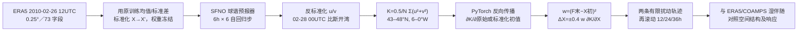

# 100｜SFNO 追踪风暴 Xynthia：初值敏感度像物理伴随，但 36 小时案例仍有伪相关

> Jorge Baño-Medina、Agniv Sengupta、James D. Doyle、Carolyn A. Reynolds、Duncan Watson-Parris、Luca Delle Monache，*Are AI weather models learning atmospheric physics? A sensitivity analysis of cyclone Xynthia*。**2025-03-07**，*npj Climate and Atmospheric Science* **8:92**。[正式开放全文及图 1–5](https://www.nature.com/articles/s41612-025-00949-6)｜[DOI](https://doi.org/10.1038/s41612-025-00949-6)｜[作者代码](https://github.com/CW3E/AI-sensitivity)｜[作者公开模拟和敏感度数据](https://doi.org/10.6075/J0QV3MWT)。阅读日期：2026-09-24。

> **证据口径**：正式开放论文主文、图注、方法式 (1)–(3) 和作者公开代码目录已逐项阅读；此文不重训 SFNO。研究重点是 **2010 年 Xynthia 单个气旋、24/36/48 小时初值敏感性，主结论在 36h**，不是独立样本 10–15 天中期预报；按本库“短临/短期”目录规则归于 `nowcasting`，并在文内保留 36h 的准确时效。文中提到神经网络可扩展到 >5 天非线性时段只是**未来方向**，没有在本案例进行这样的检验。[摘要、§Discussion](https://www.nature.com/articles/s41612-025-00949-6)

## 一、真正研究问题：模型是否连对了天气因果链？

给定预报末期比斯开湾的风动能 `K`，求它对 **36h 前全球初值字段**的梯度 `∂K/∂X₀`。如果 SFNO 在欧洲大风暴 Xynthia 之前，指出与物理伴随系统类似的上游水汽、温度和短波槽敏感区，那么它至少学到部分合理的时空联系；如果对不相关高空/遥远场也很敏感，则仅有预报均方误差较低仍不足以保证内部依赖可靠。论文拿 **Doyle 等 2014（D14）的 COAMPS 湿伴随**作物理参照，另实际加/减敏感度扰动，检验有限幅度后 36h 风暴如何改变。[正式 §Introduction–Results](https://www.nature.com/articles/s41612-025-00949-6)

这不是训练另一套模型，也不是“敏感度高就证明水汽是唯一因果驱动”。自动微分给定已训练 SFNO 的**局地导数**；对有限幅度 `ΔX` 再滚动整条非线性 SFNO 轨迹，是对该局地导数是否有实际响应的补充检验。D14 与 SFNO 的初始化、变量、网格和 `K` 定义并不一致，所以敏感度图只适合**结构/符号定性比较**，不能在相异单位色标下声称两者梯度逐像素数值相等。[正式 §Results「Case study」与 §Methods](https://www.nature.com/articles/s41612-025-00949-6)

## 二、资料、字段和预处理

| 处理环节 | 论文明确说明 | 复现与解释边界 |
| --- | --- | --- |
| 底座 | 已训练的 **Spherical Fourier Neural Operator（SFNO）**，球谐频域混合而非原 AFNO 的普通平面 FFT；全球 **0.25°**、每步 **6h**，输出反复喂回输入构成 36h 六步预报。权重可经 [ECMWF AI-models](https://github.com/ecmwf-lab/ai-models)获取。 | 本文只使用现成权重做预测与自动微分，**无新预训练、无微调、无 LoRA/蒸馏、无更新 epoch/学习率/batch**。原底座具体训练调度不能由本文推断；本文只确认其原训练资料和输入标准化。 |
| 原权重资料 | **ERA5 1979–2015**，取每日 **00/06/12/18 UTC**；原权重的训练均值/标准差用于逐字段标准化，再把预测反标准化成物理单位后计算目标。Xynthia **2010-02** 因而位于原底座训练时间范围。 | 作者认为风暴约占训练样本 **0.01%**、全球网格 **0.06%**，不大可能主导训练目标；但**时间上确实不独立**，不能用这一案例报告盲测试集泛化技巧。 |
| 输入 73 字段 | 高空 **相对湿度、温度、`u/v`、位势高度**五种字段 × **13 层**（50、100、150、200、250、300、400、500、600、700、850、925、1000hPa）＝**65**；地面 **T2m、MSLP、地面气压、整层水汽、10m `u/v`、100m `u/v`**＝**8**，合计 **73**。 | SFNO 的水汽图比较的是**整层水汽**对 D14 比湿、**相对湿度**对 D14 比湿；位温也与 SFNO 温度不完全同义。不要把 73 字段写成 Pangu 的 69 字段或给 SFNO 虚构垂直风输入。 |
| 案例时空 | **2010-02-26 12 UTC** 的 ERA5 作初值，六个 6h 步到 **02-28 00 UTC**；ERA5 也是本文 SFNO 回报真值。目标区比斯开湾 **43–48°N，6–0°W**，目标用区域格点平均 `K=0.5/N Σ(u²+v²)`。原图还有第 24/48h 位势敏感度对照。 | 目标是格点风动能，不是法国灾害损失、逐站最大阵风或直接降水；论文将风场动能的单位写成 `m²/s²`，没有把它乘空气密度成体积动能。 |
| 物理参照 D14 | 伴随基于 **COAMPS** 和其湿物理，初值来自 **NOAA GFS**；网格为 **45km 粗网格、15km 细网格**，垂直坐标为 z–σ，`K` 还纳入垂直风。SFNO 是 ERA5/0.25°/13 等压层、`u/v` 两分量目标。 | **非同初值、同状态、同网格、同目标公式的公平模型赛跑**；论文自己限定为定性对照。物理参照仍能检查雨带、槽与低层水汽的相对位置是否合理。 |

逐字段、期别与预处理见[正式 §Methods「Data」「Computation」](https://www.nature.com/articles/s41612-025-00949-6)。作者代码仓库把下载 ERA5、计算梯度、生成扰动、正向推理、画图分为独立脚本；数据档案保存已算模拟及敏感度场。[代码 README](https://github.com/CW3E/AI-sensitivity)、[数据](https://doi.org/10.6075/J0QV3MWT)

## 三、算法逐步展开：从 36h 风动能反传到 73 字段初值

*根据正式 §Methods 式 (1)–(3) 原创重绘；末期目标 `K` 的风分量只取 `u/v`，**但初值扰动施加到 SFNO 全部输入变量**；`±` 是两个符号相反的场，不是概率集合。*

1. **预处理与展开**：ERA5 原场 `X` 用底座训练期的空间平均均值、空间标准差规范化为 `X′`。SFNO 前向运行 6 次，每次前一步输出作为后一步状态，然后用原训练统计反标准化末期风场；否则梯度与 `m/s` 物理意义会错位。[方法步骤 1–3](https://www.nature.com/articles/s41612-025-00949-6)
2. **目标与链式法则**：在固定目标区把末期近地 `u/v` 平方求平均、乘 0.5。PyTorch 自动微分沿 `K←反标准化←F₆←⋯←F₁←X′←X` 的**所有六步**反传。对 `X′` 的梯度与对原始物理单位 `X` 的梯度差一个标准化雅可比，原文图的两个色标正用于区分；不能把“同色”误作同单位。[式 (1)](https://www.nature.com/articles/s41612-025-00949-6)
3. **有限幅度扰动**：对每一输入变量/位置，以 `w=(F_{t0+Δt}−X_{t0})²` 加权相应梯度，再用同一比例 `s=0.4` 得 `ΔX=0.4w·∂K/∂X`。正负两场分别加到/减去原初值，重新滚动预报。作者选幅度使风/温度初值变化大致符合**约 1m/s、约 1K** 的分析不确定度量级；`s=0.4` 不是网络学习率、也不是物理伴随积分步长。[式 (2)–(3)、作者说明](https://www.nature.com/articles/s41612-025-00949-6)
4. **对照与开销**：36h SFNO 前向在单 CPU 量级为分钟，求敏感度也是分钟级；作者说 GPU 可能秒级，但本文没有系统硬件基准、内存曲线或不同 lead 的 scaling 表。D14 的物理伴随要构造相应线性化求导结构；SFNO 自动微分省去这项专用伴随开发，却不意味有限幅度扰动成长始终线性。[§Methods/Discussion](https://www.nature.com/articles/s41612-025-00949-6)

**微调与参数设置的明确结论**：这里的“反向传播”仅用于求**初值敏感度**，**没有 optimizer.step() 更新 SFNO 权重**。原 SFNO 的训练期 ERA5 与标准化统计是已训练底座的上下文；本文给出的 `s=0.4` 是敏感度扰动缩放，六次 6h 是预报展开，二者都不应写作新网络训练超参。若复现网络权重的原始预训练，应另查 [SFNO 原始方法论文](https://proceedings.mlr.press/v202/bonev23a.html)及所用 ECMWF checkpoint 版别，不能靠此案例反推隐藏的 epoch、batch 或参数数。[正式 §Methods](https://www.nature.com/articles/s41612-025-00949-6)

## 四、正式图 1–5 与量化结果：把分母、个例和公平性写清

| 图/证据 | 核对后的结果 | 不能推出什么 |
| --- | --- | --- |
| **图 1**：ERA5、SFNO 的风暴演化 | 2010-02-26 12 UTC 初值、02-27 12 UTC **24h**和 02-28 00 UTC **36h**的强低压/风能；模型能跟随强梯度和向法国西岸移动，局地动能 **>200m²/s²**。36h 比斯开湾、以 ERA5 为真值的 `K` 空间 RMSE：**SFNO 58、IFS 82m²/s²**。 | 这只是**单个风暴、单个时刻、单一区域的动能误差**；IFS 用自己的业务分析作初值而 SFNO 用 ERA5，因此不能据 58<82 得出 SFNO 普遍优于 IFS。也不是台风中心最低压或风灾站点评分。 |
| **图 2a–f**：36h 平面敏感区 | 物理伴随与 SFNO 都显示：大西洋大气河附近狭窄水汽丝状带（论文描述约 **40km**宽）、向欧洲延伸的温度带、短波槽旁南北风的 **S 型**结构；正水汽带两侧有负敏感，指向水汽**梯度**的重要性。 | D14 与 SFNO 比较了相近但非同字段：比湿↔整层水汽、位温↔温度；色标和垂直坐标不同。SFNO 敏感度**峰值一般小于**物理伴随，格网名义 0.25° 但场看起来更粗，不是逐点相等。 |
| **图 2g–i**：位势场 24/36/48h | 位势敏感形似波包，lead 增大时敏感源向西/上游移，和西风背景下信号东传的解释相合；**位势梯度较其它场特别强**。 | 强位势依赖可能掩盖其它物理变量，而非一定证明最正确的因果权重；作者只是推测 Rossby 波导联系，未做严格动量/能量闭合证明。 |
| **图 3**：垂直截面 | D14 的比湿与 SFNO 的相对湿度敏感度主区大致在 **25–15°W、低层至约 450hPa**，正负偶极在暖锋斜面附近。SFNO 高空还出现一块**正敏感**，作者未找到可支持的物理机制，认为可能是噪声/伪相关。 | 这是本文反证之一；不能只摘“物理一致”而省略伪相关。相对湿度与比湿单位不同、初值和格距也不同。 |
| **图 4**：扰动随 12/24/36h 演化 | 对初值加/减 `0.4w∂K/∂X` 后，两符号的动能差沿气旋路径移动；总体量级由 **12h 的 5–25m²/s²** 增至 **36h 的 15–50m²/s²**，正扰动增大强风、负扰动反向减小。 | 这两个扰动是**按同一目标梯度设计**，方向正确部分具有构造性；正负大致对称只支持此时窗/幅度的准线性响应，不说明所有 lead 或大扰动保持线性。 |
| **图 5**：36h 末期局地放大 | 比斯开湾附近正/负扰动的局地动能差可达 **±70m²/s²**；海平面气压也响应，但 SFNO 的变化**比 D14 弱**。正文称图示气压差等值线 1hPa，图 5 图注称 2hPa，原文内部有口径不一致。 | `±70` 是**局地最大扰动场**，与图 4 概括的 15–50 总体量级不同；不是整个区域 RMSE 改善 70，更不是全球验证。气压等值线口径须以原图/作者代码复核。 |

五张正式主图及图注均见[期刊开放正文](https://www.nature.com/articles/s41612-025-00949-6)。另外作者把扰动场向西移 **20°**，或再向北移 **25°**进入低敏区，风暴预测几乎不变；这两个位置移位对照在正文说明为 **not shown**，不能宣称逐图见过。作者称另在台风 Lupit/Nuri 上发现强位势依赖，但同样未示出系统图/量化样本，不能把它们计作完整多案例预报技能验证。[Discussion](https://www.nature.com/articles/s41612-025-00949-6)

## 五、如何看待“学到物理”及训练数据重叠

**有力但有限的正证据**：AI 与物理伴随在水汽丝状带、暖区、短波槽以及垂直偶极上指向相近位置；有限扰动又顺着风暴移动，而不是在非相关地区泛起全场强响应。这比只说“预测图像看起来像”更直接地测试了模型对上游条件的依赖。SFNO 的非线性前向轨迹可直接自动微分，简化敏感度计算。[图 2–4、Discussion](https://www.nature.com/articles/s41612-025-00949-6)

**不能过度推断**：这仍是围绕给定基态的**局地导数**，并非无条件因果发现；COAMPS/GFS vs SFNO/ERA5 的不同初值、目标定义与纵向坐标不支持“物理伴随误差已被 AI 完全复现”。SFNO 在名义更细的网格上反而敏感度场更粗，且高空 RH 正敏感缺少物理解释；其对位势的较强依赖也可能削弱水汽/压力变量耦合，图 5 气压响应确实偏弱。论文自己提到的 >5 天敏感性只是网络方法的潜力，**本文没有给出 >5 天结果**。[图 2–5、Discussion](https://www.nature.com/articles/s41612-025-00949-6)

**训练期事件重叠**：Xynthia 在 SFNO 1979–2015 的 ERA5 训练范围内。作者估算其只占样本约 0.01%/全球格点约 0.06%，认为不足以通过直接记忆主导网络；但这只是对过拟合风险的论证，**不等价于严格时间外测试**。若要检验可泛化的敏感度结构，至少应对训练期后多场独立气旋、同初值物理模式、不同 AI 底座、分辨率/变量映射统一、独立观测真值和统计不确定性重复本流程。[Case study/Discussion](https://www.nature.com/articles/s41612-025-00949-6)

**一句话结论**：2025 年这篇工作用冻结 SFNO 的六步梯度和有限初值扰动，说明它在 Xynthia **36 小时**案例里有一部分接近物理伴随的水汽/温度/风场联系，同时暴露高空伪敏感、低有效分辨率及气压响应偏弱；既不是新模型训练论文，也不是第十天中期预报成绩。
