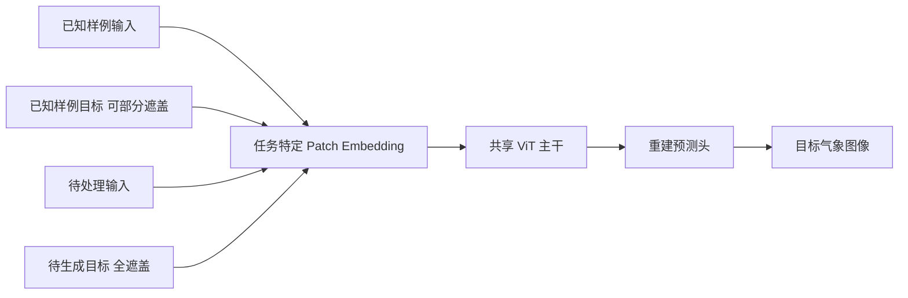

# WeatherGFM：视觉上下文提示统一十二类气象任务——正式版、代码与图表精读

> Xiangyu Zhao, Zhiwang Zhou, Wenlong Zhang, Yihao Liu, Xiangyu Chen, Junchao Gong, Hao Chen, Ben Fei, Shiqi Chen, Wanli Ouyang, Xiao-Ming Wu, Lei Bai. *WeatherGFM: Learning a Weather Generalist Foundation Model via In-context Learning*. **ICLR 2025 正式会议论文**：[书目与摘要](https://proceedings.iclr.cc/paper_files/paper/2025/hash/c897d8f3be030344949de9bd93d8274e-Abstract-Conference.html)、[21 页正文与附录 PDF](https://proceedings.iclr.cc/paper_files/paper/2025/file/c897d8f3be030344949de9bd93d8274e-Paper-Conference.pdf)。早期版本：[arXiv:2411.05420](https://arxiv.org/abs/2411.05420)，v1 于 2024-11-08 提交、v2 于 2024-12-09 更新；[作者代码，固定至 6972c66](https://github.com/xiangyu-mm/WeatherGFM/tree/6972c669679232d485f4c5ad2a64a20af63c0aa3)。本次复核：2026-09-25。正式版为主，早期版本及当前代码仅用于差异和复现核查。

## 一句话结论与适用范围

论文的核心不是提出一个已验证的全球 10–15 天预报系统，而是把雷达、卫星与污染物观测的十种图像到图像任务放进同一个视觉提示模型。**ICLR 2025 正式版扩为十二类任务**：上述十类 SEVIR/POMINO 图像任务，另加 ERA5 的 **2 米温度 T2m 与 10 米纬向风 U10** 两个最长 **168 小时（7 天）** 的预报目标。早期 arXiv v2 和旧版笔记仅写十任务、仅列 T2m，不能代表正式版。主证据仍是分钟至小时级多任务，ERA5 是 7 天方法展示；不能直接称为 10–15 天或 S2S 已验证模型。[正式摘要](https://proceedings.iclr.cc/paper_files/paper/2025/hash/c897d8f3be030344949de9bd93d8274e-Abstract-Conference.html)；[正式 Table 4、8、9](https://proceedings.iclr.cc/paper_files/paper/2025/file/c897d8f3be030344949de9bd93d8274e-Paper-Conference.pdf)

## 1. 研究问题：统一模型究竟统一了什么？

传统做法为雷达外推、卫星超分辨率、跨传感器转换和预报后处理分别训练模型。WeatherGFM 把任务抽象为从输入空间 $X_S$ 到目标空间 $X_T$ 的映射，并用一个已知的输入—输出样例告诉模型当前应执行哪一种映射。给定提示对 $(P_{in},P_{target})$ 和待处理输入 $X_{in}$，预测目标为 $F(P_{in},P_{target},X_{in};\theta)$。这与文本大模型的 few-shot 提示类似，但“提示”是具有物理含义的气象图像，不是自然语言指令。[方法第 3 节](https://arxiv.org/html/2411.05420v2)

这里需要区分三个层次：统一输入—输出接口、统一主干权重，以及对从未见过的任务真正零样本泛化。论文比较充分地展示前两点；第三点主要依赖少数定性样例，强度较弱。模型还为不同输入通道配置**任务特定 patch embedding 层**；ERA5 扩展又新增逐变量嵌入和持续训练。所以“完全无需任务适配即可处理任意新变量”并非其实际机制。[正式 §3–4](https://proceedings.iclr.cc/paper_files/paper/2025/file/c897d8f3be030344949de9bd93d8274e-Paper-Conference.pdf)

## 2. 模型与训练机制

论文设计三类视觉提示：单模态（如低分辨率雷达 VIL → 高分辨率 VIL）、跨模态（如 GOES 红外通道 → 雷达 VIL）和时序模态（过去的雷达/卫星图像 → 未来图像）。训练样本由“提示输入、提示目标、查询输入、查询目标”四块组成。模型保留提示输入与查询输入，随机遮盖提示目标及查询目标的 patch；推理时仅把查询目标全部遮盖，让模型在可见样例条件下重建它。[图 2–3 与式 2–4](https://arxiv.org/html/2411.05420v2)

主干为 ViT，先用通道特定的 patch embedding 将不同物理量投到共同维度，再经 Transformer 编码和预测头还原目标图像。默认 patch 大小 16，目标遮盖率 75%；论文附录列 base 为 12 层、768 维编码器，large 为 24 层、1024 维。这个方案的关键归纳偏置是“跨任务的低层图像结构与变换可共享”，而不是显式求解动力方程或守恒约束。[正式方法与 Table 5](https://proceedings.iclr.cc/paper_files/paper/2025/file/c897d8f3be030344949de9bd93d8274e-Paper-Conference.pdf)

以下根据论文图 2–3 重绘统一接口与模型结构；不同任务使用不同通道的嵌入层，图中已保留该限制：[原文图 2–3](https://arxiv.org/html/2411.05420v2)。

**结构参数（正式 Appendix C，Tables 5–7）**：Base 编码器 12 层/宽 768/12 头，Large 为 24 层/宽 1024/16 头；二者解码器均 8 层/宽 512/16 头，MLP 扩展率 4，输出端还用隐藏维 1024 的预测头。论文对照的单任务 ViT 是 16 层/宽 512/8 头、patch 16；UNet 则用 3×3 卷积、padding/stride 均 1、基础通道 64、`[1,2,4,8,8]` 通道倍数、3 个残差块，附录称无注意力和 dropout。它们是作者选择的统一对照，不是每个气象任务最强业务基线。[正式 Appendix C](https://proceedings.iclr.cc/paper_files/paper/2025/file/c897d8f3be030344949de9bd93d8274e-Paper-Conference.pdf)

**两段训练流程**：先混合 SEVIR/POMINO 十类任务训练 WeatherGFM，再加入 ERA5，以新变量嵌入、跨注意力变量聚合与原主干混合旧任务持续训练 T2m/U10 的多个 lead，不是从零单训一套 7 天模型。主训练正式附录披露 AdamW、cosine 学习率、基础 LR **1e−4**、每卡 batch **20**、梯度累积 **4**、**16×A100、50 epochs、fp16**；ERA5 扩展附录单列 **8×A100、20 epochs**。正文 §4.2 的 `1e4` 与附录差五个数量级，按附录看是排版错误。不能仅按 8 对 80 张 GPU 比较与 ClimaX 的计算成本，而不算 epoch、样本和硬件差异。[正式 §4.2、Appendix C.1/D](https://proceedings.iclr.cc/paper_files/paper/2025/file/c897d8f3be030344949de9bd93d8274e-Paper-Conference.pdf)

**损失口径冲突必须原样记录**：方法式 (4) 为提示目标与查询目标两项 **MSE/L2** 之和，§4.2 和附录 C.1 却称 **L1**。[模型源码固定提交](https://github.com/xiangyu-mm/WeatherGFM/blob/6972c669679232d485f4c5ad2a64a20af63c0aa3/models_mae_PromptGIP_CNN_Head.py) 的 `forward_loss_pix` 在 patch 上算平方误差，`forward_loss_pix_CNN` 在整图上算绝对误差；[训练引擎](https://github.com/xiangyu-mm/WeatherGFM/blob/6972c669679232d485f4c5ad2a64a20af63c0aa3/engine_pretrain.py) 将返回的损失字典项相加。这说明**公开实现同时涉及 MSE 与 L1**，但缺正式权重使用的完整命令时，不能断言所有论文实验都采用同一组合。复现应打印每项损失和系数。

**公开脚本与论文的差别**：[主训练示例脚本](https://github.com/xiangyu-mm/WeatherGFM/blob/6972c669679232d485f4c5ad2a64a20af63c0aa3/run_train_large.sh) 为 8 GPU、batch20、10 epochs、warmup1、`blr=1e−4`；[ERA5 继续训练示例](https://github.com/xiangyu-mm/WeatherGFM/blob/6972c669679232d485f4c5ad2a64a20af63c0aa3/run_train_large_finetune.sh) 为 8 GPU、batch10、20 epochs、warmup1，checkpoint 是作者本地绝对路径。二者都不能充当正式主训练 16 GPU/50 epochs 的完整复现命令。[训练入口](https://github.com/xiangyu-mm/WeatherGFM/blob/6972c669679232d485f4c5ad2a64a20af63c0aa3/train_PromptGIP.py) 的 AdamW β 为 (0.9, 0.95)，公开继续训练入口默认权衰 0.05；若未显式设 `lr`，有效 LR 按 `blr × (batch × accumulation × world_size) / 256` 缩放。基础 LR 与最终生效 LR 不可混写。

**微调到底做了什么**：论文说明将 ERA5 与旧任务混合持续训练、随机化 6h–7d lead；[公开继续训练入口](https://github.com/xiangyu-mm/WeatherGFM/blob/6972c669679232d485f4c5ad2a64a20af63c0aa3/train_weather_continue.py) 以 `strict=False` 装载旧权重，允许新模块初始化。正式文稿没有说只训 LoRA、冻结 ViT 或只训头部；不能套用其它基础模型的冻结策略。shell 中 `--notfinetune` 名称与代码的 `store_false` 解析并不直观，最终训练参数需要运行时打印；混合采样比例、每变量损失权重及完整随机种子均未从正式文稿核定。

## 3. 数据、任务与评测口径

主体实验来自 SEVIR。作者筛得 11,508 个多传感器天气事件，训练/验证/测试分别为 11,308/100/100 个事件，图像统一缩放至 $256\times256$。SEVIR 含 GOES 卫星通道、NEXRAD 派生的 VIL 雷达拼图及闪电观测；作者的实际任务主要使用所选卫星通道和 VIL。事件按风暴数据库抽样，并对中到强降水超采样，因此样本分布不等于一般时空均匀天气分布。[实验第 4.1 节](https://arxiv.org/html/2411.05420v2)

十种原始任务分为：雷达/卫星空间或时间超分辨率、GOES 到雷达或其他卫星通道的图像转换、NO₂ 跨卫星转换、雷达/卫星外推、雷达预报去模糊。正式 **Table 4** 逐一列明为 Radar Spatial SR、Satellite Spatial SR、Radar Temporal SR、Deblur、GEOS-IR2Radar、GEOS-IR2GEOS-IR、GEOS-IR2GEOS-Vis、GEOS2POES-NO2、Satellite extrapolation、Radar extrapolation，另加 ERA5 T2m/U10 两项。雷达与卫星外推的输入是 0、30、60、90 分钟四帧，目标是 120、180 分钟图像；对应最后输入后约 30 和 90 分钟，属于**小时级临近预报**，不是日尺度预报。[正式 Appendix B Table 4](https://proceedings.iclr.cc/paper_files/paper/2025/file/c897d8f3be030344949de9bd93d8274e-Paper-Conference.pdf)

**空间与时间处理细节**：VIL 原始 384×384 重采样为 256×256 高分辨目标，再生成 64×64 低分辨输入，边长比 4；IR069 原始 196×196 被处理成 256×256/64×64，但作者文字称其“3×”与处理后边长比 4 不一致，列为口径疑点。雷达时间超分输入 0 与 60 分钟 VIL，预测 30 分钟。去模糊输入是 Earthformer 生成的 VIL，目标是真实 VIL。SEVIR 空间超分样本约 **542,784**、时间超分约 **407,088**、时序外推约 **135,696**；这是帧/滑窗/任务样本数量，**不是独立事件数**。原文少数验证/测试数量用 “validation and testing” 表述，无法仅凭文字判断是各自还是合计；复现需以分割清单为准。[正式 Appendix A–B](https://proceedings.iclr.cc/paper_files/paper/2025/file/c897d8f3be030344949de9bd93d8274e-Paper-Conference.pdf)

**NO₂ 跨传感器处理**：GEMS 与 GEOS-CF 作输入、TROPOMI NO₂ 作目标，资料期 **2021-01 至 2022-04**；原图约 1400×800，经 256×256 滑窗、步长 128，作者称每图形成 45 个图块，训练/验证/测试为 **18,000/1,000/1,000**。这证明一种多传感器空间转换能力，而非未来 NO₂ 天气预报。雷达 CSI 的阈值为 16/74/133/160/181/219，卫星 VIS/IR 使用完全不同阈值；跨变量 CSI 不可直接排名。[正式 Appendix A、C.4](https://proceedings.iclr.cc/paper_files/paper/2025/file/c897d8f3be030344949de9bd93d8274e-Paper-Conference.pdf)

**ERA5 处理与公开代码边界**：正式文稿给出全球 **1.40625°**、**48 场=6 个高空变量×7 层+3 个地表场+3 个常数场**，新增每变量嵌入、跨注意力聚合和 MLP 对齐。[作者数据加载器固定提交](https://github.com/xiangyu-mm/WeatherGFM/blob/6972c669679232d485f4c5ad2a64a20af63c0aa3/dataset/era5_dataloader.py) 显示一条路径用 6 小时间隔、气压层 50/250/500/600/700/850/925 hPa，逐字段均值/标准差归一化，将 128×256 天气网格放入 256×256 张量中间的第 64:192 行，顶部/底部零填充。另一条 `era5_processed` 路径以 `[1,4,12,20,28]` 个 6h 步取五个 lead，并按 `[0.3,0.3,0.2,0.1,0.1]` 权重抽样；[公开持续训练入口](https://github.com/xiangyu-mm/WeatherGFM/blob/6972c669679232d485f4c5ad2a64a20af63c0aa3/train_weather_continue.py) 使用这一类。它是现行公开实现，不等于已经找到论文正式评测的完整版本化配置；统计量 JSON 和部分数据路径仍指向作者内部资源。

**潜在年份重叠需主动排查**：公开加载器默认年份字典为 train **1979–2016**、valid **2018**、test **2016–2017**，字面上训练/测试重叠 2016。没有正式作业命令与实际文件清单时，只能说**当前公开默认配置存在潜在泄漏风险，不能据此断言正式 Table 8/9 真的泄漏**。复现首步应打印每个 split 的实际起报时间戳并检验互斥。[同一固定加载器](https://github.com/xiangyu-mm/WeatherGFM/blob/6972c669679232d485f4c5ad2a64a20af63c0aa3/dataset/era5_dataloader.py)

主体报告 RMSE 和 CSI。CSI 是命中/(命中+漏报+空报)，需要按变量设阈值；雷达 VIL 阈值含 16、74、133、160、181、219。不同任务、变量和阈值的 CSI 不宜横向直接比较。对照模型是作者统一设置下重新训练的单任务 UNet 与 ViT，而非每一类任务当前最强的业务模型。[表 2 与第 4.2–4.3 节](https://arxiv.org/html/2411.05420v2)

## 4. 关键结果：成功与反例都要看

| 任务与指标 | 单任务 ViT | WeatherGFM | 阅读判断 |
| --- | ---: | ---: | --- |
| 雷达外推 RMSE，越低越好 | 0.490 | 0.467 | 多任务模型改善 |
| 雷达外推 CSI/160，越高越好 | 0.079 | 0.128 | 在该强度阈值改善；其他阈值仍须分别看 |
| 卫星外推 RMSE | 0.408 | 0.347 | 改善，时效仍为小时级 |
| 雷达空间超分辨 RMSE | 0.120 | 0.121 | 基本持平、略差 |
| 雷达去模糊 RMSE | 0.163 | 0.264 | 明显变差，不能概括为十任务均胜 |
| GOES-IR→GOES-IR RMSE | 0.257 | 0.310 | 变差，需权衡共享表示的负迁移 |
| NO₂ 跨传感器 RMSE | 0.549 | 0.302 | 连续值误差改善 |
| NO₂ CSI/1 | 0.841 | 0.682 | 阈值表现反而较差，不能只看 RMSE |

以上均为作者 [表 2](https://arxiv.org/html/2411.05420v2) 的数值，不是独立复现。雷达去模糊任务中部分 CSI 阈值有升有降，不能仅用一个指标给出整体胜负。论文强调统一能力而非每任务 SOTA，这一点与表中混合结果一致。

提示敏感性也不可忽略。随机换 20 个提示样例后，GOES→Radar 的 RMSE 标准差为 0.0087、平均 CSI 标准差为 0.0187；雷达外推对应 0.0012 和 0.0201。相比之下，雷达空间超分辨 RMSE 标准差仅 0.0001。正式附录解释主文倾向从 20 个候选提示中报较好结果；Tables 10–12 给出了提示索引与选择实验。因此，**主表优选提示数值不能当作随机提示的期望性能**，部署时需定义独立于测试目标的检索策略，并报告均值、标准差和最差样例。[正式 Table 3、Fig. 5、Appendix D Tables 10–12](https://proceedings.iclr.cc/paper_files/paper/2025/file/c897d8f3be030344949de9bd93d8274e-Paper-Conference.pdf)

作者对若干训练未见任务做图像展示，称前三个相近任务可输出合理结果，但更复杂的多模态卫星空间超分辨率失败。这里没有同等充分的定量基准，因而可解释为“存在有限外推迹象”，而不是通用零样本能力已被证实。模型规模探索比较约 30M 单任务 ViT、110M base 与 330M large，但训练样本量也从 0.5M 增至 4M；模型和数据效应没有完全分离。[第 4.4 节](https://arxiv.org/html/2411.05420v2)

## 5. 与中期预报的关系：正式版 ERA5 两变量、五个 lead 全表

正式 §4.4 和 Appendix D 以 48 场为输入，**同时评价 T2m 与 U10**，列 6、24、72、120、168 小时五个 lead；正文写“seven lead times”却只列这五个，是文字与表格不合，不能擅自补出两个。Table 4 将 ERA5 列为 cross-modal，§4.4 又说变量聚合后的任务按 single-modal mode 处理；应理解为描述层次不一致，而非已明示两套 ERA5 试验。ClimaX 为每 lead 单独微调模型，WeatherGFM 一个模型覆盖各 lead。下表直接转录正式 Tables 8–9 的 RMSE/ACC，RMSE 越低、ACC 越高越好；T2m 单位 K、U10 单位 m/s。[正式 §4.4、Tables 8–9](https://proceedings.iclr.cc/paper_files/paper/2025/file/c897d8f3be030344949de9bd93d8274e-Paper-Conference.pdf)

| Lead | T2m RMSE：IFS / ClimaX / GFM | T2m ACC：IFS / ClimaX / GFM | U10 RMSE：IFS / ClimaX / GFM | U10 ACC：IFS / ClimaX / GFM |
| --- | --- | --- | --- | --- |
| 6 h | 0.97 / 1.11 / 1.08 | 0.99 / 0.98 / 0.98 | 0.79 / 1.04 / 1.12 | 0.98 / 0.97 / 0.97 |
| 24 h | 1.02 / 1.19 / 1.23 | 0.99 / 0.97 / 0.97 | 1.11 / 1.31 / 1.26 | 0.97 / 0.95 / 0.95 |
| 72 h | 1.30 / 1.47 / 1.56 | 0.98 / 0.96 / 0.96 | 1.92 / 2.02 / 1.99 | 0.89 / 0.87 / 0.88 |
| 120 h | 1.71 / 1.83 / **1.68** | 0.96 / 0.94 / 0.95 | 2.89 / 2.79 / **2.61** | 0.76 / 0.74 / **0.79** |
| 168 h | 2.23 / 2.17 / **1.76** | 0.93 / 0.91 / **0.94** | 3.81 / 3.35 / **3.11** | 0.58 / 0.59 / **0.65** |

**具体胜负而非笼统领先**：6–72h 的 IFS 在 T2m/U10 RMSE 上都更低；WeatherGFM 到 120/168h 才在表中两变量出现较明显优势。Table 2 的 U10 跨 lead 汇总 ACC 是 WeatherGFM/IFS/ClimaX **0.848/0.836/0.824**，不能替换单独 168h 的 **0.65/0.58/0.59**。原 Table 8/9 另列 Aurora 0.25°：168h 的 T2m/U10 RMSE **1.73/2.98**，与 WeatherGFM 1.76/3.11 相近或略优，但网格明显不同，**不可与 1.40625° 列直接公平排名**。[正式 Tables 2、8–9](https://proceedings.iclr.cc/paper_files/paper/2025/file/c897d8f3be030344949de9bd93d8274e-Paper-Conference.pdf)

这些数值只支持“某些 **5–7 天 T2m/U10** 指标有竞争力”，不能代替完整业务比较：未见 **第 8–15 天**、Z500/T850/降水全场、集合 CRPS/可靠性、热浪/台风极端事件或明确版本化的多年份独立评估；主干多模态实验与 ERA5 持续训练的数据和任务也不同。论文比较 WeatherGFM 20 epochs/8 A100 与 ClimaX 100 epochs/80 V100，不能仅按 GPU 张数判断总计算量或收敛效率。[正式 §4.4、Appendix D](https://proceedings.iclr.cc/paper_files/paper/2025/file/c897d8f3be030344949de9bd93d8274e-Paper-Conference.pdf)

## 6. 原图与性能表逐项阅读索引

下表是对[ICLR 2025 正式 21 页 PDF](https://proceedings.iclr.cc/paper_files/paper/2025/file/c897d8f3be030344949de9bd93d8274e-Paper-Conference.pdf)的中文证据地图，上方 Mermaid 为原创重绘，不复制论文原图。图 6 的 OOD 任务尤其不能仅凭图像“像天气”判断极端值、位置和长期稳定性达到业务要求。

| 正式图表 | 图/表实际展示 | 阅读限制 |
| --- | --- | --- |
| Fig. 1–2 | 超分/预测/转换的输入→输出抽象，以及单模态、跨模态、时序三种视觉提示格式 | 统一接口不等于统一物理损失或任意通道即插即用 |
| Fig. 3 | 任务专用嵌入→共享 ViT→解码；训练双目标部分遮盖，推理仅查询目标全遮盖 | 推理不能看见查询真值 |
| Fig. 4 | 十种 SEVIR/POMINO 图像任务的提示、预测、真值并列 | 并非 ERA5 七天逐空间场验证 |
| Fig. 5 / Table 3 | 雷达外推换提示会改变输出；20 提示标准差量化不稳定性 | 优选提示不等于随机提示平均技巧 |
| Fig. 6 | 近邻未见任务的定性成功样例与复杂多卫星超分失败样例 | 不是跨地区、跨传感器大样本定量泛化 |
| Fig. 7 | Base/Large 与单任务 ViT 的部分规模趋势 | 训练数据也从约 0.5M 增至 4M，规模因果未解耦 |
| Table 2 | 十图像任务加 ERA5 两目标的汇总得分、正例和负迁移 | 不能说十二项全面胜出 |
| Tables 8–9 | T2m/U10 在 6–168h 的逐 lead RMSE/ACC | 不含 8–15 天或概率预报技巧 |
| Tables 10–12 | 提示样例、质量、任务组合消融 | 没有自动解决候选提示库的测试集选择偏差 |

## 7. 我的评价与复现清单

最有价值的是把任务、模态和提示样例放在统一接口中，使用户能问“同一组权重可以学到哪些共性？”这对构建气象基础模型的通用表示有启发。最需要警惕的是把“十二任务同模型”误解为“每任务最佳”，或把 SEVIR 临近预报和正式版 7 天 T2m/U10 结果误写成 15 天全球预报。

复现时先固定论文/代码/checkpoint 版本，打印 **实际有效 LR、patch MSE 与整图 L1 的权重、冻结参数、各任务采样比例**；按事件而非图像随机分割 SEVIR，打印 ERA5 每个 split 的起报时间，消除公开加载器 2016 年潜在重叠。重算各雷达阈值 CSI 及每任务 RMSE；在不窥视测试目标的前提下固定、随机、检索提示并分别报告均值/方差/最差值。要检验真正的中期价值，需在同初值、同 ERA5 版本、同格点权重、同变量集下与业务/AI 基线比较 8–15 天逐日曲线，并测试热浪、暴雨、集合可靠性及物理一致性。只有完成额外实验，才能把“方法启发”升级为“中期预报证据”。

[返回仓库首页](../../README.md) · [返回总追踪表](../../气象大模型_中期预报论文追踪.md)
