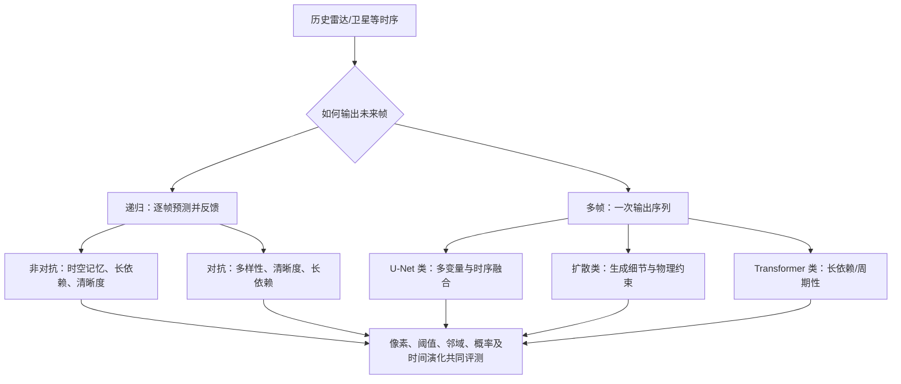

# 降水临近预报综述：从时序预测范式看模型、数据与评测

> Sojung An、Tae-Jin Oh、Eunha Sohn、Donghyun Kim，*Deep learning for precipitation nowcasting: A survey from the perspective of time series forecasting*。[2024-06-07 arXiv v1、2024-06-14 v2](https://arxiv.org/abs/2406.04867)；后发表于 [*Expert Systems with Applications* 268 (2025), 126301，DOI 10.1016/j.eswa.2024.126301](https://www.sciencedirect.com/science/article/pii/S0957417424031683)。本文方法/表格主要按[开放 v2 全文（21 页、7 图、5 表）](https://arxiv.org/html/2406.04867v2)核对，正式期刊页用于核验书目信息；两版图表是否逐项完全相同未作断言。复核日 2026-09-25。这是**综述**而非提出一个新的预报模型，不要把汇总表误写成作者统一重训实验。

## 核心判断

这篇综述的价值不是宣布某架构胜出，而是把降水临近预报拆成数据、预处理、训练目标、预测方式和评测五个互相制约的环节。其“递归逐帧”与“多帧直接”分类便于识别误差累积和多步输出的不同风险；但它讨论的主要是分钟到约 2 小时的雷达/卫星降水临近预报，**没有提供 10–15 天中期天气预报证据**。用户已将追踪范围扩大到所有气象深度学习论文，因此收入本笔记。[摘要、第 2、10 节](https://arxiv.org/html/2406.04867)

## 1. 问题定义及综述边界

设历史观测 $X=(x_1,\ldots,x_m)$，目标为未来 $n$ 帧 $Y=(x_{m+1},\ldots,x_{m+n})$；每帧通常是高分辨率雷达回波或降水图，输入也可扩展到多通道卫星与其他气象量。雷达提供降水空间细节，却有覆盖、建设成本和观测盲区；卫星补足更广区域，但所测云特征并非降水真值。传统平流外推易保留运动，但难以预报降水的生成与消散，这也是深度模型要解决的核心问题。[第 1–3 节](https://arxiv.org/html/2406.04867)

作者按**生成未来帧的时间方式**而非网络名字作首层分类。递归模型先预测下一帧，再把预测送回输入，容易累积误差，却能自然延长时间；多帧模型一次产出一段未来序列，避免每一步反馈，但固定输出时长、远期一致性和训练目标设计仍重要。图 1 下面的二级分类在不同层次混合了训练范式与网络族，因此它是阅读地图，不应被当成互斥的严格分类法。[图 1、第 2.1、7–8 节](https://arxiv.org/html/2406.04867)

原文式 (2) 将递归方法写成 $P(Y\mid X)=\prod_{t=m+1}^{m+n}P(x_t\mid x_1,\ldots,x_{t-1})$，式 (3) 将多帧方法写成对未来整段的联合预测 $P(x_{m+1},\ldots,x_{m+n}\mid x_1,\ldots,x_m)$。这只是**输出策略**的区分，不蕴含“递归一定是概率模型”或“多帧一定一次完成物理时间积分”；也不能仅靠这一分类推断训练时是否 teacher forcing、是否采样多个成员。[原文式 (2)–(3)](https://arxiv.org/html/2406.04867v2)

### 图：依原文图 1 重绘的分类地图

以下为**本仓库根据原文重绘**的结构图，非原图转载；原文分类见[图 1](https://arxiv.org/html/2406.04867)。

## 2. 数据集与预处理：先问“看见了什么”

综述列举 HKO-7、IowaRain、RYDL、MRMS、Shanghai、SEVIR、OPERA、Meteonet 等开放或常用数据。不同数据集的地理范围、雷达/卫星模态、空间分辨率、采样间隔和可用年份不同。以 SEVIR 为例，它含美国雷达与卫星多模态事件序列、5 分钟时距；即使两篇工作都说“SEVIR 上测试”，还须核对使用哪一通道、降水强度阈值、事件划分与 lead time，不能只比一个 CSI。[第 3 节、表 1](https://arxiv.org/html/2406.04867)

作者把数据处理分为裁剪、缩放、采样和滑动窗口。裁剪可抑制异常回波，但可能截掉极端雨强；缩放会改变损失对高雨强的相对权重；仅取含雨事件又会改变真实场景的晴雨基率；滑窗高度重叠时，若先生成窗口后随机划分，训练与测试可能共享近邻帧。最后一点是依据流程作出的**风险推论**，并非作者报告已发生泄漏。复现时宜先按时间和事件分割，再生成窗口，并在论文记录雨强变换、缺测和无雨样本比例。[第 4 节](https://arxiv.org/html/2406.04867)

### 原文 Table 1：八组传感器资料的实际时间与尺度

下表是综述[Table 1](https://arxiv.org/html/2406.04867v2)所列**资料元数据**，不是本综述重新下载后的质量审计；年份指表中资料覆盖期，不能自动推断各下游论文使用同一训练/测试切分。

| 资料 | 覆盖年 | 时间间隔 | 表列水平尺度 | 区域 | 表列传感器 |
|---|---|---|---|---|---|
| HKO-7 | 2009–2015 | 6 min | 2 km | 香港 | 雷达 |
| IowaRain | 2016–2019 | 5 min | 0.5 km | 美国 | 雷达 |
| RYDL | 2014–2015 | 5 min | 1 km | 德国 | 雷达 |
| MRMS | 2017 | 2 min | 1 km | 美国 | 雷达 |
| Shanghai | 2015–2018 | 6 min | 1 km | 上海 | 雷达 |
| SEVIR | 2017–2019 | 5 min | 0.5–8 km | 美国 | 雷达、卫星 |
| OPERA | 2019–2021 | 15 min | 2 km | 欧洲 | 雷达、卫星 |
| Meteonet | 2016–2018 | 5–15 min | 1 km | 法国 | 雷达、卫星 |

SEVIR 的图 2 同时展示 NEXRAD VIL 与 GOES-16 可见光、水汽、红外通道；它们的物理含义、原始网格和可见时段并不相同。反射率 dBZ 也不是雨强 mm/h：综述写 $Z=aR^b$，给出常见参考 $a=200,b=1.6$，但同时指出关系随降水类型/雷达测站而变。把原始反射率模型和经 Z–R 转换后的定量降水模型放一张表，必须写明采用的转换及阈值单位。[原文 Fig. 2、§3.1–3.4](https://arxiv.org/html/2406.04867v2)

Table 2 还显示具体做法并不统一：可用 z-score、对数或 min–max 缩放；RainNet 等使用强雨截断，DGMR 使用裁剪；样本筛选的阈值和先抽整图再裁子图的层级采样亦不同。对数变换的零雨偏置、截断上限与逆变换都会影响强降水误差，不应只写“做了归一化”。本文没有给出上述八套资料的统一训练期统计量或一套通用缺测填补规则；详细复现须回到相应方法原文。[原文 Table 2、§4](https://arxiv.org/html/2406.04867v2)

## 3. 损失函数与评测：不能只看清晰度

极端雨像素少，普通 MSE 很容易让模型通过“下小雨或模糊雨区”获得好平均分。综述讨论按强度加权、池化、运动、临近预报及位置相关损失：加权可提升强雨关注度，但权重过大可能增加虚警；池化/邻域指标允许有限位置偏差，却也可能掩盖精确定位误差；对抗或生成式损失可改善视觉纹理，但清晰图像未必更可靠。[第 5–6 节](https://arxiv.org/html/2406.04867)

| 评测视角 | 综述列举的典型指标 | 该指标单独无法回答的问题 |
| --- | --- | --- |
| 全场像素 | MAE、MSE、相关系数 | 强降水是否命中，以及雨区是否被抹平 |
| 阈值事件 | CSI、FAR 等 | 邻域内稍有位移但形态合理时是否应计错 |
| 邻域/概率 | FSS、pooling CRPS 等 | 局地峰值和样本校准是否同时正确 |
| 图像质量 | GDL、LPIPS、PSNR、SSIM | 雨量与预警阈值的物理/业务可靠性 |

雨强阈值、雷达反射率阈值和图像灰度阈值不是同一种单位；CSI 必须连同阈值报告。对概率模型，样本看起来多样不等于校准，宜增加 CRPS、可靠性图、覆盖率和强降水条件化评分。论文表 3 是指标目录，不能从中推出某个模型具有某项能力。[第 6 节、表 3](https://arxiv.org/html/2406.04867)

## 4. Table 4：模型族、输入输出和损失并非统一参数配置

综述[Table 4](https://arxiv.org/html/2406.04867v2)的 `m/n/dt` 分别是输入帧数、输出帧数和时间间隔（分钟）。以下几行保留能改变任务难度的原表设置，说明相同“临近预报”标签下的任务可以差数倍；参数量为综述报告，不能误作同一个网络按同一显卡/优化器重训。

| 方法/策略 | 资料与损失 | m→n；dt | 参数量（表列） | 原文任务时长/关键限制 |
|---|---|---|---:|---|
| ConvLSTM/递归 | HKO-7；MSE | 5→15；6 min | 487 K | 输出 90 min；表 5 是另一个 SEVIR 结果，不可把 487 K 当其复现实例参数 |
| TrajGRU/递归 | HKO-7；加权损失 | 5→20；6 min | 1.9 M | 输出 120 min；位置自适应递归与固定卷积不同 |
| DGMR/递归生成 | 英国/美国雷达；加权与 hinge 对抗损失 | 4→18；5 min | 98.5 M | 输出 90 min，论文表 4 指明有 Z–R 步骤 |
| NowcastNet/多帧生成 | 中国/英国；CE＋池化＋运动损失 | 4→18；10 min | 29.1 M | 输出 180 min；不能把其物理运动项概括为所有生成模型的配置 |
| LDCast/多帧扩散 | MeteoSwiss；MSE＋KL | 4→18；5 min | 671 M | 输出 90 min，表列无 Z–R |
| Prediff/多帧扩散 | SEVIR；MSE＋对抗＋KL | 6→7；10 min | 120 M | 输出 70 min；与 90/180 min 模型的指标不宜直接排位 |
| Earthformer/多帧 Transformer | SEVIR；MSE | 12→13；5 min | 7.6 M | 输出 65 min；Table 4 未列优化器/LR/微调 |

这里的“训练流程、参数设置和微调”要分清研究对象：**An 等没有训练一个新模型，也没有论文自身的微调阶段**。Table 4 给的是被综述模型的架构/损失/输入窗摘要，不给可复现的 batch、学习率、训练 epoch、随机种子或每篇的资料切分；若为 DGMR、Prediff、Earthformer 写这些细节，应另读各自原文/源码，不能从此综述补造。[原文 Table 4、§9.1](https://arxiv.org/html/2406.04867v2)

## 5. 论文性能汇总表应怎样读

下表仅节录原文表 5 中与 SEVIR 相关的几行，保留原文 MSE 标度和 CSI 注释；**它不是统一训练、统一测试协议下的排行榜**。原表把不同来源的已发表数字并列，有的 CSI 是多个阈值平均（M），有的是单一 30 dBZ，不能用其大小直接判定算法优劣。[原文表 5](https://arxiv.org/html/2406.04867)

尤其要把表 5 的两半拆开：Moving MNIST 是 **10 帧输入→10 帧输出的合成手写数字视频**，用于列参数/FLOPS/MSE/SSIM，不能解释成降水技巧；天气资料列才是各来源的 MSE/CSI。综述图 7 聚合不同资料的阈值—时效曲线，作者自己提醒资料不同；图上约 4 mm、40 dBZ 后高阈值技巧下降，是跨资料图示趋势，而非本综述设计的同数据消融。表 5 脚注 `(M)` 的六个阈值 **16/74/133/160/181/219** 应按相应 SEVIR 指标口径理解，不能不经换算就写成六个 dBZ 阈值。[Table 5、Fig. 7、§9.2](https://arxiv.org/html/2406.04867v2)

| 方法 | 表 5 所列 MSE（$\times10^{-3}$） | 表 5 所列 CSI | 口径提醒 |
| --- | ---: | ---: | --- |
| Persistence | 11.53 | 0.261 (M) | 仅作简易参照 |
| ConvLSTM | 9.76 | 0.354 (30 dBZ) | 单阈值，不能与 M 直接排位 |
| PredRNN-V2 | 3.9 | 0.480 (M) | 需回原论文核对切分与时效 |
| Earthformer | 3.7 | 0.442 (M) | 同上 |
| Earthfarseer | 2.8 | 0.471 (M) | 同上 |

综述将高雨强（例如 >4 mm 或 >40 dBZ）和较长 lead time 视为主要困难，报告性能随时间延长而下降。这个趋势符合逐帧误差、对流生成与不确定性扩大的直觉，但本文是跨论文综述而非控制变量实验，因此不能只凭表 5 量化“扩散比 Transformer 好多少”。更有用的复现实验应固定事件划分、空间/时间分辨率、阈值、训练预算与输入模态，画出每个阈值随 lead time 的 CSI/FSS/CRPS 曲线。[第 9 节、表 5](https://arxiv.org/html/2406.04867)

## 6. 研究启示与我的批判性判断

作者提出四类挑战：更长时效、多传感器融合、合理数据增强和标准化评测。对此可进一步区分“延长临近预报到数小时”和“中期预报到 10–15 天”：前者仍以雷达/卫星细尺度演变为主，后者需要全球大气初始状态、跨尺度动力和集合不确定性，数据/指标/基线均不相同。把临近预报模型直接递归数百步当作中期模型，会把它原本未验证的稳定性问题藏起来。[第 10 节](https://arxiv.org/html/2406.04867)

我会把这篇作为**评测协议与降水生成方法的索引**，而非某种结构的业绩证明。后续读具体模型时逐项核对：传感器与空间覆盖、降水单位和阈值、事件切分、预报时效、是否报告晴雨不平衡、概率校准、计算成本以及外部地区/年份验证。只有这些条件齐全，结构图和性能表才真正可复用。

[返回仓库首页](../../README.md) · [返回总追踪表](../../气象大模型_中期预报论文追踪.md)
