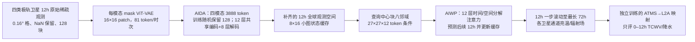

# DAWP：先在卫星观测空间补齐稀疏资料，再做全球短期观测预报

> Junchao Gong、Jingyi Xu、Ben Fei、Fenghua Ling、Wenlong Zhang、Kun Chen、Wanghan Xu、Weidong Yang、Xiaokang Yang、Lei Bai，*DAWP: A framework for global observation forecasting via Data Assimilation and Weather Prediction in satellite observation space*；2025-10-13 [arXiv:2510.15978v1 全文与附录](https://arxiv.org/html/2510.15978v1)，[NeurIPS 2025 主会正式论文页面](https://proceedings.neurips.cc/paper_files/paper/2025/hash/da8a39bc39ae1c89dd6ebb1e3bcbb3f3-Abstract-Conference.html)，DOI `10.52202/085713-4972`；[作者仓库](https://github.com/jasong-ovo/DAWP-NIPS25)目前仅有“Code will be released soon”说明。本笔记于 2026-09-24 按 arXiv v1 的 36 页 PDF/附录 A–I 核对表 1–13 与图 1–20 的图注，并目视检查图 2/3/7/8、表 2/3/4/6/7–12 与算法 1；NeurIPS 正式书目已核对，正式会议 PDF 尚未逐页比较。主任务是**短期的卫星观测直接预报**：卫星通道曲线最长 **72 小时**、降水产品仅 **12 小时**，未验证 10–15 天中期技巧。

## 一、真正解决的问题与“观测空间”的含义

传统 AI 全球天气预报通常把数值同化产生的 ERA5/业务分析作为起点。DAWP 想把训练和起报前移到更近源头的卫星测量：极轨探测并不是每时每地都有数据，若直接以稀疏观测为输入、自回归模型又在稠密输出上滚动，会形成输入–输出分布断裂。作者的解法分为**AIDA 初始化**（多模态掩码自编码器把不规则观测填成稠密观测空间）和**AIWP 预报**（时空 Transformer 在稠密场上推进，每块读邻区缓存）。另外训练一个卫星到降水/整层可降水量产品的映射，作下游可用性演示。[原文 §1、§3、图 1–2](https://arxiv.org/html/2510.15978v1)

这不是“原始卫星直达全球 15 天物理天气变量”的完成品：核心四模态的目标仍是相应卫星辐射或亮温场，降水/TCWV 是由同一 ATMS 的 **Level-2A 物理反演产品**监督的映射输出；没有台站、雷达、探空或海面资料参加主训练，也未直接评估 Z500/T850 等标准中期变量。所谓“global”指格网拼接的地理覆盖，不等于每小时所有格点均被卫星观测。[表 1、§4.3、附录 F](https://arxiv.org/html/2510.15978v1)

## 二、数据链：源文件、格网、缺测、归一化和切分

| 用途 | 原文明确的资料与通道 | 需要保留的口径 |
| --- | --- | --- |
| 主预报 1：**AMSU-A** | NOAA-18/19，Level 1B 微波辐射，**15** 通道，原始产品时间覆盖 **2007–2023**；EUMETSAT 获取。 | 表 1 的产品可用年不等于完整四模态训练期。 |
| 主预报 2：**ATMS** | NPP/NOAA-20，Level 1C 亮温，本文选 **9** 通道，**2012–2023**；GES DISC 获取。 | 是本文使用的 9 通道，不把仪器原生全部通道数套入。 |
| 主预报 3：**HIRS** | NOAA-18/19，Level 1B 红外/可见辐射，**20** 通道，**2007–2023**；EUMETSAT 获取。 | 附录称 19 个红外加 1 个可见，表 1 概写为红外 20。 |
| 主预报 4：**MHS** | NOAA-18/19，Level 1B 微波辐射，**5** 通道，**2007–2023**；EUMETSAT 获取。 | 四主模态中的第四种。 |
| 降水映射标签 | NPP/NOAA-20 的 **ATMS-Precipitation Level 2A** 两通道：TCWV 与 surface precipitation，**2012–2023**。 | 只训练从 ATMS 预测到反演产品的映射；作者称预测时无需降水产品作输入，不等于不用降水产品监督。 |

原始卫星点按经纬度落到**等距经纬度 0.16°** 公共格：为每模态/小时建立全 NaN 图与计数图，每个原观测映射至最近格点，设计意图是遇到同格多个有效点则**累加后按计数取平均**，无观测点继续为 NaN。但附录 E 的**算法 1 只初始化 `D_count`，从未在循环里递增计数**，按伪代码原样运行会除以零或无法平均；这是必须靠作者未公开的数据处理代码确认的缺口，不能把算法 1 当作可直接复现的实现。正文概述为“插值、重投影”，也**没有提供每颗卫星的时间匹配容差、扫描条纹质量控制或跨传感器偏差校正细则**。本文把一个训练例表述为 **12×1152×2304**（12 小时×全球格），全复合数据量 **>35 TB**；全球分成 `8×16=128` 个 **144×144** 小图，便于局部训练和推理。[§1、表 1、附录 A/E](https://arxiv.org/html/2510.15978v1)

四主模态以各自均值/标准差做 z-score。降水产品先按原文 `log(x/a+b)` 变换再标准化，surface precipitation 用 `a=1e−7、b=1e2`，TCWV 用 `a=1、b=1`。**不能擅自改写为常见的 `log(x/a+b)` 以外公式，也不能把对数后的误差直接当原物理单位**；原文没公开逐通道均值、标准差数表和零雨量/负值的全部边界处理。训练资料为 **2012-01–2022-06**，测试 **2023-05–07**，中间十个月在附录 F 未明确命名为验证集；不能把表 1 的 2007 起始年充当训练起点，也不能自行补造验证集划分。降水映射是否使用完全相同的起止和独立测试格点，全文没有充分细化。[附录 E–F、图 9](https://arxiv.org/html/2510.15978v1)

## 三、模型结构：AIDA 与 AIWP 两个不同学习对象

每一传感器先用专属 **mask ViT-VAE** 编码 `144×144` 小图：`16×16` patch 得 `9×9=81` 空间 token，隐宽 **768**；附表 10 列编码端 **10** 个 Transformer block、潜变量采样路径、解码端 **12** 个 block，掩码注意力忽略无有效观测的 patch。它的 VAE 重建目标是观测像素 MAE 加 `1e−6` 权重 KL，不是经典把每个缺测格设零再计算损失。[§3.3、附表 10](https://arxiv.org/html/2510.15978v1)

**AIDA**把四个模态每小时的潜 token 跨 12h 串联；每模态 `81×12=972`，总 **3888** token，先从真实可观测 token 里随机留下 **128** 个送共享编码器，占**全部 token** `128/3888≈3.3%`；其余仍有真值但被遮的 token 用于重建监督，原始缺测不当真值。输入序列可用 token 数不同，作者以 `[EOS]` 补齐到统一长度；推理时释放人工掩码，尽量使用全部可用观测。附表 11 给共享编码器 **12 层/768 维**，填回/解码器 **8 层/512 维**。这一步把观测空间“同化”为连续小图，不能理解成传统物理状态 4DVar 的直接替代。[§3.1、附录 G 表 11](https://arxiv.org/html/2510.15978v1)

**AIWP**预测器读取已补齐的 12h 观测窗，预测接下来的 12h；全球 `8×16` 块每一步共享一个状态缓存。预测某个中心块时，缓存读取上、下、左、右及四角共**八邻块**的已预测潜表示，并合成中心及周边 `27×27×12` token 视图；经 **12 层、768 维** Temporal-Spatial 分解注意力和 SwiGLU 前馈做时间、空间注意力，再写回下一步的全球缓存，反复滚动。经度边界循环连接，极区边界按附录 A 的对侧经度对称索引处理。这样局部模型可交换跨块信息，不代表作者在物理球面上求解守恒方程。[§3.2、图 2、附录 A/G 表 12](https://arxiv.org/html/2510.15978v1)

上图据[原文图 2、附表 10–12](https://arxiv.org/html/2510.15978v1)原创重绘；原论文图 2 的文字“128 Sub-images”指全球一时次 128 块，AIDA 的“128 tokens”是**单小图保留的 token 数**，两个 128 不是同一维度。

## 四、训练与微调：哪些参数确实披露

论文把 VAE、AIDA 和 AIWP 分成**三段独立训练**，均在 **4×A100 80GB** 上用 `144×144` 小图；正文报告约 **1/5/4 天**。附录 G 表 7–9 的公共配置是 AdamW `β=(0.9,0.999)`、初始/峰值 LR 分别 **1e−6/1e−4**、最小 LR **1e−6**、权重衰减 **1e−5**、余弦衰减、各 **200,000** 个更新。唯一区别的表内 batch 分别为 **VAE 200、AIDA 48、AIWP 8**；VAE 的 KL 权重 **1e−6**。AIDA 继承并**冻结 VAE 编码器**，以人工掩码观测 token 的 MAE 训练；AIWP 对稠密观测序列训练自回归预测。推理三部分权重不因每次新观测改变。[§4.1、附录 G 表 7–9](https://arxiv.org/html/2510.15978v1)

正文说“warm up **10k** steps”，但每阶段 `200k×10%` 的三张表意味着 **20k**；两种设置不能同时成立，本笔记保留差异，不替作者选一个。论文未明列三阶段各自的随机种子、总参数个数、全局 batch 与单卡 batch 的定义、梯度累计、AIWP 阶段是否继续更新 AIDA、训练 rollout 的多步长度与权重，也未给降水映射**独立**优化表。附表 12 输出层先写 `7×27×12`，末行线性投影又标 `972` token，两者数量不一致，中心块裁剪路径需代码核验。降水映射是以 ATMS 观测为输入、ATMS-Precipitation 为监督输出训练的另一映射网络；没有证据称这是对整个 DAWP 主干做 LoRA 或真实观测微调。作者代码仓库当前仍是发布预告，无法用实际训练脚本解开这些参数缺口。[§3.3、§4.1、附录 G、作者仓库](https://arxiv.org/html/2510.15978v1)

## 五、定量结果、图表与不利结果

### 5.1 直接观测预报：表 2 与图 3

主评分是只在**测试期原本有实测值**的位置计算逐点 MAE，避开 NaN；不是在 AIDA 生成的所有填补格与独立地面真值比较。表 2 的数值按原文缩放：AMSU-A 单位 `×1e−5`、MHS `×1e−4`，ATMS/HIRS 按 `×1`；不同仪器尺度**不能跨列比绝对值**。[附录 H.2、表 2](https://arxiv.org/html/2510.15978v1)

| 目标通道；MAE 越低越好 | 0–12h：持久性 / 复现 EarthNet / 复现 Transformer-DOP / DAWP | 24–36h：同序四方法 | 读法 |
| --- | --- | --- | --- |
| **AMSU-A ch0**，`×1e−5` | **5.86 / 2.93 / 2.67 / 1.92** | **6.39 / 5.17 / 4.91 / 3.66** | DAWP 在两个窗最低，但误差随 lead 升高。 |
| **ATMS ch0**，`×1` | **14.37 / 6.96 / 6.40 / 3.36** | **15.37 / 12.52 / 11.35 / 7.84** | 即使用稀疏极轨观测，也非误差不增长。 |
| **HIRS ch9**，`×1` | **12.43 / 9.15 / 9.22 / 7.70** | **14.61 / 12.37 / 12.39 / 10.71** | 模态基线优势大小并不完全一致。 |
| **MHS ch0**，`×1e−4` | **7.01 / 3.96 / 3.91 / 3.07** | **8.00 / 6.41 / 6.22 / 5.15** | 只代表该通道，其他通道见附图 10–13。 |

[图 3](https://arxiv.org/html/2510.15978v1)把八个通道的曲线延伸到 **72h，每小时采样**：DAWP 曲线普遍更低，但都有增长和因极轨扫描造成的周期抖动；论文没有可逐点核验的第 72 小时数字表，不能按图像像素捏造精确 MAE。论文“12h lead advantage”的例子来自不同方法**不同预报窗**误差接近的比较，不是预报技巧定义下跨站、跨阈值逐小时证明。图 4/附图 14–20 给多时次空间案例，属于形态证据而非额外独立定量样本。[图 3–4、附图 10–20](https://arxiv.org/html/2510.15978v1)

### 5.2 降水与水汽：表 3 的 CSI/FAR 必须同时看

映射网络把卫星预报转为 L2A TCWV 与地表降水，**仅在 0–12h、存在观测的点**上按阈值计算 `CSI=TP/(TP+FN+FP)`、`FAR=FP/(FP+TP)`；CSI 大、FAR 小较好。TCWV 阈值为 10/20/30mm；surface precipitation 为 0.5/1/2mm/h。[§4.3、附录 H.1](https://arxiv.org/html/2510.15978v1)

| 12h 指标 | 持久性 | 复现 EarthNet | 复现 Transformer-DOP | DAWP | 解读 |
| --- | ---: | ---: | ---: | ---: | --- |
| TCWV **CSI ≥30mm** | 0.636 | 0.786 | 0.789 | **0.807** | 四法中较高。 |
| TCWV **FAR ≥30mm** | 0.332 | 0.172 | 0.169 | **0.120** | 四法中较低。 |
| 降水 **CSI ≥1.0mm/h** | 0.073 | 0.050 | 0.057 | **0.102** | 胜过两学习基线与持久性。 |
| 降水 **CSI ≥2.0mm/h** | 0.031 | 0.008 | 0.010 | **0.035** | 虽第一，绝对技巧仍很低。 |
| 降水 **FAR ≥2.0mm/h** | 0.655 | **0.180** | 0.214 | 0.283 | DAWP 比两学习基线**更高误报率**；只优于持久性。 |

这一负例与作者在文字中强调 DAWP 的“reliability”必须并列：两种弱降水阈值的 FAR 确实比学习基线低，但在 2mm/h 强阈值上 **0.283 > 0.180/0.214**。原文也解释低 CSI 的 EarthNet/Transformer-DOP 几乎不报超过阈值的降水，因此看似低 FAR；这说明**CSI 与 FAR 必须联合解释**，不能只用单一数宣称极端降水全面胜出。被验证的“真值”是卫星反演 L2A，不是独立雨量计。[表 3 与 §4.3](https://arxiv.org/html/2510.15978v1)

### 5.3 消融、压缩器、推理成本

| 原文证据 | 可核对的正负结果 | 不能外推的部分 |
| --- | --- | --- |
| **图 5/6**：去掉 AIDA | 无 AIDA 的 DAWP 训练损失约 20k 步后升至 **1.0** 附近；完整模型 200k 步后 <**0.1**。把 AIDA 加到复现 Transformer-DOP 后，多步 MAE 曲线改善。 | 这不是同架构/同训练动态下“仅 AIDA 导致所有收益”的完全因果分解；无 AIDA 版训练崩溃后，比较可能混有优化稳定性效应。 |
| **表 4/图 7**：跨区域条件 CBC | 中心块平均收敛损失 **0.128→0.106**，6h ATMS ch0 边界纹理连续性更好。 | 表 4 中边界行平均 **0.128→0.148** 反而升高，不能说中心和边界所有区域都数值改善；作者的“约 15.6%”与两行四舍五入数直接计算出的 **17.2%** 不完全一致。 |
| **图 8**：只保留/删除一模态 | 删任一模态一般加大误差；只留 ATMS 时多种输出误差最小，HIRS/MHS 缺失影响相对低。 | 两个热图色标分别约 0–80% 和 0–500%，不能只凭颜色把“删一”和“留一”互相排名；优势也可能受通道数与覆盖率影响。 |
| **附表 6**：VAE 类型 | Mask-ViT-VAE 的 AMSU-A/HIRS 重建误差 **0.78/4.11**，低于 SD-VAE 的 **1.07/5.84**（分别按表中不同缩放）。 | ATMS 为 **1.29 > 1.26**、MHS **2.41 > 2.28**，并非每模态最佳；重建优劣不自动等于 72h 预报改进。 |
| **附表 13**：单模块资源 | VAE/AIDA/AIWP 的推理时间分别 **53/310/491 ms**，所列峰值内存约 **7.3/18.2/47.1 GB**，batch **50/12/2**。 | 三项 batch 不同，表中未给整球 128 块、72h 完整 rollout 的端到端时延，不能简单相加宣称全球预报耗时。 |

以上数字均来自[原文图 5–8、附表 6/13](https://arxiv.org/html/2510.15978v1)，未从曲线反推精确新值。还有一个基线公平性问题：作者明确说 EarthNet/Transformer-DOP 在本复合数据上**由本文重新实现**，并非直接复用对方训练权重；附录 C 把复现 EarthNet 写为 **12 层/768 编码 + 8 层/512 解码**，而 [EarthNet 2024 原文附录 C](https://arxiv.org/pdf/2407.11696)给自身多模态解码器 **6 层/384 上下文嵌入**。故表 2/3 的差异是在 DAWP 作者自己的复现配置下成立，不能等同“与 EarthNet 论文原版已在同任务公平胜出”。DAWP 作者仓库当前仅有发布预告，精确复现仍受阻。[DAWP 附录 C、作者仓库](https://arxiv.org/html/2510.15978v1)

## 六、与观测直达中期研究的关系与复验路线

DAWP 比[EarthNet](../assimilation/73-earthnet.md)多了明确的**观测空间自回归预测器**和全球块间边界条件；前者主任务是观测预报，后者主任务是多模态分析。因此 DAWP 放在“小时级/短期预报”目录，而非“同化”目录。它也与 [AIFS-DOP](../medium-range/42-aifs-dop.md) 或 [FuXi Weather](../medium-range/08-fuxi-weather.md) 不同：那两条路线有更长时效或物理变量评分，但输入、训练目标、数据集和评测真值都不同，不可据此横向排榜。

要检验能否成为**卫星观测→10–15 天**路线，需至少公布并固定：每模态真值质量控制、扫描点到格网的时间容差/归一化统计、VAE/AIDA/AIWP 各阶段冻结与 rollout 监督长度、预报映射的独立训练与测试配置；开放模型代码/权重；用与业务系统相同起报与独立观测配对评估 Z500/T850/降水等物理量至少到第 10–15 天，且分开报告“多看了哪些观测”和“架构改进”的贡献。当前论文到 72h 的卫星 MAE 和 12h L2A 降水 CSI/FAR 已证明一条有价值的短期研究路径，但**不足以回答两周天气技巧或可靠集合预报问题**。这些是阅读后的实验建议，不是原文已完成的结果。

[返回首页](../../README.md) · [返回总表](../../气象大模型_中期预报论文追踪.md)
