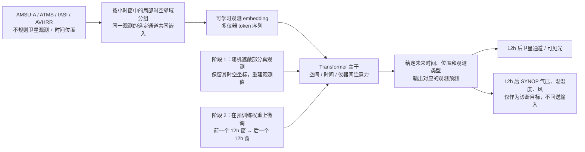

# Transformer-DOP：不经再分析、直接从多类观测学习 12 小时天气预报的原型

> Anthony McNally、Christian Lessig、Peter Lean、Eulalie Boucher、Mihai Alexe、Ewan Pinnington、Matthew Chantry、Simon Lang、Chris Burrows、Marcin Chrust、Florian Pinault、Ethel Villeneuve、Niels Bormann、Sean Healy，*Data driven weather forecasts trained and initialised directly from observations*；[arXiv:2407.15586v1](https://arxiv.org/abs/2407.15586)，2024-07-22 首发；[原始全文](https://arxiv.org/html/2407.15586)。作者单位为 ECMWF；“Transformer-DOP”是[后续 DAWP 论文](https://arxiv.org/html/2510.15978v1)对该原型的简称，并非这篇论文的正式标题。本笔记按 v1 正文、表 1 与图 1–5 核验；未查到本文的后续修订版或同行评审正式版。**实际展示的预报时效只有 12 小时**，归短期观测预报目录，不作为 10–15 天中期成绩。

## 一、问题：为什么不用 ERA5 或传统分析场

GraphCast、Pangu-Weather、AIFS 等路线通常从数值同化产生的分析或再分析开始；这样可以借助物理系统提取大量信息，但模型训练和实时起报也隐含依赖传统数值模式及其观测算子。本文提出另一条研究路线：让网络从历史**实测值**学习观测之间的时空关系，起报时也读实测值，在未来所要求的位置和时间**预测观测量**。它没有先显式求一个三维物理状态的 4D-Var 分析场。[原文 §1–2](https://arxiv.org/html/2407.15586)

“直接从观测”须按本文的数据定义理解。输入为各卫星仪器的原始级别辐射/亮温/反射率及其观测位置和时间；SYNOP 地面气压、温湿度与风速作为诊断输出监督而**不作为起报输入**。论文并未证明卫星读数能无误差地反演任意地表变量，也未证明在所有用户自定点位有可靠的业务评分。模型的 12 小时窗口借用了 ECMWF 现有观测处理基础设施的时间分桶，但这不等于把该中心数值同化生成的分析场送入网络。[原文 §2–4、表 1](https://arxiv.org/html/2407.15586)

## 二、逐数据源与处理链

| 仪器/站点 | 平台及表 1 给出的资料可用期 | 本文所选字段 | 网络角色与物理含义 |
| --- | --- | --- | --- |
| AMSU-A | Metop-B；2013 年起 | 15 个微波通道 | **预报型**：观测作为输入，也预测后续观测。50 GHz 附近通道对温度深层结构敏感，窗口通道还含地表信息。 |
| ATMS | Suomi-NPP、NOAA-20；2012 年起 | 22 个微波通道 | **预报型**：输入和未来目标；含温度、约 183 GHz 水汽信息。 |
| IASI | Metop-B；2013 年起 | 17 个红外通道 | **预报型**：输入和未来目标；云影响既是常规同化难点，也是可供模型学习的天气形态信号。论文仅选择 17 通道，不应误写为仪器全谱。 |
| AVHRR | Metop-B；2013 年起 | 1 个可见光通道 | **预报型**：输入和未来目标；夜半球反射率接近零，不能把其黑暗区当作“无云”。 |
| SYNOP | 地面站；表 1 写 1979 年起 | `ps`、`t2m`、`rh2m`、`u10`、`v10` | **诊断型**：预测与监督，但不进入预报输入；站点分布稀疏且地理不均。 |

来源：[原文表 1、图 1 及数据段](https://arxiv.org/html/2407.15586)。表 1 的“2012/2013 起”“1979 起”是**各资料库覆盖范围**，不是作者披露的最终训练切分；同时有全套卫星数据的重叠期不会早于 2013 年。作者展示了 2022-02-18 和 2022-10-17 两个案例，但没有说明它们是训练、验证还是独立测试日期，故不能替作者命名测试集。图 1 表明极轨观测在一个 12 小时窗内可覆盖全球大部分区域，却不能推出每个格点每个时刻都有观测。[原文表 1、图 1/3–5](https://arxiv.org/html/2407.15586)

原文明确的数据处理步骤是：把每个空间—时间邻域中的表格化观测变成 token；同一仪器在某个观测处的**所有所选通道合并嵌入**，再把位置与时刻一并编码。训练预掩码时只留下被遮位置的时空坐标，待模型重建被遮的实测值。卫星是起报输入；SYNOP 因为目标是从卫星诊断地面天气量，不能误接到输入支路。12 小时的相邻两个窗口分别是预测输入和目标，非逐小时滚动 12 次。[原文“Prototype neural network”段](https://arxiv.org/html/2407.15586)

**没有披露**：卫星产品精确版本/下载路径、质控阈值和薄化算法、各仪器观测量的单位及逐通道归一化统计、时间窗口边界与匹配容差、如何处理缺测/重复观测、token 的空间半径和时间跨度、经纬度/时间位置编码公式、SYNOP 站点筛选与异常值处理、训练/验证/测试具体起止。原文并未给出重采样至某固定经纬格的算法，因此不把后续 GraphDOP、EarthNet 或 DAWP 的 0.16° 网格处理方式倒填给本篇。记录这些空白不是说作者一定没有做处理，而是**无法从该稿复现其处理**。[原文数据与模型段](https://arxiv.org/html/2407.15586)

## 三、结构与信息流：预报的是观测，不是中间分析图

作者只给出图 2 的**示意结构**。小范围时空邻域的多仪器观测，经可学习 embedding 映射为 latent 向量；Transformer 自注意力让不同位置、时间及仪器的信息相互作用。输出头对指定未来坐标和仪器通道回归未来观测；SYNOP 诊断目标训练了从卫星表征到物理地面变量的关系。可在原始观测点之外查询某个位置，但本文没有提供任意查询坐标的误差地图或独立格点评分。[原文图 2 与模型段](https://arxiv.org/html/2407.15586)

此为据[原文图 2、表 1 与模型段](https://arxiv.org/html/2407.15586)原创重绘的信息流，不是把论文原图搬入仓库。图中的两个训练阶段由原文明确给出；**输出查询头具体实现、block 数、宽度、参数量、mask token 布置和位置编码形式未公开**，所以只画到可证实的层级。SYNOP 是训练时带标签的诊断目标；这既不等于传统 DA 先产出完整格点分析，也不等于没有使用任何地面真值做监督。

## 四、训练与微调：流程可确认，数值配置不够复现

1. **掩码预训练**：从历史观测中随机遮掉一些观测值，保留这些点的位置和时间，让 Transformer 利用未遮的多仪器 token 预测被遮真值。该阶段的目的不是预测未来，而是学习同一时空窗内与不同测量系统之间的关联。论文没有给随机遮蔽比例、各通道/仪器采样权重、具体损失类型及通道权重，也没有说明是否将 SYNOP 目标纳入该阶段。[原文模型段与图 2](https://arxiv.org/html/2407.15586)
2. **预报微调**：从上述预训练模型出发，把前一个 **12h** 观测窗作为输入，把下一 **12h** 窗的卫星与诊断观测作为预测目标。原文使用明确的 *fine-tuned* 表述，因此这是微调而不是从头训练的第二个完全独立模型；但没有交代哪些层被冻结或更新、是否换头、各任务损失权重、teacher forcing 或多步 rollout 方案。由于所报只有一个目标窗，不能自行推断使用了多步自回归训练。[原文模型段](https://arxiv.org/html/2407.15586)
3. **推理与验证**：输入起报前的卫星观测，在未来所求位置和观测类型上读出预测；用实际未来卫星测量或 SYNOP 站点值做可视化比较。原文没有实时报文延迟预算、输入时刻漏数规则、业务循环更新时间或完整全球推理成本。[原文结果段](https://arxiv.org/html/2407.15586)

**未披露的训练超参数**：Transformer 层数、隐藏宽度、注意力头数、参数量、优化器、学习率/调度、weight decay、batch、迭代数/epoch、训练时长、硬件、随机种子、预训练与微调各自所用年份和最终检查点选择规则。后续 [DAWP](https://arxiv.org/html/2510.15978v1) 附录 C 自行复现 Transformer-DOP 时采用 **18 层/1024 维**，并明确说原稿只有结构草图、无源码；这**不是本篇原作者披露的正式配置或本篇性能**，不能移植到这里。原稿也没有证据支持 LoRA、量化或冻结卫星编码器等具体微调方式。

## 五、原图所能支持的结果；没有数字就不造性能表

| 原文证据 | 实际案例与作者展示的可见信息 | 可得结论与限制 |
| --- | --- | --- |
| **图 1**：输入观测覆盖 | 12h 窗内 ATMS、IASI、AVHRR 和 SYNOP 的典型地理分布。 | 说明卫星覆盖与站点稀疏性，**不是预报精度图**；没有覆盖率百分比统计。 |
| **图 3**：IASI 红外 | 2022-10-17 00 UTC 的 IASI **channel 921、约 10 μm**：前一窗输入、下一窗预测、下一窗实测三组图；作者指出南半球锋面东移、北太平洋新形成的钩状云型等形态。 | 可见 12h 大尺度运动和部分云形，但作者也承认预测图比实测更平滑。无 MAE、RMSE、光谱误差或多个起报日置信区间。 |
| **图 4**：AVHRR 可见光 | 同一 2022-10-17 案例；输入窗西半球夜间几乎为零，未来窗转为受日照区域，预测图与实测图都显示云特征。 | 作者将此解读为跨仪器学习（可能借助 IASI 云信号）；但**没有单独去掉 IASI 或其它传感器的消融**，也没有排除天文昼夜周期等可预测信息的定量对照。 |
| **图 5**：地面风 | 2022-02-18 欧洲/地中海低压个例，对照未来窗 **09/18 UTC** 的 SYNOP 10m 风矢量与预测。 | 显示部分环流结构和方向变化；原文承认大小与方向存在差异。SYNOP 不做输入，属于从卫星诊断风的个例，不是所有站点/季节的误差分布。 |

全部行依据[原文图 1、3–5 图注及结果段](https://arxiv.org/html/2407.15586)；上表是**证据表**而非伪造“模型性能数值表”。这篇 v1 **没有给独立测试集、逐区域/逐变量指标、持久性或 IFS 对照表、消融、集合校准、统计显著性或 10–15 天曲线**。因此“skilful/realistic”的作者文字主张只能在展示样例范围内成立，不能据此计算与 AIFS、GraphDOP 或 DAWP 的横向优势，也不能把几个生动图像当成系统性验证。

## 六、与后续观测直达中期路线的关系

本文的重要性在于把**多仪器卫星观测 → 多类未来观测 → 地面物理量**放进一个无需传统分析场的可行原型，并在论文中明确使用“掩码预训练→预报微调”两阶段。它也提供一个醒目的负面证据边界：作者在结语写明，凭当前初步结果**不能推测更长时效会有多真实**。[原文讨论段](https://arxiv.org/html/2407.15586)

[GraphDOP](../medium-range/47-graphdop.md)是后续**另写的**图网络观测直接预报论文，展示约五天的更长时效；[AIFS-DOP](../medium-range/42-aifs-dop.md)则在另一模型/训练流程中评估约十天。[DAWP](74-dawp.md)也引用本文作其复现基线，但 DAWP 的 72h 卫星指标来自其**自行复现**的模型，不应倒填为 2024 原稿的表格结果。未来真正检验本原型能否走到中期，需要公开数据切分、缺测/质量控制与归一化、网络与微调超参、完全独立的多季节测试起报、标准天气量逐日误差/技巧，以及与持久性和业务预报的相同观测真值对照；这些是本笔记提出的复验条件，不是作者已经完成的实验。

[返回首页](../../README.md) · [返回总表](../../气象大模型_中期预报论文追踪.md)
