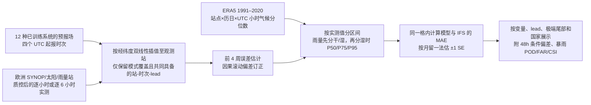

# 欧洲站点的极端天气检验：EPT-2.1、AIFS 与物理模式各失在哪里？

> Marvin Vincent Gabler、Roberto Molinaro、Niall Siegenheim、Henry Martin、Mark Frey、Niels Poulsen、Philipp Seitz、Olivier Lam（Jua.ai AG），*Do AI weather models miss extremes? Evidence from ten months of verification against European weather stations*；[arXiv:2608.09972v1](https://arxiv.org/abs/2608.09972)，**2026-07-31** 首发；[可检索全文、正文表 1–5、附表 S1–S19](https://arxiv.org/html/2608.09972v1)；[作者公布的聚合指标与绘图代码](https://github.com/juaAI/aiweather-extremes)。截至本次核验按 **v1 预印本** 解读，不冒称已同行评审。本篇是**已训练天气系统的独立站点评测论文**，而非 EPT-2.1 的模型结构/训练技术报告。最长实测 **48 小时**，因此归在“短临、小时级与短期”目录，不归中期或 S2S。[原文 §3–4](https://arxiv.org/html/2608.09972v1)

## 一、研究问题与最重要的边界

作者质疑“AI 天气模型天然会漏报极端”的概括：早期负面证据多把 2022–2024 年确定性、均方误差训练模型与 ERA5 等再分析格点比较。格点真值平滑了站点极端，也难回答公众关心的地点值。本研究让多代 AI 与物理模式在**相同欧洲实测站点、相同起报时次、相同预报时效与按实测值定义的极端分组**上比误差；关注的不是整场灾害的路径/峰值，也不是 10–15 天技巧。[引言、§2–3](https://arxiv.org/html/2608.09972v1)

核心结论应拆成两层。**相对误差**上，Jua 的部分区域生成式系统在高温、大风或日照尾部优于 IFS；AIFS 某些尾部反而逊于 IFS，物理 GFS 的高温尾部也可能更差。**条件偏差**上，不论 AI 还是物理模式，在整体去偏后仍倾向于把观测分布两端拉向中间——小值高估、大值低估。前者并不否定后者；一个模型可以系统性低估峰值，却仍比另一模型具有更低的平均绝对误差（MAE）。[§4–7](https://arxiv.org/html/2608.09972v1)

## 二、比较对象与“模型结构/训练流程”到底披露了什么

表 1 有 **11 个受测系统 + 1 个 IFS HRES 参考**。物理模式为 ECMWF ENS、NOAA GFS、DWD ICON Global 与 ICON-EU；AI 回归家族为 AIFS、Aurora、EPT-2 Reasoning、EPT-2e 和太阳辐射专用 EPT-2.1 Helios；AI 区域生成集合为 EPT-2 HRRR 与 EPT-2.1 Europa。EPT-2e 虽列为回归家族但输出是集合；**“输出集合”并不等于扩散式生成训练**。HRRR 在本文列为约 **5.5 km、16 成员、每小时更新**，Europa 约 **7 km**；本文没有给 Europa 的成员数、网络结构或完整训练配方。Helios 是太阳辐射专用区域回归模型，不能用它在辐射上的领先证明其风、温、雨能力。[§3.1、表 1](https://arxiv.org/html/2608.09972v1)

本论文**没有重新训练、预训练、微调或蒸馏这些系统**；它使用不同产品已有的预报场做外部检验。作者仅说明 Jua 模型没有用本次天气站、太阳站或雨量站**训练/微调**。原稿没有为各 EPT-2.1 版本列出训练年限、输入/输出通道完整清单、目标分辨率映射、层数/参数量、优化器、学习率、batch、损失权重、训练步数、微调起点/冻结范围或生成采样步数；这些不能从 [EPT-1.5](../medium-range/45-ept-1-5.md) 或 [EPT-2 技术报告](../medium-range/38-ept-2.md) 直接移植。该报告引述其他技术资料解释模型家族，但**不是 EPT-1 的独立原始模型论文**，也不提供把 EPT-2 Reasoning/2e 与 2.1 Europa/Helios 判为同一权重的证据。[§3.1、参考文献](https://arxiv.org/html/2608.09972v1)

作者新增的可复验“方法结构”是评测管线，而非新神经网络：

上图依据[原文 §3.2–3.5](https://arxiv.org/html/2608.09972v1)原创重绘。**评测中的四周滚动去偏不是重新微调天气模型**，不会更新其网络权重；下游用户可把它视作统一的业务后处理。图 1 的 48h 预报场只是来自公开文档的**说明图**，论文明确说它不进入分数计算，也不由作者代码复现。图 2 为站点地图；图 3–17、S1–S4 为本评测导出的技能图，笔记下文选摘其可核数字而不转载原图。[图 1–2、数据/代码声明](https://arxiv.org/html/2608.09972v1)

## 三、观测、基准与数据预处理

**站点和变量。**质控原位观测包括 **1,871 个**气象站的 10m 风与 2m 温度、**955 个**太阳站的逐小时全球水平面短波辐照积算量（GHI），以及独立的 **4,005 个**雨量计的逐小时降水；天气站原始流不含可用于本文的小时雨量。欧洲总体池覆盖德国、法国、英国、西班牙、意大利、波兰、荷兰、比利时、瑞士、挪威、奥地利、捷克、丹麦等 **13 国**；雨量只覆盖其中 **11 国**，没有意大利和波兰。预报网格按经纬度**双线性插值**到各站；区域模式只在其覆盖的站点验算。原稿没有公布各站质控阈值、逐月有效样本数、各变量缺测插补规则或预报原场再网格化细节，不能自行补写。[§3.2、图 2](https://arxiv.org/html/2608.09972v1)

**两个评测轨道。**Track A 是 **2025-09-01 至 2026-06-30** 的十个月：风/温在共同的 6、12、…、48h 六小时网格比较；辐射/雨量采用 1–48h 小时网格。AIFS、Aurora 在辐射无可用输出，ENS 辐射也略去；AIFS、Aurora、Helios 无雨量字段，因此不能把“无分数”解释为负分。ENS 雨量按其原生 6h 频次处理。Track B 是 **2026-03-01 至 2026-06-30**，加入 ICON-EU，以共同的 1–48h 小时网格比较区域模式。太阳资料还受国家/月份覆盖限制：GB/ES/PL 没有此网络的太阳站，意大利主要资料到 2026-02，故 Track B 太阳结果不含 IT。[§3.2](https://arxiv.org/html/2608.09972v1)

**极端阈值不是从这十个月反推。**作者把 ERA5 **1991–2020** 的 0.25° 格点值插值到每个站，按该站的历日和 UTC 小时，用循环 **±15 天 × 30 年 = 930 样本**估计 P5/P25/P75/P95。风/温/白天正辐射按观测值分为 `<P5`、`P5–25`、`P25–75`、`P75–95`、`>P95` 五段，加“全部”一栏。太阳夜间 0 值不参与辐射阈值。雨量零值过多，先把 `<0.1 mm` 定为干时，其余湿时按 ERA5 湿小时 P50/P75/P95 分四档；这里的 `>P95` 是**湿小时气候分位的最强档**，不是“所有小时中前 5%”或统一的灾害预警阈值。[§3.3、表 2–3](https://arxiv.org/html/2608.09972v1)

由于实测站点方差往往大于格点 ERA5，`>P95` 和 `<P5` 风/辐射尾部各约占**10%**而非名义 5%。评测期比 1991–2020 偏暖，温度 `>P95` 达 **13.4%**、`<P5` 仅 **3.3%**。所以“极端”是**相对该固定格点气候态的站点稀有值**，不是每个站天然等样本数的最极端 5%，也不是单次热浪灾情等级。[§3.3、§6](https://arxiv.org/html/2608.09972v1)

**公平配对和误差定义。**每个 `轨道×国家×变量×lead×观测区间×去偏设置` 格只取全部参评模式共有的观测—预报样本、共同起报时次（每日 00/06/12/18 UTC）；缺少某 lead 的模式不被插值到别的 lead。技能 `S = 1 - MAE(模式)/MAE(IFS)`，正值表示相同样本上低于 IFS 的 MAE，负值反之。每月留一法 jackknife 给 **±1 个标准误**，不是 95% 置信区间。ENS、EPT-2e、HRRR、Europa 以**集合均值**算 MAE；没有 CRPS、可靠性、覆盖率或集合 spread 技巧检验，故不能证明生成集合概率预报更好。另对雨量 `>P95` 做 POD、FAR、CSI、频率偏差。[§3.4](https://arxiv.org/html/2608.09972v1)

**四周滚动偏差订正。**风、温、辐射分别按模式与 UTC 有效小时，从此前四周欧洲站误差估计一个跨地点共享的均值偏差，再对下一周预报整体平移；不按单个站/lead/起报时次拟合。集合各成员同移，因此离散度不变。雨量若加常数易造负值，故用此前四周**观测总量/预报总量比**乘预报，倍率截到 **[0.33, 3]**，0 仍为 0；文中雨量分数全部在此订正之后。训练与测试之间保持时间因果，但使用同一站网作业务去偏与验算，不能说完全站点外独立验证。分组阈值取自**观测值**，所以去偏不会改变样本所属的极端组。[§3.5](https://arxiv.org/html/2608.09972v1)

## 四、图表和性能：先看主轨道十个月

下表是 Track A 对 **IFS HRES** 的 MAE 技能百分比（正号更优），括号为作者报告的 **±1 jackknife SE**；风/温汇总 6–48h 的六小时网格，太阳/雨量汇总 1–48h 的小时网格。只摘录能由原文正文/表直接核查的关键列，**不将不同变量、尾部或国家合并成一个冠军榜**。[附表 S1–S3、正文表 5](https://arxiv.org/html/2608.09972v1)

| 变量/极端分组 | 领先与主要 Jua 变体 | 重要反例与解释 |
| --- | --- | --- |
| **10m 风，全部 / `>P95` 大风** | EPT-2.1 Europa **+8.4±0.5 / +9.0±1.2**；EPT-2 HRRR **+4.5±0.3 / +6.1±0.9**。 | ICON Global 大风 **+9.5±1.1**，点估计略高于 Europa、误差带重叠；AIFS **−5.4±0.4 / −10.6±0.6**。故“所有 AI 比物理模式极端风好”不成立。 |
| **2m 温度，全部 / `>P95` 高温** | EPT-2 HRRR **+12.1±0.4 / +19.6±2.2**；Europa **+11.5±0.7 / +15.0±1.7**。 | 两者高温差别不足以按此标准误稳判优劣；AIFS **−1.4±0.6 / −4.9±2.0**，GFS **−23.9±1.4 / −22.8±2.0**。 |
| **太阳短波，全部 / 阴天 P5–25 / 晴空 `>P95`** | Helios **+10.2±1.7 / +16.4±3.4 / +24.8±5.4**。 | Helios 在最常见的 **P25–75 反而 −8.2±1.1**，Reasoning 同区间 **+14.0±0.7**；专家化的尾部优势不普适。 |
| **小时雨量，全部 / 中等 P50–75 / 最强 `>P95`** | Reasoning **+5.1±0.4 / +14.0±0.9 / +1.7±0.5**；HRRR 中等 **+15.2±2.2**；EPT-2e 中等 **+14.8±1.7**。 | HRRR 最强档 **−1.5±0.5**、EPT-2e **−1.9±0.9**；Europa 干时 **+21.0±2.7**，但轻/中雨 **−11.1±3.0 / −10.5±3.4**。中雨大幅领先不等于暴雨也领先。 |

**Lead 曲线（图 3–6、附表 S8–S10）**比只看总平均更重要。Europa 风的全部样本技能在 6/12/24/48h 分别为 **+8.3/+8.7/+8.5/+8.1%**，大风尾部分别 **+8.8/+9.3/+9.2/+9.0%**，在这四个 lead 近乎平台；AIFS 风全部为 **−6.6/−6.5/−5.7/−4.0%**，48h 差距缩小但仍负。太阳 Helios 各 lead 领先，1–12h 汇总为 **+13.5±1.9%**；雨量的 Jua 优势一般到 12h 后较明显。所有曲线均止于 **48h**，不能外推成第 10 天表现。[§4.1、附表 S8–S10](https://arxiv.org/html/2608.09972v1)

**按国别看高温（表 4）**，GFS 在所有列出的国家均负；但 Europa 并非处处正，例如英国 **−1.2%**、荷兰 **−3.4%**、丹麦 **−4.4%**，而瑞士 **+31.1%**、奥地利 **+28.2%**。这提示欧洲总体平均掩盖地域差异，也说明不能把区域产品的单一欧洲平均直接用于某国部署决策。该表仅给国别点估计，**没有国别标准误**，不能以几百分点差异宣称显著。[§4.2、表 4](https://arxiv.org/html/2608.09972v1)

**暴雨检出（图 11、附表 S19）**是强度 MAE 之外的第二视角。`>P95` 事件的 CSI：Europa **0.19**、ICON Global **0.19**、Reasoning **0.18**、IFS **0.17**、HRRR **0.16**、ENS 集合均值 **0.13**；对应频率偏差 Europa **0.74**、ICON Global **0.82**、Reasoning **0.53**、IFS **0.71**、HRRR **0.42**、ENS 均值 **0.29**。**全部小于 1**，说明事件预报次数普遍偏少；对 ENS/生成集合用均值作阈值，本身会平滑个别成员高雨量，这不是集合发生概率的检出率。[§4.2、附表 S19](https://arxiv.org/html/2608.09972v1)

## 五、条件偏差、区域复核与不能忽略的负面证据

图 12 在 **48h** 检查去掉总体平均偏差后的**条件偏差**：各模式在低观测值组偏高，在高观测值组偏低。原文给出的跨模式量级为平静风约 **+0.8～+1.2 m/s**、大风约 **−2.2～−2.9 m/s**，极冷约 **+0.7～+1.2°C**、高温约 **−0.3～−0.7°C**，小雨约 **+0.09～+0.12 mm**、极强雨约 **−2.29～−2.51 mm**。这些是跨模式范围，**不是某个 EPT 版本的专属数值**。去偏只移除整体平均，不能修复按极端条件分组后的非线性偏差；相对 MAE 仍会因模型而异。[§4.3、图 12](https://arxiv.org/html/2608.09972v1)

Track B 仅用 **2026 年 3–6 月** 与共同 1–48h 逐小时样本，再把 **ICON-EU** 加入可覆盖的区域比较。风总体 Europa **+7.2±0.4%**、ICON-EU **+5.3±0.5%**；大风 Europa **+10.5±1.4%**、ICON-EU **+11.5±1.6%**，二者接近。温度总体 Europa **+13.2±0.6%**、ICON-EU **+12.4±0.8%**、HRRR **+12.0±0.7%**，高温尾部三者约 +17%，误差带重叠。Helios 太阳总体 **+12.6±2.5%**，而 ICON-EU **+7.2±1.4%**。雨量中只有 HRRR 在**轻雨到高雨**三档都为正（中雨 **+15.6±6.1%**）；Europa 干时很强，但轻/中/高雨 **−19.1±6.0 / −20.2±7.2 / −9.0±5.7%**。最强雨档三者仅 **Europa +1.2±0.8、HRRR −0.7±0.3、ICON-EU +0.1±0.5%**。这一轨道改变月份、模式集合和有效站点，**不能与 Track A 的表格数字当完全同一样本做“前后性能提升”**。[§4.4、附表 S11–S18](https://arxiv.org/html/2608.09972v1)

这些结果也**不能单独证明生成式优于回归式**。分辨率、地理覆盖、预报初值、可用变量、训练资料和模型架构同时变化；作者没有做同底座同资料、只换损失/生成机制的因果消融。即便区域生成模型对高温不错，物理 ICON-EU 在大风尾部仍相当有竞争力，且 EPT-2 Reasoning 在最强雨量的点估计反而优于两款区域生成集合的集合均值。[§5](https://arxiv.org/html/2608.09972v1)

## 六、复现清单与我对证据强度的判断

作者称[复现包](https://github.com/juaAI/aiweather-extremes)包括归档的站点核验 API 请求/响应、聚合指标、头部表格和抽取/聚合/绘图代码；分数图表可由聚合结果离线再生，**图 1 是外部说明资产**。但原始完整预报场要经 Jua 平台获取，原稿也未把每个底座的权重和训练流水线作为本研究发布，因此“能重画图”与“从原始站点/预报场完全独立重算”不是同一级复现。[数据与代码声明](https://arxiv.org/html/2608.09972v1)

后续严格复验应固定站点名单/月份/可用起报时次，先检查所有模型在**真正相同样本**上的绝对 MAE、CSI 和样本数，再把前四周去偏与无去偏并列；对站点本地 P95 与 ERA5 格点 P95 各算一次，判断尾部占比膨胀的影响。集合系统至少再给每成员阈值发生概率、CRPS、可靠性和 spread–error，而不能只看集合均值；再加独立年份/欧洲外地区、极端过程事件级峰值与峰值时刻。**这些是我提出的复验方案，不是本文已报告的结果。**

对本库重点而言，本篇的价值是为 [EPT-2 系列](../medium-range/38-ept-2.md)、[Aurora](../medium-range/01-aurora.md) 与 [AIFS](../medium-range/41-aifs-base.md) 补上**欧洲观测站、短期极端条件的横向负例与正例**；它没有测试第 10–15 天，不能用来填充中期模型数量或宣称 EPT-2.1 的中期技巧。作者单位是 Jua，结果属于作者报告的可核表格；今后若有独立第三方按同协议重算，应优先加入并对照。当前尚未找到可独立作为“EPT-1 模型论文”收录的原始技术报告，**不会以 EPT-1.5 报告里的前代名称凭空增加一篇文献**。

[返回首页](../../README.md) · [返回总表](../../气象大模型_中期预报论文追踪.md)
