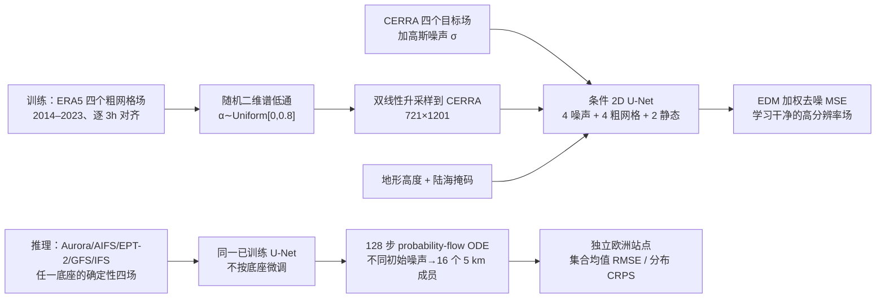

# 通用扩散式概率降尺度：一次训练，给多种天气底座生成欧洲 5 km 集合

> Roberto Molinaro、Niall Siegenheim、Henry Martin、Mark Frey、Niels Poulsen、Philipp Seitz、Marvin Vincent Gabler（Jua.ai），*Universal Diffusion-Based Probabilistic Downscaling*；[arXiv:2602.11893](https://arxiv.org/abs/2602.11893)，**2026-02-12** v1 首发、**2026-04-20** 更新为 [v3 全文/附录](https://arxiv.org/html/2602.11893v3)；arXiv 标注 **ICLR 2026 Workshop on AI and Partial Differential Equations**，不能冒称 ICLR 主会正式论文。它与 [EPT-2 技术报告](../medium-range/38-ept-2.md)不同：训练的是一个**区域概率后处理器**，不是重新训练全球预报底座；与 [欧洲极端站点评测](79-jua-europe-extremes.md)也不同：本篇自己训练扩散模型、做同架构回归消融。公开预报核验最长 **90h=3.75 天**，按实际时效归短期目录，尽管引言使用“medium-range”一词。[摘要、§5–6](https://arxiv.org/html/2602.11893v3)

## 一、问题与贡献的准确范围

全球确定性预报在约 9–25 km 网格上难解析复杂地形、地表粗糙度和边界层控制的近地面细节。一个 25 km 格点可以对应多个合理的 5 km 局地实现，因此粗到细并非单值函数；只做 MSE 回归会趋向条件均值，给出平滑且低估不确定性的场。本稿把降尺度写作条件分布 `p(u_5km | x_25km)` 的学习：从一个确定性底座输入**多次采样**出不同高分辨率天气实现，再用集合均值给点预测，用集合分布给 CRPS。[§1、§3–4](https://arxiv.org/html/2602.11893v3)

“通用”有精确定义：**同一套** ERA5→CERRA 配对资料训练出的条件扩散器，不对 Aurora、AIFS、EPT-2、GFS 或 IFS HRES 单独更新权重，就以这些模式在各 lead 的场替换训练时的 ERA5 条件输入。它不是全球通用地理模型：高分辨率目标、静态地形和训练域都在欧洲 CERRA 覆盖范围；也不是不需要变量匹配，五种底座必须提供能映射到相同四个物理字段的条件输入。[§3、§5](https://arxiv.org/html/2602.11893v3)

## 二、数据、空间对齐和训练/测试切分

| 数据角色 | 原文设置 | 解读与风险边界 |
| --- | --- | --- |
| 粗网格条件 `\bar u` | **ERA5 约 0.25°/25 km**，`t2m、u10、v10、msl` 四个场；按同一有效时刻与 CERRA 配对。 | 训练时输入**分析/再分析**而不是五款实际模式的预报；要靠后述条件谱平滑改善模型迁移。ERA5 场双线性升采样到高分辨率网格后送网络；升采样本身不会产生新增天气信息。 |
| 高网格目标 `u` | **CERRA 约 0.05°/5 km** 的同四个场；欧洲 **36–72°N、15°W–45°E**，数组大小 **721×1201**。 | CERRA 是训练标签，不是独立站点真值；它有自身数值模式/同化偏差。这里没有逐小时降水、辐射或高空场学习。 |
| 静态信息 `s` | CERRA 网格的**地形高度、陆海掩码**两通道。 | 条件输入实际上是 `4` 个噪声目标 + `4` 个粗网格天气场 + `2` 个静态场 = **10 通道**。 |
| 训练期与标准化 | ERA5/CERRA 逐 **3h** 配对，标注 **2014–2023**；所有输入/输出动态通道用 **ERA5 1979–2021** 统计量标准化。 | 附录另称共 **26,280 个样本**，但 2014–2023 若每 3h 连续、无缺口应约 29,216 次；未解释被排除的日期/时段或是否实际少一年。不能自行把 26,280 推断为“完整十年”。 |
| 站点封存评测 | **2024-07-01–2025-06-30**，约“10,000 independent in situ observations”，来自 WMO SYNOP、WIS 2.0、METAR（含 ASOS/AWOS）；网格预报双线性插至站点。 | 原文语句说约 10,000 **observations**，没有明确是 10,000 个独立站还是有效站时次；不得写成 10,000 站。评测仅 **T2m 与风速**，无独立站点 MSLP/逐分量结果。 |

逐站质量控制和异常值阈值、CERRA/ERA5 的具体空间插值边缘处理、训练/验证细分、各底座入评月份/站点交集及数据下载清单未充分公开；复现时应向作者索取。尤其原稿说所有动态通道标准化使用 ERA5 统计，而目标 CERRA 的分布可不同，是否对目标/输出另做业务偏差订正不宜凭猜测补写。[§5、附录 A.4](https://arxiv.org/html/2602.11893v3)

## 三、模型结构与信息流：真正训练的是谁

这是按[图 1–2、§3–5、附录 A](https://arxiv.org/html/2602.11893v3)重绘的**训练与推理流程**。上游天气模式只提供已算好的预报场；本稿没有回传梯度到 Aurora/AIFS/EPT-2/GFS/IFS，没有重训它们，也没有在测试站点上微调扩散器。由于网络不是时间积分器，每个 lead 的预报场**各自**做条件降尺度；生成的多个空间成员不自动保证时间连续、一致的天气轨迹。[§3–5](https://arxiv.org/html/2602.11893v3)

去噪主干是带 U-Net 跳接的二维编码器—解码器：输入 3×3 卷积投到 **32** 基通道，四个分辨率阶段按 **[2,4,8,8]** 放宽，文中列宽 `32→64→128→256→256`；各阶段 **2 个残差块**，降采样 3×3 stride 2，上采样先双线性×2 再 3×3 卷积。块内两次 `GroupNorm→激活→卷积`，默认 **32 组**、**dropout 0**；自注意力仅在**瓶颈**放一次，不能把它写成所有尺度都使用 Transformer。噪声 `σ` 用 **256 维 Fourier 特征**与两层 MLP 生成每通道的仿射 `(a,b)`，对每个残差块的归一化特征做 `(1+a)·GN(x)+b` 条件调制。总参数量标为 **24M**、输出四通道。[附录 A.3](https://arxiv.org/html/2602.11893v3)

附录 A.3 的“配置摘要”把十个输入通道写成“噪声目标 4 + coarse-resolution forecast provided as conditioning 6”；但其前面 A.3/正文明确把六个条件通道拆成**天气预报 4 + 地形/陆海 2**。应以完整列出的 `4+4+2=10` 为计算口径，不误称天气底座本身要提供六个动态字段。图 2 图注说“lead time, when applicable”可被嵌入，但**实际配置只明确给噪声等级嵌入**，没有可核对的独立 lead 编码维度/训练设置；不得据图注肯定实现了 lead 条件化。[图 2、§5、附录 A.3](https://arxiv.org/html/2602.11893v3)

## 四、频谱增强、扩散目标、优化与采样参数

**条件输入为什么做谱平滑？**不同上游系统在有效分辨率和高频能量上不同；长 lead 的 AI 自回归还会更平滑。如果只用固定谱的 ERA5 训练，推理时遇到 AIFS 或 EPT-2 的平滑场可能产生分布偏移。作者对训练的 ERA5 条件输入二维 FFT，乘各向同性高斯低通 `G_α(kx,ky)=exp[-(kx²+ky²)/(2σ_α²)]` 再逆变换；每个实例独立采 `α~Uniform[0,0.8]`，`σ_α = 1/2·max(1,min(H,W)/2·(1−α))`。作者称 `α=0` 对应无平滑，但该附录给的**有限带宽高斯公式并非严格恒等滤波器**，在高频仍可能小于 1；需以实现代码确认 `α=0` 是否特殊分支。[§5、附录 A.1](https://arxiv.org/html/2602.11893v3)

**训练什么分布？**对标准化后的 CERRA 目标 `u` 加 `η~N(0,σ²I)`，网络从 `u+η`、粗场和静态场恢复 `u`，跨时间配对和噪声级求加权 MSE。采用 EDM 预条件化：`σ_data=0.5`，噪声对数采样 `log σ~N(−0.5,1.5²)`；`c_skip=σ_data²/(σ²+σ_data²)`、`c_out=σ·σ_data/sqrt(σ²+σ_data²)`、`c_in=1/sqrt(σ²+σ_data²)`、`c_noise=(log σ)/4`，有效噪声权重 `w(σ)=(σ²+σ_data²)/(σ·σ_data)²`。这组参数控制不同噪声级的梯度权重，并非天气物理方程时间步。高噪声下从样本结构中学习“可能的局地实现”，而不是学一个唯一的细网格真值。[§4、附录 A.2](https://arxiv.org/html/2602.11893v3)

**公开的训练超参**：作者写 **26,280 个**三小时配对样本，**AdamW**、初始学习率 **1e−4**、weight decay **1e−5**，余弦退火到 **1e−5**，batch **1**，共 **50 epoch、8×H100、约 8 小时**。不披露的关键项包括随机种子、训练/验证划分、数据加载并行/混合精度、优化器 `β` 与梯度累积、EMA 权重配置、学习率 warm-up 和 checkpoint 选择标准；不能用通常的 EDM 默认值代替。没有上游模式特定微调，这正是“zero-shot”定义；同架构 MSE 回归下采样器是消融对照，不是扩散器的一段微调。[§5、附录 A.4](https://arxiv.org/html/2602.11893v3)

**推理**不是把一幅粗场一步锐化：先从 `N(0,80²I)` 的噪声场出发，沿 EDM 幂律噪声表从 `σ_max=80` 降到 `σ_min=0.002`，共 **N=128** 个离散噪声级，用一阶显式 **Euler** 积分概率流 ODE。对同一底座预报及 lead 取独立噪声，通常生成 **16 个**细网格成员；整幅欧洲 5 km 场的 16 次采样作者报告单 **H100 约 20 秒/一个预报步**。这不是完整 90h 序列端到端只要 20 秒；每个需降尺度的 lead 都要调用采样器。推理条件在训练后直接替换为五种底座相应字段，论文明确**没有按底座微调/校准集合 spread**。[§5、附录 A.2.1、§6](https://arxiv.org/html/2602.11893v3)

## 五、性能图应怎样读，哪里并未获胜

评测用 **2024-07–2025-06** 的独立站点，五个底座均取共同的**六小时时效网格**，最远 **90h**。各自比较“**底座原始确定性预报**”与“**同一底座经扩散降尺度后 16 成员集合**”，而非五种底座在统一分数表里互相排名。集合均值算 `RMSESS=1−RMSE_downscaled/RMSE_raw`；16 成员经验分布算 `CRPSS=1−CRPS_downscaled/CRPS_raw`。确定性底座的 CRPS 恰退化为**绝对误差/MAE**，因此该 CRPSS 的参照不是一个同样为 16 成员的业务集合；大幅正数有“从点分布升级成概率分布”的任务口径，不能误写成打败 ECMWF ENS。[§5、公式 10、图 3–4](https://arxiv.org/html/2602.11893v3)

| 图/实验 | 原文可核查的结论 | 不能从图推出的结论 |
| --- | --- | --- |
| **图 3：T2m 集合均值 RMSE 技能** | AI 底座短时效改善约 **5–14%**、远期约 **2–6%**；NWP 通常小于 AI。**IFS T2m 在约 24h 后接近 0**，并非所有 lead 都明显进步。 | 原稿正文给的是**范围概述**，没有每模式每 lead 数值表/标准误；不能从曲线像素写出精确百分数或显著性。 |
| **图 3：10m 风速集合均值 RMSE 技能** | AI 在 0–90h 范围概述约 **3–8%**，NWP 约 **4–9%**；风的点预测改善比温度持续。 | 不是“5 km 模型替换原天气模式后的独立 10–15 天风技巧”；这里只有前 3.75 天。 |
| **图 4：16 成员 CRPS 技能** | 所列底座在图示时效总体正收益，短时效常达 **15–30%**，通常高于 RMSESS。 | 参照是确定性预报的 CRPS=MAE；没有对 ENS/多成员底座进行概率公平对照，亦无 reliability diagram、rank histogram、spread/error 比。 |
| **图 5：同 U-Net 的 MSE 回归降尺度消融** | 两个下采样器都改善点 RMSE；风速**扩散版更好**，温度二者 RMSE 很接近；扩散版在 T2m/风的 CRPS 优势更大。 | 图示以 EPT-2 作底座，不等于已证明同一差距在 Aurora/AIFS/GFS/IFS 的每个 lead 都存在；回归版不是无成本的等精度概率集合。 |
| **图 6–7：6h 风/温场图** | 同一时刻的粗底座、CERRA 目标与两个生成成员能展示各成员不同的细尺度纹理。 | 两个个例成员不是多年统计，也未验证每一条高频纹理与真实站点/雷达局地事件吻合。 |

原文对图 3 同时使用 “predominantly positive at nearly all lead times” 和部分图注的“consistently improves”；按**更保守的正文结果**解读，尤其保留 IFS 温度近零这个反例。图 3/4 没有可抽取的原始点值表与不确定性带，此表只用正文明确的数值范围，不从图形反推伪精确成绩。[§5–6、图 3–7](https://arxiv.org/html/2602.11893v3)

## 六、局限、和 Jua 论文系列的关系、复验优先项

本方法**不是**直接从观测到天气预报，也不是区域动力模型：它需要上游已算好的天气场，不解新的时间演化方程。ERA5/CERRA 训练样本同属再分析体系，站点检验虽然更独立，欧洲地理/地形又仍与训练域相同；尚未测试别的气候带、别的高分辨率目标。只报 T2m、风速的站点 RMSE/CRPS；没有降水、辐射、风暴过程、尾部分位数准确度或多 lead 成员轨迹一致性。16 成员和 128 步的成本/技能最优点、传播初值不确定性与概率后校准都未优化。原稿未给可核验代码/权重发布链接，参数可读但不足以无歧义复现全部数字。[§6、附录](https://arxiv.org/html/2602.11893v3)

它对本库有两层意义：一是揭示 **EPT-2、Aurora、AIFS 等中期底座可以接一个模型无关的区域概率后处理器**，且训练/微调链条公开得比一些 EPT 产品更完整；二是证明这些改良**只在 90h 内验算**，不能挪入中期 10–15 天表格。这篇论文的泛化是“对五种上游底座零样本”，不是“零训练”——它用十年配对再分析学习了 24M 参数。与第 79 篇的 2025-09–2026-06 极端站点评测在时间、变量、底座版本和指标上不同，不能合并排名。[§5–6](https://arxiv.org/html/2602.11893v3)

复验时我会首先核对实际 3h 训练文件清单以解释 **26,280 vs 2014–2023** 的差异、`α=0` 的滤波实现、动态 4+静态 2 条件通道、5 个模式到统一四变量的单位/网格映射；然后对**相同站点/lead/月份**报告绝对 RMSE/CRPS、样本数和不确定性，并增做不同集合大小、降尺度分辨率、各模式单独校准、欧洲外区域与 10–15 天扩展。最后还应比较空间谱、站点尾部/地形分组以及成员间时间连续性。这些都是**建议的额外实验**，不是本篇已完成的结果。

[返回首页](../../README.md) · [返回总表](../../气象大模型_中期预报论文追踪.md)
