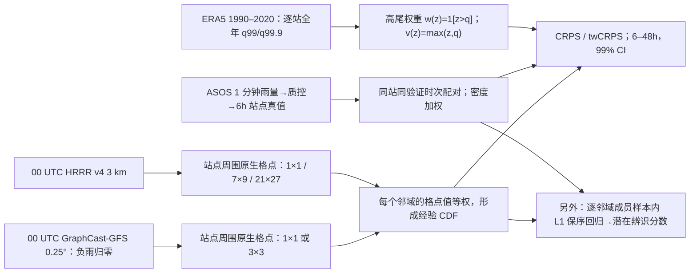

# 86｜HiRA × twCRPS：GraphCast-GFS 与 HRRR 的美国极端降水空间评测

> Nicholas Loveday、Tracy Hertneky，*Evaluating extreme precipitation forecasts: A threshold-weighted, spatial verification approach for comparing an AI weather prediction model against a high-resolution NWP model*。[arXiv:2510.25045](https://arxiv.org/abs/2510.25045)：**2025-10-29 v1**，2026-05-29 v2，**2026-09-08 v3**；本笔记以 [v3 正文/附录](https://arxiv.org/html/2510.25045v3) 为数值与措辞依据。[EGUsphere 2026-02-04 讨论页](https://egusphere.copernicus.org/preprints/2026/egusphere-2025-5796/)显示同行评议与作者回应，不把它误写成已发表于 GMD 的正式论文。[复现代码](https://doi.org/10.5281/zenodo.20438050)、[评测数据](https://zenodo.org/records/19672887)。阅读日期：2026-09-24。

## 研究问题与结论先行

全球 AI 模型的 0.25° 降水场和 3 km 对流解析 HRRR，若都拿最近格点与雨量站逐点比较，高分辨率系统中的**位移误差会被双重惩罚**：模式在邻处下了雨，站点恰好没下，既记一次虚警又记一次漏报。作者把某站周围的原生网格值视为等权**空间伪集合**，形成经验 CDF，再以全部阈值的 CRPS 或着重历史 99%/99.9% 大雨阈值的 twCRPS，统一验证 32 个月的 6h 降水。这样评估的是“预报员看到周围一片场后可形成的概率分布”，不是单一格点准确度，也不是模型本身训练出的时变集合。[引言/方法](https://arxiv.org/html/2510.25045v3)

在**近似相同物理覆盖范围**的邻域对照下，HRRR 的普通 CRPS 在全部报告 lead 更好；但聚焦极端的大雨 twCRPS，HRRR 只在较短 lead 更好，后段不保持显著优势。GraphCast-GFS 的重雨**原始幅度/出现频率明显偏低**，可其样本内保序中位数校准后的辨识能力在较长 lead 上有优势方向，v3 明确写明对应 24h 后差异**不显著**。不能用旧版摘要或不看置信区间的曲线改写成“AI 显著胜过 HRRR”。[§3–6、附图 9](https://arxiv.org/html/2510.25045v3)

## 原始数据、切分与预处理

| 数据环节 | 论文可核实的实际做法 | 复现与解释 |
| --- | --- | --- |
| 验证站点 | 美国本土 CONUS 的 ASOS **逐分钟降水**，聚合为 **6h 累积量** | 不是 ERA5 伪真值；图 1 显示站点分布，但正文未给可直接引用的站点总数，不能臆填。 |
| 站点质控 | 逐分钟累积 **>38 mm** 或 6h 累积 **>840 mm** 的值移除；每 6h 窗内有效分钟覆盖不足 **5 小时**则整窗缺测 | 阈值为原文援引世界纪录的基本异常值排除，不能当作更完整的仪器/时次 QC。 |
| 极端阈值 | 用 **1990–2020 ERA5 6h 降水**，按站点对应格点估逐站**全年** `q0.99` 与 `q0.999`，评估期阈值固定 | 站点本身历史不够长才借 ERA5；ERA5 阈值与雨量站分布可能不同，全年固定阈值也非季节条件。 |
| 模型起报 | **2022-01-01–2024-08-30** 共 **973 个 00 UTC** 起报、约 32 个月；以同一站、同一验证时次匹配有效案例 | GraphCast operational 曾微调至 2021，作者从 2022 开始以避开该资料；不代表 2022–2024 每个站点独立于一切再分析训练源。 |
| AI 预报 | NOAA GFS 分析初始化的 **GraphCast-GFS** 重报档案，原生 **0.25°**，6h 降水负预测截为 **0** | 此处不是 ERA5 初始化或 IFS 初始化 GraphCast；负雨截断是评测前的后处理，并非在本研究重新训练。 |
| 物理对照 | **HRRR v4**、原生约 **3 km**、小时更新，00 UTC 档最长 48h | 比较因此限定 GraphCast-GFS 前 **48h**，不能外推中期第 10–15 天。HRRR 雷达同化对 6h 暴雨可能重要，但作者只作可能机制推测，未做消融。 |
| 汇总/显著性 | 站点密度加权，权重可随缺报时次变化；先跨站求空间均值，再用 **Hering–Genton 修正的 Diebold–Mariano** 检验时间相关，图示 **99% 置信区间** | 不把密集站网区域当全国同权；方向性差异仍须看 CI，而非只看平均曲线。 |

资料链接与实现：v3 列明[ASOS 原始档](https://mesonet.agron.iastate.edu/request/asos/1min.phtml)、[HRRR 档](https://hrrrzarr.s3.amazonaws.com/index.html)、[GraphCast-GFS 档](https://noaa-oar-mlwp-data.s3.amazonaws.com/index.html)、[WeatherBench 2 ERA5](https://console.cloud.google.com/storage/browser/weatherbench2/data/era5)、[代码 Zenodo](https://doi.org/10.5281/zenodo.20438050)与[处理后数据 Zenodo](https://zenodo.org/records/19672887)；概率评分/统计实现用 `scores` Python 包 **2.5.0**。本笔记核对了论文公开流程，**未实际重跑 Zenodo 数据或脚本**。[§1、代码可得性](https://arxiv.org/html/2510.25045v3)

## 方法结构、参数与公平口径

*依据论文 §1–6 原创重绘的评测流程，并非论文原图。* 本篇**没有新天气神经网络训练或微调**；GraphCast-GFS 是现有权重加 GFS 初值重报，HRRR 是业务数值模式。本文未给可用于训练新 GraphCast 的优化器、学习率、batch、epoch、参数量或微调冻结范围，故这些字段**不适用/未披露**；不能因用户要求训练细节而虚构。唯一在评估环节拟合的是下文的样本内一维**保序中位数回归**，不是 GraphCast 微调。[§1.2、§6](https://arxiv.org/html/2510.25045v3)

### 原文表 1：空间范围匹配，不是分辨率消除

| 近似物理覆盖范围 | HRRR 3 km 网格点 | GraphCast-GFS 0.25° 网格点 | 用途 |
| --- | ---: | ---: | --- |
| 约 **3×3 km** | **1×1** | 无可比邻域 | HRRR 单格基准，最易受双重惩罚。 |
| 约 **21×27 km** | **7×9** | **1×1** | 相似覆盖范围的较小邻域对照。 |
| 约 **63×81 km** | **21×27** | **3×3** | 相似覆盖范围的较大邻域对照。 |

表内尺寸取自[原文表 1](https://arxiv.org/html/2510.25045v3)。GraphCast 经纬网格的公里长度随纬度变化，HRRR 矩形邻域只近似覆盖同一面积；不重网格化是这种**原生邻域产品**比较的定义，**并未控制有效分辨率、空间采样或消除网格尺度差异**。若要回答“相同空间尺度上哪个底座物理更好”，应另做共同网格/共同观测尺度实验。邻域越大，等权经验 CDF 成员数越多；这不是独立扰动生成的气象集合。[§2.3、§3](https://arxiv.org/html/2510.25045v3)

### 评分公式、统计拟合以及为什么用普通版而非 fair 版

对邻域 `N` 的 `M` 个原生格点预报 `x_m`，`F_N(z)=M⁻¹ Σ1{x_m≤z}`。普通 `CRPS(F_N,y)=M⁻¹Σ|x_m−y|−[2M²]⁻¹ΣΣ|x_m−x_j|`；上尾 `twCRPS` 将 `x,y` 先做 `v(z)=max(z,q)` 再用同式，相当于只积分 ERA5 站点阈值 `q` 以上的 CDF/事件指示平方差。**分数越小越好**，并且对每个站点时次都评分；未按“极端已发生”筛样，因此避免那类条件筛选的 forecaster's dilemma。[§2.1–2.2](https://arxiv.org/html/2510.25045v3)

v3 特别区分两种解释：若邻域格点值**本身就是被评估的有限经验 CDF**，用上述 `M²` 普通版；若把这些格点当成某个潜在总体预测分布的随机抽样，才可能用分母 `M(M−1)` 的 `fair CRPS/twCRPS` 修正成员有限性。但相邻格点高度空间相关，并非独立 ensemble 抽样；作者在**主实验选的是经验 CDF 与普通评分**。不要把公平修正公式和主分数混写，也不要说 fair 修正消除了网格尺度差异。[§2.2–2.3](https://arxiv.org/html/2510.25045v3)

另为区分**原始幅度准确度**和**排序辨识力**，作者对每个邻域成员分别用**样本内 L1 保序中位数回归**作单调校准，再算潜在 CRPS/twCRPS（图 7–8）。这不是 [#85 Gneiting 等](../medium-range/85-potential-crps-fair-weather-comparison.md) 在每格点使用的 EasyUQ/IDR 完整概率 CDF 最优回归，更不是 [#84](../medium-range/84-weighted-pcrps-extremes.md) 的 `twPCRPS` 同一指标。样本内真值已进入映射拟合，所以这种“潜在”结论不能作为未来业务时次的独立校准效果。[§6](https://arxiv.org/html/2510.25045v3)

## 图 1–9 的性能内容与反例

本稿的主结果在曲线和 CI 图中，**没有提供可逐时效精确抄录的数字表**。以下表将论文图注/正文的可核验方向、比较口径和反面证据成组列出，避免臆测像素读数。[§3–7](https://arxiv.org/html/2510.25045v3)

| 图 | 原文支持的结论 | 同时必须保留的限制 |
| --- | --- | --- |
| 图 1–2 | 图 1 给 ASOS 站网；图 2 解释高尾 twCRPS 的 CDF/阈值与 `max(z,q)` 变换。 | 图 1 未给可抄的站点总数；图 2 是评分示意，非模型成绩。 |
| 图 3：全部雨强 CRPS | HRRR 1×1 对 GraphCast 1×1 在**前 24h**较优，之后混合；按表 1 的近似同物理面积邻域比较，**HRRR 在所示各 lead 都较优**。两模型邻域放大后普通 CRPS 都改善。 | 不能仅凭“AI 点对点在部分 lead 接近/胜过”推断其空间产品更好；需保持同一比较面积。 |
| 图 4：`q0.99` 上尾 twCRPS | 单格对单格 GraphCast-GFS 所示全 lead 分数更低；同物理面积比较时 HRRR 只在较短 lead 优于 GraphCast，长 lead 不保持。HRRR 增大邻域带来的 twCRPS 改善明显大于 GraphCast。 | 普通 CRPS 与极端 twCRPS 的赢家不同；“HRRR 短 lead 优势因为雷达同化”是作者**推测**，未用关闭雷达的消融证明。 |
| 图 5：Brier 阈值分解 | **6h lead** 下，HRRR 对约 **<5 mm** 阈值的 Brier 较低；到 **30h lead** 只在部分邻域成立。高阈值下，HRRR 21×27 相对 GraphCast 3×3 在 6h 略优、30h 略弱。 | 普通 CRPS 积分受常见的小雨/无雨阈值主导，不能凭它替代大雨决策分析。 |
| 图 6：QQ | HRRR 单格的 6h 累积雨量分布更贴近站点；GraphCast 单格重雨频率明显偏低。HRRR 7×9 邻域**均值**也变平滑，但不及 GraphCast 的重雨弱幅明显。 | 因而 GraphCast 较优的 twCRPS 不等于其原始强雨强度或频率已校准；分辨率只解释部分偏差。 |
| 图 7–8：样本内保序后的潜在分数 | 普通潜在 CRPS：HRRR 7×9 对 GraphCast 1×1 各 lead 有更强辨识力；大邻域 HRRR 21×27 对 GraphCast 3×3 短 lead 有利、其后收敛。高尾潜在 twCRPS：**6h** HRRR 优，约 **24h 后** GraphCast 大邻域组合有优势方向。 | v3 明确说**24h 后的大邻域辨识差异不显著**；不是“AI 统计显著超越”。样本内映射更不是可部署离线校准。 |
| 附图 9：`q0.999` | 更严的站点历史尾部阈值下，HRRR 仅在 **6h lead、GraphCast 3×3 vs HRRR 21×27** 一组比较显著更优；50 mm 固定阈值的方向类似。 | 固定 50 mm 分数未展示原图，不能编出其曲线数值；极端更稀少，置信不确定性不容忽略。 |

图 3、4、7、8 的“正差”定义是 HRRR 分数更低/更好，图示 99% CI；因此仅把平均线落在某侧、却没有排除零的区域视为**方向而非显著胜负**。论文没有第 10 天、S2S 或全球站网实验；归入`notes/nowcasting/`的小时—2 天短期评测，不能算 GraphCast 中期降水技巧实证。[§3–7](https://arxiv.org/html/2510.25045v3)

## 版本差异、可复现性与阅读判断

- **版本措辞必须按 v3**：v1/v2 与其他索引摘要曾写“AI 在 24h 后辨识稍优”；v3 的 §6 增加了**该差异不显著**，且 §2.3 进一步区分经验 CDF 评分和有限样本 fair 评分。若只读旧摘要，会过度报告结论。[版本记录](https://arxiv.org/abs/2510.25045)、[v3 §2.3/§6](https://arxiv.org/html/2510.25045v3)
- **复现应报告三层口径**：单格 vs 单格、表 1 的两个近似面积配对；分别报告全阈值 CRPS、站点全年 q0.99/q0.999 尾部 twCRPS、以及样本内潜在辨识分数。保留逐站 QC、缺报、站点密度权重与时间相关检验，并在未来数据留出集重新测试保序校准。[§1–6](https://arxiv.org/html/2510.25045v3)
- **不等于彻底公平的同尺度物理对比**：原生格点、0.25° vs 3 km、GFS vs HRRR 初值、HRRR 雷达同化和不同空间有效分辨率一起变化；作者明说比较的是**具体邻域预报产品**。既不能说 GraphCast 获胜源自神经网络结构，也不能说 HRRR 普通 CRPS 获胜全源于解析度。[§2.3、结论](https://arxiv.org/html/2510.25045v3)
- **与其他极端论文的关系**：[ #82 AMSE-GraphCast](../medium-range/82-amse-graphcast-spectral-loss.md)改**训练损失**以减双重惩罚；本篇改**验证协议**，没有重训。[#83](../medium-range/83-record-breaking-extremes-zhang-2026.md)看历史破纪录的原始强度误差；[#84](../medium-range/84-weighted-pcrps-extremes.md)看全球 1–10 天单格潜在极端信息。本篇为 CONUS 6–48h 站点降水的空间伪集合，不能把三种结论拼成一个排行榜。
- **材料边界**：本笔记依据 arXiv v3 全文、表 1、图 1–9 正文与图注，并核对 EGUsphere 讨论页面及 Zenodo 代码/数据链接；未逐图数字化、未重跑代码，故不提供原文没有的精确 lead 数值。图为原创流程重绘，未转载期刊原图。EGUsphere 页面未显示正式接收/出版证明，故发表状态保持“预印本/讨论稿”。
