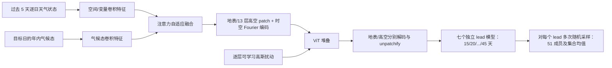

# TianQuan-S2S：气候态注意力融合与逐层随机扰动的 15–45 天预报

> Guowen Li、Xintong Liu、Yang Liu、Mengxuan Chen、Shilei Cao 等，*TianQuan-S2S: A Subseasonal-to-Seasonal Global Weather Model via Incorporate Climatology State*，arXiv:2504.09940，初版 2025-04-14；本笔记据 [v6，2026-03-12](https://arxiv.org/html/2504.09940v6) 阅读于 2026-09-24。该作已列入 [ICLR 2026 正式论文列表](https://iclr.cc/virtual/2026/papers.html)；[作者项目页](https://github.com/zhangminglang42/TianQuan)截至本次核对仍说明训练代码尚未公开。旧追踪表使用早期名称 “TianQuan-Climate”；以下实验数值以 v6 为准，不默认等同于会议定稿每项表格。

## 核心判断

本工作针对 15–45 天 S2S，不是把中期 6 小时步长无限滚动：输入最近 5 天状态与对应年内气候态，训练多个按目标时效单步输出的模型，再组合这些输出。气候态提供远期低频背景，Transformer 每层可学习噪声幅度以形成集合和减轻过度平滑。论文表 2 有一条必须保留的负面结果：**Wind10 的集合均值 RMSE 在 15–40 天均高于气候态基线**，所以摘要“总体优于气候态”不能扩展成所有变量。[摘要、表 2、讨论](https://arxiv.org/html/2504.09940v6)

## 1. 问题设定与模型数据流

作者认为 S2S 的可预报性同时来自初始大气状态与缓慢变化、季节相关的气候背景。只靠初值，到两三周后高频天气细节会失去可预报性；只回归到平均气候态，又会让异常型态与局地信息消失。模型取过去 5 天逐日状态，使用 1979–2016 资料生成 366 个年内日气候态，对输入场与气候态各做卷积特征提取，再用注意力权重自适应融合，而非固定相加。[第 2–3 节、图 2](https://arxiv.org/html/2504.09940v6)

融合后把地表和 13 层高空变量分 patch，加经纬度与时间 Fourier 编码送入 ViT；时间 Fourier 波长范围在正文给为 1–365 天。每个 Transformer block 除确定性注意力更新，还加入由网络 $g_n(E)$ 学得幅度的高斯噪声，即 $E_{n+1}=E_n+h_n(E_n)+g_n(E_n)\epsilon$。与仅扰动初始场不同，这个噪声贯穿深层表示，旨在长时效维持样本多样性。输出侧把地表 token 和各高空层 token 分开线性解码、unpatchify 还原物理变量，损失为纬度加权 MSE。按 15、20、25、30、35、40、45 天分别训练对应单步模型；因此这不是单个“任意 lead 通用模型”，且多模型输出的一致性值得检查。[第 3 节、附录 D](https://arxiv.org/html/2504.09940v6)

### 图：依据原文图 2 与第 3 节事实重绘

下图是本仓库自行绘制的机制示意，非原图截图或视觉改图。[原文图 2](https://arxiv.org/html/2504.09940v6)

## 2. 数据、基线、成员数与可比性

### 2.1 数据来源、时间聚合、空间处理与切分

ERA5 原始资料为全球**逐小时**再分析，选 1979–2018。论文正文说取 00/06/12/18 UTC 四个时点求逐日均值，附录 F.4 先重复四时点描述，但紧接着的式 (12)–(13) 又令 $T=24$，写成连续 **24 个逐小时值**的平均；“前一日 23 点到当日 00 点”的文字示例也不足以消除歧义。因此不能确定公开实验究竟按 4 点还是 24 点实现，若复现必须向作者代码/权重核实，且保证训练、气候态和验证集使用相同口径。10 米风速是先对每时刻 $u,v$ 求 $\sqrt{u^2+v^2}$ 再平均，不是先对 $u,v$ 分别日均再求模。[第 4 节数据、附录 F.4 式 12–13](https://arxiv.org/html/2504.09940v6)

作者报告通过**双线性插值**生成两种全球网格：1.40625°（128×256）和 5.625°（32×64）。训练输入是最近 **5 个逐日状态**，还使用地形、海陆掩膜等静态信息；预测目标是第 15–45 天的指定 lead。正文说选取 13 个气压层；附录表 6 写默认 **67 个变量**，若把五个高空量 Z、Wind、T、Q、R 各取 13 层再加 T2m、Wind10，可算出 67，但附录表 10 给这五项的层值合计仅列 **13 个层—变量组合**（Z: 50/100/150；Wind: 200/250/300；T: 400/500/600；Q: 700/850；R: 925/1000）。这两处无法直接还原一致的通道清单，尤其 Wind 字段究竟是速度模还是水平分量也未写透，不能据此伪造完整输入张量。表 10 另列海陆掩膜和地形，未说明它们是否计入 67。[第 2/4 节、附录 C.2 表 6、F 表 10](https://arxiv.org/html/2504.09940v6)

按年份划分为训练 **1979–2015**、验证 **2016**、测试 **2017–2018**。366 个年内日气候态使用 **1979–2016** 的 38 年资料，故气候态统计**包含验证年**，但不包含测试年；这不是说标签直接用于优化训练权重，却要求比较模型采用一致的背景资料。日均化与较粗网格会削弱小时级和小尺度极值，不能与原生 0.25°/逐 6 小时中期业务结果直接同排行。[第 2 节气候态、第 4 节数据](https://arxiv.org/html/2504.09940v6)

### 2.2 模型规模、训练流程与已披露超参数

作者不是先在大模型上预训练再微调：附录 D 表 7 对 TianQuan 的 **Pretrain** 明标 ×，而是按目标 lead 分开训练；附录另有一个**单模型自回归＋scheduled sampling 微调**的对照实验，不是主模型七条分支的既定微调流程。主模型 $PM_K$ 从同一组最初 5 天输入直接预测目标 $K$ 天，彼此不依赖先前模型输出；附录 D 式 (11) 对每个 $K$ 还写成 5 天目标段 $X_{t-4+K:\,t+K}$，但正文称“单步预测”，具体每日/五日输出及拼接协议需核对，不能默认为连续 15–45 天每日无缝预报。[附录 D、表 7–8](https://arxiv.org/html/2504.09940v6)

公开的结构与优化设置如下；没有披露的项目单独标出，不据 GPU 容量倒推 batch 或参数量。[第 3–4 节、附录 C.2 表 6](https://arxiv.org/html/2504.09940v6)

| 项目 | 论文披露值及含义 |
| --- | --- |
| 主干 | UD-ViT，**8** 个 block、隐藏维 **384**、**12** 个 attention head；drop path **0.1**、dropout **0.12** |
| 卷积与融合 | 气候态独立卷积提特征；初始场空间/通道卷积分支，按位置注意力加权融合；patch 宽度和卷积核/层数未给出可独立核验的完整配置 |
| 随机层 | 每个 Transformer block 加 $g_n(E)\epsilon$，$\epsilon\sim\mathcal N(0,I)$；图 6 显示噪声尺度 $\sigma\approx1$ 较好，但具体采样种子、训练/推理激活配置未完整披露 |
| 目标函数 | 各变量、格点的纬度加权 MSE；纬度权重 $\cos(\phi_i)$ 以全球行均值归一；没有从正文得到变量间单独权重 |
| 优化器 | AdamW；$\beta_1=0.9,\ \beta_2=0.99$；权重衰减 **1e−5**，位置嵌入除外；初始/峰值文中只写学习率 **5e−5** |
| 学习率日程 | 线性 warmup **5,000 步/5 epoch**，余下 **95,000 步/95 epoch** 余弦退火；这是文中报告的调度，不能无依据乘七解释为全部训练更新总数 |
| 硬件/框架 | PyTorch、**8×80 GB GPU**；论文写 77.6 TFLOPS，但未清楚界定是单卡、集群或测量口径 |
| 未披露或需复核 | 每卡/全局 batch、梯度累积、混合精度、patch size、参数总数、随机种子、每个 lead 的独立训练时长/成本、是否有额外归一化或变量裁剪/缺测处理 |

作者项目页在本次阅读时仍只给仓库说明和“训练代码待公开”，所以这些缺项不能从现有公开实现验证。论文把独立模型按 15/20/…/45 天组合，七次训练和七次推理的总成本与单模型方法的成本不可混为一谈。[项目页](https://github.com/zhangminglang42/TianQuan)

### 2.3 推理、集合协议与评分口径

确定性比较用一次输出；集合试验作者描述为原始成员加 50 个随机扰动，共 **51 成员**，并引入各层随机噪声。原文既说“50 扰动加入未扰动初态”，又突出“每层可学习噪声”，没有完全明确两种扰动如何在 51 成员中联合施加。ClimaX 通过扰动初始状态做集合，FuXi-S2S 原有集合机制不同，因而必须核对成员数、初始化、后处理与同一验证期，不能只看一个 CRPS 说某种概率机制必然更强。正文图 3 对 **2017–2018** 的两种网格评估确定性 RMSE/ACC；表 1–2 的集合指标列至 **40 天**（FuXi-S2S 未给 45 天），不能把表 3 的 45 天消融当作 FuXi 同场对比。附录 G 对 ACC 的 $C$ 又写成“整个测试集真值的时间平均”，与模型输入的 **1979–2016 年内日气候态**不是相同统计量，复现评分时应分别实现与报告；不能反推模型训练用了测试标签。[第 4 节图 3/表 1–3、附录 G](https://arxiv.org/html/2504.09940v6)

## 3. 关键性能表：好结果与坏结果都保留

以下选摘原文 [表 1–3](https://arxiv.org/html/2504.09940v6) 的明确单元格。RMSE/CRPS 越低越好，ACC 越高越好；不同表的“单次预测”“集合均值”“概率评分”不能直接互换。Z500 的表 3 是消融设置，数值口径与表 2 集合均值不相同。

| 表/指标与变量 | Lead | 对照 | TianQuan-S2S | 读法 |
| --- | ---: | ---: | ---: | --- |
| 表 1，T2m CRPS | 15 天 | FuXi-S2S **2.238** | **2.256** | 这一格略差于 FuXi，非“全面领先” |
| 表 1，T2m CRPS | 30 天 | FuXi-S2S **2.359** | **2.297** | 较长 lead 优势出现 |
| 表 2，T2m 集合均值 RMSE | 30 天 | FuXi-S2S **2.520**；气候态 **2.610** | **2.502** | 两项对照均优，但差距不大 |
| 表 2，Z500 集合均值 RMSE | 30 天 | FuXi-S2S **807**；气候态 **820** | **798** | 大尺度场有改善 |
| 表 2，Wind10 集合均值 RMSE | 30 天 | FuXi-S2S **3.678**；气候态 **2.430** | **3.711** | 差于两者，重要失败项 |
| 表 3，Z500 单模型消融 RMSE/ACC | 45 天 | 无噪声且无气候态：**1048 / 0.441** | 全模型：**921 / 0.535** | 联合设计长 lead 增益明显 |

作者正文称第 45 天 Wind10 ACC：ClimaX **0.172**、ECMWF-S2S **0.112**、TianQuan **0.297**。这个“比基线高”与 Wind10 集合均值 RMSE 差于气候态并不矛盾：ACC 是异常空间相关，RMSE 是量值误差，且比较对象也不同。另一个值得警惕的表述是正文“集合均值 RMSE 在 T2m/T850/Z500 高于气候态基线”按上下文应理解为**技巧更高/误差更低**，不能把“RMSE 数值高于”照字面复制；表 2 的具体数值才是准绳。[结果 4.1、表 2](https://arxiv.org/html/2504.09940v6)

## 4. 消融、诊断与科学局限

表 3 对 Z500 45 天的比较显示：只去噪声为 RMSE **940**，只去气候态为 **972**，两者都去为 **1048**，全模型 **921**；在该设置下两个模块均有贡献且存在叠加收益。不过“气候态帮助远期”的陈述还要在每个变量和区域上验证，不能仅由 Z500 与 T2m 的消融推到全部变量。表 4 比较了直接拼接、门控、只扰动初值、固定层噪声和不同注噪层数；全模型在该表所列 T2m/Z500 指标较优，但不同方案的模型容量/训练预算须复核。[表 3–4](https://arxiv.org/html/2504.09940v6)

Figure 4 的 30 天地图说明模型不只输出均值平滑场，Figure 5 的点散图比较相关与偏差；但少数时刻的视觉例子不能代替多年极端事件、MJO/ENSO 遥相关或区域雨量评估。模型第 15 天才开始预测，因此它补充的是中期之后的 S2S，不应与 0–10 天模型逐日同场比较。更关键的是：气候态对风的强基线仍难超越，若只挑 T2m/Z500 会高估跨变量泛化。[第 4 节与附录](https://arxiv.org/html/2504.09940v6)

复现建议：固定训练年、366 日气候态和逐日平均口径，公开每个目标 lead 的独立模型及参数量；逐变量画 lead–RMSE/ACC/CRPS 和 spread–skill，并在强风/温度极端、不同纬带、不同季节单独评分。还应加入同成员数、相同训练成本的“只用气候态”“只扰动初值”“无逐层噪声”对照，量化性能收益相对七模型总计算开销是否值得。

[返回仓库首页](../../README.md) · [返回总追踪表](../../气象大模型_中期预报论文追踪.md)
