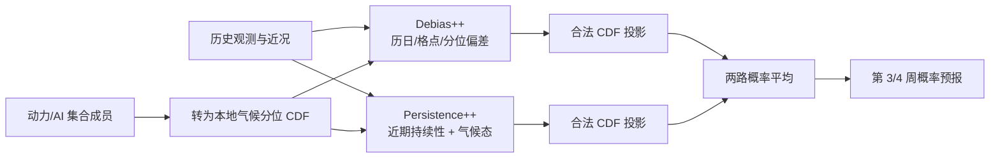

# PBC：把 S2S 集合预报的系统偏差当作可学习的概率问题

> Hannah Guan、Soukayna Mouatadid、Paulo Orenstein、Judah Cohen、Haiyu Dong 等，*Advancing Subseasonal Forecasting with Machine Learning*，[arXiv:2604.16238v3](https://arxiv.org/html/2604.16238v3)，2026-09-04。v1 2026-04-17、v2 2026-07-10 的题名为 *Enhancing AI and Dynamical Subseasonal Forecasts with Probabilistic Bias Correction*；**v3 已改题**，以下以 v3 和[作者代码固定提交 7f9b957](https://github.com/mouatadid/pbc/tree/7f9b95754ef68e205beb687fd60bf939bbfc6998)为准。2026-09-25 再核。状态：预印本，勿把竞赛报告混同于完整独立复验。

## 1. 为什么值得读

许多长滚动模型越过两周后出现气候漂移和集合分布偏移。本文不重新训练天气动力核心，而是研究“原始集合中尚存的 S2S 信号如何被校正并显露”。PBC（probabilistic bias correction）直接在**预测分布的累积分布函数 CDF**上学习修正，而非只调整集合均值。论文核心评测是第 3 周 **19–25 天**和第 4 周 **26–32 天**、1.5° 全球网格的 T2m、降水和海平面气压；这属于中期后的 S2S，不是 10 天确定性格点预报。[v3 引言、Results 2.1](https://arxiv.org/html/2604.16238v3)

其结果说明：预报器的架构性能与后处理性能不能混为一谈。对论文中的 AIFS-SUBS，PBC 使 2025 年三变量、两时效平均 RPSS 从约 **0.03 翻倍**；这是在很低正技巧基线上的相对倍数，不能说绝对 RPSS 增加 1.0。对业务动力集合，作者报告相对已业务订正版本在 **98% 降水、91–92% 温度、89–91% 气压格点**提升；摘要的 91%/92%/98% 是按气压/温度/降水目标概括，精读时应引用正文按 week 的范围。[v3 图 2–3](https://arxiv.org/html/2604.16238v3)

## 2. 方法机制

首先把动力/AI 集合成员相对于当地、当季气候五分位阈值转为每个阈值的 CDF 概率：五个区间对应四个有限阈值，末阈值为 $+\infty$。Debias++ 估计按格点、历日和分位阈值变化的概率偏差，使用过去 20 年同季节历史并在最近 3 年选择时窗。Persistence++ 将原集合 CDF、两个最近已验证的观测指示量及 20 年概率气候态做逐格普通最小二乘，抓住近期持续信号。两路输出先截到 $[0,1]$，再经**保序回归**投影成单调有效 CDF，最后等权平均。逐次拟合只接触在目标日期前、按该 lead 已经完全可观测的数据，以模拟业务发布。[v3 图 1、Methods 4.3/Algorithms 1–2](https://arxiv.org/html/2604.16238v3)

### 方法图（依据原文图 1 与 Methods 自行重绘）

这不是原图翻录；图中省略了不同变量使用观测分位还是模式 hindcast 分位等实现分支。业务竞赛版本 **MicroDuet** 进一步组合 PBC-ECMWF 与 PBC-PoET：2024 验证期选定的权重是温度二者等权、降水仅 PBC-ECMWF、气压仅 PBC-PoET。因此“MicroDuet 的竞赛成绩”并非一个单独 PBC 基模型的普适成绩。[v3 Methods 4.3.4](https://arxiv.org/html/2604.16238v3)

### 2.1 两支算法究竟如何“训练”

**Debias++ 是滑窗经验偏差估计，而非梯度训练的神经网络。**针对目标日 $t^*$、lead $\ell$、格点 $g$、CDF 阈值 $k$，它从历史预测与验证事件的差值 $O-F$ 估计概率偏差，把该均值加回目标概率。历史最多 **20 年**；同一历日左右候选宽度 $s\in\{14,28,35\}$ 天，发行日混合范围 $d^*=1$，即作者实际候选 $(s,d^*)$ 只有 **(14,1)/(28,1)/(35,1)**。在目标日前最近 **3 年**比较各候选的平均 RPS 选配置，然后按该配置对目标格点/阈值校正并裁剪到 $[0,1]$。论文没有报告 SGD、学习率、batch 或网络层数，因为此支不使用这些组件。[Methods 4.3.1、Algorithm 1](https://arxiv.org/html/2604.16238v3)

**Persistence++ 是每格点、每 CDF 阈值的五特征最小二乘。**回归特征依次为常数 1、同月同日的过去 **20 年**滚动观测指示量均值、两次已完成验证的滞后指示量、当前集合 CDF。若历史气候指示量缺测，以无技巧先验 $k/K$ 填补；拟合目标为相应历史周的实况是否低于第 $k$ 阈值。Algorithm 2 给第 $\ell$ 天目标的两个滞后位置为 $t-\ell-L+1$ 与 $t-2\ell-L+2$，其中周长 $L=7$；但本节说明文字另写 $t-\ell+6$ 与 $t-2\ell+5$，**符号相反**，而后者可能碰到发行时尚未完整验证的周，复现必须按“当时完全可见”的时序约束核实实现。系数按格点和阈值分别求解，原文没有岭惩罚、AdamW 或批量微调的披露，不能把 PoET 的神经网络训练参数归给 PBC。[Methods 4.3.2、Algorithm 2](https://arxiv.org/html/2604.16238v3)

两支输出有时会使高阈值 CDF 低于低阈值 CDF；作者用平方误差意义下的保序投影修复单调性，再逐阈值平均。这个步骤只是保证合法概率及减小相应投影误差，不等于原始天气集合成员被重新物理积分；产品是**分位事件概率**，不是新的连续风温压降水场或原生集合轨迹。代码 README 的[执行示例](https://github.com/mouatadid/pbc/tree/7f9b95754ef68e205beb687fd60bf939bbfc6998)按四个有限分位分别运行 Debias++ 调参→投影，以及 Persistence++→投影，最后合并成 PBC；重现实验还依赖 CDS 与 IRI/ECMWF 资料凭证、对应 hindcast 档案，不能将开源脚本存在等同于数据开箱即得。

## 3. 数据、对照和指标

真值为 **1979–2026 ERA5** 重网格到 **1.5°×1.5°**；T2m/MSLP 取目标周平均，降水取目标周总量。温度/降水只评分陆地占比 ≥50% 的格点；降水第 80% 气候分位仍为零的干旱格点排除。每个目标日/格点的观察气候五分位用**过去 20 年**的同月日及相差 **2、4 天**的历史样本定义，避免用测试目标之后的实况。概率评价为纬度余弦加权 RPS 相对均匀五分位气候态的 RPSS；**RPSS>0 才优于气候态**，所以低正技巧的“翻倍”与绝对可预测性增强要分开。极端事件改用 20 个 5% 分位阈值和 Brier skill score（BSS）。默认历史测试集是 2016–2024 年、排除闰日的**周一和周五目标日**，第 3 周为目标前 **19–25 天**、第 4 周为 **26–32 天**。[v3 Methods 4.1](https://arxiv.org/html/2604.16238v3)

| 数据/基线 | 论文中的实际处理与评估期 |
| --- | --- |
| ECMWF 原始动力集合 | S2S/IRI 周聚合资料：**2015-05-14 至 2023-06-26** 周一、周四发行，共 **51 成员**（1 控制＋50 扰动）；**2023-06-28 起**每日发行，扩为 **101 成员**。以观测气候阈值把成员计数变 CDF。版别与发行频率改变，历史样本不能当恒定成员数序列 |
| ECMWF 业务 hindcast 订正 | 每目标日期近旁 **前 4＋当期最近 1＋后 4** 个可用发行日期，叠加各自过去 **20 年×11 成员** hindcast 求模式气候分位；同一原始预测在**模式分位阈值**下计 CDF。它与按观测阈值算的 raw ECMWF 不是同一概率基线 |
| FuXi-S2S | 官方 **51 成员**预测 2017–2021、对应 2002–2016 hindcast；每日输出先对周内降水累加、T2m/MSLP 平均，再用匹配历日的模式 hindcast 五分位生成 CDF。与 ECMWF 发行日大多**不重合**，不能视为完全配对实验 |
| AIFS-SUBS | 本文所用版本 2025 年**奇数日（去每月 31 日）**发行、各周 **100 成员**；各目标日以之前 **20 年×10 成员** hindcast 建模式分位；该版本报告在 ERA5 **1979–2006、2012–2024** 训练并留五年验证，不可把 PBC 结果归因于本文重新训练 AIFS |
| PoET | 是**独立神经网络预处理基线**：2024 发行的 ECMWF hindcast 中，**2004–2022** 训练、**2023** 验证；S2S 改版用周聚合、36 个 ERA5 静态场和周平均太阳辐射，约 **27M 参数**；温度/气压用多任务版、降水用单任务版。2024 的 100 个扰动成员经 PoET 后再作为 PBC 输入，不是 PBC 自身 27M 参数 |

PBC 输入的分位基准按分支不同：Debias++ 使用**观测阈值**；Persistence++ 对 PoET 及 ECMWF 降水也用观测阈值，其他应用使用**模式 hindcast 阈值**。复现必须连同每个来源的集合大小、周累积/周均、模型版别和阈值定义保存，不能只保存最终 RPSS。[v3 Methods 4.2–4.3](https://arxiv.org/html/2604.16238v3)

历史动力评测覆盖 2016–2024（图 2，**939** 个目标周）；AIFS-SUBS 结果针对 2025（图 3a，**179** 个目标周）；PoET 对比是 2024（图 3b，week 3 **104**、week 4 **107** 个目标周）。不能把这些不同年份的 RPSS 直接做跨模型统一排名。AI Weather Quest 的 2025 秋季榜单是实时提交，以 **ERA5-T** 对周一目标日评分，代表较强外部时间验证，但仍需以竞赛协议、目标和评分格点为界；作者统计显著性主要用成对单侧静止块 bootstrap、自动块长和 **5,000** 次重复，竞赛两季比较另用配对 Wilcoxon。[v3 Results 2.2–2.4、Methods 4.4/Statistical methods](https://arxiv.org/html/2604.16238v3)

## 4. 原文图表结果：相对改善的分母须清楚

下表据[v3 图 2–5 与正文](https://arxiv.org/html/2604.16238v3)重排；百分比是论文给定条件下的**相对技巧改善或受益格点比例**，不是命中率，也不是无条件的绝对 RPSS。

| 图/试验 | 作者报告 | 必须同时说明 |
|---|---|---|
| 图 2：ECMWF，2016–2024 | 原始集合降水正 RPSS 基线 **0.023**，PBC 使其约 **3 倍**；对已业务订正版本，温度提升 **26–37%**（原基线 0.07–0.10）、气压提升 **16–32%**（原基线 0.06–0.11） | 原始与已订正基线不同；不能把“3 倍”用于后者 |
| 图 2：空间广度 | 对已业务订正 ECMWF，降水 **98%**、温度 **91–92%**、气压 **89–91%** 格点 RPSS 提升 | 格点比例不是每格统计显著，也不覆盖被排除的干旱降水格点 |
| 图 3：AIFS-SUBS，2025 | 三变量/两时效平均 RPSS 从 **0.03 约翻倍** | 平均低基线；应进一步看变量和区域 |
| 图 3：PoET，2024 | PBC 后降水 **+68–98%**（PoET 基线 0.03–0.04）、气压 **+15–23%**（0.08–0.10）、温度 **+5–7%**（0.16–0.19） | 已过 AI 后处理的强基线也受益，但不同变量相对百分比不可直接比较价值 |
| 图 4：AI Weather Quest | MicroDuet 在 2025 秋季三变量与第 3/4 周均列第一；随后冬季第 3/4 周亦第一 | 组合权重在 2024 选定，随后实时竞赛验证；仍限竞赛设置 |
| 图 5：极端与洪水 | 第 3 周极端预报中降水 **96%**、气压 **89%**、温度 **85%** 格点改善；GDACS 洪水框选降水 BSS 较原始 ECMWF 改善 **76–92%** | 极端定义为 >95/<5 分位；洪水以 20°×20° 框内极端降水代理，非完整水文预报 |

图 2 与扩展图显示，单独 Persistence++ 对降水很重要，Debias++ 对分布校准也有增益；投影修正本身通常贡献很小，互补分支平均更稳。这是可解释的消融，不应把所有增益归因于更复杂神经网络。[v3 Extended Data Fig. 7](https://arxiv.org/html/2604.16238v3)

## 5. 阅读判断与复现清单

这篇工作的关键贡献是把第 3/4 周的模式偏差拆成“历史可学习”和“近期可持续”两部分，并用简单、可每日增量更新的模型校准**完整概率分布**。与训练更大天气基础模型的路线相比，它对现有动力/AI 集合更易接入；但若原始集合根本没有可预测信号，统计修正不能无中生有。其优势也依赖稳定的 hindcast 档案、及时验证资料和气候分位定义；在业务改版、观测漂移、长尾新极端或非平稳气候下需持续再评估。[v3 Discussion、Methods](https://arxiv.org/html/2604.16238v3)

建议复现时固定 arXiv **v3**、ERA5/ERA5-T 版本和发布日期，分别报 raw ECMWF、业务订正、单分支 PBC、双分支 PBC 与 MicroDuet；按年份/季节/区域、干旱格点过滤前后拆开 RPSS；用相同发行日历重做与 FuXi-S2S 的公平对照；洪水评估增加独立雨量/径流真值和置信区间。作者已给出[PBC 开源代码](https://github.com/mouatadid/pbc)，但复现实验前仍需核对其 commit 与依赖数据可得性。

[返回仓库首页](../../README.md) · [返回总追踪表](../../气象大模型_中期预报论文追踪.md)
