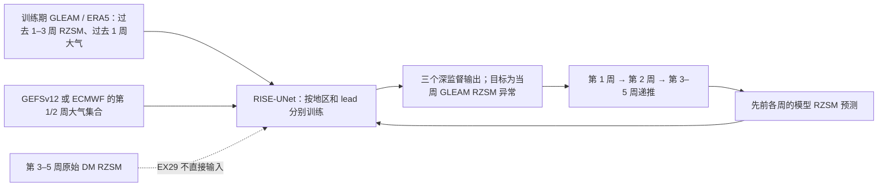

# RISE-UNet：动力集合与土壤水记忆结合的第 1–5 周干旱预报

> Kyle Lesinger、Di Tian，*Skillful subseasonal soil moisture drought forecasts with deep learning-dynamic models*，*Nature Communications* **16**, 7461，**2025-08-12**，[正式开放全文](https://www.nature.com/articles/s41467-025-62761-3)，[DOI](https://doi.org/10.1038/s41467-025-62761-3)，[正式补充材料（表 S1–S6、图 S1–S13）](https://media.springernature.com/original/springer-static/esm/art%3A10.1038%2Fs41467-025-62761-3/MediaObjects/41467_2025_62761_MOESM1_ESM.pdf)，[作者代码/数据说明（OSF）](https://osf.io/6y4kh/)。本笔记依据正式正文和 20 页补充材料核对，阅读于 2026-09-24。

## 一、问题与结论：预报的是土壤水异常，不是全球天气场

根区土壤水分（RZSM）保留前期降水与蒸散的信息；动力模式的降水误差却会在第 3 周之后累积，使直接输出的 RZSM 和骤旱事件难以可靠预测。作者研究的目标是 **0–100 cm RZSM 周平均季节异常**，分别为第 1–5 周训练区域神经网络，并比较纯再分析 DL、GEFSv12/ECMWF S2S 动力集合、统计后处理、神经网络偏差订正及混合 DL–DM。主结论是混合模型在美国本土第 3–4 周的异常相关和概率误差上通常优于原动力集合/后处理，并可迁移研究思路到中国和澳大利亚；这里的“迁移”是**重新训练区域模型**，并非直接零样本跨域预测。[摘要及结果](https://www.nature.com/articles/s41467-025-62761-3)

这篇属于 **S2S**：第 1–2 周是作为延长到第 3–5 周的前导信息，第 3–4 周是核心证据；第 5 周和骤旱极端的结果需要更谨慎地看。它不是 10–15 天全球大气基础模型，也没有证明神经网络直接改善了气温、降水或环流场。[图 1–8](https://www.nature.com/articles/s41467-025-62761-3)

## 二、资料来源、配准与防泄漏边界

| 数据链 | 原文与补表设置 | 对训练/比较的影响 |
| --- | --- | --- |
| 目标 GLEAM v3.8a | 1999-12 至 2020-02 的日 RZSM；0–10 cm 表层与 10–100 cm 根区按深度合成 `0.1×表层 + 0.9×根区`，统一到 0.5°、7 日滚动平均。GLEAM 综合卫星土壤水资料与陆面/气象输入，并非地面原位观测。 | 训练与验证都以 GLEAM 为“真值”，所以评分是对产品一致性，不是完全独立的地下实测验证。 |
| ERA5 再分析 | 小时资料覆盖 1999-10 至 2020-02；使用露点、最高/最低气温、整层可降水量、地面气压、200 hPa 位势高度等，另由最高减最低气温得日温差，露点与气压推算近地面比湿；土壤层按深度合成 0–100 cm。重网格至 0.5°并做 7 日滚动平均。 | 作为历史大气/RZSM 输入，不是未来可用的动力模式预报；必须按起报时刻截断。 |
| GEFSv12 回报 | **2000–2019**，每周三起报，共 **1043** 个起报；**11** 成员、至 **35 天**。前 10 天 0.25°/3h，后续 0.5°/6h，先做日均再与 0.5°周窗对齐；0–10、10–40、40–100 cm 三层按厚度加权为 0–100 cm。气象字段包括最高/最低温、Z200、比湿等。 | 保留成员而非先平均；2020–2022 因动力系统版别变更被排除，不能把不同版本混成同分布测试。 |
| ECMWF S2S 回报 | **11** 成员，原约 1.5°、至 45 天；本文只取前 **35 天**，包含日平均气温、整层水汽、露点/RZSM 等。RZSM 用守恒插值到 0.5°，大气变量用双线性插值。 | 与 GEFS 的起报日不完全相同，作者按**有效日期**匹配；第 4 周 1–2 天差异影响较小，但第 1 周严格逐日起报公平性下降。 |
| 区域与季节异常 | 美国本土、中国、澳大利亚分别处理，空间样本为 **48×96** 个 0.5°像元。以 **2000–2015 训练年**的 DJF/MAM/JJA/SON 均值计算季节异常，海洋/水域无效像元置零；异常再按**训练期**极值做 min–max 缩放。 | 不把验证/测试季节均值或 extrema 回流训练；测试值越过训练极值时可能超出 0–1，论文未说明额外裁剪。 |
| 数据划分 | **2000–2015 训练、2016–2017 验证、2018–2019 独立测试**。补表 S3 报 **9185/1144/1144** 个训练/验证/测试成员样本，测试对应约 104 个起报×11 成员。 | 样本并非 1144 个独立天气事件：同一起报 11 成员相关，空间像元也相关；显著性应按起报/季节分块理解。 |

正文描述的归一化和验证年份，须与补表 S3 的样本数一起读；特别是整套预处理不能拿 2018–2019 统计量计算训练气候态。[Methods/Materials and data](https://www.nature.com/articles/s41467-025-62761-3)、[补表 S3、S5、S6](https://media.springernature.com/original/springer-static/esm/art%3A10.1038%2Fs41467-025-62761-3/MediaObjects/41467_2025_62761_MOESM1_ESM.pdf)

补表 S5 的 CONUS 和中国框的**南边界分别印成 26.5°S 和 20.5°S**，与美国/中国及 48×96 的 0.5°框明显不符；预期应为北纬，但这里不静默改写原表。复现时要先核对作者代码的框坐标。补表 S6 明确定义预测周窗：week 1–5 分别是起报后 **1–7、8–14、15–21、22–28、29–35 日**；过去 lag 1–12 周覆盖起报前 1–84 日。[补表 S5–S6](https://media.springernature.com/original/springer-static/esm/art%3A10.1038%2Fs41467-025-62761-3/MediaObjects/41467_2025_62761_MOESM1_ESM.pdf)

## 三、实验设计：EX29 为何与“直接动力订正”不同

模型名称 RISE-UNet 指 residual、inception、squeeze-and-excitation 的 UNet++。作者设置多组实验，补表 S1 是输入配置而非附带说明；若不按表区分，容易将第 3–5 周成绩误解释为“读取对应周的动力预报后做偏差订正”。[正文图 1、补表 S1](https://www.nature.com/articles/s41467-025-62761-3)

| 路线 | 输入与监督关系 | 科学问题 |
| --- | --- | --- |
| 原始 DM：GEFSv12、ECMWF S2S | 直接读取自身 RZSM 集合，以 GLEAM 对照 | 物理集合的未订正基线。 |
| DM-BC_EMOS：EX30–33 | 对 DM RZSM 集合做 ensemble model output statistics | 统计均值/离散度校准能补多少。 |
| DM-BC_DL：如 EX0/EX13 | 用 RISE-UNet 读取 DM 的 RZSM 做神经网络后处理，不叠加历史再分析。 | “只订正动力预报”与混合特征的区别。 |
| DL：如 EX24 | 只使用历史 GLEAM/ERA5 及可能的递推 RZSM；不使用将来 DM。 | 土壤水记忆本身可否支撑第 3–4 周。 |
| DL–DM：EX29_G / EX29_E | 分别以 GEFSv12 或 ECMWF 为动力输入，历史 GLEAM RZSM lag 1–3 周、ERA5 大气 lag 1 周、此前各周的**模型自身 RZSM 预测**共同入网。仅第 1/2 周另外读相应周 DM 大气；**第 3–5 周无该周直接 DM 大气/RZSM 输入**。 | 前两周动力信号与历史陆面记忆，经递推传到第 3–5 周能否胜基线。 |

因此第 3 周 EX29 的“混合”能力主要由第 1–2 周 DM 天气信号、前期 RZSM 和递推土壤水预报传递，不是拿第 3 周 GEFS/ECMWF RZSM 直接回归。作者对每个**地区×预测周**分别训练网络；EX29_G 与 EX29_E 是两套模型，不是训练后把 GEFS 权重微调成 ECMWF 权重。补图 S1 的 22 成员 GEFS+ECMWF 组合也未明显增进 ACC，集合成员叠加本身并非增益来源。[补表 S1、补图 S1、正文图 2–3](https://media.springernature.com/original/springer-static/esm/art%3A10.1038%2Fs41467-025-62761-3/MediaObjects/41467_2025_62761_MOESM1_ESM.pdf)

图为依据正文图 1 和正式补表 S1 **独立重绘**的 EX29 信息流；虚线是排除项，不代表模型内部存在该连接。第 1/2 周的具体大气通道随 GEFS/ECMWF 可用字段变化，不应把两套动力资料视为逐变量完全相同。

## 四、网络结构、训练流程及微调边界

输入张量是 `(成员样本, 48, 96, 通道数)`，通道数由实验/预测周决定。四层编码器滤波器数依次 **32/64/128/256**，将 48×96 下采样至 6×12；每个 RISE 模块并联 **3×3、5×5、7×7 卷积和 5×5 池化**，拼接后经归一化、ReLU、1×1 卷积、残差及 squeeze-and-excitation 门控。UNet++ 的嵌套密集跳连把多尺度上下文重新上采样至原网格，**三个深监督输出**各自计算损失；编码器第 1 层 dropout **0.1**、其余三层 **0.25**。这不是全球球面网络：区域裁剪/卷积边界和训练区的物理差异都会影响外推。[正文 Methods / 图 1、补表 S2–S3](https://www.nature.com/articles/s41467-025-62761-3)

| 训练设置 | 已公开具体值 | 不应推断的部分 |
| --- | --- | --- |
| 独立模型 | 各周 1–5 分开训练；中国、澳大利亚也分别**重新训练** | 未报告跨区域零样本泛化或一个模型一次输出所有五周。 |
| 批与成员 | batch **66 = 6 个起报×11 成员**；训练集 **9185**、验证/测试各 **1144** 成员样本；`shuffle=False` | 不能把 9185 当作独立起报数。 |
| 优化与调度 | **Adam**，`β₁=0.9`；初始 LR **1×10⁻⁴**；验证平台时 `ReduceLROnPlateau` 因子 **0.1** | `β₂`、权重衰减、调度 patience/阈值及随机种子在已核对表 S3 中未报告，不用框架默认值冒充论文值。 |
| 训练时长 | 最多 **100 epoch**，早停 patience **10**；Glorot uniform 初始化；ReLU；1 张 **NVIDIA Tesla V100 32 GB**，每个预测周约 **3 h** | 各实验总 GPU 时长不能按单个 3h 直接等同；不同输入通道数/地区有差异。 |
| 集合损失 | 论文的实验性 `CRPS_exp = MAE − 0.08×集合标准差`，对三个深监督输出求和/聚合；每批含全部 11 成员 | 名称含 CRPS，但**并非标准 proper CRPS 公式**；鼓励离散度的项与实际评估 CRPS 须区分。 |
| 预测集合 | 保留 11 个 DM 成员并启用随机 dropout 生成概率预测；作者提到可在 <60s 生成至 1000 次实现 | 1000 是推理容量描述，不是所有主图都以 1000 成员公平评分。 |

训练顺序可理解为：先按训练年计算季节基线/归一化参数；为每个起报拼出各 lag、周窗与成员输入；对每一地区/周/配置建立单独网络，在 2000–2015 训练、2016–2017 调 LR/早停；固定模型后用 2018–2019 起报递推生成 1–5 周集合，并与相同周窗 GLEAM 比较。若复验 EX29，第 2–5 周的递推输入应使用**当次先前预测**，不能用测试期 GLEAM 的将来周值做教师强制。[Methods、补表 S1/S3/S6](https://www.nature.com/articles/s41467-025-62761-3)

**微调核查**：本文没有报告从全球天气预训练模型加载权重、冻结骨干、LoRA，或对某国先训后在另一国微调的步骤。作者说中国/澳大利亚是 *retrain*，因此按独立监督训练记录；不把“实验配置之间共享 RISE-UNet 结构”误写成“权重迁移微调”。源码仓库可供复验具体默认值，但未在论文/补表明确指定者不能倒填为正式论文参数。[Methods 与补表 S3](https://www.nature.com/articles/s41467-025-62761-3)

## 五、评估指标、主图与补图读法

ACC 衡量**季节异常**的线性相关，CRPS 衡量集合概率误差（越低越好）；二者不等价，尤其相关改善不自动意味着可靠性和极端干旱阈值概率改善。论文还用 KGE、干旱阈值的 TPR/FPR/GSS、个例 MAE/相关/SSIM；这些指标针对不同问题，不能拼成一个“整体优于”。图 2 的线路是**实验族及 GEFS/ECMWF 多个运行的空间/时间平均**，不是 EX29_G 一条曲线的精确值。[图 2 注释、Methods](https://www.nature.com/articles/s41467-025-62761-3)

| 图表与样本 | 已核对的结果 | 解释/负面边界 |
| --- | --- | --- |
| 图 2A–B，CONUS 2018–2019，周 1–4 的**实验族平均** | 第 3 周 DL–DM 与 DL 家族 ACC 约 **0.60**，比 DM-BC_EMOS 高约 **66%**；CRPS 约 **0.015**、改善 **>27%**。 | ACC 相对 EMOS 在各周改善；CRPS 相对 EMOS 的清晰改善主要在**周 3–4**。家族平均不等于最佳单模型 EX29 的逐样本值。 |
| 图 2C–D，单一 EX29_G 对 EX24，第 3 周 | EX29_G 在美国本土多数地区 ACC 更高，CRPS 几乎全域更低。 | 美国东部部分地区 ACC 反而不如纯 DL；“混合必然处处更好”不成立。 |
| 图 3，置换特征重要性 | 第 3 周最重要的单项是最近一周的 **GLEAM RZSM lag 1**。 | 重要性依变量共线、模型已训练条件而变，不是证明土壤水与大气的因果方向。 |
| 图 4，CONUS 空间/季节 | 第 3 周 ACC>0.6 的陆地面积约 **58%**，原 GEFS/EMOS 约 **13%**；冬季第 3–4 周 ACC 约 **0.80**，春季约 **0.47–0.51**。 | 密西西比/俄亥俄河谷偏弱，季节差异很大；KGE>0 面积 >70% 也不等于极端概率已校准。 |
| 图 5 与补图 S9，中国/澳大利亚 | 分别重新训练后，ACC>0.6 的面积较原 GEFS 多约 **23/18 个百分点**。 | 中国中/西北部与澳大利亚部分海岸 CRPSS 可为负；青藏高原夏季也非一致收益。 |
| 补图 S1，双模式集合 | GEFS+ECMWF 共 22 成员并未显著提高 ACC。 | 增加成员来源不是单独有效的解释。 |
| 补图 S10–S12，低于第 20 百分位的干旱阈值 | 后期部分地区 TPR、FPR、GSS 得到改善，特别是周 3–5 的部分指标。 | 误报/漏报权衡随周次与地区改变；东南部低技巧、美国西北干偏差仍在，不能从平均 ACC 推断事件技巧。 |
| 图 6–8，2019 年骤旱个例 | 中国/澳大利亚的所选起报，MAE、相关、SSIM 对 GEFS 的改善比例为 **100%**；美国本土所选起报中相关 **100%**、SSIM **67%**、MAE 仅 **50%** 改善。 | 这些是**所选事件起报**的比例，不是全年概率；模型仍可低估干旱范围与强度。 |

主文摘要说“可提前四周有技巧”，应解释为试验中的第 3–4 周 RZSM 异常/骤旱技能，不是第五周所有地区、所有季节和所有阈值一致可靠。测试只有 **2018–2019 两年**，约 104 个周三起报；分季节或骤旱事件后有效独立样本更小。图 6–8 的个例解释不能替代事先封存事件集合的可靠性检验。[Results / Discussion](https://www.nature.com/articles/s41467-025-62761-3)

## 六、复现建议与实际应用边界

首先应按同有效日期同时构建 GEFS 与 ECMWF 的 11 成员周资料、保留不同空间插值方法，然后将训练气候态/极值锁定在 2000–2015；检查 S5 南纬疑误的真实区域框。对于 EX29，最好分别记录第 1/2 周 DM 大气、第 3–5 周完全不输入对应周 DM 的消融，另外报告“只用 lag RZSM”“不递推”“直接 DM RZSM 订正”，才可分辨土壤水记忆、动力前兆和复杂网络结构各自的贡献。评估应按起报日分块 bootstrap，并同时给出区域/季节的 ACC、CRPS、可靠性、20% 干旱阈值命中与误报，而非只重复区域均值。[补表 S1–S6、图 2–5](https://media.springernature.com/original/springer-static/esm/art%3A10.1038%2Fs41467-025-62761-3/MediaObjects/41467_2025_62761_MOESM1_ESM.pdf)

业务使用时还有三个关键问题：GLEAM 再分析近实时可用性和产品延迟能否满足起报；GEFS/ECMWF 不同版本、成员数、起报日和资料分辨率变化能否稳定复现；目标若变成站点/农田实测 RZSM 而非 GLEAM，同样的技巧是否存在。作者亦指出未显式引入 MJO/NAO 等大尺度慢变量，也没有双向在线耦合陆面反馈。它是一项**区域 RZSM 集合后处理/混合预测**研究，不是通用天气基础模型。[Discussion、Data/Code availability](https://www.nature.com/articles/s41467-025-62761-3)

[返回首页](../../README.md)
