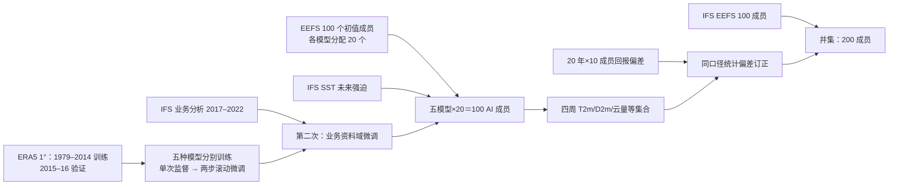

# Weyn 等：业务型多架构天气模型集合的四周次季节预报

> Jonathan A. Weyn、Divya Kumar、Jeremy Berman、Najeeb Kazmi、Sylwester Klocek、Pete Luferenko、Kit Thambiratnam，*An ensemble of data-driven weather prediction models for operational sub-seasonal forecasting*，[arXiv:2403.15598v1](https://arxiv.org/abs/2403.15598)，**2024-03-22 提交**；[全文 HTML](https://arxiv.org/html/2403.15598v1)、[原始 PDF（9 页）](https://arxiv.org/pdf/2403.15598v1)。PDF 封面另印 **2024-03-26**，与 arXiv 首次提交日不同。本笔记于 2026-09-25 按 v1 正文和原图 1–5 核对；目前按**预印本**记录，不冒称期刊同行评审成果。

## 一、研究问题与结论先行

这篇研究问的不是某一种神经网络是否拿到最佳确定性 RMSE，而是：把**不同架构的五个天气模型**与不同 IFS 初值搭配，能否用业务可取的起报资料做全球 **1°、四周**概率预报；再与 ECMWF 扩展期集合及其标准化偏差订正公平比较。核心贡献是整合 ConvLSTM/ConvNeXt、FourCastNet 式 AFNO、三种 GraphCast 式图网络，使用 **5 模型×20 初值＝100 成员**，另试验与 ECMWF **100 成员**并集成 **200 成员**。它属于**第 1–4 周次季节（S2S）**，第 2 周附近也和中期末段相接，但绝不能仅用第 1 周收益代表第 4 周。[摘要、§2.1–2.2](https://arxiv.org/html/2403.15598v1)

必须把两个基线分开：对**未订正** ECMWF 集合，本文 T2m 的 CRPS 在第 1 周约低 **17%**、第 4 周约低 **4%**；对**经过统计偏差订正**的 ECMWF 集合，第 4 周反而由 ECMWF 约好 **3%**。AI 集合自身偏差订正并未产生同样大的提升，而且其第 4 周秩直方图仍呈 U 形欠离散。200 成员 AI+IFS 的 CRPS 比订正 IFS 略好，但论文没有给逐周精确改善表，也未验证热浪和干旱事件。[§3、图 2–5](https://arxiv.org/html/2403.15598v1)

## 二、资料、变量、时空对齐和业务起报

| 环节 | 作者公开做法 | 阅读与复现要点 |
| --- | --- | --- |
| 训练源 | ECMWF **ERA5** 再分析的选定字段，保守重网格至 **1°**。模型为 **6h** 预报时间步，但训练采样每 **3h** 都可起一个样本。 | 3h 是样本滑动间距，**不是模型每步只推进 3h**；相邻训练样本强相关。保守插值的具体掩码、缺值和逐字段标准化系数未公开。 |
| 高空场 | Z、T、q、u、v，各取 **1000/850/700/500/200 hPa**，即清单上 5×5＝**25 个层变量**。 | 这里的层数、水平分辨率不同于原版 GraphCast/FourCastNet，不能直接沿用那些论文的参数或分数。 |
| 单层/海表场 | T2m、D2m、U10、V10、整层水汽、海平面气压、总云量、海表温度 SST；另给**太阳入射辐射、地形、陆海掩码**作为已知/静态特征。 | 清单为 25+8＝33 个天气/海表字段，但论文同时把 SST 作为每步**外部指定**输入；是否在所有模型的损失中把 SST 当预测目标、各模型完整张量通道数及归一化方法，原稿没有逐项列明。 |
| 时间划分 | ERA5 **1979–2014** 训练、**2015–2016** 验证、**2017–2018** 初始测试。最终又用 **2017–2022 IFS 业务分析**做业务域微调。 | 后一阶段与早期 2017–2018“测试年”重叠；不能把早期测试称为最终微调模型的独立盲测。真正用于最终业务比较的是**2023-07-03 至 2023-12-31**的起报。 |
| 滚动气候强迫 | 每次递推注入可知的入射太阳辐射、地形/陆海掩码；训练时 SST 取 ERA5，推理时取**ECMWF IFS** 海表场。 | 这是**AI 大气 + IFS 海洋状态强迫**的混合链，不是从初值完全自主产生四周海气耦合。SST 来源切换本身是分布转移，需做消融。 |
| 业务初值与验证 | ECMWF **EEFS** 经 MARS 提供自 2023-06 升级后的 **100 个扰动成员**，五个 AI 模型各分配其中 **20 个初值**。只检验 **周一/周四 00 UTC**、2023 下半年起报；验证场为 **IFS 业务分析**。 | 四周评分既依赖 IFS 初值也依赖 IFS SST；不是纯 ERA5 初值实验。论文未报告成员分配随机种子、逐次起报列表或 100 成员的长期跨季节稳定性。 |

模型输入为时刻 `t−6h,t` 两帧，监督输出 `t+6h,t+12h` 两帧；再把模型预测回送输入，按 12h 块连续递推至 4 周。论文文字称“next two time steps”，因此不应误记成一个 12h-only 单步网络；对五个架构之间是否完全同构的输出头，原稿没有披露。[§2.1](https://arxiv.org/html/2403.15598v1)

上图依据原文 §2 **独立重绘**。箭头表示训练、输入、后处理或并集的数据流，而非论文附有统一的端到端计算图；五个模型内部结构并不相同。特别是“20 年回报”用于偏差估计，不是这五个模型的预训练时期。[§2–3](https://arxiv.org/html/2403.15598v1)

## 三、五个模型到底怎样组成集合

| 成员模型 | 公开结构/参数量 | 特殊设置与披露边界 |
| --- | --- | --- |
| 改造 MS-Nowcasting | ConvNeXt 与 ConvLSTM 自编码器，加定制空洞卷积块，约 **15M** 参数。 | 只说“基于”该架构；没有逐层宽度、核大小、LSTM 隐态等完整配置，不能用原 MS-Nowcasting 的雷达模型设置补填。 |
| FourCastNet 式 | Transformer 骨干 + adaptive Fourier neural operator；patch 缩到 **2×2**，约 **46M** 参数。 | 缩 patch 是为减小下采样影响，不等于复现原版高分辨率 FourCastNet；深度、头数、谱模态未给。 |
| NVIDIA Modulus 图模型 | GraphCast 式 **六层 multi-mesh**，约 **20M** 参数。 | 原文特别说明**没有进行第一轮自回归微调**，不能给它套用其他模型完整三阶段日程；是否以同样方式进行最终业务分析微调未逐模型澄清。 |
| 作者自建图模型 A | GraphCast 式六层 multi-mesh，约 **20M** 参数。 | 与 Modulus 实现的优化器参数略有区别，但具体数值未提供；不同实现并非严格只变一项的消融。 |
| 作者自建图模型 B | 与 A 同类图网络、约 **20M** 参数，并额外读**目标时刻**太阳入射辐射和 SST。 | 比 A 多未来已知强迫，因此其差别既含实现又含输入；不可单独归因为图结构。 |

每个模型先独立优化和用 S2S 预报验证后入选；最终概率分布同时含**初值扰动**和**模型架构/权重差异**。图 2b 将“只用最佳 GNN、100 个初值”与“五模型×20 初值”对照，后者尤其在前期增大离散度；这支持多模型有额外不确定性来源，却不是因子完全分离的严格消融：模型配置、训练路径也在变。[§2.2、图 2b](https://arxiv.org/html/2403.15598v1)

## 四、从头训练、两次微调和缺失的超参数

1. **ERA5 单次迭代预训练**：用一轮前向滚动的均方误差 **MSE** 监督；学习率先线性升温、随后余弦退火。论文未报告 epoch/总步数、batch size、学习率峰值、优化器类型/β、权重衰减、变量权重、纬度加权损失和训练硬件，不能由 FourCastNet/GraphCast 的常见配方推断。
2. **ERA5 自回归微调**：降低到固定学习率，展开**两个 forward step**，误差沿两步反向传播；作者把监督帧描述为合计四个时间步、最远 **24h**。目标是让网络在训练时接触自身预测，再减小四周 rollout 的误差积累；**训练展开最长 24h，不代表只预报 24h**。
3. **业务分析域微调**：以 **2017–2022 IFS operational analysis** 接着训练，仍使用两步递推；这是从 ERA5 到业务初值分布的适配，并非 LoRA、冻结骨干或单独训练一个偏差校准网络。该阶段的 LR、训练时长、冻结范围、混合 ERA5 比例和检查点选择未披露。Modulus GNN 未经历第一轮自回归微调的例外，应逐模型报告而不能笼统写“五模型均三阶段”。
4. **偏差订正属于训练后统计处理，不是参数微调**：ECMWF 按每周一/四 00 UTC 对先前 **20 年**各 **10 成员**回报求误差，在每个 lead/周窗上平均，再合并目标日及前后两个相邻历日的平均偏差。作者下载同样的历史初值，跑 AI 回报，计算对应订正；既有业务 IFS 订正，也有 AI 自身订正。文中没有公开逐变量/逐格点的完整实现、历史回报量及缺失处理脚本，复现不能凭“订正”二字假定同样效果。[§2.3–2.4](https://arxiv.org/html/2403.15598v1)

这个流程的难点是**三个不同的数据分布**：ERA5 再分析训练、IFS 业务分析再微调、EEFS 扰动分析与预报 SST 推理；过去 20 年回报的资料/模式版别又与 2023 业务期不同。原文自己把订正后 AI 改善偏小部分归因于训练与测试预测不一致，这比只看“四周 CRPS”更值得复现检查。[§3 图 2 讨论](https://arxiv.org/html/2403.15598v1)

## 五、原图 1–5 与模型性能：数字、图意和负面结果

CRPS 是**越低越好**的概率评分；ESSR＝成员标准差/集合均值 RMSE，理想量级约 1，但接近 1 不能独自证明概率校准。图 2/5 的条形高度以原图方向读取，本文只记录作者正文明确给出的百分比和图内印出的值，不从像素倒推更多小数。[§3、图 2 与图 5](https://arxiv.org/html/2403.15598v1)

| 原图/指标 | 原文可核结果 | 应怎样解释 |
| --- | --- | --- |
| 图 1，第 4 周 T2m 偏差空间图 | 原图印出的全球平均：AI 原始 **+0.09 K**、AI 订正 **−0.03 K**、IFS 原始 **−0.12 K**、IFS 订正 **+0.04 K**；AI 对加拿大偏暖。 | 订正使平均有符号偏差变小，但图同时有正负抵消，**不能**将该均值当作绝对误差或 CRPS。图注写对 ERA5，结果正文写对业务分析，真值标注不一致，复现须核对实际生成脚本。 |
| 图 2a，第 1/4 周 T2m CRPS | AI 相对**原始** IFS 第 1 周约低 **17%**、第 4 周约低 **4%**；第 4 周**订正** IFS 反过来约好 **3%**。 | “4–17% 胜 ECMWF”只成立于未订正基线；不能跨周、跨订正状态合成一个总排名。 |
| 图 2b，第 4 周 T2m ESSR | AI 未订正约 **0.9**，原始 IFS 近似；订正 IFS 接近 **1**。AI+IFS 的 **200 成员**第 1 周约 **1.1**，且相对订正 IFS 的 CRPS **略好**。 | 单最佳 GNN 的 100 初值集合更窄；五模型混合增散度。早期 ESSR>1 亦可能偏过散，不能只报“可靠”。 |
| 图 3，第 4 周 T2m 空间 CRPS | 两幅**已订正**地图内印出的全球平均约为 AI **1.09 K**、IFS **1.03 K**；陆地单独评估时 AI 对**原始** IFS 的第 4 周优势由全球 **4%** 变 **14%**，但对**订正** IFS 仍落后。 | 图 3 的地图注数字与正文图 2 的“约 3%”不是同一可直接相除的报告口径；1.09/1.03 相除约 5.8%，原稿未给出差异计算细节，本笔记不替作者修订。极地高误差明显。 |
| 图 4，第 4 周 T2m 秩直方图 | AI 原始与订正后均明显 **U 形**；原始 IFS 也欠离散并有冷偏，订正 IFS 改善；AI+订正 IFS 的并集更接近均匀。 | AI 自身做偏差订正**未解决欠离散**。并集改善只在本组温度/半年起报中验证，不等于所有变量均已校准。 |
| 图 5，D2m 与总云量 CRPS | 两变量大体与 IFS **相差几个百分点**；图上去偏有时反而无益。作者另称 6h 累积降水诊断模型比 IFS **差约 12%–25%**，但**未给图表**。 | 不能用 T2m 获益代表降水或云量；降水缺少可核图、成员配置和训练说明，只可作为作者报告的局限。 |

图 2a 同时绘出 AI、原始 IFS、AI 订正、IFS 订正、AI+订正 IFS 五组；看任何一根条的“胜出”，都必须写清是**同一 lead、同一后处理状态**的哪两个分布。作者没有给逐周数值表、置信区间或分季节显著性，故百分比仅按正文披露值引述，不把条形像素人工估算到 0.01 K。[图 2、5](https://arxiv.org/html/2403.15598v1)

## 六、科研价值、复现检查与不能外推之处

方法价值是证明 2023 年业务 EEFS 初值能够喂给多个神经架构，在一张 **NVIDIA V100** 上**不到两小时**完成 100 条 **30 天**预报（作者报告，含 I/O）；同时提供了“原始 IFS vs 双方同类去偏 IFS”两种基线，并发现与物理 IFS 并集能补欠离散。注意 30 天是推理吞吐描述、四周是本文主要评分窗口；不是声称提供经过检验的 46 天预报。[§4](https://arxiv.org/html/2403.15598v1)

复现应先锁定 2023 周一/四 00 UTC 起报清单、EEFS 100 初值及 SST 的各成员对应，再逐模型保存训练检查点和三阶段超参数；复做 20 年回报的 lead/周/历日统计，比较**AI 原始、AI 订正、IFS 原始、IFS 订正、AI+IFS**五条 CRPS/ESSR/秩直方图，并在相同区域遮罩下重算图 3 的全球均值。建议按起报日分块 bootstrap、单列陆地/海洋与各季节，追加 10–15 天、周 3–4 温度/降水阈值事件的独立验证，尤其在加拿大暖偏和降水劣势区域做压力测试。以上为**阅读建议**，不是作者已经完成的实验。

主要证据限制：作者明说仅在少数地表变量展示聚合分数，**未做热浪和干旱极端验证**；没有完整网络/优化参数、代码/权重及逐起报评分；2023 下半年半年样本不能证明多年业务稳健。模型仍用 MSE 回归训练，可能平滑细尺度尾部；短 lead 的多模型增散不保证第 4 周秩直方图变平；未来 SST 借助 IFS，不能把成绩宣传为完全独立的 AI 海气联合模式。[§1、§4](https://arxiv.org/html/2403.15598v1)

[返回首页](../../README.md)
