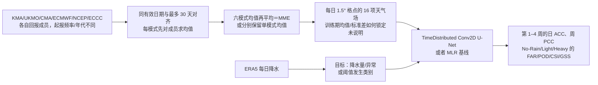

# Chung 等：东亚六模式集合的第 2–4 周降水深度学习后处理

> Uran Chung、Jinyoung Rhee、Miae Kim、Soo-Jin Sohn，*Advancing sub-seasonal to seasonal multi-model ensemble precipitation prediction in east asia: Deep learning-based post-processing for improved accuracy*，*Heliyon* **10(16)**, e35933，[DOI 10.1016/j.heliyon.2024.e35933](https://doi.org/10.1016/j.heliyon.2024.e35933)，**2024-08-08 在线发表、2024-08-30 卷期日期**。[出版社书目与摘要](https://www.sciencedirect.com/science/article/pii/S2405844024119640)、[PMC 正式存档全文](https://pmc.ncbi.nlm.nih.gov/articles/PMC11385763/)、[Europe PMC 正文 XML](https://www.ebi.ac.uk/europepmc/webservices/rest/PMC11385763/fullTextXML)。阅读于 2026-09-25，逐项检查正文表 1–3、原图 1–6。论文的独立补充 DOCX `mmc1.docx` 未能可靠取得，故附表 A1/A2 和附图 A1 仅按正文描述，不抄写未经核验的附表数值。PMC 将文章类型标为 *review-article*，但正文确实报告了作者自己的训练和验证实验，本笔记按其实际方法/证据层级阅读。

## 一、研究问题、任务边界和先读结论

作者不是另训一个全球动力预报底座，而是用**已有六个 S2S 动力模式的回报预报场**，以及将它们做均值的多模式集合（MME），训练东亚降水的监督后处理器。任务分别为每日降水量/异常和降水发生类别，主要讨论**第 1–4 周**，第 2–4 周是 U-Net 优于多元线性回归（MLR）的重点。该工作归 **S2S**，不能因 U-Net 输入包含每日格点就归入短临，也不能把它说成无需动力模式的端到端全球降水基础模型。[摘要与§1–2](https://pmc.ncbi.nlm.nih.gov/articles/PMC11385763/)

主结论要带着负面结果一起读：第 2–4 周降水量的空间型态相关 PCC，经 U-Net 后处理一般高于 MLR 和原始模式；第 1 周提升很小。图 6 的**无雨事件**在 U-Net/MME 下却常有更高 FAR（误报比例），论文结论也承认 MME 本身未改善无雨的 FAR/POD。故“发生预测改善”主要指部分 CSI/GSS 和其他雨强情况，不能推断无雨、轻雨、暴雨所有事件指标全方位变好。[§3.2、图 3–6、§4](https://pmc.ncbi.nlm.nih.gov/articles/PMC11385763/)

## 二、六套回报资料、MME 构造及时间范围审计

| 动力中心 | 表 1 回报成员数 | 表 1 回报期 | 原始起报频率/最长期 | 对齐隐患 |
| --- | ---: | --- | --- | --- |
| KMA，韩国全球季节预测系统 V5 | 3 | 1991–2010 | 每月 1/9/17/25 日；60 天 | 与 ECMWF/ECCC 起报日不同，作者举例舍去最初 3 天。 |
| UKMO | 7 | 1993–2015 | 每月 1/9/17/25 日；60 天 | 同样需日期平移；不是同日同初值集合。 |
| CMA | 4 | 1994–2014 | 每日；60 天 | 每日产品按目标有效日选择。 |
| ECMWF | 11 | 1998–2017 | 周一、周四；46 天 | 比表 1 声称的 MME **1995** 起始晚 3 年。 |
| NCEP | 4 | 1999–2010 | 每日；44 天 | 六模式**真实同时可用**最早不早于 1999，最晚不晚于 2010（仅按表 1 计算）；作者未解释 MME 1995–2014 在缺模式年份如何构造。 |
| ECCC | 4 | 1998–2014 | 每周四；32 天 | 30 天统一窗口可用，但与多数系统的起报频率不同。 |
| 作者的 MME | 表 1 不写成员数 | **1995–2014** | 每周；统一 **30 天** | 先将各动力系统的扰动成员平均成**单模式集合均值**，再将六个模式均值平均；不是保留原始 33 条扰动轨迹的概率混合集合。 |

正文说六模式数据取公共 1995–2014 年，并以 2018-01-04 为例解释将 KMA/UKMO 的 1 月 1 日起报舍去前三天。这同时牵涉两个独立问题：表 1 中部分模式起始年份更晚、NCEP/KMA 回报在 2010 年结束，而对齐示例的 2018 年又超出表 1 的 MME 时段。**本笔记不替作者补造缺失模式的年份数据或插补规则**；这些条件若不厘清，训练/测试样本数与可复现的 80/20 划分无法精确复算。所有模式原始全球格点统一写为 **1.5°×1.5° / 121×240**，图 1 展示东亚及周边研究区；论文未给出用于裁剪的精确经纬度数组和陆地掩码策略。[§2.1、表 1、图 1](https://pmc.ncbi.nlm.nih.gov/articles/PMC11385763/)

图依据正文 §2.1–2.3 **独立重绘**，其中“MME 共同年份与缺失模式”仍是原文未解决的复现问题，不应把上图的对齐框看作公开代码已经实现。作者实际**先压缩每个动力模式的原始集合维**，因此这篇不评价预报概率分布的 CRPS 或集合可靠性；名称中“multi-model ensemble”主要指多模式均值输入。[§2.1.1、表 1](https://pmc.ncbi.nlm.nih.gov/articles/PMC11385763/)

## 三、字段、目标、标签与预处理到什么程度

各模式每日场的输入清单可按论文逐项复核为 **16 项**：最高/最低 2m 气温、总降水、2m 气温、海平面气压；u 风 **50/850/200 hPa** 三层，v 风 **850/200 hPa** 两层；Z **200/500 hPa** 两层、ω500、SST、顶层净长波辐射、q850。原文写的 u 第一层是 **50 hPa**，不能未经代码验证就“纠正”为 500 hPa。除最高/最低温的 6h 值先做日均外，S2S 字段记为日分辨率。输入张量维度为`起报日×lead 日×纬度×经度×字段`；所有 S2S 场按均值和标准差标准化，但正文未给统计量是否仅取训练分段、每个 lead/中心是否分别计算、异常气候态基准期及极端值裁剪策略。[§2.1.1](https://pmc.ncbi.nlm.nih.gov/articles/PMC11385763/)

监督目标使用**ERA5 日降水**，并非独立雨量站或卫星降水观测；作者也承认 ERA5 夏季部分地区偏湿、山区误差。目标有连续降水量/日异常和降水发生分类两条任务，但表 2 的三个标签口径需要保留原样：无雨 `<0.1 mm/d`，轻雨 `≥0.1 且 <10 mm/d`，暴雨 `≥50 mm/d`；表头另标“0%、>0 至 ≤33%、>67%”。**10–50 mm/d 未被这三行覆盖**，百分比标签与固定 mm/d 阈值怎样对应也未解释。若作为三个独立二元事件分类，标签覆盖问题的影响不同于互斥三分类；论文未给足实现，不能自行选择其一。[§2.1.1–2.1.2、表 2](https://pmc.ncbi.nlm.nih.gov/articles/PMC11385763/)

## 四、网络细节、训练配置、微调核查

图 2 的结构是一个编码–解码 U-Net：下采样用**平均池化**，编码层使用约 **32/64/64/128** 个特征图的卷积块，跳连把各层特征拼到对应的解码器；首层卷积核 **2×2**，后续主要 **3×3**，逐级上采样后以 1×1 卷积输出。正文说特征图级别为 **32、64、128**，图 2 又在中间两个块都标 **64**，上述 32/64/64/128 是按**图中标签**转述。每个卷积块外包 `TimeDistributed`，意为**对不同 lead 帧逐帧复用同一 Conv2D 权重**；这层封装本身不会像 ConvLSTM/3D 卷积那样自动在时间维做交互。作者也写明是否使用该 wrapper 并**未改变 MSE/RMSE 精度**，因此“显式学到时间连续性”尚缺单独实验证据。[§2.2.2、图 2](https://pmc.ncbi.nlm.nih.gov/articles/PMC11385763/)

| 训练要素 | 已披露事实 | 缺失或限制 |
| --- | --- | --- |
| 划分 | 各模式/其 MME 按自身回报期 **80% 训练、20% 测试**；训练内部**随机四折**，三折拟合、一折验证。§2.3 特别说 MME 测试为 **2011–2014**，图 A1 的 MME 训练为 **1995–2010**。 | 单模式年份因回报期而异，未列各系统起报数；随机四折若跨相邻日和重叠 lead，验证集可能与训练集高度相关，论文未给“按起报/年份分组”防泄漏策略。 |
| 损失/优化 | **MSE** 为训练目标；**Adam**，学习率 **0.005**，**50 epoch**，batch **80**；另看 cosine similarity 作为学习诊断。MLR 也以 MSE 最小化，并报告 R²。 | β、权重衰减、学习率日程、早停、随机种子、GPU/总时长、每个目标的输出激活与类别损失权重未报告。发生分类也写 MSE，未见交叉熵配置。 |
| 多任务/底座 | U-Net 与 MLR 分别对六单模式和 MME 的降水量/发生任务做后处理。 | 论文没有报告从某天气基础模型加载预训练权重或领域 LoRA；**没有可核的微调阶段**。不同起报中心/目标的权重共享还是完全独立训练，未给检查点/源码。 |
| MME 与测试标准化 | 成员均值→模式均值及输入 Z-score，验证 ERA5 同网格日降水。 | 统计量是否严格只用训练折、对第 4 周是否以同一气候态作异常，未清楚交代；测试年不能被用于估计训练标准化/气候态。 |

图 A1（正文描述）中，连续降水异常的训练/验证 MSE 约从 epoch 10 起趋平，发生任务到约 epoch 15 前波动较大、此后训练与验证仍有差距；连续异常的 cosine similarity 在约 epoch 5 后大约 **0.2**。这些是**作者对未取得附图的文字描述**，不等同于对原图量尺重新核算。[§2.2.3、§3.1](https://pmc.ncbi.nlm.nih.gov/articles/PMC11385763/)

## 五、指标、原图 3–6 的性能与负面结果

ACC 是格点随时间的异常相关，PCC 是某一周空间图案相关；Fig. 3a 的逐日 ACC 与 Fig. 3b 的逐周 PCC **分母/聚合维度不同**。作者自定义 `skill score=(后处理相关−原始相关)/原始相关`，这个比值在原始相关接近零时可能显著放大、且负基线时解释不稳定；它不是标准的概率技巧分数。CSI 忽略 TN，GSS 再扣随机命中，POD 是命中率，FAR 是预报发生中的误报比例（越低越好）。[§2.3，公式 2–8](https://pmc.ncbi.nlm.nih.gov/articles/PMC11385763/)

| 图表/样本 | 原文报告和原图直接可见的结果 | 不得省略的限定 |
| --- | --- | --- |
| 图 3a，六模式＋MME，逐日 ACC | 除 CMA 外，单模式降水经 U-Net/MLR 后大多优于原始；**第 14 天后 NCEP** 处理后的 ACC 相对较高。 | 各模式覆盖的回报期/起报频率不同，不宜把曲线差异当作同一公平测试年下纯架构排名；图中未给置信区间。 |
| 图 3b，第 1–4 周空间 PCC | 第 1 周几乎无显著改进；第 **2–4 周** 多数系统满足 U-Net > MLR > 原始的总体次序；MME 与若干单模式相近或更好。 | “多数/总体”不代表所有点。图中有 CMA、ECCC 等弱系统和个别反例，不能无条件宣称七组逐周都严格优于。 |
| 图 4a–c，相关技巧比值 | 前 **1–2 天** ACC 相对改善不稳；第 **21 天后** 多数组别 U-Net 的 ACC 相关比值 ≥1，而 MLR 后期多在 0–0.5；CMA 全时段/ ECCC 第 4 周 PCC 提升较明显。 | 比值 ≥1 是相对原始相关至少翻倍，**不是 ACC=1**；在后期原始相关很小的情况下，比例大不保证绝对预测技巧高。 |
| 图 5，周 2/3 格点 ACC 地图 | U-Net 在 NCEP、MME 等的较低相关区呈更广改善，图 5 以东亚地图展示而非单一全球均值。 | 原图颜色不作为精确数值表；局部仍可负相关，不能按“更多红色”推断每格点可靠性或极端降水命中。 |
| 图 6a，无雨 FAR | U-Net 的无雨 FAR 整体偏高，**MME 特别明显**；原始和 MLR 往后期 FAR 降低。 | 无雨假警报未改善，是业务使用的实质反证；不同雨强 FAR 的正负方向不能合并。 |
| 图 6b–d，发生分类 | POD 随雨强变化，作者自己认为难判断处理是否造成高 POD；无雨及轻/重雨的 CSI、GSS 以 U-Net 总体较高。 | CSI/GSS 上升不能抵消 FAR 反例；表 2 的 10–50 mm/d 类别空档和分类/二元任务实现缺失限制解释。 |

原文没有给上述六模式×四周的逐格点预测文件、置信区间或完整数值表；本笔记只选用正文明确百分比/阈值与原图可直接识别的方向，不从低分辨率图像逆推小数。作者“prediction accuracy enhanced for total lead times”指其选定指标/任务，不意味着对概率校准、强降水尾部和独立地面雨量站均改善。[§3.2、图 3–6](https://pmc.ncbi.nlm.nih.gov/articles/PMC11385763/)

## 六、复现优先级和证据边界

先解决**年份与频率**：从各 S2S 数据档案逐模式列出完整回报期、每个起报日与 30 天有效日、成员数和缺测。若真要“六模式同时”训练，需单列 1999–2010 的实际重叠和 1995–2014 中缺模式时的处理，并解释文中 2018 对齐例子所用的是回报、业务预测还是示意。其次应按**起报年份/季节分组**做交叉验证，锁定训练折的 Z-score 与降水异常气候态；用独立雨量/卫星产品检验 ERA5 标签依赖，并把无雨 FAR 与强降水 CSI/GSS 同时呈现。最后应消融 `TimeDistributed`、平均池化、单模式/六模式均值及 **10–50 mm/d** 标签处理，否则无法识别所谓“时间连续性”或 MME 增益究竟来自哪里。这些均为**本笔记提出的复现检查**，不是论文已完成的额外实验。[表 1–2、图 2–6](https://pmc.ncbi.nlm.nih.gov/articles/PMC11385763/)

源码/训练配置和原始处理后数据未公开于正文；作者在数据可用性栏写的是 **“Data will be made available on request”**。补充 DOCX 未取得意味着附表系数和附图曲线仍待核验；而正文表 1 的时间冲突、随机折与相邻回报样本相关性、表 2 阈值空档、没有独立观测真值，都是把这项区域后处理研究用于业务之前必须处理的限制。文章显示**东亚 S2S 降水后处理有潜力**，不证明六模式集合已经形成可直接运行、全雨强校准的业务概率系统。[§4、Data and code availability](https://pmc.ncbi.nlm.nih.gov/articles/PMC11385763/)

[返回首页](../../README.md)
