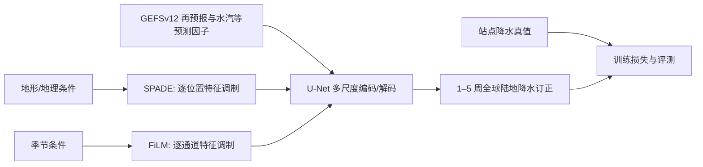

# ReST：把地形和季节作为条件注入全球次季节降水订正

> Gyu-Ho Noh、Kuk-Hyun Ahn，*Deep learning with spatio-temporal conditioning improves global subseasonal precipitation forecasts*，*npj Climate and Atmospheric Science*，2026，DOI [10.1038/s41612-026-01430-8](https://doi.org/10.1038/s41612-026-01430-8)。原稿 2026-03-09 收稿、2026-04-30 接收；阅读依据：[期刊全文](https://www.nature.com/articles/s41612-026-01430-8)及[期刊早期公开 PDF](https://www.nature.com/articles/s41612-026-01430-8_reference.pdf)。阅读日期：2026-09-24。

## 1. 问题与边界

降水在 1–5 周时效的原始数值集合中同时受动力可预报性和系统偏差限制。本文解决的是**已有 GEFSv12 再预报的后处理**，不是从初始状态独立运行全球天气动力学。作者关心全球陆地降水格点的确定性 ACC、MSESS 与 RMSE，强调山区、热带等偏差结构复杂的区域；不能把它当作直接提高海洋降水或业务概率集合质量的证据。[摘要与 Results](https://www.nature.com/articles/s41612-026-01430-8_reference.pdf)

## 2. 结构与训练资料

ReST 采用 U-Net 主干。SPADE 由空间条件图生成逐位置的特征缩放、平移；FiLM 由季节条件生成逐通道调制。参考结构 ReST-S5F2 对 5 个网络块使用 SPADE，仅对上层 2 块使用 FiLM。地形、陆海背景及季节不是简单接在输入尾部，而是在多个尺度重复调制中间特征；其归纳偏置是“相同的大尺度湿度条件，在不同地理环境下对应不同的降水响应”。[原文 Figure 3 与 Methods](https://www.nature.com/articles/s41612-026-01430-8_reference.pdf)

方法图据原文机制自行重绘，不复制论文图像。训练输入为 2000–2019 年 GEFSv12 reforecast；验证真值来自 63,588 个站点汇成的全球降水资料，比较在 0.25° 陆地网格进行。对照包含原始 GEFSv12（RAW）、quantile mapping、random forest 及 Res34-U-Net。由集合均值生成确定性输出，因此与能给出完整预测分布的概率校正方法不能直接以单一 ACC 排名。[原文摘要、Results、Discussion](https://www.nature.com/articles/s41612-026-01430-8_reference.pdf)

### 数据集是怎样构成的

| 环节 | 论文公开内容 | 复现要点 |
|---|---|---|
| NWP 输入 | GEFSv12 2000–2019 再预报、最长 35 天；周累积降水 PCP、2 m 气温 T2M、总柱水汽 TCV、500 hPa 位势高度 Z500 | 降水在目标周累积，其他三变量在同一目标周求均值，不能把瞬时 TCV 与周累积 PCP 错配 |
| 网格 | 预测因子统一以反距离加权插值到 0.25° | 不是模型直接生成原始 GEFS 格点真值 |
| 观测 | GHCN-D 与 GSOD 站点元数据去重、质控；缺测用 Station-based Serially Complete Earth 补齐 | 最终保留 63,588 站，日观测时刻统一到 00 UTC |
| 观测成图 | 站点日降水经反距离加权插值到 0.25° 全球陆地网格，再按 GEFS 起报日期累积成各周目标 | 山地/站点稀疏地区的“真值”仍是插值估计，不是独立雷达或卫星降水 |
| 时间切分 | 2000–2013 训练，2014–2015 验证，2016–2019 测试 | 不能把整个 2000–2019 都称作训练集 |

资料转换顺序决定了这篇文章评价的是**周累积区域降水偏差订正**，不是以 6 小时瞬时场逐步积分 35 天。论文并未把所有站点筛选阈值、逐变量归一化常数和每个训练样本的集合成员融合方法在网页文字里完整列出，复现时要检查补充材料/代码，不可臆补。[期刊 Methods：Numerical weather prediction dataset、Observational dataset](https://www.nature.com/articles/s41612-026-01430-8)

### 训练、超参数与微调边界

ReST 将残差 U-Net 与两种条件调制组合：SPADE 对每个空间位置生成特征缩放/偏置，FiLM 用季节变量对整条通道调制。`S5F2` 的数字代表五处空间调制、两处时间/季节调制，**不是 5 层网络、2 个预报周**。论文比较多种调制放置方式，这本身是结构消融，不是先训练 S5 再把 F2 微调进去。[原文结构与消融](https://www.nature.com/articles/s41612-026-01430-8)

训练使用 AdamW + Huber 损失，最多 300 epoch，以验证集性能早停；每个模型跑六个随机种子并将预测平均以降低随机初始化敏感性。这是同任务从头训练/模型平均，论文没有披露跨资料预训练、冻结层或参数高效微调阶段。网页可核实方法段未给出 AdamW 的学习率、β、权重衰减、batch size、Huber 转折参数与 patience；不应凭常见默认值代填。[期刊 Methods：Training strategy](https://www.nature.com/articles/s41612-026-01430-8)

评测以陆地格点为单位，ACC 为时序异常相关，MSESS 对比基准均方误差，RMSE 表示量值误差。六种种子预测平均得到的场仍是确定性预报，不是由六成员校准分布计算的 CRPS；要评估降水风险，还需概率输出与可靠性检验。[期刊 Methods：Evaluation metrics](https://www.nature.com/articles/s41612-026-01430-8)

## 3. 图表与实验结果

| 原文证据 | 可以得出的结论 | 不应扩大为 |
|---|---|---|
| Figure 1：全陆地格点 ACC/MSESS/RMSE 的累积分布 | ReST 的 ACC/MSESS 分布整体右移、RMSE 左移；第 1–2 周改善最明显 | 不能从 CDF 图读出一个全球统一的百分比增益 |
| Figure 2：ACC 空间图 | 山地、热带非洲、东南亚等低原始技巧区域有空间连续的改善 | 不意味着每个格点或所有季节均显著改善 |
| Figure 3–4：8 种调制放置消融 | 覆盖更多层的 SPADE 普遍优于只在少数层放置；FiLM 的位置差异相对小 | 不能断言季节信息无效，只能说本结构/资料下次于空间条件 |
| Supplementary Figures S4–S7：时效变化 | 到第 3 周方法间差距明显收敛，原始动力信号变弱 | 不能把“可输出 5 周”误读为“5 周一直有实用技巧” |
| 预测因子消融 | 水汽去除在热带影响大；地形去除在山地影响大 | 重要性受变量选择和区域分布约束 |

这里最重要的负结果是**统计后处理不能凭空恢复已消失的动力可预报信息**。作者在 Discussion 将显著增益的实用范围约束在前两周，而非标题可能暗示的整个次季节范围。[原文 Results/Discussion](https://www.nature.com/articles/s41612-026-01430-8_reference.pdf)

## 4. 评价与复现建议

ReST 的贡献是证明“多尺度地理条件”比单纯加深 U-Net 更契合全球降水订正；空间调制对于地形抬升、海陆热力差与局地水汽汇聚具有可解释的作用。其研究边界同样清楚：只有 GEFSv12 输入、确定性集合均值、以站点插值真值为主，且第 3 周后增益迅速变小。复现时应固定 reforecast 版本、站点质控和插值方法，按年、季节、气候区和周次拆开评分，并增加 CRPS/可靠性图的概率扩展试验；尤其不能把 ACC 改善替代洪水或极端降水风险校准。[原文 Discussion](https://www.nature.com/articles/s41612-026-01430-8_reference.pdf)

[返回首页](../../README.md) · [返回总表](../../气象大模型_中期预报论文追踪.md)
