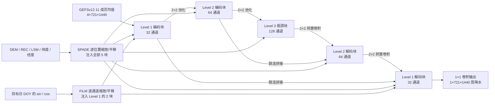

# ReST：地理—季节条件调制的全球次季节降水订正

> Gyu-Ho Noh、Kuk-Hyun Ahn，*Deep learning with spatio-temporal conditioning improves global subseasonal precipitation forecasts*，*npj Climate and Atmospheric Science* 9，156，**2026-05-07**，DOI [10.1038/s41612-026-01430-8](https://doi.org/10.1038/s41612-026-01430-8)。原稿 2026-03-09 收稿、2026-04-30 接收；依据[期刊正式全文](https://www.nature.com/articles/s41612-026-01430-8)与[23 页正式补充材料](https://media.springernature.com/original/springer-static/esm/art%3A10.1038%2Fs41612-026-01430-8/MediaObjects/41612_2026_1430_MOESM1_ESM.pdf)精读。复核日期：2026-09-25。

## 1. 问题与边界

降水在 1–5 周时效的原始数值集合中同时受动力可预报性和系统偏差限制。本文解决的是**已有 GEFSv12 再预报的后处理**，不是从初始状态独立运行全球天气动力学。它输出全球**陆地**各目标周的确定性降水订正场，评价 ACC、MSESS 与 RMSE，强调山区、热带等偏差结构复杂的区域；不能把它当作直接提高海洋降水或业务概率集合质量的证据。[摘要与 Results](https://www.nature.com/articles/s41612-026-01430-8)

## 2. 结构与训练资料

ReST 采用 **3 个分辨率层级、5 个残差块**的 U-Net。SPADE 由空间条件图生成逐位置的特征缩放、平移；FiLM 由季节条件生成逐通道调制。参考结构 ReST-S5F2 对全部 5 块使用 SPADE，仅对两个高分辨率 Level 1 块使用 FiLM。地形、陆海背景及季节不是简单接在输入尾部，而是在多个尺度重复调制中间特征；其归纳偏置是“相同的大尺度湿度条件，在不同地理环境下对应不同的降水响应”。每个残差块有两层卷积、捷径、GroupNorm 和 GELU；STaM 只接在**第一次 GroupNorm 后**，因为作者认为放在第二次归一化之后会在跳连融合/通道混合中稀释条件作用。[原文 Methods](https://www.nature.com/articles/s41612-026-01430-8)、[补充 Figure S10–S11](https://media.springernature.com/original/springer-static/esm/art%3A10.1038%2Fs41612-026-01430-8/MediaObjects/41612_2026_1430_MOESM1_ESM.pdf)

方法图据原文机制自行重绘，不复制论文图像。数据覆盖 2000–2019 年 GEFSv12 reforecast，但**仅 2000–2013 用于训练**；验证真值来自 63,588 个站点汇成的全球降水资料，比较在 0.25° 陆地网格进行。对照包含原始 GEFSv12（RAW）、quantile mapping、random forest 及 Res34-U-Net。由集合均值生成确定性输出，因此与能给出完整预测分布的概率校正方法不能直接以单一 ACC 排名。[原文摘要、Results、Discussion](https://www.nature.com/articles/s41612-026-01430-8)

### 数据集是怎样构成的

| 环节 | 论文公开内容 | 复现要点 |
|---|---|---|
| NWP 输入 | GEFSv12 2000–2019 再预报、最长 35 天；**11 个集合成员求平均**以形成确定性预测因子，包含周累积降水 PCP、2 m 气温 T2M、总柱水汽 TCV、500 hPa 位势高度 Z500 四个输入通道 | 降水在目标周累积，其他三变量在同一目标周求均值，不能把瞬时 TCV 与周累积 PCP 错配；成员离散度没有被输入模型 |
| 网格 | 预测因子统一以反距离加权插值到 0.25° | 不是模型直接生成原始 GEFS 格点真值 |
| 静态地理条件 | ETOPO 2022 高程 DEM、IPCC AR6 气候参考区 REC、ERA5 陆海掩码 LSM、纬度和经度五个栅格 | 作为 SPADE 条件在多个尺度注入，不是只在输入端拼接一次 |
| 观测 | GHCN-D 与 GSOD 站点元数据去重、质控；缺测用 Station-based Serially Complete Earth 补齐 | 最终保留 63,588 站，日观测时刻统一到 00 UTC |
| 观测成图 | 站点日降水经反距离加权插值到 0.25° 全球陆地网格，再按 GEFS 起报日期累积成各周目标 | 山地/站点稀疏地区的“真值”仍是插值估计，不是独立雷达或卫星降水 |
| 时间切分 | 2000–2013 训练，2014–2015 验证，2016–2019 测试 | 不能把整个 2000–2019 都称作训练集 |

资料转换顺序决定了这篇文章评价的是**周累积区域降水偏差订正**，不是以 6 小时瞬时场逐步积分 35 天。集合融合明确为**11 成员平均**；但正文与正式补充材料并未完整列出站点筛选阈值、IDW 距离幂次/邻域、逐变量归一化常数、降水变换和逐 lead 权重共享关系，不可臆补。[期刊 Methods：Numerical weather prediction dataset、Observational dataset](https://www.nature.com/articles/s41612-026-01430-8)

### 训练、超参数与微调边界

ReST 将残差 U-Net 与两种条件调制组合：SPADE 对每个空间位置生成特征缩放/偏置，FiLM 用季节变量对整条通道调制。`S5F2` 的数字代表五处空间调制、两处时间/季节调制，**不是 5 层网络、2 个预报周**。FiLM 的目标日采用 `cos(2π·DOY/366)` 和 `sin(2π·DOY/366)` 两维编码，避免年末/年初的数值断裂。论文比较多种调制放置方式，这本身是结构消融，不是先训练 S5 再把 F2 微调进去。GeoCyclic padding 在经度上环绕，在纬向边界对相邻行做经度 180° 对向重排，避免全球格点的零填充断边。[原文结构与消融](https://www.nature.com/articles/s41612-026-01430-8)、[补充 Text S3–S4](https://media.springernature.com/original/springer-static/esm/art%3A10.1038%2Fs41612-026-01430-8/MediaObjects/41612_2026_1430_MOESM1_ESM.pdf)

正式补充材料 **Table S2** 给出使用的网络层参数；**Table S3 是搜索空间，不是最终训练同时启用的另一套配置**：

| 部位/设置 | 公开的最终配置 | 解读 |
|---|---|---|
| Level 1 两块 | 每块两次 `5×5` 卷积、各 **32** 输出通道；每次卷积前 GeoCyclic padding **2**；GroupNorm **4 组**；捷径 `1×1` 卷积 | 编码与解码各一块，高分辨率 |
| Level 2 两块 | 每块两次 `5×5` 卷积、各 **64** 通道；padding **2**；GroupNorm **4 组**；捷径 `1×1` 卷积 | 编码与解码各一块 |
| Level 3 一块 | 两次 `5×5` 卷积、各 **128** 通道；padding **2**；GroupNorm **4 组**；捷径 `1×1` 卷积 | U-Net 最低分辨率瓶颈 |
| 跨尺度与输出 | 两次 `2×2/stride 2` 池化；解码转置卷积依次 **64、32** 通道、`2×2/stride 2`；最终 `1×1` 卷积输出 **1** 通道 | 补图 S10 标输入 **4×721×1440**、输出 **1×721×1440** |
| 条件网络 | SPADE 分支产生所在层的逐位置缩放/平移；Table S2 的 Level 1 FiLM 全连接层特征为 **120→60→64** | 这里的 MLP 维度不是 U-Net 主干通道数 |
| 参数规模 | ReST **2.39M**；Res34-U-Net **34.58M**，约 **14 倍** | 参数量不是统一硬件下的训练/推理耗时 |

结构和维度依据[补充 Table S2–S3、Figure S10–S11](https://media.springernature.com/original/springer-static/esm/art%3A10.1038%2Fs41612-026-01430-8/MediaObjects/41612_2026_1430_MOESM1_ESM.pdf)，参数量依据[正式 Methods：Baseline models](https://www.nature.com/articles/s41612-026-01430-8)。

训练使用 **AdamW + Huber 损失**，最多 **300 epoch**，以 2014–2015 验证集性能早停；每个模型跑**六个随机种子**并将预测平均以降低随机初始化敏感性。六个种子不是 GEFS 的六个成员，也不是能提供校准概率的预测集合。这是同任务从头训练/模型平均，论文没有披露跨资料预训练、冻结层或参数高效微调阶段。正式正文与补充材料均未给出 AdamW 学习率、β、权重衰减、batch size、Huber 转折参数、早停 patience、硬件/耗时和六种子数值；不应凭常见默认值代填。[期刊 Methods：Training strategy](https://www.nature.com/articles/s41612-026-01430-8)

对照方法也有可复现细节：QM 用训练期的配对预报/观测建立经验 CDF 与分位映射；RF 按**每个格点独立拟合**，输入四个动态因子与 DOY，设置 **50 棵树、终端节点最少 2 个观测**；Res34-U-Net 把 **4 动态＋2 个广播 DOY 正余弦场＋5 地理场＝11 通道**直接拼接到输入，不使用 ReST 的中间特征条件调制。补充 Text S2 另引入 EMOS、Bayesian ridge：逐格对数变换降水并拟合概率预测，再取**预测中位数**作 ACC/MSESS/RMSE 确定性对照；这不能衡量概率可靠性、离散度或 CRPS。[补充 Text S2、S5–S7](https://media.springernature.com/original/springer-static/esm/art%3A10.1038%2Fs41612-026-01430-8/MediaObjects/41612_2026_1430_MOESM1_ESM.pdf)

评测以**每个陆地格点沿测试年份的时间序列**为单位，ACC 为预报与观测扣除季节气候态后的异常相关，`MSESS = 1 − MSE(预报,观测)/MSE(气候态,观测)`，RMSE 表示周降水量值误差。气候态只由**训练期**站点周降水构成，以目标 DOY 前后 **±15 天**的循环窗口取平均，跨年边界环绕处理；不能用测试期资料建基准。六种子平均得到的场仍是确定性预报，不是由六成员校准分布计算的 CRPS；要评估降水风险，还需概率输出与可靠性检验。[期刊 Methods：Evaluation metrics](https://www.nature.com/articles/s41612-026-01430-8)、[补充 Text S8](https://media.springernature.com/original/springer-static/esm/art%3A10.1038%2Fs41612-026-01430-8/MediaObjects/41612_2026_1430_MOESM1_ESM.pdf)

## 3. 图表与实验结果

| 原文证据 | 可以得出的结论 | 不应扩大为 |
|---|---|---|
| Figure 1：全陆地格点 ACC/MSESS/RMSE 累积分布 | ReST 的 ACC/MSESS 分布整体右移、RMSE 改善；第 1–2 周最明显，Res34 也通常优于逐格基线 | 图中 RMSE **乘 −1** 只是为了“越右越好”的作图约定；不能从 CDF 伪造一个全球百分比增益 |
| Figure 2、补充 Figures S4–S6：技巧地图 | 安第斯、喜马拉雅、热带非洲、东南亚等区域改善明显；第 4–5 周大部分地区技巧下降 | 第 3 周方法间差距已收窄，不意味着每格/每季均显著改善 |
| 补充 Figure S1：REC 区域 ReST−Res34 | 前两周很多区域的 ACC/MSESS 优势和 RMSE 降低仍成立；作者按时间样本做 **1000 次 bootstrap** 并标 95% 区间 | 区域尺度稳健性不代表稀疏站区每个格点可靠；RMSE 的改善方向是更低 |
| Figures 3–4、补充 Table S1/Figure S7：8 种调制放置消融 | `S2/S3/S5 × F2/F3/F5` 八种对照与参考 `S5F2`；SPADE 跨尺度覆盖越全通常越好，FiLM 位置差异相对小 | 只能说本结构和数据下空间调制贡献更大，不能断言季节信息无效；Week 2 部分位置差异扩大 |
| Figures 5–6、补充 Figure S8：七种预测因子消融 | 保留 PCP，逐一去掉 T2M、TCV、Z500、DEM、REC、LSM、LAT+LON；TCV 在热带湿对流区、DEM 在山地影响尤其大 | Week 2 部分原本低技巧区域出现**删变量后局部改善**；不能把变量重要性解读为处处正贡献 |
| 补充 Figure S2：EMOS/BR 的确定性中位数 | ReST 的确定性分数整体较好；EMOS/BR 的 ACC 对 RAW 没有稳定优势，MSESS/RMSE 略有改善 | 未对概率分布给出公平的概率评分，不能宣称 ReST 概率预报更优 |

这里最重要的负结果是**统计后处理不能凭空恢复已消失的动力可预报信息**。作者在 Discussion 将显著增益的实用范围约束在前两周，而非标题可能暗示的整个次季节范围。[原文 Results/Discussion](https://www.nature.com/articles/s41612-026-01430-8)。正式正文和补充材料没有可直接转录的主要性能精确数值表，本节保留图中**方向性**结论，而不从曲线视觉位置估造数值。[正式补充材料](https://media.springernature.com/original/springer-static/esm/art%3A10.1038%2Fs41612-026-01430-8/MediaObjects/41612_2026_1430_MOESM1_ESM.pdf)

## 4. 评价与复现建议

**作者结论**是“多尺度地理条件”比单纯加深 U-Net 更契合全球降水订正；空间调制对于地形抬升、海陆热力差与局地水汽汇聚有可解释的作用。**我的阅读判断**是：2.39M 对 34.58M 的容量对照支持条件注入有价值，但其研究边界同样清楚——只有 GEFSv12 输入、确定性集合均值、以站点补全/插值真值为主，且第 3 周后增益迅速变小。复现时应固定 reforecast 版本、11 成员聚合、站点质控/SC-Earth 补缺、插值及每周起报对齐；补记原文未披露的学习率、batch、归一化、Huber δ 和早停细节。评测按年、季节、气候区、站网密度、极端分位和周次拆开，并增加 CRPS/可靠性图的概率扩展试验；尤其不能把 ACC 改善替代洪水或极端降水风险校准。[原文 Discussion](https://www.nature.com/articles/s41612-026-01430-8)

[返回首页](../../README.md) · [返回总表](../../气象大模型_中期预报论文追踪.md)
