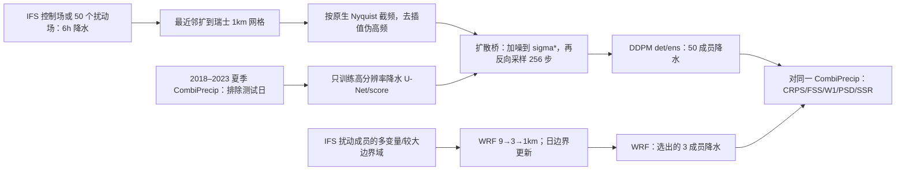

# 瑞士极端降水的第 1–3 周降尺度压力测试：非配对扩散桥与 WRF

> Mauricio Lima、Marika Koukoula、Romain Pilon、Monika Feldmann、Erwan Koch、Daniela I. V. Domeisen、Tom Beucler，*Stress-Testing Dynamical and Generative Downscaling Using Subseasonal Extreme Precipitation Forecasts*，[arXiv:2609.11696v1](https://arxiv.org/html/2609.11696v1)，2026-09-10 首发；36 页、12 图、6 表，作者标注已投 *JAMES*，**目前按预印本收录，不冒称正式发表**。原文阅读：2026-09-25。论文声明[作者代码 DOI](https://doi.org/10.5281/zenodo.22687888)，本次无法独立打开该记录，以下实现细节仅据论文正文/附录。

## 1. 研究问题与结论先行

论文不是训练一个从观测初值独立运行 21 天的天气模型，而是把现有 ECMWF IFS **0、1、2、3 周提前量**的降水预报降尺度到瑞士约 1 km 网格，并比较两条路线：WRF 物理模式三层嵌套到 1 km；扩散模型只用瑞士高分辨率降水资料训练，推理时再接受 IFS 降水作为条件。验证只涵盖 **2018-06-11/12 和 2021-06-28/29 两次极端事件各 48 小时**。前者是近乎滞留的多单体对流，后者是更有组织的超级单体/弓状回波；不能从两个选定个例推出全年、其他季节或所有瑞士暴雨的泛化性能。[摘要、§2](https://arxiv.org/html/2609.11696v1)

最重要的反例是：**扩散式降尺度确实改善细尺度结构与部分分布指标，但不保证 fair CRPS 提高。**第 3 周 2018 年 WRF 的 CRPS skill 为 **0.32**，明显高于原 IFS 集合及 DDPM 集合的 **0.18**；2021 年则原 IFS 与 DDPM 集合都为 **0.17**，WRF 仅 **0.04**。这项工作支持“按事件物理形态选择降尺度工具”，不支持“扩散总是更准”或“第 3 周暴雨已可稳定定位”。[原文表 2、§6](https://arxiv.org/html/2609.11696v1)

## 2. 数据链和验证协议

| 资料 | 原文做法 | 应保留的限制 |
|---|---|
| CombiPrecip 真值 | 瑞士雨量计＋雷达融合，原始 **1 km/1 h**；先聚合为 **6 h**，从 CH1903+/LV95 坐标转经纬度，在 **5.9–10.6°E、45.8–47.9°N** 区域用二维线性插值到规则格网。评分时把 **0–0.1 mm/h** 的微雨截为 0，以降低雷达弱雨不确定性。 | 这仍是有观测误差的融合产品，不是点站实况；除频谱评分外，弱雨阈值会改变分布与空间指标。 |
| ECMWF S2S IFS | 2018 事件用 **cy43r3**，2021 用 **cy47r2**；控制成员为 `IFS det`，扰动 **50 成员**为 `IFS ens`。原生约 **0.15°**（瑞士约 11×16 km）；地表量包括降水为 **6 h**，高空场为日尺度。 | 模式循环不同是个例比较边界。原始场仅最近邻插值到 1 km 作评分，`IFS + NNI` 并未真正创造 1 km 技巧。 |
| 起报和事件 | 对每个事件固定从首日 **00 UTC** 起的 **48 h** 验证窗，取从 0 天、1、2、3 周前的四组预报。 | “3 周”是起报提前量；评分目标仍仅一次事件的 48 h 降水，不是整整第 3 周的平均或所有日的 21 天逐日技巧。 |
| 扩散训练集 | **2018–2023 六至八月**瑞士 CombiPrecip 高分辨率图，移除两次目标事件日期；训练不使用 IFS–CombiPrecip 成对样本。气候态按该训练集各像素经验均值构造。 | 排除两个事件日期不是留出整年；同年/同季相似过程仍在训练中。模型只学习区域降水先验，不能称零样本迁移到其他地理区域。 |

原文以同一高分辨率真值/区域/48 h 窗评分五种产品：`IFS det + NNI` 一条确定性序列、`IFS ens + NNI` 50 成员、`DDPM det` 从一个 IFS 控制场各抽 50 个噪声样本、`DDPM ens` 对 50 个 IFS 扰动场各抽一个样本、WRF 从 50 个扰动成员按目标区域平均降水选**最干/中位/最湿**三成员驱动。两个 DDPM 产品是**同一套扩散权重**的两种条件采样，不是两次训练或分别微调；WRF 的三成员不是随机抽样，构成比较解释的重要限制。[§4.1、§5、表 1、图 3](https://arxiv.org/html/2609.11696v1)

## 3. 原创结构图：信息从哪里进入模型

图据[原文§2–5、图 2–5、表 1](https://arxiv.org/html/2609.11696v1)自绘，不是原图转载。它特别显示公平性并不完美：扩散只看瑞士降水切片；WRF 用更广域、更丰富的三维/陆面信息，却只能负担 3 成员。虽然扩散训练**非配对**、没有学习某个 IFS 循环的误差映射，但部署时仍要用 IFS 条件，不是无初值生成。

## 4. 扩散数据处理、结构、训练、采样和微调

### 4.1 预处理与后验条件

IFS 降水先最近邻插值到 CombiPrecip 网格；最近邻只增像素，不增实际空间信息，还引入阶梯形人工高频。作者随后做二维离散 Fourier 变换，只保留原低分辨率场 Nyquist 频率以内的波数，逆变换得到平滑条件场；图 4 给选择噪声尺度的功率谱依据，图 5 展示最近邻→低通的形态差异。扩散桥不是把 IFS 场与 CombiPrecip 配对学习输入到输出，而是把这个 IFS 条件加噪到 `σ*`，再沿学得的高分辨率降水先验反向生成。作者选择“高低分辨率谱近似接合”的波长 `λ*≈200 km`；也考虑约 30 km，最终采用 200 km 因图上小尺度更充分，但噪声越高也越可能偏离原 IFS 大尺度约束。**相同 λ* 被用于所有 lead 与 det/ens 产品，没有逐个例/逐 lead 校准。**[§4.2.2–4.2.3、图 4–5](https://arxiv.org/html/2609.11696v1)

### 4.2 网络和明确给出的参数

| 环节 | 可核数值/机制 | 未披露或协议注意 |
|---|---|---|
| 高分辨率 score 网络 | U-Net 内部固定 **224×336**；四尺度特征通道 **32/64/128/256**、每尺度 **6** 个残差块、瓶颈 **8 头注意力**；噪声级用 **128 维 Fourier 嵌入**进入残差块，按 `σ_data=0.31` 作预条件。 | 这是 score 网络，不是从 IFS 配对样本训练的图像翻译器；论文未给可靠可核的总参数量/每层卷积完整清单。 |
| 噪声与损失 | 正向噪声标准差按正切型日程映射至 `[0,100]`；训练时噪声按**对数均匀**采样，最低 `1e−4`。目标是恢复高分辨率 CombiPrecip 扰动状态的 score/去噪信息。附录 D 式 (19) 给 Karras 式权重 `(σ_data²+σ²)/(σ²σ_data²)`。 | 同一附录的式 (18) 文字又把 `λ(t)`写成 `1/σ(t)²`，与随后式 (19) 不同；复现须核对作者代码/最终实际损失，不能假装两式完全相同。 |
| 优化 | **Adam、batch 2、1,000,000 steps**；LR 0→`1e−4` 用前 **1000 步**线性预热，再余弦降至 `1e−6`；参数 EMA 衰减 **0.99**，EMA 权重用于采样。单 **A100** 约 **10 小时**一次训练。 | 原文未给 Adam β、weight decay、样本随机种子或训练/验证按年份划分，不补造。 |
| 推理 | 反向 SDE 用 **Euler–Maruyama 256 步**、Karras `ρ=7` 网格，采样最低噪声 `1e−3`；同一 U-Net 分别产 `DDPM det/ens` 各 50 成员。 | `1e−3` 是采样下界，不是上面的训练 `1e−4`；两种 50 成员的离散来源不同。 |
| 微调 | **未实施**单独的 IFS 配对微调、事件微调或第 3 周专用微调；`λ*` 是推理条件选择，不改变权重。 | “非配对”只表示训练不需要 IFS–观测配对，不意味着对任意地区/资料源零成本直接泛化。 |

以上按[附录 B–E、§4.2](https://arxiv.org/html/2609.11696v1)整理。作者说训练集仅 2018–2023 夏季且排除目标日期，并未详细披露降水网络输入的独立标准化统计、负雨/异常像素处理或代码可核版本；这些是复现缺口，不能用其他扩散论文的默认变换填补。

### 4.3 WRF 对照的参数同样重要

WRF **v4.4** 采用单向嵌套 **9→3→1 km** 三层域、**35 个**地形跟随垂直层、顶层 **50 hPa**、最低层约 20 m；先 **12 h spin-up**，外域大尺度 IFS 压层边界按 **24 h** 更新。外域时间步 **9 s**、两个内域 **4 s**。微物理为 Thompson double-moment，边界层 YSU，地表 Revised MM5/Noah-MP，辐射 RRTMG，并显式开启湖泊；外域需积云参数化，内域不使用该参数化。附录表 6 说明 WRF 输入远非降水一场：Z/U/V/T/Q/R 六类三维场取 **1000、925、850、700、500、300、200、100、50、10 hPa**，另有 SST、四层土温/土湿、雪/云/地表等。[§4.1、附录 A 表 6](https://arxiv.org/html/2609.11696v1)

WRF 在本文是固定物理配置，并非神经网络，没有“预训练/微调权重”。论文未报告对这两个事件系统搜索微物理/边界层组合；单成员模拟在多线程 HPC 上约 **24 小时**。与扩散 50 成员 10/20 分钟的墙钟时间不是同硬件、同资源成本归一化比较。[§4.1、§6](https://arxiv.org/html/2609.11696v1)

## 5. 评分协议：不把不同指标合成一个“最佳”

原文用经验 **fair CRPS**，成员间项按 `N(N−1)` 修正，以降低不同成员数造成的系统偏差；确定性 `N=1` 时退化成 MAE。对 CRPS、Wasserstein-1 分布距离和成员平均功率谱距离，论文再相对训练集像素气候态计算 `skill=1−metric_model/metric_climatology`，**正值表示胜气候态、负值表示更差**。avFSS 用 **15×15 个 1 km 像素**邻域衡量降水阈值超过率；SSR 用集合离散度/集合均值误差且含成员数修正，**越靠近 1 越好**，不是数值越大越好。W1 汇总成员、空间、时间分布，所以能看总体雨量分布，却不直接惩罚“把强雨移到错误山谷”；谱距离看空间尺度能量，不单独检验事件位置。[§3](https://arxiv.org/html/2609.11696v1)

### 5.1 完整 CRPS 技巧表：两次事件 × 三个 lead

下表为[原文表 2](https://arxiv.org/html/2609.11696v1)逐项转录的 **CRPS skill vs. 气候态，无量纲、越高越好**；0 天列原文亦有，但扩散/WRF 均不提供 0 天值，故这里专列主问题的 1–3 周。

| 产品/成员数 | 2018：1 周 | 2018：2 周 | 2018：3 周 | 2021：1 周 | 2021：2 周 | 2021：3 周 |
|---|---:|---:|---:|---:|---:|---:|
| IFS det+NNI / 1 | 0.00 | 0.02 | −0.04 | 0.00 | −0.12 | −0.12 |
| IFS ens+NNI / 50 | 0.21 | 0.20 | 0.18 | 0.15 | 0.13 | 0.17 |
| DDPM det / 50 | 0.11 | 0.05 | 0.04 | 0.00 | −0.16 | −0.03 |
| DDPM ens / 50 | 0.23 | 0.19 | 0.18 | 0.15 | 0.13 | 0.17 |
| WRF / 3（挑最干/中/最湿） | **0.27** | 0.14 | **0.32** | 0.01 | 0.01 | 0.04 |

2018 年 2 周最佳其实是原 IFS 集合 **0.20**，DDPM 集合 **0.19**；2021 年 3 周 DDPM 集合只是**维持**原 IFS 的 **0.17**，没有在 fair CRPS 上增加技巧。图 6 展示第 3 周的形态，但图中集合只挑每个产品**总雨量最高的一个成员**；视觉上的精细结构不能代替上述全成员评分。[§5、图 6、表 2](https://arxiv.org/html/2609.11696v1)

### 5.2 第 3 周其他三个量：读出优点也保留负面值

| 产品 | 2018 W1 skill | 2018 谱 skill | 2018 SSR | 2021 W1 skill | 2021 谱 skill | 2021 SSR |
|---|---:|---:|---:|---:|---:|---:|
| IFS det+NNI | 0.39 | −0.05 | — | 0.43 | −0.50 | — |
| IFS ens+NNI | 0.31 | −0.12 | 0.40 | 0.24 | −0.18 | 0.39 |
| DDPM det | 0.50 | 0.22 | 0.22 | **0.50** | −0.17 | 0.20 |
| DDPM ens | 0.36 | 0.09 | 0.60 | 0.31 | **0.01** | **0.62** |
| WRF | **0.79** | **0.23** | **1.04** | −0.01 | −0.34 | 0.29 |

W1/谱/SSR 数值分别来自[原文表 3/4/5](https://arxiv.org/html/2609.11696v1)。**SSR 的最佳是最接近 1**：2018 的 WRF 1.04 很接近理想，2021 的 DDPM ens 0.62 为该列最高却仍明显欠离散。2021 年第 3 周的谱评分中 DDPM ens 仅 **0.01**，表明它刚胜训练期气候态而非已精确重建超级单体小尺度结构；WRF 为 **−0.34**。原文表 5 把 0 天列头写作“1-day”，表注却称 0-day；本笔记主表不使用该争议列。频谱分析特意**不执行 0.1 mm/h 微雨截断**，与其他指标的处理不同。[表 4–5、§3.4](https://arxiv.org/html/2609.11696v1)

### 5.3 图 1–12 的阅读线路

图 1 是真值、像素气候态与 IFS 原始第 0–3 周强雨形态；图 2–3 是 WRF 嵌套域及三成员选取规则；图 4–5 是 IFS/真值功率谱交接波长与最近邻/滤波预处理；图 6 为第 3 周**最高雨量成员**地图，补图 9–10 给第 1/2 周同类图；图 7、补图 11–12 把两事件拼接计算谱，作者说所有模型在 **小于约 2 km** 的波长偏离 CombiPrecip；图 8 在 **15 km** 邻域上显示 DDPM 对其原始 IFS 条件的 avFSS 提升，WRF 在较高雨强阈值也有优势，但再往更高阈值各方法 FSS 接近零。作者报告将邻域从 15 改 30/45/60 km，定性结论大体不变。以上是图意同步，不转载原图、不对曲线补造精确表值。[§5、图 1–8、补图 9–12](https://arxiv.org/html/2609.11696v1)

## 6. 方法学判断与可复验边界

1. **两事件是压力测试，不是气候统计**。一个近滞留多单体、一个传播型超级单体，且只各 48 小时；“没有随 lead 单调退化”是这组极端条件下的观察，不能推广为第 3 周普遍无误差增长。两个事件还用不同 IFS 循环。[§2.1、§6](https://arxiv.org/html/2609.11696v1)
2. **输入与成本不等价**。WRF 用广域多变量物理边界和 3 个按雨量跨度挑选的成员；扩散只用瑞士域降水，输出 50 个噪声/IFS 成员。fair CRPS 修正集合数偏差，但不能消除空间信息与成员选样策略差异；24h 多核 CPU vs 10/20min GPU 墙钟也不是同成本比较。[表 1、§4/§6](https://arxiv.org/html/2609.11696v1)
3. **训练来源与可迁移性**。扩散不需 IFS–观测配对，是跨驱动产品有潜力的设计；但只训瑞士夏季、没有外区盲测，且 `λ*` 是对这组 IFS/CombiPrecip 谱挑选的。因此“无需模型专属微调”不等于“无需区域再训练/参数再标定”。[§4.2、§6](https://arxiv.org/html/2609.11696v1)
4. **主张与证据分开**。空间谱、W1、avFSS 改善说明结构/群体分布可更像高分辨率观测；第 3 周 2021 CRPSS 不增说明它没有同时改善总体概率分数。用户若要强降水风险阈值，还应检查极端分位、可靠性和空间位移损失。论文没有足以证明所有极端阈值都已校准的统计样本。[表 2–5、图 8](https://arxiv.org/html/2609.11696v1)

复现优先次序：锁定 IFS cy43r3/cy47r2 与两事件起报；确认 CombiPrecip 6 小时聚合和经纬格转换；用同一训练期像素气候态、弱雨阈值和 fair CRPS 公式重算原始/降尺度评分；检查附录 D 两处损失权重表达是否与作者代码一致，并测试 `λ*=30/200 km` 敏感性；扩展到多个年份/区域及同成本成员子采样。此处是我的后续验证建议，不是论文已做的额外试验。

[返回首页](../../README.md) · [返回总表](../../气象大模型_中期预报论文追踪.md)
