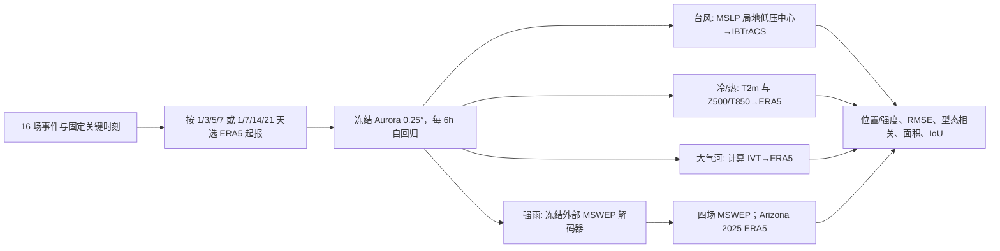

# Aurora 十六场极端事件诊断：第 14–21 天环流型尚可，地表极端幅度塌缩

> Qin Huang, Moyan Liu, Yeongbin Kwon, Upmanu Lall. *Evaluating the Predictability of Selected Weather Extremes with Aurora, an AI Weather Forecast Model*. [*Atmosphere* 2026, 17(8), 716，正式发表 2026-07-23](https://doi.org/10.3390/atmos17080716)；[arXiv:2603.06516，2026-03-06 初版](https://arxiv.org/abs/2603.06516)。阅读与核验日期 2026-09-25。以期刊正式 HTML 为准；出版社列出 S1–S7 独立补充材料，本次补充下载返回 429，故补表未取得的逐格值不填造。

## 先说结论与归档理由

这是一篇**冻结已有 Aurora 模型的诊断性评测，不是新的天气模型训练论文**。作者选取 16 场物理机制不同的极端天气，检验台风、冷潮/热浪、大气河与强降水。只有四场地表温度极端延伸到 **14 和 21 天**；台风、大气河、降水均只检验 **1–7 天**，不能把论文标题下全部 16 场都说成有 S2S 技巧。最关键结果是：四场温度极端的平均空间型态相关从第 1 天约 **0.97** 到第 21 天仍约 **0.77**，但越过危险温度阈值的平均 IoU 从 **0.91** 坠至 **0.14**。即“环流型大致还在，地表极端幅度与受灾范围已经不可靠”。[正式摘要、§3.2、Fig. 8](https://www.mdpi.com/2073-4433/17/8/716)

本条归在 `s2s/`，因为其独特的诊断是第 14–21 天**次季节前段**的温度极端失真；第 1–7 天其他事件提供对照，并非完整的 21 天全球多变量评测。样本是按物理多样性**有目的选出的 16 个案例**，不是随机、可代表总体的回报样本。论文没有对所有案例做同初值 IFS/GFS 系统对照，故不能据这 16 场声称 Aurora 在业务中普遍胜/负于 NWP。[正式 §2.1、§4.5](https://www.mdpi.com/2073-4433/17/8/716)

## 1. 数据、预处理及“训练集内/外”定义

**模型输入和网格**：调用 Microsoft 公布的 **Aurora 0.25° 预训练模型**，全球 `721×1440`，00/06/12/18 UTC 每 6 小时自回归一步；每次预报以 ERA5 大气状态起报。输入包括地面 T2m、U10/V10、MSLP；高空温度、水平风、比湿、位势高度等 13 层（50–1000 hPa）；静态海陆掩膜、土壤类型、地表位势。大尺度天气与锋面可表达，但 0.25° 对 10–50 km 对流系统及山地雨强无法充分解析。作者没有为本研究重训、微调、偏差订正或做事件专门适配。[正式 §2.2](https://www.mdpi.com/2073-4433/17/8/716)

**16 个案例 = 4 台风 + 4 温度极端 + 3 大气河 + 5 强雨**。四台风为 Sandy 2012、Amphan 2020、Ian 2022、Hinnamnor 2022；四温度案例为欧洲“Beast from the East”2018、Texas 冰冻 2021、British Columbia 热穹顶 2021、西南欧热浪 2023；三大气河为 Iran 2019、California 2022/2023；五强雨为 Pakistan 2010、Sudan 2020、西欧 2021、Appalachian 2022、Arizona 2025。选择条件是灾害影响、极端程度、ERA5 可用性与动力机制多样性；因此各类别、地区和样本年都不平衡。[正式 Table 1、§2.1–2.3](https://www.mdpi.com/2073-4433/17/8/716)

**训练集内/外不是随机分组**：作者以 Aurora 所引 ERA5 训练期 **1979–2020** 将事件标成 2020 年及以前“in”、2020 年以后“out”。这一划分还可能受 Aurora 其它异构预训练资料影响，且训练期内案例的 ERA5 再分析也用于验证，所以不能把“in”组当真正封存测试。更直接的混淆是：组内两场强雨是大尺度季风，组外不少强雨是中尺度对流或切断低压；难度与过程类型同时变化。论文因此明确说强雨组的内外差异**不能单纯归因于时间泛化**。[正式 §2.1、§2.4、§4.2](https://www.mdpi.com/2073-4433/17/8/716)

**真值并不完全同源**：T2m、IVT、格点场以 ERA5 为主，台风路径单独对 NOAA **IBTrACS** ；降水不是 Aurora 原生输出，而是接[另文训练的轻量降水解码器](https://github.com/lehmannfa/aurora-lite-decoder)，其学习目标是 **MSWEP V3**，因此四场可回溯强雨主要对 MSWEP 验证。Arizona 2025 因 MSWEP 尚未就绪改对 ERA5 验证，其雨强对比不能与其余四场无缝合并。作者对 ERA5 台风中心与 IBTrACS 作约 50 km 内检验，也将 ERA5 T2m 与站点、ERA5 IVT 与卫星估计作合理性检查，但主要量化表仍以再分析/解码器训练目标为准。[正式 §2.3–2.4、§3.1.5](https://www.mdpi.com/2073-4433/17/8/716)

## 2. 完整实验流程：这里有没有训练或微调？

**没有新模型训练**。论文调用公开 Aurora 权重与已经训练好的降水解码器；本研究只做 ERA5 起报、6 小时滚动、事件提取和评分。不要把 Aurora 原始论文的预训练轮次、LoRA 微调，或解码器原作者的训练参数，写成本篇 16 事件实验“作者重新训练”流程。若要复现原模型，可分别阅读本库的 [Aurora 底座笔记](../medium-range/01-aurora.md)和[解码器源码](https://github.com/lehmannfa/aurora-lite-decoder)；本篇未公开**每场使用的完整运行脚本、最终处理数组或冻结权重的精确 hash**，故仍无法仅靠正文逐位复现。[正式 §2.2–2.4、Data Availability](https://www.mdpi.com/2073-4433/17/8/716)

作者统一采用**两阶段评估设计**：Stage 1 固定灾害关键时刻，向前改变起报日期，比较不同 lead 对同一灾害目标的预报；Stage 2 对台风加入 00/06/12/18 UTC 亚日尺度起报敏感性，对温度、大气河、强雨加入空间和物理机制分析。台风、AR、强雨设 **1/3/5/7 天**，温度极端设 **1/7/14/21 天**。21 天意味着最多 **84 次 6h 自回归**，这解释为何“长期误差累积”是合理候选机制，但不能由此单独证明幅度塌缩完全由网络结构而非训练分布/混沌造成。[正式 Fig. 1、§2.1–2.3](https://www.mdpi.com/2073-4433/17/8/716)

以下为依据 Fig. 1 与 §2 自绘的**评估而非训练**流程图，不复制原始图：

**评分指标不能互换**：台风路径误差用球面距离，登陆位置误差与预报自身 `+24h` 位置误差也不相同；强度另看 MSLP 与最大 10m 风。温度阈值为寒潮 **0/−5/−10 °C**、热浪 **30/35/40 °C**；IoU = 预测与真值超阈值交集/并集，要求位置和面积同时对。型态相关是格点 Pearson，几乎不反映振幅，所以必须与 RMSE、偏差、阈值面积并看。强雨统一以 **1 mm/6h** 算一项 IoU；该低阈值并非极端暴雨阈值，不能据高 IoU 证明极端雨量命中。[正式 §2.3–2.4、补充材料 S2 的正文引用](https://www.mdpi.com/2073-4433/17/8/716)

**计算环境**：全部实验在单张 80 GB A100 进行，作者称 16 事件各 lead 加起报敏感性试验合计约 **35 分钟**；台风 7 天单次滚动约 30–40 秒，温度 21 天约 90–120 秒，带解码器的 7 天雨量预报仍不到 2 分钟。这里是已经训练好模型的推理耗时，不包括 Aurora 原始预训练、ERA5 下载处理或业务实时观测链。[正式 §3.5](https://www.mdpi.com/2073-4433/17/8/716)

## 3. 中期—次季节核心表：四场温度极端何时失去危险幅度

下表从正式 §3.2 与 Fig. 8 的**文中明确数字**摘出关键对照，不从折线图反推伪精确全量表。即使 14/21 天还能画出部分高低压结构，也不代表地面极端阈值位置/面积有用。[正式 §3.2、Figs. 3–4、7–8](https://www.mdpi.com/2073-4433/17/8/716)

| 温度事件/时效 | 型态相关（对 ERA5） | 危险阈值面积或 IoU | 幅度偏差与解读 |
| --- | ---: | --- | --- |
| 四事件平均，第 1→21 天 | **0.97→0.77** | 平均 IoU **0.91→0.14** | 群体均值只来自四个精选案例 |
| 2018 欧洲寒潮，14 天 | **0.875** | 0 °C 以下面积：Aurora **10.6%**，ERA5 **68.5%**；IoU **0.157** | **+6.88 °C** 暖偏，寒潮幅度大量消失 |
| Texas 2021 寒潮，14 天 | **0.728** | 结冰面积 **0.2% vs ERA5 78.7%**；IoU **0.002** | **+11.62 °C** 暖偏，关键影响区基本漏掉 |
| Texas 2021 寒潮，21 天 | **0.852** | 结冰面积 **3.2%**；IoU **0.038** | 相关回升而阈值性能仍很差，示范两指标脱钩 |
| 西南欧 2023 热浪，14→21 天 | **0.738→0.793** | 30 °C 面积 14 天 **50.1% vs 57.1%**，IoU **0.625**；21 天面积 **1.3%**，IoU **0.018** | 该案例 14 天尚保留部分面积，但第 21 天塌缩 |
| British Columbia 2021 热浪，14 天 | **0.800** | IoU **0.024** | **−10.63 °C** 冷偏；与西南欧热浪形成反例 |

因此不能说“所有 14 天热浪都已经崩溃”——西南欧 2023 的 14 天 IoU 仍 0.625；也不能说“相关系数 0.8 左右说明灾害可预警”，Texas 14/21 天给出直接反例。Fig. 7 是**概念示意图，不是新实验数据**；Fig. 8 才是四类别 12 个面板的作者定量汇总。论文还写欧洲寒潮在 14 天保留斯堪的纳维亚阻塞脊（Z500 异常 >150m）和南移急流、Texas 大尺度脊/急流也有形态，但 T2m/T850 极端没有同步保持。这个“环流型—地表影响”差异比单一平均 RMSE 更有业务意义。[正式 §3.2、Figs. 7–8](https://www.mdpi.com/2073-4433/17/8/716)

## 4. 其余四类结果与负例：时效只到 7 天

| 类别 | 具体结果 | 需要同时看到的限制 |
| --- | --- | --- |
| 台风路径与强度 | 1 天登陆位置误差 Sandy **21.5 km**、Ian **37.3 km**、Amphan **55.6 km**；Sandy 3 天升至 **243 km**；Hinnamnor 3 天 **1690 km**、5–7 天 **1816–1925 km** | Ian 的低误差来自相对直行、好预报的轨迹；Hinnamnor 脊—槽相位导致转向失败。`+24h` 位置误差与“登陆位置”不是同一指标 |
| 台风强度 | Ian 1 天 MSLP **+2.3 hPa**、风 **−4.0 m/s**；Sandy **+3.6 hPa/−1.7 m/s**；Amphan 3 天 **−6.3 hPa/+4.5 m/s** | 大西洋两例偏弱，印太两例偏强；符号随海盆不同，不能用统一强度偏差修正 |
| 大气河 | 三例 1 天大尺度 IVT 相关 **0.98–0.99**，RMSE **16.5–32.9 kg m⁻¹ s⁻¹**；5 天相关仍约 **0.84–0.85** | California 2022 的 7 天**登陆区域** IVT 偏差达 **−314.9 kg m⁻¹ s⁻¹**，2023 例仅 **−18.8**；区域与大尺度评分范围不同 |
| 强雨 | Pakistan/Sudan 组内 1 天相关 **0.54–0.56**，1 mm/6h IoU **0.69/0.25**；西欧 2021 相关/IoU **0.39/0.32**，Appalachian 2022 **0.03/0.22** | Arizona 2025 为 **0.21/0.42**，但对 ERA5 而非 MSWEP 验证；峰值 **5.2 vs 34.8 mm/6h**，约低估 7 倍，低阈值 IoU 掩盖幅度失败 |

[正式 §3.1、Figs. 2、5、6、8](https://www.mdpi.com/2073-4433/17/8/716)。大气河的“结构还在而强度减弱”在 5–7 天可见，但**不是已验证的大气河 14–21 天现象**。强雨也不能概括为所有事件都呈同一型态—幅度背离：论文 §4.5 指出降水的相关与 IoU 并非五例稳定分叉，而是个例依赖。组内/组外强雨的机制差异太大，尤其 Appalachian 中尺度对流与 Arizona 地形性切断低压，不能简单认定“模型记住训练年、不能泛化到新年份”。[正式 §3.2、§4.2、§4.5](https://www.mdpi.com/2073-4433/17/8/716)

## 5. 模型结构与性能图表的证据地图

| 原文图/表 | 应对应的技术或物理问题 | 不能外推的东西 |
| --- | --- | --- |
| Table 1 / Fig. 1 | 16 案例库存、各自 lead、固定目标时刻＋变起报/亚日敏感性评测流程 | 不是随机抽样或全类别 21 天 |
| Fig. 2 | 四台风 1/3/5/7 天轨迹对 IBTrACS；Hinnamnor 转向失败 | 单个登陆误差不能变成台风年平均技巧 |
| Figs. 3–4 | Texas 冰冻、西南欧热浪的 ERA5/预测/差值空间图，1/7/14/21 天 | 结构图有脊不代表寒潮/热浪强度和面积可信 |
| Fig. 5 | California 2023 大气河 IVT 1/3/5/7 天结构/差值 | 其 7 天优于 2022 案例不意味着全部 AR 都相同 |
| Fig. 6 | Arizona 2025 降水 1/3/5/7 天图；峰值严重漏报 | 图上有雨区不代表雨量级别命中，且真值改用 ERA5 |
| Fig. 7 / Fig. 8 | Fig. 7 为型态—幅度分离概念图；Fig. 8 的 12 面板才是 TC、T2m、AR、降水按 lead 的误差/相关/偏差/IoU | 不要把 Fig. 7 曲线当实测或跨不同真值的 Fig. 8 面板合并排行 |
| 补充 S1–S7 | 模型表、指标定义、温度/IVT/降水细表、Texas GFS 对照 | 本次独立补充文件 429，未核验逐格数值或新图 |

表中图表与链接均指向[期刊正式全文](https://www.mdpi.com/2073-4433/17/8/716)。正文可见 Fig. 8 的图注把 **四类事件类别**（TC、温度、AR、降水）分成 12 面板；若把冷潮/热浪分开，研究问题可数成五种极端类型。这个分类口径差别不影响 **16 个事件**的总数。[正式 Fig. 8 图注](https://www.mdpi.com/2073-4433/17/8/716)

## 6. 解释边界与可执行复现方案

作者认为长期幅度趋近气候态可能来自确定性 MSE 训练在不确定性增长下回归条件均值、ERA5 对极值的平滑、6 小时自回归误差累积、0.25° 对流/地形分辨率不足，以及极端过程在训练集中稀少；这些是**机制解释与待检验假说**，不是本研究通过随机对照分别识别出的因果贡献。Fig. 8 确认的是诊断现象，不能据此断言改用单一概率损失或多 lead 解码头就一定恢复 21 天极端技巧。作者在 §4.6 提议冻结底座、训练特定 lead 解码器及概率输出，但**本篇没有实际实施这些微调实验**。[正式 §4.3、§4.6](https://www.mdpi.com/2073-4433/17/8/716)

业务外推有三个核心障碍。第一，样本仅 16 场，且只有四场长 lead 温度极端，无法估算全国/全球总体危险阈值技巧或置信区间。第二，除 Texas 2021 的补充 GFS 对照外，缺少对全部案例的相同起报/相同真值 IFS/GFS 原始预报比较；文中引用 NHC 年平均属于**背景参照，不是事件配对基线**。第三，温度/IVT 使用 ERA5，强雨主要用解码器训练目标 MSWEP，Arizona 改 ERA5，台风用 IBTrACS，评分资料不能混合为同一“观测真值”排行榜；全部派生指标只向作者索取，没有公开处理结果。[正式 §2.4、§4.5、Data Availability](https://www.mdpi.com/2073-4433/17/8/716)

如要验证“中期到 S2S 极端可预报性”，下一步应预注册更多独立年份/过程类型的事件清单，确保大尺度季风与中尺度对流在训练期内外各有匹配样本；在同初值、同 0.25° 网格、同统计窗口、同真值下加入归档 IFS/GEFS 与 Aurora 概率扩展，分别报告第 1–21 天 T2m 相关、RMSE、阈值面积、IoU、召回/虚警，以及 Z500 环流和观测站/雷达/MSWEP 不同真值敏感性。若做 lead 专用头或极端加权微调，必须明确冻结范围、训练期、目标资料、损失、参数与计算成本，且用独立封存年评估。当前论文提供的是**很有价值的失效诊断**，并未完成这一新系统训练和公平业务验证。

[返回首页](../../README.md) · [返回总追踪表](../../气象大模型_中期预报论文追踪.md)
