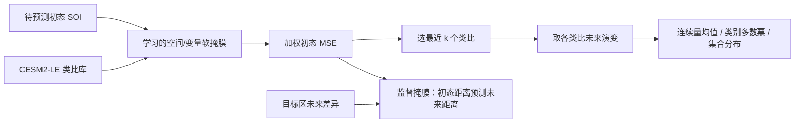

# AI-informed model analogs：学习“找相似天气”的空间权重，而不是直接生成未来场

> Jacob B. Landsberg、Matthew Newman、Elizabeth A. Barnes，*AI-informed model-analogs for understanding subseasonal-to-seasonal jet stream and North American temperature predictability*，[*Machine Learning: Earth* **2(1), 015007**](https://doi.org/10.1088/3049-4753/ae4805)，正式发表 **2026-03-11**。预印本 [arXiv:2506.14022v3](https://arxiv.org/html/2506.14022v3) 于 **2026-04-03** 更新，v1 于 **2025-06-16**、v2 于 **2025-12-10** 提交；下文方法/数值以 v3 全文及内嵌补充材料为阅读底本，正式发表书目信息按[出版社记录](https://doi.org/10.1088/3049-4753/ae4805)和[NOAA PSL 出版目录](https://www.psl.noaa.gov/mjo/References/)核对。复核日期：2026-09-25。arXiv 页的旧“1(1), ae4805”与出版社/NOAA 的“2(1), 015007”不同，引用正式版应以后者为准。

## 1. 研究问题

经典类比预报从历史/模拟档案寻找初态相似的样本，再用其后续演变组成预报集合；困难在于“哪里相似”不能只凭目标区、整个全球或先验遥相关区域决定。作者让很小的神经网络学习一张**任务特定、平均权重固定为 1 的全球软掩膜**，用它衡量两个初态的加权距离。研究不是训练一个端到端天气生成器，而是提高类比选择和解释月尺度可预报来源。[v3 Methods 2.2–2.4](https://arxiv.org/html/2506.14022)

这是依据原文 Figure 1–2 自绘的方法图。网络学习时成对输入状态，通过掩膜后的初态 MSE 经非负线性层预测未来目标区 MSE；与真实未来差异比较，且限制线性层非负，保证“近的初态应对应更近的未来”与类比检索逻辑一致。推理阶段并非让该网络输出预测场，而是按学习的距离排序取 `k` 个类比轨迹。[v3 Figure 1–2](https://arxiv.org/html/2506.14022)

## 2. 数据、任务和验证

**月尺度资料**：CESM2-LE 取 **1850–2100** 的历史与 SSP3-7.0 情景模拟，利用全部 **100 成员集合均值**扣除共同外强迫/季节背景；为降低存储与训练成本，实际仅将 19 个成员放进类比库，另 14 个成员做待预测状态（SOI），其中 **10/2/2 个成员**按训练/验证/测试拆分，具体成员 ID 见补充 Table S2。月平均场用 CESM 原生约 **1.25°×0.9°** 网格，ERA5 双线性插值到该网格；两种来源都转成相对季节循环的异常，并在**每个格点除以其异常标准差**。ERA5 **1940-01 至 2024-09** 是第二套独立评测，按**每个日历月、每个格点拟合并扣除三次趋势**；因此 ERA5 是迁移测试，不是在 ERA5 上继续训练掩膜。CESM“完美模式”检验与 ERA5 迁移检验必须分开看；后者仍依赖 CESM 模拟库而非真实历史档案。[v3 Methods 2.3、补充 Table S2](https://arxiv.org/html/2506.14022v3)

**补充的逐日周 3–4 资料是另一套协议**：对输入作向后 **7 日滑动平均**，对目标作向前 **7 日滑动平均**，并用双线性插值降到 **2.5°×2.5°**；CESM2-LE 只取 **1850–1949**，每个日历日/格点去线性趋势；ERA5 只取 **1942–2023**，每个日历日/格点去三次趋势。二者再去季节循环并按格点异常标准差标准化。类比库 **5 成员**，SOI **2/1/1 成员**训练/验证/测试（补充 Table S3）。这与月尺度的 19/10/2/2 成员划分、时间覆盖和分辨率均不同，不能把两组结果当相同样本的跨时效曲线。[v3 补充 S1.1、Tables S2–S3](https://arxiv.org/html/2506.14022v3)

| 任务（原文 Table 1） | 初态 → 目标 | 时效与季节 | 输出/评分 |
|---|---|---|---|
| #1 美国中西部夏季气温 | skin temperature → 区域 skin temperature | Month 1，7–9 月 | 连续异常；MAE、CRPS 相对气候态技巧 |
| #2 北大西洋冬季急流 | skin temperature + U250 → 网格 U250 | Month 1–2，12–2 月 | 三分位分类；错误率、Brier skill |
| #3 南加州夏季气温（补充材料） | skin temperature → 区域 skin temperature | Week 3–4；六月第三周至九月第三周 | 冷/中/暖三分位分类；准确率与多类 Brier skill |

所有指标报相对于气候态的 skill score `1 − error/error_climatology`；正值才胜过气候态。连续任务计算 MAE 和 CRPS，分类任务计算误分类率和**多类** Brier Score，后者以各类相对频率形成概率。对照包含全球等权类比、只在目标区匹配的区域类比、持续性、气候态及随机类比；“随机类比 90 百分位”是 **100 次随机抽样结果的较优分位**，不是一次随机运行的平均。以不同 `k` 组成概率分布时，要区分连续预报的集合均值和分类的多数票。冬季 U250 任务在**北大西洋每个格点**分类后再汇总，不是先平均整个区域；其类比库三分位门槛用库内资料，测试标签门槛按测试资料本身定义，作者这样做为削弱 CESM–ERA5 分布偏移，但直接业务化需预先固定验证门槛。[v3 Methods 2.5、Results 3.2](https://arxiv.org/html/2506.14022v3)

## 2a. 真正被训练的网络：损失、超参数、微调边界

网络的输出不是气温/风的未来场，而是**对每个格点/变量的非负权重掩膜**。对于一对初态，先计算经掩膜加权后的全球状态距离；再用约束非负的线性映射预测二者未来目标区的距离，以真实未来距离的平方误差训练。权重均值约束为 1，避免全体权重同时缩小而使“距离”平凡地趋零。训练完成后固定掩膜，再在类比库上检索最近 `k` 个轨迹；**检索及集合聚合不进行梯度优化**。每个任务有自己的掩膜，不是一个网络零样本通吃三个任务。[v3 Methods 2.2/2.4](https://arxiv.org/html/2506.14022v3)

| 训练项 | v3 附表 S1 原值 | 作用 |
| --- | --- | --- |
| 优化器、学习率 | Adam，**`1×10^-4`** | 优化掩膜网络而非天气动力模型 |
| batch / 验证 batch | **32 / 1000** | 成对初态及目标未来距离的监督 |
| 基本损失 | MSE | 预测目标距离对真实目标距离 |
| early stopping | patience **30**，min delta **`1×10^-4`** | 用验证集防止掩膜过拟合 |
| 稀疏化附加实验 | 约束 `Σw=n` 时加入 `λ₂ / sqrt(Σw²)`；例图 `λ₂=100` | 鼓励少数格点较高权重；不是所有主结果必需步骤 |

训练/验证/测试拆分以 CESM2-LE **成员**为单位，月尺度的类比库 19 成员、SOI 训练 10、验证 2、测试 2；补充的第 3–4 周逐日任务改为类比库 5、训练 2、验证 1、测试 1，不能沿用月尺度成员数。ERA5 作为外部迁移测试；论文没有报告“在 ERA5 上再微调掩膜”的步骤，因此不能把 ERA5 测试优势解释为后续适配训练。作者[公开分析代码仓库](https://github.com/jlandsbe/S2S/tree/6b1753421f89ee2ce70a2c0a05b18fde0c4b7838)，但其 `experiments.py` 同时含多个观察、阈值和调参配置；不能把任一配置的 `max_epochs`、`patience`、输入字段等未经运行映射就宣称为论文所有主图统一设置。正文/附表明确给出的 Adam、学习率和 batch 等优先作为可核验基准；未在正文表格中逐项映射的 GPU、训练耗时和最终停止 epoch 仍应标为未披露/未核验。[v3 Methods 2.4、Table S1 与代码](https://arxiv.org/html/2506.14022v3)

## 3. 原文图表的定量信息

| 图/结果 | 作者报告 | 阅读时的限定 |
|---|---|---|
| Figure 4，Month 1 温度 | 相比传统类比的 **MAE skill** 在 CESM2-LE / ERA5 分别增加 17% / 51%，**CRPS skill** 分别增加 5% / 48%；多数组合以 50 个类比最优，CESM CRPS 为 100 个 | 是对 skill 的相对提升，不是温度误差减少同样比例 |
| Figure 5，极端样本 discard plot | ERA5 50 类比集合中，预测越极端，AI 选择相对区域类比的优势越大 | 以**预测**极端程度筛选；不能替代真实极端事件命中率 |
| Figure 7，Month 1–2 U250 | CESM2-LE / ERA5 的分类准确率技巧分别增加 6% / 1%，Brier 技巧分别增加 19% / 13%；多数设置 400 类比最佳 | 准确率增益在 ERA5 很小；仍要检查区域与统计显著性 |
| Figure 3、6，权重图 | 中西部气温重视本地及北半球中纬度、海洋大陆；急流任务中皮肤温度与北半球权重高 | 权重揭示模型利用的相关结构，不自动构成因果证明 |
| Figure 8–9，北大西洋消融 | 以 400 类比、CESM2-LE 的 Brier skill 为主，轻度稀疏化可略增益；删去 skin temperature 或 U250 都降低技巧，删去北半球/海洋温度影响尤其大 | 除训练时 inverse-L2 正则外，其余阈值/区域删减是在掩膜学成后做，不是每种消融都重新训练；ERA5 样本下影响过小，作者未作同等详细的定量物理归因 |
| 补充 Figures S2–S3，南加州周 3–4 | ERA5 的 1500 类比集合，全部样本的准确率技巧比气候态略高于 **4%**；只看集合一致度最高约 **25%** 样本升至 **9% 以上** | 是按**预测集合一致度筛样本**的条件技巧，不是每次起报都达到 9%；Figure S2 标题为准确率/Brier，而 S1.2 文字却写 MAE/CRPS 的 16/18/4/71% 增益，指标口径冲突，不转录为确定的分类效能数字 |

月尺度与第 3–4 周是不同任务，不应将一个任务的百分比直接外推到另一任务。作者还指出连续量的 `k` 过大时集合均值趋于气候态，而分类多数票可容忍更多类比；这解释最优 `k` 的显著差异。[v3 Results 3.1–3.2、Supplement](https://arxiv.org/html/2506.14022v3)

### 补充 Table S4：月 1 中西部温度与业务 S2S 模式的有限对照

下表按作者[补充 Table S4](https://arxiv.org/html/2506.14022v3)的 **MAE 相对气候态技巧分数**转录，**不是绝对温度误差**；最极端月份列只占预测中极端程度最高的 **15%**。NCEP 使用 **25 成员、1982–2010**，CAN/GEM 使用 **21 成员、1990–2023**，都重网格到 ERA5 格点、去趋势并转异常。不同模式的 lead 和年份不严格对齐，只能视为量级参照。

| 方法 | 作者表中 lead | 全样本 MAE skill | 预测最极端 15% 月份 MAE skill |
|---|---:|---:|---:|
| AI 类比 | 1 月 | **0.068** | **0.24** |
| NCEP-CFSv2 | 0.5 月 | 0.14 | 0.23 |
| NCEP-CFSv2 | 1.5 月 | 0.085 | 0.19 |
| ECCC-CanESM5 | 0.5 月 | <0 | 0.30 |
| ECCC-CanESM5 | 1 月 | <0 | 0.29 |
| ECCC-GEM5.2-NEMO | 0.5 月 | <0 | 0.23 |
| ECCC-GEM5.2-NEMO | 1.5 月 | 0.015 | 0.0015 |

因此全样本下 AI 类比**低于 NCEP 的两个列举 lead**、高于 CAN 与 GEM 的列举设置；在“最极端 15%”子集里 **CAN 的 0.30 高于 AI 的 0.24**。这些是不同年份/提前量的有限比较，不能称为与同条件业务模式全面打平或胜出。

## 4. 我的判断及下一步

本文的特色不是“大模型参数量”，而是以可解释的监督度量学习替换手工指定遥相关区域；对气温极端和急流型的潜在预测窗很有价值。局限包括 CESM2-LE 与 ERA5 的分布差、月均目标抹掉事件时间定位、用相关性权重解释物理机制的风险，以及类比库规模对效果和部署的制约。复现应固定 arXiv v3、成员划分与异常基期，报告绝对 MAE/CRPS/Brier 值及置信区间；尤其应将 learned-mask 与同容量的随机/先验区域掩膜比较，并测试不同气候强迫情景下的鲁棒性。[v3 Methods/Conclusions](https://arxiv.org/html/2506.14022)

[返回首页](../../README.md) · [返回总表](../../气象大模型_中期预报论文追踪.md)
