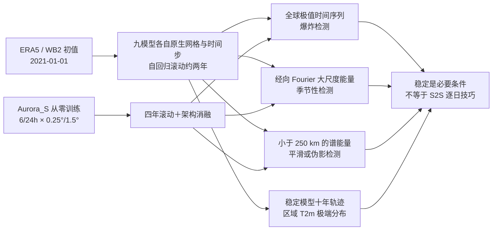

# 122｜九种 AI 天气模型超过两周的滚动预报：稳定、季节性与预报技巧不是一回事

> Fanny Lehmann、Firat Ozdemir、Yun Cheng、Torsten Hoefler、Sebastian Schemm、Benedikt Soja、Siddhartha Mishra，*Can AI Weather Models Predict Beyond Two Weeks? A Quantitative Benchmark and Analysis of Long Rollouts*。[arXiv:2605.30184v2 全文与附录](https://arxiv.org/html/2605.30184v2)，首发 **2026-05-28**、v2 **2026-06-05**；[作者指标代码固定提交](https://github.com/lehmannfa/ai-weather-stability/tree/240b8a420339ab9817a6ba8574f10be422c41147)。2026-09-25 核验。**这是一篇长时积分稳定性/气候统计的评测与消融论文，不是证明任一模型具有 30 天逐日天气预报技巧的新预报模型论文。**截至此次核查按预印本 v2 解读，不冒称同行评审正式版。

## 1. 问题、证据层级与独立贡献

多数 0.25°、6 小时步长的 AI 天气模型在 10–15 天 RMSE/ACC 上表现良好，研究者于是想把它们直接自回归积分到数周、数月或数年。然而“积分稳定”至少有三种不同含义：数值不爆炸、能跟上年循环、空间小尺度能量既不塌缩也不过度放大。作者把三者拆为可计算指标，对九种已有模型做同类长滚动，再从头训练小型 Aurora 变体，考察结构、时空分辨率和训练进度对这些指标的影响。[摘要、§3–5](https://arxiv.org/html/2605.30184v2)

研究对象是**预报轨迹的长期统计合理性**，不是每一天的相位正确性。两条轨迹在第 20 天之后天气形态完全不同，仍可都遵守季节统计；反过来，某模型在 10 天内有好 ACC，也可能第 16 天或第 40 天数值爆炸。因而本篇可为 S2S/气候模型筛选“能否安全滚动”的必要条件，却不能凭稳定天数给出第 3–6 周 ACC、CRPS 或可靠性结论。[§3、§7](https://arxiv.org/html/2605.30184v2)

本图依据论文 §§3–6 原创重绘。图中“约两年”是主文 **2021-01-01 起 730 天**的主实验，附录含五次初值/随机种子敏感性；图中的十年是极端分布统计轨迹，不是十年逐日预报核验。GenCast 的原生预报步长为 12 小时，而主文把 730 天概称 2920 个 6 小时步；具体 GenCast 前向次数不能未经实现核实就等同 2920。[§3、Appendix A/B/E](https://arxiv.org/html/2605.30184v2)

## 2. 数据、初值、模型版本与归一化边界

作者从 WeatherBench 2 获取 ERA5，主比较从 **2021-01-01** 出发，约 **730 天**、2021–2022 期间滚动，ERA5 作参考；九模型覆盖图 Transformer、ViT/3D Swin、SFNO、扩散、ConvNeXt+GRU，容量约 **3.5M–4.7B**，并**没有把各模型重新训练到同一数据/网格**。AIFS、Aurora、DLESyM 用各自推理仓库，其余主要经 Earth2Studio。表 A.1 将 AIFS 的训练上界写到 **2022**，所以 2021 主滚动并非对全部模型严格训练外；其余多模型也有不同训练期、变量集、强迫和原生时间步，横向稳定性排名不是受控架构实验。[§3、Appendix A、Data and Code Availability](https://arxiv.org/html/2605.30184v2)

| 主比较模型 | 表 A.1 容量、架构与网格 | 原论文/本研究的处理边界 |
|---|---|---|
| AIFS | Graph Transformer，**253M**，N320 约 31 km，6h | 表 A.1 训练期资料 1979–2022；不同变量的长滚动失效时刻差异极大。 |
| Aurora | 3D Swin，**1.3B**，0.25°，6h | 主比较用预训练底座；后述 **113M Aurora_S** 才是本文从零训练的新实验。 |
| FourCastNet | AFNO，**75M**，0.25°，6h | 先出现高频能量放大；论文单独将爆炸检测窗口缩短为 10 天。 |
| FuXi | 3D Swin 系列，表 A.1 报 **4.7B**，0.25°，6h | 表中容量是作者对系列的归纳，不能代替指定 checkpoint 的逐层参数核验。 |
| GenCast | 条件扩散，**57M**，0.25°，**12h** | 随机生成模型；附表 A.2/A.3 用不同种子并合并两成员统计，不与确定性单轨迹混同。 |
| GraphCast | 图网络，**36.7M**，0.25°，6h | 局部伪影可能比全球谱阈值更早出现，不能只看表 3。 |
| Pangu-Weather | 3D Swin/Earth-specific Transformer，**256M**，0.25°，多原生步长 | 不爆炸但某些变量丢季节性，说明两指标独立。 |
| SFNO | Fourier Neural Operator，**289M**，0.25°，6h | 长滚动未见主表九变量爆炸，但部分高空湿度/小尺度谱有例外。 |
| DLESyM | ConvNeXt+GRU，大气模块 **3.5M**，HEALPix64 约 1°，6h | 只提供部分变量，极平滑；“不爆炸”不等于变量齐全或真实高频。 |

模型版本/数据处理细节必须按各自原论文及推理实现分别复现；本篇**没有**为九个底座重新规定统一 z-score、海陆掩膜、SST 强迫或新微调流程，不应把后文 Aurora_S 的优化器/批量等移植到 AIFS、FuXi、GenCast。Aurora_S 的训练为 ERA5 **1979–2019**、2020 验证、2021–2024 测试；默认 0.25°/6h，也另设 1.5°/24h。主文未公开各底座输入中缺测替换和重网格实现的完整配置，跨模型复现需锁定实际 checkpoint 与 Earth2Studio/各官方推理库版本。[§5、Appendix A/D](https://arxiv.org/html/2605.30184v2)

## 3. 三种稳定性指标到底怎么算

1. **爆炸时间（Table 1）**：每变量沿全球格点取每时刻最大/最小值，先做 **4 天**滚动均值，再对 **30 天**窗的数值做对数线性拟合；原文附录给 `R²>0.9`，以最先出现的极值窗起点作爆炸日。FourCastNet 因太快失稳改用 **10 天**拟合窗；超过 730 天只表示**本实验未检测到**，不是永久稳定。作者固定提交的[实现](https://github.com/lehmannfa/ai-weather-stability/blob/240b8a420339ab9817a6ba8574f10be422c41147/metrics/blowup_time.py)还设置 `|slope|>0.001`、负极值偏移后取 `log(abs(y))`；正文未逐项披露这些代码判定，且绝对值斜率不等同单纯“正指数增长”。[Appendix B.1](https://arxiv.org/html/2605.30184v2)
2. **季节性消失（Table 2）**：沿经度 Fourier 谱、纬度加权，取 **≥5000 km** 大尺度能量，与 ERA5 **1990–2019** 同年积日范围比较；要求超过阈值 45 天。**来源内部不一致**：§3 叙述为偏离“大于两倍气候范围”，附录 B.2 为“大于气候范围”；[公开代码](https://github.com/lehmannfa/ai-weather-stability/blob/240b8a420339ab9817a6ba8574f10be422c41147/metrics/loss_seasonality.py)建的是 `clim_mean ± (max−min)` 包络、16 个 6h 时步平滑，但用全时段 `out_of_bounds.cumsum()>180` 检测，**不是文中要求的连续 45 天**。这会改变边缘案例的失效日；不运行作者原始谱资料，不能断言表 2 用了哪一修订版代码。[§3、Appendix B.2](https://arxiv.org/html/2605.30184v2)
3. **小尺度谱比例（Table 3）**：纬度加权经向谱的 **<250 km** 能量；第一数为末 30 天对同期 ERA5，括号数为模型末 30 天相对自身前 2 天。低于 1 是较平滑，高于 1 是小尺度过能量；若先爆炸，“末 30 天”取爆炸**之前**。两数要一起读：一个模型对 ERA5 偏平滑，可能第一步就偏平滑，而非滚动逐渐抹掉。局地伪影可被全球平均谱遗漏。[Appendix B.3、图 A.5](https://arxiv.org/html/2605.30184v2)

## 4. 九模型定量结果：选取代表变量，但绝不混指标

以下逐数转录 v2 **Tables 1–3** 的 T2m 与 Z500 两列（DLESyM 只含其可输出字段）；`>730` 是右删失。数值是**天数或谱能量比**，不是 10–15 天 RMSE/CRPS，也不是模型训练 epoch。[原文 Tables 1–3](https://arxiv.org/html/2605.30184v2)

| 模型 | 爆炸 T2m / Z500（天） | 丢季节性 T2m / Z500（天） | 小尺度末期/ERA5 T2m / Z500（括号：末期/初期） |
|---|---|---|---|
| Aurora | >730 / >730 | >730 / >730 | 0.8 (1.0) / 2.3 (0.8) |
| SFNO | >730 / >730 | >730 / >730 | 0.8 (1.1) / 5.6 (6.1) |
| Pangu | >730 / >730 | **181** / >730 | 0.7 (0.9) / 1.2 (1.3) |
| AIFS | **41 / 16** | 599 / 590 | 0.6 (1.1) / 3.9 (5.6) |
| GraphCast | 360 / 274 | 228 / >725 | 3.7 (4.4) / **300 (100)** |
| FourCastNet | **8 / 9** | 60 / 62 | **9×10⁵ (10⁶)** / 7.4 (1.0) |
| FuXi | 431 / 491 | 185 / 243 | **2000 (2000)** / **300000 (200000)** |
| DLESyM | >730 / >730 | >730 / >730 | **0.03 (1.0)** / 0.1 (0.8) |
| GenCast | 76 / 71 | 96 / 105 | 1.0 (1.0) / 4.7 (2.8) |

**读表的三个反例。**AIFS 的 Z500 第 **16 天**首先触发该爆炸判据，而它在同表多变量（如 U10m/MSLP）超过 730 天未爆炸；不能简化为“AIFS 全场第 16 天崩溃”。Pangu 的 T2m **181 天丢季节**却 **>730 天不爆炸**；GraphCast 的 Z500 **274 天爆炸**而季节指标 **>725 天**，是“大尺度季节看起来还在、局地/其他尺度已坏”的相反例。DLESyM T2m 的 0.03 表示相对 ERA5 极平滑，并非“最接近真实”。[Tables 1–3、§3](https://arxiv.org/html/2605.30184v2)

附表 A.2/A.3 按 **2021-01-01 00/06/12/18 UTC + 2021-12-01** 五初值报告均值/标准差；概率模型改为同一初值的五随机种子并聚合两成员。AIFS Z500 爆炸时间 **18±2.5 天**，GraphCast **277±38.2 天**，GenCast **76±6.1 天**；但 Aurora Q100 在五试验中不总稳定，附表爆炸 **365±333.7 天**、丢季节性 **311±12.0 天**。故“主表 Aurora 全变量 >730”仅对应主初值，不能压过复核表的例外。[Appendix B.4、Tables A.2–A.3](https://arxiv.org/html/2605.30184v2)

## 5. 干预实验与训练细节：哪里有真正的新训练

### 5.1 扰动/诊断，不是微调

图 2 把每个动态输入字段加 `N(0, σ²)` 噪声，σ 取该物理变量标准差；比较噪声轨迹与干净轨迹的差。Aurora/SFNO 有明显去噪并回到物理合理季节吸引子，Pangu 可降噪却趋向无季节定态，AIFS/GraphCast 对初扰更敏感。初期误差约十天的 V 形（先降噪后不同天气轨迹分离）不能解释为 10 天以后还能追踪**同一条**天气轨迹。提高到 `10σ`、仅破坏静态图层、从纯白噪声或结构化图像启动，都是**推理期输入扰动**，不更新底座权重。Aurora 在“动态字段随机、静态字段真实”时可恢复，但已用静态字段训练的模型若推理时把静态字段也破坏则失败。[§4.1、图 2/A.6–A.12](https://arxiv.org/html/2605.30184v2)

作者还用训练年份候选邻居检验“回到季节循环是否只是背下天气”：按年积日 ±10 天选 ERA5 训练样本、把 13 个高空层缩到 **500/850/1000 hPa** 以控制检索成本，比较最近和次近的距离比；比值约 1，未发现系统性的训练样本精确记忆。纯白噪声的五轨迹也保留不同成员之间方差，但这只排除论文定义下的**明显最近邻复制**，不证明所有物理极端和长期强迫响应都正确。把物理初态保持在一月而把日期 embedding 改成六月，Aurora/AIFS 数日内转向六月气候；把日期固定则年循环消失。时间编码的因果消融在 Aurora_S 中支持其作用，但“Pangu 因缺时间编码才丢季节”对 Pangu 本身仍是作者的机制解释，不是专门重训 Pangu 的受控实验证明。[§4.2–4.3、Appendix C.3](https://arxiv.org/html/2605.30184v2)

### 5.2 Aurora_S：完整可见的从头训练流程

这里**没有对九个原始模型统一微调**；只有本文的 **Aurora_S 113M 参数**从随机权重在 ERA5 1979–2019 训练、2020 验证、2021–2024 测试。使用 **8 张 GH200 GPU**、每卡 batch 1（全局 batch 8）、**60,000 更新步**、AdamW、纬度加权 MAE 且沿用原 Aurora 的变量权重。学习率前 **1000 步线性升至 5×10⁻⁴**，随后余弦衰减；不开模型并行和梯度检查点。0.25° 数据读入较慢，训练约 **22h**；1.5° 约 **13h**。正文/附录没有公开这一组的 AdamW β/weight decay、每通道均值方差或数据加载的完整种子，不能补写。默认 13 层、6h、0.25°；四个主配置为 **6/24h × 0.25°/1.5°**，保持相同 batch 以分离分辨率/步长效应。[§5、Appendix D](https://arxiv.org/html/2605.30184v2)

结构消融以 Aurora_S 为底：Swin3D 窗口 `(2,6,12)` 改 `(2,3,6)`/`(2,12,24)`，去窗口平移、patch 1/2/4、LayerNorm 改 RMSNorm、13→3 高空层、从头训练时去静态变量，均仍可维持长滚动和季节性；这**不意味着**不需要地形等输入，因为“从头不提供”与“原模型训练时依赖、推理时破坏”是不同实验。去绝对时间 embedding 后可数值不爆炸却丢季节；将编码深度 `(2,6,2)→(2,2,2)`、embedding 256→128、容量 **113M→21M** 后同样失去真实季节循环。该 21M 结果只能说明此组合容量/设置不够，不能给所有模型设普适参数门槛。[§5.1、图 4](https://arxiv.org/html/2605.30184v2)

| 四年 Aurora_S 配置 | Table A.4 的 T2m 丢季节天数 | 其他重要负/正证据 |
|---|---:|---|
| 6h、0.25° | **381** | U10m 仅 **78** 天、Q100 **50** 天；不能因 T2m 尚好而称九字段全稳定。 |
| 24h、0.25° | >1460 | Q500 仅 **244** 天；24h 并非所有变量完全稳定。 |
| 6h、1.5° | **244** | T500 **635** 天、Q100 **171** 天；较粗网格仍可丢季节。 |
| 24h、1.5° | >1460 | 表 A.4 九字段均 >1460，但这不证明 0.25° 细节或 6h 极端可保留。 |

图 4 的所有四配置四年时间序列都能看到季节起伏，但上述自动指标在 6h 版标出漂移，作者称其**较保守**。图 5 把 60k 训练过程中单步 T2m RMSE 与多年季节循环 RMSE 分开：训练进展通常改善季节统计，但不同 checkpoint 波动，短 lead RMSE 与长期季节误差只中等相关；不能用最小短期验证误差单独挑长期稳定模型。四配置长期统计趋近全尺寸 1.3B Aurora，不代表 113M 在 10 天精度达到 1.3B。[§5.2–5.3、图 4–5](https://arxiv.org/html/2605.30184v2)

## 6. 极端分布和图表证据范围

作者让 Aurora、SFNO、DLESyM 从 2021-01-01 继续滚动约十年，以 2m 温度在中欧、美国西部、东亚、澳大利亚东南、亚马孙五区的每 6h 空间最大/最小作尾部事件。门槛取 ERA5 **1990–2019** 区域所有像素/时刻混合样本的 P90/P10，另在附图 A.16 扫 P80–P99.9／冷尾 P0.1–P20。主图 6 是尾部 QQ：Aurora/DLESyM 一般低估热尾、冷尾较轻，SFNO 热尾随地区变化；P90 热事件频率比约 **0.7–1.1**，偏向低估。稳定长期滚动不保证尾部强度/频率正确，也未模拟气候变化强迫。[§6、Appendix E、图 6/A.16–A.17](https://arxiv.org/html/2605.30184v2)

图 1 是北极 T2m 及极值包络的九模型定性入口，**定量判断看 Tables 1–3**；图 2 是 `1σ` 噪声与干净轨迹的分离，不能当成预报真实技巧；图 3 是一月物理态＋六月日期的时间编码实验；图 4 是 Aurora_S 四年消融；图 5 是训练步数—季节误差和单步误差关系；图 6 是五区极端 QQ。附图 A.1–A.5 提供频谱/局地伪影反例，A.6–A.14 是噪声、纯白噪声与记忆检验，A.15–A.17 是小模型谱与极端频率。**本文没有 S2S 标准周 3–6 CRPS、逐日天气 ACC 或在同一初值/真值下的概率可靠性表**，不能把表 1 的爆炸日数改名为“可预报天数”。[图 1–6 与附录](https://arxiv.org/html/2605.30184v2)

## 7. 冲突、复现优先级与可得边界

- **阈值/代码不一致**：主文 §3 对季节偏离写“两倍气候范围”，附录 B.2 写“气候范围”；固定提交代码使用均值±范围，但用**累计**越界次数而不是连续 45 天。重新生成 Table 2 前须锁定作者当时实际运行的修订版、谱资料及阈值，不应把“作者开源了代码”当作结果自动可复现。
- **长轨迹分母不一致**：主文极端小节说十年轨迹的**前四年与同期 ERA5**比较，附录 E 又写 ERA5 **2011–2020** 阈值/部分频率窗口及 Aurora **2021–2031**；“十年 14,700 个 6h 步”的写法也只约等于十年。读图 6 的严格同年比较需确认所用文件，不能把气候期门槛、同期核验与外推十年混成一个时间窗。
- **模型与初值混杂**：AIFS 主轨迹可能覆盖其表 A.1 所列训练期；各模型原生网格/时间步、字段、海温/静态强迫不同；附表敏感性虽然较主表稳健，但部分高空湿度和局地伪影是例外。严格横向复核应指定 checkpoint 和强迫、所有模型同物理起报/核验年，分别输出 10/15/30/60 天逐日技能和独立长期谱/极端指标。
- **代码可得性**：[作者仓库](https://github.com/lehmannfa/ai-weather-stability)提供三类**指标**脚本和谱处理，本文没有公开 Aurora_S 的完整训练配置/数据管线，也未在此仓库提供所有九模型预计算长轨迹。上述训练超参来自论文附录 D，而非猜自开源指标代码。

归类为 **`s2s`** 是因为论文审查“超过两周能否滚动”的跨界基础条件；更精确的任务标签应为**长积分稳定性与季节气候统计**。若将来应用于用户关注的中期/次季节决策，必须在前 10–15 天及周 3–6 的同真值评分之外再检查这里的三类稳定性和尾部风险。[原文结论](https://arxiv.org/html/2605.30184v2)

[返回首页](../../README.md) · [返回总表](../../气象大模型_中期预报论文追踪.md)
