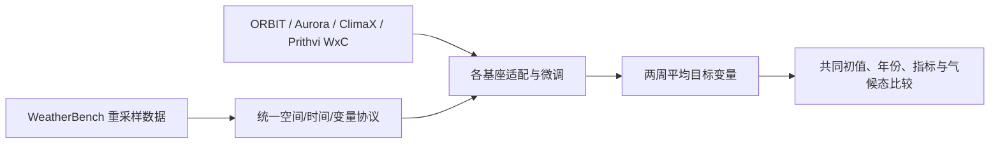

# S2S 基础模型微调基准：EGU25 摘要的可读内容与证据边界

> Takuya Kurihana、Valentine Anantharaj、Moetasim Ashfaq，*Fine-tuning Foundation Models for Benchmarking Prediction Skills for Sub-seasonal Forecasting*，EGU General Assembly 2025 摘要 EGU25-14848，[DOI:10.5194/egusphere-egu25-14848](https://doi.org/10.5194/egusphere-egu25-14848)，2025-03-18。阅读日期：2026-09-24。**来源等级：会议摘要，不是完整实验论文。**

## 1. 为什么保留这一条

天气基础模型在中期通常用逐步滚动给出 10–15 天结果，但把它扩展到 S2S 时，模型输入、目标、气候态基线与训练/验证划分必须统一。该摘要提出使用重采样 WeatherBench 数据，为 ORBIT、Aurora、ClimaX、Prithvi WxC 等模型建立两周平均变量的微调和比较框架。这是一个问题设定与实验议程，而非已经公开的完整排行榜；因此在仓库中单独记录，避免把它与同行评审实证论文混排为同级证据。[EGU 摘要 DOI](https://doi.org/10.5194/egusphere-egu25-14848)

这张图是依据摘要目标的**评测工作流重绘**，不是作者公开的具体网络图；摘要未披露能让人复现每个适配器的层数、损失、优化器或参数冻结方案。

## 2. 已知与未知分开记录

| 项目 | 摘要可以支持的内容 | 不可从摘要推断的内容 |
|---|---|---|
| 模型 | ORBIT 为重点，包含多种天气/气候基础模型对照 | 各模型是否同容量、同训练预算、同输入历史 |
| 时效 | 两周 lead time / 平均目标，与中期—S2S 交界有关 | 第 3–8 周技巧或可稳定滚动月尺度 |
| 数据 | 使用重采样的 WeatherBench | 精确年份、泄漏控制、各变量缺测处理 |
| 指标 | 摘要讨论误差/预测技巧 | 多年份 CRPS、可靠性、极端事件、置信区间 |
| 成果性质 | 会议展示一套比较思路 | 独立同行评审的完整结论或业务部署 |

特别要防止两种误读：一是两周平均目标与“逐日第 14 天的天气场”不同，时间平均会显著降低方差；二是模型预训练资料若覆盖测试年，朴素微调评测可能造成数据泄漏。摘要未提供充分信息排除这些风险，也未提供完整的可数字化图表，因此本笔记**不编造精确性能表**。[EGU 官方条目](https://doi.org/10.5194/egusphere-egu25-14848)

## 3. 阅读判断与后续验证标准

此条的价值在于提示“基础模型的 S2S 能力”必须在统一 protocol 下测试，尤其需要同气候态、持久性、动力集合和简单统计基线比较。若作者发表完整稿，优先核验：预训练截止日期与 S2S 测试期是否重叠；每模型的输入字段和分辨率；两周平均的有效定义；随机种子及微调预算；按地区、季节和第 2/3/4 周拆分的误差；概率集合的可靠性。在这些信息公布前，严谨的结论只能是“提出基准微调方向”，不能说某个基础模型已被证明最好。

[返回首页](../../README.md) · [返回总表](../../气象大模型_中期预报论文追踪.md)
