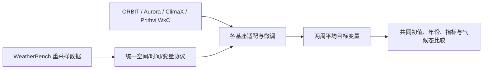

# 撤回记录：S2S 基础模型微调基准（EGU25-14848，不计论文）

> Takuya Kurihana、Valentine Anantharaj、Moetasim Ashfaq，*Fine-tuning Foundation Models for Benchmarking Prediction Skills for Sub-seasonal Forecasting*，EGU General Assembly 2025 摘要 EGU25-14848，[DOI:10.5194/egusphere-egu25-14848](https://doi.org/10.5194/egusphere-egu25-14848)，元数据发表日 2025-03-18。**2026-09-25 复核发现：[EGU25 官方 ESSI1.9 日程明确标记 withdrawn（已撤回）](https://meetingorganizer.copernicus.org/EGU25/session/53424)。本文件只保留旧条目核验轨迹，不计作 2024–2026 年已完成的实证论文，不声称会议实际展示或结果经过同行评审。**

## 1. 为什么保留这一条

旧目录曾把该 DOI 当成普通会议摘要收录。现在 EGU 官方日程给出“已撤回”的**后续状态**；Crossref 仍保留原始摘要和 2025-03-18 的 DOI 元数据，这只能证明摘要曾登记，**不证明已发表完整论文或已在会议展示**。截至本次检索，按完整题名和三位作者未核到可与此 DOI 直接对应的正式论文；因此没有可合法补写的完整训练流程、参数表、模型结构和可复验性能。[EGU 官方状态](https://meetingorganizer.copernicus.org/EGU25/session/53424)、[原 DOI](https://doi.org/10.5194/egusphere-egu25-14848)

原摘要提出的研究问题仍可作为历史线索：把天气基础模型扩展到 S2S 时，需统一输入、目标、气候态基线和训练/验证划分；它提议把 WeatherBench 重采样为**两周平均目标、两周 lead**，先用约 **1 亿参数 ORBIT**，再考虑 Aurora、ClimaX、Prithvi WxC。但这只是被撤回摘要的计划/初步主张，不是已完成的四模型公平基准。原摘要声称 ORBIT 对 200 hPa 位势高度在 **2018** 测试上得到“**MSE 24.32 m**”；MSE 量纲通常应为长度平方，摘要将它写为 `m`，且未给完整评测协议或误差计算代码，不能据此制作可信的性能排名。[DOI 元数据中的原始摘要](https://doi.org/10.5194/egusphere-egu25-14848)

这张图只重绘**被撤回摘要曾计划的评测工作流**，不是已实施/可复现的网络图；摘要未披露每个适配器的层数、损失、优化器、参数冻结方案或四模型的实际结果。

## 2. 已知与未知分开记录

| 项目 | 摘要可以支持的内容 | 不可从摘要推断的内容 |
|---|---|---|
| 模型 | ORBIT 为重点，包含多种天气/气候基础模型对照 | 各模型是否同容量、同训练预算、同输入历史 |
| 时效 | 两周 lead time / 平均目标，与中期—S2S 交界有关 | 第 3–8 周技巧或可稳定滚动月尺度 |
| 数据 | 使用重采样的 WeatherBench | 精确年份、泄漏控制、各变量缺测处理 |
| 指标 | 摘要讨论误差/预测技巧 | 多年份 CRPS、可靠性、极端事件、置信区间 |
| 成果性质 | 曾登记摘要 DOI，但 EGU 官方日程后来标为 **withdrawn** | 会议实际展示、同行评审完整结论或业务部署 |

特别要防止三种误读：一是**撤回摘要不等于正式论文**；二是两周平均目标与“逐日第 14 天的天气场”不同；三是模型预训练资料若覆盖测试年，朴素微调评测可能造成数据泄漏。摘要不足以排除这些风险，其“24.32 m MSE”既无完整口径又有量纲疑点，因此本笔记**不把它放入性能表**。[EGU 官方日程](https://meetingorganizer.copernicus.org/EGU25/session/53424)

## 3. 阅读判断与后续验证标准

这条撤回记录的价值是**阻止错误计数和误引**。只有未来出现作者确认、可核对方法与结果的独立完整论文，才应另建论文笔记并按实际时效归档；届时需核验预训练截止与测试年份、每模型字段/分辨率、两周平均定义、微调冻结范围和预算、基线/概率可靠性。不能从这份已撤回摘要推断 ORBIT 或任何其他基础模型在 S2S 的相对排名。本条无“待精读”承诺：它因来源撤回而**退出实证论文集**，不是一篇尚未完成解读的论文。

[返回首页](../../README.md) · [返回总表](../../气象大模型_中期预报论文追踪.md)
