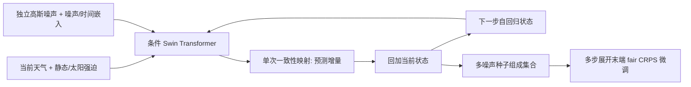

# Swift：单步一致性采样能否支撑长时效天气集合？

> Jason Stock、Troy Arcomano、Rao Kotamarthi，*Swift: An Autoregressive Consistency Model for Efficient Weather Forecasting*，[arXiv:2509.25631v1](https://arxiv.org/html/2509.25631)，2025-09-30。阅读日期：2026-09-24；依据预印本原文及[作者代码](https://github.com/stockeh/swift)。

## 1. 问题与贡献

扩散天气集合有概率建模优势，但每个自回归步都需要几十次函数评估，S2S 的长滚动成本高。Swift 将概率流模型的采样压到**一次网络求值（1 NFE）**，并利用这一效率做多步自回归微调，优化公平 CRPS，而非只做单步监督。其核心比较分两层：在 2020 初值上进行约 15 天的量化中期验证；对 60–75 天作物理形态与季节循环的长滚动检查。后者原文称“qualitatively only to ERA5”，不能被改写成有 75 天定量技巧领先业务集合。[摘要、Results 4.1–4.2](https://arxiv.org/html/2509.25631)

## 2. 网络与训练

条件 Swin Transformer 使用 2×2 patch、12 个注意力块、宽度 1056、12 头，约 **225M 参数**。预测四个地面变量加五类大气变量的 13 个气压层，共 69 个预报通道；海陆掩膜、地形和大气顶太阳辐射作外生强迫。时间增量随机取 6/12/24 小时，模型预测相对当前状态的残差，以相应增量统计量反标准化并回加到当前状态。[Methods 3.1–3.3](https://arxiv.org/html/2509.25631)

上图据原文 Figure 2/Methods 自绘。第一阶段预训练扩散基线和一致性基础模型 Swift-B；第二阶段只微调 Swift-B，先以 1–2 步、再到 3、4、8 步的课程式 rollout，在末端计算两成员公平 CRPS。训练约 15M 预训练图像和 5M 微调图像；作者报告每模型用 120 张 Intel Max 1550 GPU tiles 约 3 天。这些计算资源是训练成本，不能与单次推理速度混为一谈。[Methods 3.2–3.4](https://arxiv.org/html/2509.25631)

## 2a. 数据处理及条件变量

数据是 WeatherBench 2 整理的 ERA5，先降到 **1.40625°、128×256**，再按 6h 抽样；**1979–2018 训练、2019 验证、2020 测试**。每个预报量/气压层采用由训练集计算的均值和标准差做 z-score；对 6/12/24h 三种时间间隔的预测目标，分别使用对应的**增量统计量**标准化残差，而条件状态用全场统计量。推理时先将预测增量按所请求的间隔反标准化，再加回当前状态，形成下一步输入。这一流程意味着 24h 长滚动不能把 6h 的增量统计量直接拿来用；否则分布尺度与物理时间都错。[Methods 3.1](https://arxiv.org/html/2509.25631)

网络输入除随机噪声外，还有天气当前态、海陆掩膜、地形、大气顶太阳辐射，以及**噪声级与预测时间间隔**两个标量条件。天气目标有 69 通道、合并强迫后的空间输入共 141 通道；2×2 patch 投影后进入 12 个 1056 宽、12 头块。每隔一层移动 x/y 方向窗口，用 AdaLN 把噪声/时间条件送入每层，MLP 使用 SwiGLU；位置/调制权重做零初始化，其余用截断正态（标准差 0.02）。这些结构是作者报告的网络设置，非推测。[Methods 3.3](https://arxiv.org/html/2509.25631)

## 2b. 预训练→微调：精确到优化器和训练量

| 阶段 | 模型与目标 | 优化及日程 | 数据量/资源 |
| --- | --- | --- | --- |
| 预训练对照 | 扩散模型用 TrigFlow v-prediction；Swift-B 用一致性目标；纬度与气压/变量加权 | 扩散用 AdamW；一致性网络二维权重用 Muon，1D/嵌入仍用 AdamW；预热前 **2M images**，余弦降至 **15M images** | 每模型约 **15M images**；120×64GB Intel Max 1550 tiles，local batch 1 |
| 多步微调 | **只从 Swift-B 权重继续**；在真实自回归输入上以两成员 unbiased/fair CRPS 作末步损失、跨 K 步反传 | AdamW 常数 LR **`1×10^-5`**；先 `K={1,2}` **1.5M images**，再 `K=3` **1M**，最后 `K={4,8}` **0.5M**（原文同时给总微调量约 5M，分段数字不能机械相加为总数） | 梯度 checkpointing 使 K=8 可训练，测试期采样仅 1 NFE |

AdamW 最大 LR **`5×10^-4`**、`β=(0.9,0.95)`、`ε=10^-6`、weight decay **`10^-5`**（位置嵌入/调制层例外）。Muon 的二维权重 LR **0.02**、momentum **0.95**、weight decay **0.01**、默认 5 次 Newton–Schulz；其 1D/嵌入参数由 AdamW 以 LR **`3×10^-4`**、`ε=10^-10` 等训练。所有模型采用**500K images 半衰期 EMA**，推理用 EMA 权重；训练混合精度 bfloat16，推理 float32。作者称每模型至多约 20M images、约 167K update steps/3 天；这些数与分段日程不同粒度，不能在没有运行日志时强行化为统一总步数。[Methods 3.4、Figure 4](https://arxiv.org/html/2509.25631)

预训练噪声水平按 log-uniform 抽样，`σ_min=0.02`、`σ_max=200`；**微调和推理只采用最大噪声端的一步采样**。这解释了为什么 Swift 能用 1 NFE：不是把普通扩散模型的 39 步推理随便删到 1 步，而是另有一致性预训练及多步 CRPS 微调。原文没有说微调时冻结主干或只做 LoRA，故按继续训练基础一致性网络理解，不能称参数高效微调。[Methods 3.2/3.4](https://arxiv.org/html/2509.25631)

## 3. 论文图表读法

| 原文图/比较 | 结果 | 解读限制 |
|---|---|---|
| Figure 1、Results 4.1 推理 | 摘要给出最高 **39×** 相对扩散推理加速；正文另列所测试配置下约 **30× 墙钟时间**，单步对 39 NFE | 速度口径与批次、成员数、硬件、执行设置相关；不能把两个数字当互相矛盾或相同测试 |
| Figure 5 中期评分 | Swift 相对未多步微调的 Swift-B 明显更稳定，与其自建扩散基线、IFS ENS 多数变量有竞争力，但**略逊 GenCast** | 12 成员 Swift 与 GenCast 50 成员不等规模；原文指出 SSR<1 欠离散 |
| Figure 6、15 长滚动 | 60–75 天热带 u850 Hovmöller、q700 功率谱保持类似结构；14/45 天个例保持清晰 | 形态合理不等于逐日/逐格点 75 天准确预测 |
| Figure 7 极端个例 | Hurricane Laura 提前 5 天起报，48 成员呈现分歧并有成员捕捉实况路径 | 一例不能作为极端事件整体概率校准证据 |
| Figure 8 季节循环 | 南北半球温度随季节转向变化，幅度略偏小 | 季节趋势对外强迫敏感，仍要与气候态和海温条件公平比较 |

原文明确说短期 0–4 天多步微调对 SSR 有代价，且场的高波数谱会向较大尺度漂移。所谓“稳定 75 天”只表示没有明显数值崩坏或非物理视觉场，不代表第 10 周有优于气候态的业务技巧。[Results/Conclusion](https://arxiv.org/html/2509.25631)

## 4. 阅读判断与复现

Swift 最有价值的思路是让**概率校准目标与实际自回归使用方式一致**，同时把生成成本压到能做长滚动和多初值检验的量级。它仍需更严格的 S2S 分周 CRPS、ACC、MJO、区域极端和可靠性图，以及同初值、同成员、同分辨率的 IFS ENS/GenCast 对照。复现应分别记录 NFE、总壁钟时间、成员数和 GPU 型号；把 6 小时的中期试验与 24 小时步长的 75 天试验分开报，避免将长滚动可视化用作定量结论。[Results 4、Limitations](https://arxiv.org/html/2509.25631)

[返回首页](../../README.md) · [返回总表](../../气象大模型_中期预报论文追踪.md)
