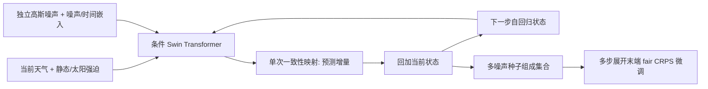

# Swift：单步一致性采样能否支撑长时效天气集合？

> Jason Stock、Troy Arcomano、Rao Kotamarthi，*Swift: an autoregressive consistency model for efficient weather forecasting*，*Machine Learning: Earth* **2**(2), 025004，**2026-07-14**，[正式 DOI](https://doi.org/10.1088/3049-4753/ae802a)；最早的[arXiv:2509.25631v1](https://arxiv.org/html/2509.25631v1)发布于 **2025-09-30**。本笔记于 2026-09-25 依[IOP 授权展示的正式全文](https://www.researchgate.net/publication/407501734_Swift_an_autoregressive_consistency_model_for_efficient_weather_forecasting)、arXiv 初版和[作者代码](https://github.com/stockeh/swift)复核；**以下图号和主要结论均以正式发表版为准**。网页文字提取会漏掉公式中的上标和 Swift 字样；公式只转写经 arXiv 正文可交叉核对的部分，不对含糊符号作推断。

## 1. 问题与贡献

扩散天气集合有概率建模优势，但每个自回归步都需要几十次网络求值，长滚动尤其昂贵。Swift 在 **TrigFlow 概率流的一致性映射**上预训练，使每次 6/12/24 小时状态更新只需**一次网络求值（1 NFE）**；然后在模型自己生成的多步轨迹上以公平 CRPS 微调。它并不是把既有扩散基线直接从 39 步删成一步，也不是靠多权重模型或初值扰动来产生集合；集合成员来自不同高斯噪声。[正式版 §2–3](https://doi.org/10.1088/3049-4753/ae802a)

论文把两类证据分开：2020 年初值的 **15 天、6 小时间隔**中期预报用 RMSE、CRPS、SSR 评分；**最长 75 天、24 小时间隔**的试验检查数值和形态稳定性。正式版明确说后者不是 S2S 可预报性的定量验证，不能写成“第 10 周技巧优于业务集合”。因此本笔记归入 `s2s/` 是因为论文的长滚动研究问题，而不是说其已取得经检验的 S2S 技巧。[正式版 §4–5](https://doi.org/10.1088/3049-4753/ae802a)

## 2. 网络与训练

条件 Swin Transformer 使用 2×2 patch、12 个注意力块、宽度 1056、12 头，约 **225M 参数**。预测四个地面变量加五类大气变量的 13 个气压层，共 69 个预报通道；海陆掩膜、地形和大气顶太阳辐射作外生强迫。时间增量随机取 6/12/24 小时，模型预测相对当前状态的残差，以相应增量统计量反标准化并回加到当前状态。[Methods 3.1–3.3](https://arxiv.org/html/2509.25631)

上图依据正式版 Figure 2/§3 自绘，表示**一个成员的单步采样**；多噪声种子重复该路径得到集合，不表示同一成员每一步都沿同一高斯变量。第一阶段分别训练扩散对照和一致性基础模型 Swift-B；第二阶段仅继续训练 Swift-B，在真实自回归生成态上先用 1–2 步、再到 3、4、8 步的课程式展开，在末步计算两成员公平 CRPS，并通过全部展开步反传。论文报告每模型最多约 15M 张预训练图像加 5M 张微调图像、120 个 Intel Max 1550 GPU tiles、约 3 天；这些属于训练成本，不等同于单次推理速度。[正式版 §3.2–3.4](https://doi.org/10.1088/3049-4753/ae802a)

## 2a. 数据处理及条件变量

数据是 WeatherBench 2 提供的 ERA5，降到 **1.40625°、128×256** 并取 6h 时次；**1979–2018 训练、2019 验证、2020 测试**。正式正文没有交代降尺度的具体重网格核、缺测/质量筛选、TOA 辐射计算实现，也没有发布用于标准化的逐变量数值表；复现不能假装这些已被完整披露。[正式版 §3.1/Table 1](https://doi.org/10.1088/3049-4753/ae802a)

| 类别 | 字段及角色 | 处理口径 |
| --- | --- | --- |
| 预测目标 | 地面 `t2m/u10/v10/mslp` 4 项；高空 `z/t/u/v/q` × 50、100、150、200、250、300、400、500、600、700、850、925、1000 hPa 共 65 项，合计 **69 通道** | 按训练期的变量/层均值和标准差标准化；每个时间跨度的目标是下一态减当前态 |
| 空间条件 | 当前天气场、地表位势 `z`、海陆掩膜 `lsm`、大气顶入射太阳辐射 | 当前天气态用**全场**统计量；静态地理条件与随时间变化的日照条件不能混为预测目标 |
| 标量条件 | 扩散噪声级、所请求的 `δi∈{6,12,24}` 小时间隔 | 噪声级作正弦编码，时间间隔另作嵌入，二者合并调制每层 adaLN |

每个预报量/气压层采用训练集计算的均值和标准差做 z-score；对 6/12/24h 三种间隔的预测目标，又分别使用相应**增量统计量**标准化残差，而条件状态使用全场统计量。推理时依请求的间隔反标准化预测增量，再回加当前状态，形成下一步输入。这个细节决定不能把 6h 的增量统计量直接用于 24h 长滚动，否则连残差物理尺度都错。[正式版 §3.1](https://doi.org/10.1088/3049-4753/ae802a)

网络输入除随机噪声外，还有天气当前态、海陆掩膜、地形、大气顶太阳辐射，以及**噪声级与预测时间间隔**两个标量条件。天气目标有 69 通道、合并强迫后的空间输入共 **141 通道**；2×2 patch 线性投影后进入 12 个 1056 宽、12 头块。网络是像素空间、**非层级式** Swin：每隔一层移动 x/y 窗口，取消 scaled-cosine attention 的相对位置偏置，以 adaLN 将噪声/间隔调制进各层，前馈层采用 SwiGLU；最后线性投影并 reshape 成目标场。层偏置与调制权重零初始化，其余用均值零、标准差 0.02 的截断正态；作者指出其他初始化曾导致发散。[正式版 §3.3/Figure 2](https://doi.org/10.1088/3049-4753/ae802a)

## 2b. 预训练→微调：精确到优化器和训练量

**预训练目标。** 自建扩散对照与 Swift-B 都采用 TrigFlow：对标准化后的真实增量 `x₀` 与高斯噪声 `z`，构成 `xₜ=cos(t)x₀+sin(t)z`。扩散模型回归沿这条曲线的速度；Swift-B 则学习把曲线上任一点直接映回干净样本的一致性映射 `fθ(xₜ,t)=cos(t)xₜ−sin(t)σd Fθ(xₜ/σd,t)`。一致性训练要用停止梯度的目标网络及沿轨迹的时间切向量；后者在**前 3M images** 线性启用，并由 PyTorch 前向自动微分/JVP 求得，同时用 `c=0.1` 稳定切向归一化。这个“切向预热”与下表**前 2M images 的学习率线性预热是两件不同的事**。训练损失还按纬度格点面积和变量/气压层权重求和；这些权重强调近地层，不能把未加权 CRPS 与训练损失视为一物。[正式版 §2.1–2.2、§3.2、Figures 3–4](https://doi.org/10.1088/3049-4753/ae802a)

**微调目标。** 从同一 Swift-B 的预训练权重继续更新，给相同初态采独立高斯噪声得到**两个成员**；每个成员递归生成 `K` 次，末步与对应 ERA5 真值比较。两成员的公平 CRPS 可写成 `( |ŷ₁−y|+|ŷ₂−y| )/2−|ŷ₁−ŷ₂|/2`，再施加与预训练相同的纬度/变量权重。第一项奖赏准确，第二项避免成员塌缩；但两成员目标仍不能保证测试期所有 lead/区域均校准。作者用批内向量化、跨步梯度 checkpointing 和 through-time 反传控制显存，而不是在每个中间步另算一份 CRPS。公开正文未说冻结主干、只训 LoRA 或使用独立观测微调数据。[正式版 §2.3、§3.2/Equation 7](https://doi.org/10.1088/3049-4753/ae802a)

| 阶段 | 模型与目标 | 优化及日程 | 数据量/资源 |
| --- | --- | --- | --- |
| 预训练对照 | 扩散模型用 TrigFlow v-prediction；Swift-B 用一致性目标；纬度与气压/变量加权 | 扩散用 AdamW；一致性网络二维权重用 Muon，1D/嵌入仍用 AdamW；**LR** 线性预热前 **2M images**，然后余弦降至 **15M images**；一致性切向量另有 **3M images** 预热 | 每模型约 **15M images**；120×64GB Intel Max 1550 tiles，local batch 1 |
| 多步微调 | **只从 Swift-B 权重继续**；在真实自回归输入上以两成员 unbiased/fair CRPS 作末步损失、跨 K 步反传 | AdamW 常数 LR **`1×10^-5`**；先 `K={1,2}` **1.5M images**，再 `K=3` **1M**，最后 `K={4,8}` **0.5M**（原文同时给总微调量约 5M，分段数字不能机械相加为总数） | 梯度 checkpointing 使 K=8 可训练，测试期采样仅 1 NFE |

AdamW 最大 LR **`5×10^-4`**、`β=(0.9,0.95)`、`ε=10^-6`、weight decay **`10^-5`**（位置嵌入/调制层例外）。Muon 的二维权重 LR **0.02**、momentum **0.95**、weight decay **0.01**、默认 5 次 Newton–Schulz；其 1D/嵌入参数由 AdamW 以 LR **`3×10^-4`**、`β=(0.9,0.95)`、`ε=10^-10`、weight decay **0.01** 训练。所有模型采用**500K images 半衰期 EMA**，推理用 EMA 权重；训练混合精度 bfloat16，推理 float32。作者称每模型至多约 20M images、约 167K update steps/3 天；分段微调的“images”与全局 optimizer step 并非一个单位，正文没有给出更细的逐阶段批大小/重复采样账本，不应强行化为完全一致的总步数。[正式版 §3.4、Figures 3/10](https://doi.org/10.1088/3049-4753/ae802a)

预训练噪声水平按 log-uniform 抽样，`σ_min=0.02`、`σ_max=200`；**微调和推理只采用 `t=π/2` 的单步采样**。这解释了 Swift 的 1 NFE：不是直接把普通扩散模型的 39 次求解截成 1 次，而是另有一致性目标预训练和多步 CRPS 微调。正式版 Figure 10 的 AdamW 常数 LR 对比 Muon 余弦调度是**训练配置诊断**：后者收敛更快且没有相同的验证 RMSE 尖峰，但优化器和调度同时变动，不能单独归因于 Muon，更不能当作所有预报指标上的完整消融。[正式版 §3.4/Figure 10](https://doi.org/10.1088/3049-4753/ae802a)

## 3. 论文图表读法

### 3a. 公开的推理耗时：不要把函数评估和墙钟混算

| 正式版 §4.1 的配置 | 自建 TrigFlow 扩散对照 | Swift | 可比性判断 |
| --- | ---: | ---: | --- |
| 每个自回归步、每个成员的网络求值 | **39 NFE**，DPM-Solver++ 2S；无 stochastic churn | **1 NFE** | 得出“单成员单步 39 倍更少求值”；不等于端到端一定 39 倍快 |
| 15 天、6h 间隔的样本数 | **12** 个起报 | **64** 个起报 | 作者受计算与存储约束，两个样本数不相等 |
| 每次预报的集合规模 | **24** 成员 | **12** 成员 | 规模不等，下面墙钟值并非同集合成本控制试验 |
| 报告的平均墙钟 | **7.6 分钟/次** | **15 秒/次** | 数值相除约 **30.4×**；作者表述为实测约 30×，不是 39× |

这是以论文报告的原始量和单位重排，不从曲线臆测数值。训练期两者为同参数规模的自建对照，因此“Swift 接近其扩散基线技巧且省采样成本”比“Swift 全面打败所有扩散天气模型”更可控；但上表的吞吐仍须在同硬件、同成员数、同起报数和相同精度设置下重测才能形成严格的等成本对照。[正式版 Abstract、§4.1、Figures 1/5](https://doi.org/10.1088/3049-4753/ae802a)

### 3b. 技巧、谱与长滚动：按正式版图号逐项读

| 正式版图/资料 | 图中测的是什么 | 能得出的结论与不能得出的结论 |
|---|---|---|
| Figure 5、Figures 13–15 | 2020 起报、6h 递推至 15 天；纬度加权集合均值 RMSE、逐地 CRPS、spread/skill ratio 对 ERA5 | 多步微调后的 Swift 胜过 Swift-B，接近自建扩散对照和 IFS ENS 多数变量，但**略逊 GenCast 且 SSR<1 欠离散**；论文未给对应曲线的逐 lead 数表，本笔记不读图造精确分数 |
| Figure 7 | 32 个初值、12 成员、6–360h 不同变量的功率谱对 ERA5 | 部分较平滑量（位势、海平面气压）的高波数能量向较大尺度漂移；其他场在 15 天内无明显谱爆炸；这不等于谱误差为零 |
| Figure 12 | 2020-01-01 起报的 7 天单成员/12 成员均值/误差地图 | 多个变量在近极区误差较大，是纬度加权目标、再分析不确定性和模型误差共同可能关联；一幅个例图不能推出全年高纬技巧 |
| Figure 6 | 2020-08-23 00 UTC 起报、距 Laura 登陆约 4 天的 **48 成员**路径与单成员场 | 转向北上时集合分歧扩大，部分成员贴近 ERA5 路径；**单一飓风个例**不是所有强对流事件的可靠性/命中率估计 |
| Figure 8、Figure 16 | 24h 步长，热带 10°N–10°S 平均的 u850 距平 Hovmöller、最长 75 天；q700 单成员 60 天场和 32 初值×12 成员谱 | 展示作者定义下无发散、无塌缩的**滚动稳定性**；Hovmöller 波纹像真并不证明相位预报正确。作者展示的 GenCast 60 天发散是该特定外推个例，不能概括 GenCast 正常业务预报技巧 |
| Figure 9、Figure 11 | 75 天南北半球温度季节趋势，以及 14/45 天全场可视化 | 大尺度季节转向可保持，但幅度偏小；缺少 S2S 分周 CRPS/ACC、气候态技巧基线和多年的独立统计，不能由此宣称 75 天可预报性 |

正式版还明确指出多步微调在短期 **0–4 天牺牲部分 SSR**，没有显式守恒约束；作者把训练中的优化稳定性与推理中的滚动稳定性分开讨论。本文的 6h 中期评分与 24h 长滚动试验也**不是同一时间步长协议**。所以“稳定 75 天”是一个必要工程信号，但不是第 10–11 周优于气候态的业务技巧证明。[正式版 §4–5](https://doi.org/10.1088/3049-4753/ae802a)

## 4. 阅读判断与复现

Swift 最有价值的思路是把**概率评分目标与实际自回归使用方式对齐**，再以单步生成降低多成员、多起报、多步训练的成本。下一步严谨验证应增加独立年份的 S2S 分周 CRPS/ACC、MJO/热带传播、区域极端 Brier 与可靠性图，以及同初值、同成员、同空间分辨率的 IFS ENS/GenCast 对照；这些是本笔记提出的检验建议，**不是作者已完成的结果**。[正式版 §5](https://doi.org/10.1088/3049-4753/ae802a)

复现账本至少要固定 WB2 数据版本、重网格和标准化统计量、六/十二/二十四小时三组残差统计量、训练初值抽样、噪声种子、每阶段有效 batch 与 optimizer step、EMA、混合精度、推理 GPU、NFE、成员数和完整 15 天墙钟。需先跑 **Swift-B→Swift** 的同骨干对照，再跑作者扩散基线；有条件时分开做同成员数的墙钟试验和原文不等成员数的复现。不能把 24h 的 75 天形态图放在 6h 的 15 天定量技巧表里。[正式版 §3–4](https://doi.org/10.1088/3049-4753/ae802a)

**版本差异，避免复用旧图号。** 2025 年 arXiv v1 的 Figure 6/7/8 依次是长滚动/Laura/季节循环，Laura 起报写 **2020-08-22 06 UTC、提前 5 天**；2026 年期刊版依次为 **Figure 8/6/9**，Laura 图注写 **2020-08-23 00 UTC、约提前 4 天**。正式版将“39×更快”收紧为“**39×更少 NFE；本实现约 30×墙钟**”，并明确 75 天只证明滚动稳定、没有定量季节技巧评估。这些版本变化说明不能把 arXiv v1 的图号、个例日期和摘要措辞直接套到期刊版。[arXiv v1](https://arxiv.org/html/2509.25631v1) · [期刊正式版](https://doi.org/10.1088/3049-4753/ae802a)

[返回首页](../../README.md) · [返回总表](../../气象大模型_中期预报论文追踪.md)
