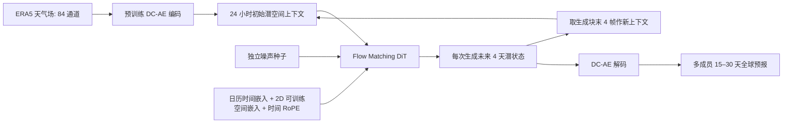

# Marchuk：276M 潜空间流匹配模型的 15–30 天集合预报

> Arsen Kuzhamuratov、Mikhail Zhirnov、Andrey Kuznetsov、Ivan Oseledets、Konstantin Sobolev，*Marchuk: Efficient Global Weather Forecasting from Mid-Range to Sub-Seasonal Scales via Flow Matching*，[arXiv:2603.24428v1](https://arxiv.org/html/2603.24428v1)，2026-03-25，当前仅此一版；[作者项目页](https://v-gen-ai.github.io/Marchuk/)及[推理代码固定提交](https://github.com/v-gen-ai/Marchuk/tree/e8f8e0c2b924a13cebd3de6835137408bd5116c1)。2026-09-25 复核 [15 页 PDF](https://arxiv.org/pdf/2603.24428v1) 的图表、HTML 表格与代码。此为预印本技术报告，不把项目页宣传语当作同行评审结论。

## 1. 核心问题

原始天气网格高维，像素空间生成式模型需要在每个自回归步做多次去噪，30 天集合昂贵。Marchuk 复用 LaDCast 的深度压缩自编码器，将 1.5° ERA5 全球 84 通道场压到约 **64× 空间压缩**的潜变量；随后用 276M 参数的 DiT/flow matching 预测未来潜场。它的贡献更像“潜空间生成器 + 时间上下文/训练策略优化”，不是新的观测同化系统。[Methods 3](https://arxiv.org/html/2603.24428)

此图据原文 Figures 1–3 自绘。原文称输入为上一日四个 6 小时帧，单次生成未来四天；公开推理脚本下一轮只保留**生成块最后四帧**，不是把全四天 16 帧都无限追加。训练目标长度在 1–8 天间变化，可训练 2D 空间位置 + 1D 时间 RoPE 替换 GeoRoPE，并将年月日小时的嵌入送入交叉注意力。推理用约 20 个流匹配积分步，每成员用不同噪声种子。[Methods 3.2–3.4](https://arxiv.org/html/2603.24428v1) · [作者推理脚本](https://github.com/v-gen-ai/Marchuk/blob/e8f8e0c2b924a13cebd3de6835137408bd5116c1/inference.ipynb)

## 1a. 数据处理与训练、微调的真实披露程度

WeatherBench 2 格式的 ERA5 原始资料为小时频率；论文训练时**随机抽取小时级时间锚点**，随后每 6 小时取一帧：§3.1 描述的典型样本是**前 4 帧（1 天上下文）+ 后 16 帧（4 天目标）=20 帧**。全球原网格是 1.5°、`240×121`；六个高空量（位势、温度、纬/经向风、比湿、垂直速度）×13 层，加 2m 温度、10m `u/v`、海平面气压、SST、6h 累计降水，共 **84 通道**；海陆掩膜与地形另作静态条件，经预训练 DC-AE 一并编码。**1979–2017 训练，2018–2021 留作评价**，100 个量化起报日期从 **2018 和 2021** 两年均匀抽取；2026 年莫斯科寒潮是另一个独立个例。论文未把 2018–2021 再明确拆成调参验证与最终测试年份，不能自行补一个切分。[Methods 3.1、Evaluation Protocol](https://arxiv.org/html/2603.24428v1)

公开 notebook 具体打开 WB2 的 `...6h-240x121_equiangular_with_poles_conservative.zarr`，裁掉南极第一行后成为模型输入的 **240×120**，编码后的示例张量为 **15×30×84**，即经纬两个方向各约压缩 8 倍。它从 LaDCast 目录读取 `ERA5_normal_1979_2017.json` 和潜变量归一化 JSON，按预设统计量标准化 84 个动态通道；海陆掩膜 1 通道与地形 4 通道分别以空间均值/标准差标准化，并把潜变量 `target_std` 设为 **0.5**。这给出**当前公开推理路径**，但不等于论文完整训练数据管线：notebook 读的是现成的 **6h** Zarr，不能据此复现正文所说的**随机小时锚点**；Marchuk 仓库也没有单独收录这两份 JSON、84 通道逐值统计表、缺测筛选或降水变换的独立说明。需连同 LaDCast 版本固定后才能复现。[作者推理 notebook 固定提交](https://github.com/v-gen-ai/Marchuk/blob/e8f8e0c2b924a13cebd3de6835137408bd5116c1/inference.ipynb)

对 DiT 训练，作者提出 **Variable Horizon Training（VHT）**：固定 24 小时上下文，从 **1–8 天均匀随机取目标长度**。这样网络同一次训练见到不同长度条件，而不是先固定窗口训练、再对 30 天任务“后验微调”。论文明确说 VHT 比固定窗口或事后微调更稳；**并未报告 Marchuk 本身另有独立 fine-tune 阶段**。若复现，不能把 VHT 写成“从 LaDCast 扩散权重微调”：复用的是 **DC-AE**，核心 276M DiT 仍需按本论文训练。[Methods 3.2–3.3](https://arxiv.org/html/2603.24428)

网络借鉴 Cross-DiT 的时间步调制：用**共享 MLP**产生大部分调制参数，再用各 block 的轻量 LoRA 适配，减少重复调制参数占比（作者给出从约 40% 降到低于 10%，随 LoRA 配置变化）。这里的 **LoRA 是架构中的调制层设计**，论文没有说用 LoRA 对已训练天气模型做参数高效微调。日期条件是 `月:日:小时` 的 **8,784 个可训练嵌入**（366×24）；空间用可训练 2D 位置，时间用 1D RoPE。后续一次预测 4 天潜状态并自回归到 15–30 天；每条样本约 20 个流匹配积分步，20–50 成员用不同噪声种子。[Methods 3.2–3.4、图 3](https://arxiv.org/html/2603.24428)

**公开权重对应的结构配置。** `configs/model.yaml` 将 `in_visual_dim/out_visual_dim` 都设为 **84**，潜变量 patch 为 **1×1×1**，宽度 **640**、前馈宽度 **2624**、`num_blocks=16`。`model/dit.py` 每组实际顺次实例化**局地注意力块和全局注意力块各一个**，所以 Figure 3 标注的总深度是 **32 个 Transformer blocks**，不是 16；`axes_dims=(16,24,24)` 合为每头 **64** 维，由 640/64 可核为 **10 头**。每块时间调制的低秩中间宽度默认 **256**；推理脚本载入 HF `v-gen-ai/Marchuk` 权重并设置 20 次显式 `img ← img − Δt·velocity` 积分。这里是**公开推理实现的参数**，未有训练源码证明每个消融模型都采用完全相同配置。[固定配置](https://github.com/v-gen-ai/Marchuk/blob/e8f8e0c2b924a13cebd3de6835137408bd5116c1/configs/model.yaml) · [固定模型实现](https://github.com/v-gen-ai/Marchuk/blob/e8f8e0c2b924a13cebd3de6835137408bd5116c1/model/dit.py) · [固定推理脚本](https://github.com/v-gen-ai/Marchuk/blob/e8f8e0c2b924a13cebd3de6835137408bd5116c1/inference.ipynb)

**正文与公开实现的口径边界。** 正文说有 **8,784** 个有效年月日小时嵌入，代码却分配 `nn.Embedding(8785, 640)`；可能为额外保留位，但没有公开解释，不能把多出的 1 位说成另一个日期。正文 §3.1 固定抽取 20 帧（1 天＋4 天），§3.3 又称训练目标均匀抽 1–8 天；源码没有训练数据加载器来解释超过 4 天的样本怎样形成。这两处都应保留为复现缺口，不替作者构造未公开的训练管线。[论文 §3.1–3.3](https://arxiv.org/html/2603.24428v1) · [固定模型实现](https://github.com/v-gen-ai/Marchuk/blob/e8f8e0c2b924a13cebd3de6835137408bd5116c1/model/dit.py)

预印本**没有公开**核心 DiT 的优化器、学习率、batch、训练总步数、训练硬件时长、梯度裁剪、flow-matching 路径/损失的完整公式、VHT 采样与 20 帧示例如何扩展到 8 天目标的实现。作者仓库目前发布模型权重、结构及**单次推理 notebook**，没有训练脚本；因此不能从推理配置反推训练超参。表 1 的 **7.5 分钟/H100/50 成员/30 天**是潜空间推理速度，**不含 DC-AE 编码/解码**，也不是训练成本。[Methods 3、Table 1](https://arxiv.org/html/2603.24428v1) · [作者仓库](https://github.com/v-gen-ai/Marchuk/tree/e8f8e0c2b924a13cebd3de6835137408bd5116c1)

## 2. 数据与公平比较

ERA5/WeatherBench-2 1.5°（源网格 240×121、公开推理实际裁剪为 240×120），6 小时抽样；1979–2017 训练，2018–2021 留作评价，但论文所有主量化图表和 Tables 2–5 的协议只明确写**从 2018 与 2021 抽取共 100 个起报日期**，没有给每年各多少或验证与最终测试的独立分组。对照只包括同一研究路线的 LaDCast **375M/1.6B** 和 RMSE 气候态；没有在这 100 个起报日上重跑业务 IFS ENS、FuXi-S2S、GenCast 或 AIFS ENS。[Evaluation Protocol](https://arxiv.org/html/2603.24428v1)

确定性指标是纬度加权 RMSE 和 ACC，概率指标报告 CRPS、论文称作 CRPS Skill/Spread 的分量。Figure 5/8/9 是随提前量的曲线，Tables 2–5 是 15/30 天截面，**没有公开完整逐 lead 数值表**。原文没有说明这 100 个起报日的季节分布、集合指标到底使用 20 还是 50 成员、气候态的逐日窗口/基准年和统计置信区间；这些不足会影响公平比较。推理 Table 1 只计**潜空间预报**，不含编码/解码，所以 7.5 分钟不是从 ERA5 原始数组到物理场输出的端到端时长。[§4.1、Table 1](https://arxiv.org/html/2603.24428v1)

## 3. 模型性能：逐项保留正反结果

**原文 Table 1：潜空间推理速度。** 条件相同为单张 H100、30 天、50 成员；计时**排除 DC-AE 编码/解码**，不能称端到端速度。[Table 1](https://arxiv.org/html/2603.24428v1)

| 模型 | 参数量 | 每轮采样积分步 | 50 成员、30 天潜空间推理 |
| --- | ---: | ---: | ---: |
| LaDCast 小版 | 375M | 10 | 11 分钟 |
| LaDCast 大版 | 1.6B | 10 | 45 分钟 |
| Marchuk | 276M | 20 | **7.5 分钟** |

Marchuk 对大版的表内速度比是 **45/7.5=6×**，对小版 **11/7.5≈1.47×**。论文结论另称“一个数量级更快”，但 Table 1 最直接的数字是 6 倍，不能把近似宣传措辞当作 10 倍实测，也不能忘记 Marchuk 用了**两倍的积分步数**。[Table 1、Conclusion](https://arxiv.org/html/2603.24428v1)

**原文 Tables 2–3：15/30 天 RMSE。** 以下逐格转录；`q500` 一列保留原文的 **×10⁻³** 缩放。论文表格对其余字段未逐列标注物理单位，本笔记不自行填单位；同列越低越好，**不同列不可相加**。[Tables 2–3](https://arxiv.org/html/2603.24428v1)

| 15 天 RMSE | U500 | T500 | G500 | q500 ×10⁻³ | MSLP | U10 | V10 | T2M |
| --- | ---: | ---: | ---: | ---: | ---: | ---: | ---: | ---: |
| LaDCast 375M | 8.14 | 3.07 | 784.21 | 0.832 | 690.74 | 3.81 | 3.93 | 2.59 |
| LaDCast 1.6B | **8.08** | **3.04** | **774.18** | **0.796** | **684.29** | **3.77** | **3.91** | 2.54 |
| Marchuk 276M | 8.15 | 3.08 | 785.91 | 0.803 | 697.89 | 3.80 | 3.95 | **2.52** |
| 气候态 | 8.55 | 3.18 | 810.57 | 0.857 | 711.21 | 3.96 | 4.02 | 2.66 |

| 30 天 RMSE | U500 | T500 | G500 | q500 ×10⁻³ | MSLP | U10 | V10 | T2M |
| --- | ---: | ---: | ---: | ---: | ---: | ---: | ---: | ---: |
| LaDCast 375M | 8.47 | 3.26 | 840.58 | 0.883 | 727.40 | 3.93 | 4.01 | 2.80 |
| LaDCast 1.6B | **8.40** | 3.17 | 815.53 | **0.825** | 713.08 | 3.87 | **3.97** | 2.66 |
| Marchuk 276M | **8.40** | **3.16** | **809.15** | 0.836 | 715.79 | **3.86** | 3.99 | **2.64** |
| 气候态 | 8.55 | 3.18 | 810.57 | 0.857 | **711.21** | 3.96 | 4.02 | 2.66 |

15 天时，Marchuk 的 T2M 最好，但对 375M 小版只在 **q500、U10、T2M 三列**更低，另外五列更高；尤其 G500 **785.91** 对小版 **784.21**、大版 **774.18**。30 天时它在八列都胜 375M 小版，但 MSLP **715.79** 反而高于气候态 **711.21**；G500 **809.15** 只比气候态 **810.57** 低一点。这里的气候态行在 15/30 天表里数值完全相同，正文未给其构造窗口，不应把这几项小差距外推为多年稳定技巧。[Tables 2–3](https://arxiv.org/html/2603.24428v1)

**原文 Tables 4–5：15/30 天 CRPS。** `q500`、`TP-6h` 均按原文 **×10⁻³** 列示；论文没为其他列逐项标注单位。越低越好，但集合成员数/置信区间在主表旁没有披露。[Tables 4–5](https://arxiv.org/html/2603.24428v1)

| 15 天 CRPS | U500 | T500 | G500 | q500 ×10⁻³ | MSLP | U10 | T2M | TP-6h ×10⁻³ |
| --- | ---: | ---: | ---: | ---: | ---: | ---: | ---: | ---: |
| LaDCast 375M | 4.23 | 1.49 | 354.07 | 0.394 | 305.53 | 1.85 | 1.13 | 0.520 |
| LaDCast 1.6B | **4.19** | **1.45** | **338.43** | **0.377** | **299.99** | **1.82** | **1.09** | **0.515** |
| Marchuk 276M | 4.26 | 1.47 | 343.34 | 0.385 | 310.33 | 1.85 | 1.10 | 0.519 |

| 30 天 CRPS | U500 | T500 | G500 | q500 ×10⁻³ | MSLP | U10 | T2M | TP-6h ×10⁻³ |
| --- | ---: | ---: | ---: | ---: | ---: | ---: | ---: | ---: |
| LaDCast 375M | 4.43 | 1.64 | 398.00 | 0.419 | 325.58 | 1.92 | 1.24 | 0.530 |
| LaDCast 1.6B | **4.38** | **1.53** | 364.10 | **0.393** | **316.72** | **1.88** | **1.15** | **0.522** |
| Marchuk 276M | 4.42 | **1.53** | **354.93** | 0.401 | 318.99 | 1.89 | 1.16 | 0.527 |

30 天 Marchuk 八列都胜 375M 小版，但对 1.6B 大版仅 **G500 354.93<364.10**，T500 打平；其余六列仍略差。15 天它对大版八列无一取胜，U10 甚至只与小版打平。故摘要/项目页的“接近大版”总体可理解为量级相近，而论文 §4.1“在所有评测指标持续胜小版”的概括**与 15 天 Tables 2/4 的逐列数字不一致**。不能用该概括覆盖表格反例。[Tables 2–5、§4.1](https://arxiv.org/html/2603.24428v1)

Figure 5 是总 CRPS 曲线，Figure 8 的 skill 分量改善伴随 Figure 9 的 spread 分量略减；**spread 变小不自动等于校准改善或欠离散**，还要看 ensemble spread 与 forecast error 的比值、可靠性图。Figure 7 的 ACC、Figure 8 的 CRPS skill 及 Figure 9 的 spread 没有可逐 lead 精确转录的配套数表。Figure 6 的莫斯科寒潮用 **250 成员**、区域 **55–58°N/35–39°E**，计算各提前量落在 **−22±3°C** 范围的成员比例：15 天以前约 **5–10%**，临近事件升至约 **80–90%**；这是单次 2026 年事后个例，不是 2018/2021 的独立统计，也不能证明长期极端事件概率已校准。[Figures 5–9、§4.2](https://arxiv.org/html/2603.24428v1)

## 4. 消融、局限与我的判断

以下按论文 Tables 6–11 转录**第 15 天 RMSE** 的少量关键列，目的在于看方向和反例；不是把各实验视作完全相同的训练配方。[Tables 6–11](https://arxiv.org/html/2603.24428v1)

| 原文消融 | 配置→G500 RMSE | 配置→T2M RMSE | 严谨读法 |
| --- | --- | --- | --- |
| Table 6 空间/时间位置 | 3D RoPE **829.83**；GeoRoPE **821.28**；时间 RoPE＋可学 2D **808.11** | **2.66 / 2.67 / 2.65** | 混合编码在这两列最优；这组配置和主表 Marchuk G500 **785.91** 不同，不能拼成单一模型的消融增益 |
| Table 7 固定上下文长度 | 6/12/24/48h：**820.05 / 806.22 / 809.98 / 804.05** | **2.68 / 2.63 / 2.66 / 2.61** | 48h 最优，但 12→24h 反而变差；正文“随窗口增大持续改善”不是逐列单调事实 |
| Table 8 时间跳步 | 1/6/12h：**829.13 / 814.46 / 851.86** | **2.72 / 2.65 / 2.75** | 6h 最好，不能把 12h 减少步数当作免费的加速 |
| Table 9 推理窗口 | 1/2/4/8d：**808.56 / 800.60 / 815.62 / 826.77** | **2.68 / 2.59 / 2.57 / 2.65** | G500 最优 2d，T2M 最优 4d；不存在统一最优时长 |
| Table 10 日历时间嵌入 | 无/有：**804.05→799.18** | **2.61→2.59** | 确有改善，但 U500 **8.39→8.39**、T500 **3.14→3.14**，不是所有变量都严格提升 |
| Table 11 输入上下文 | 12h/1d/2d：**822.71 / 811.02 / 817.01** | **2.62 / 2.65 / 2.65** | 1d 是作者最终的成本—技巧折中；T2M 12h 更低，MSLP 则 2d **715.08** 优于 1d **727.00** |

论文 §4.3 列 VHT 对固定训练目标及事后微调的比较为消融主题，但**没有给可独立转录的 VHT/固定目标逐变量对照表**；不能为“VHT 改善多少百分比”编数。Tables 7、9、11 的“上下文长度”分别针对固定窗口训练、可变长度模型推理和缩短初态的不同试验，数值不可直接互相相减归因。部分消融的 G500（如 Table 6 的 808.11）与主表 G500（785.91）有明显基准差，论文没有完整解释各组训练/初始化是否完全一致；这是复现和因果归因的缺口。[§4.3、Tables 6–11](https://arxiv.org/html/2603.24428v1)

Marchuk 的强项是以较少参数和更低**潜空间**推理成本接近大版 LaDCast，同时 30 天 G500 RMSE/CRPS 略胜；但它在第 15 天有不少字段输给小版，30 天 MSLP 输给气候态。作者认为限制之一是 DC-AE 重建误差，上限由预训练编解码器决定；此外只有 1.5° ERA5 再分析初态，不具备实时观测同化，台风强度等细尺度表现也受分辨率限制。以上是论文明确写出的边界；我另认为其概率校准主张仍需可靠性/秩直方图或 spread–skill 联合检验，不能只用降低 CRPS spread 分量解释为“更可靠”。[Conclusion、Figures 8–9](https://arxiv.org/html/2603.24428v1)

后续公平评测应在**同一 100 个起报日、同一真值/网格/成员数**重跑 GenCast、AIFS ENS、FuXi-S2S 与 LaDCast；增加多年份和每周 lead 的 CRPS/ACC、气候态技巧置信区间；把 DC-AE、数据 I/O、成员批处理计入端到端成本；极端事件则做多事件、多地区统计。上述是阅读建议，**并非论文已经提供的结果**。[Evaluation Protocol、Limitations](https://arxiv.org/html/2603.24428v1)

[返回首页](../../README.md) · [返回总表](../../气象大模型_中期预报论文追踪.md)
