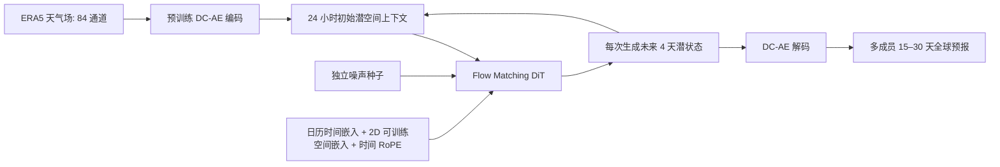

# Marchuk：276M 潜空间流匹配模型的 15–30 天集合预报

> Arsen Kuzhamuratov、Mikhail Zhirnov、Andrey Kuznetsov、Ivan Oseledets、Konstantin Sobolev，*Marchuk: Efficient Global Weather Forecasting from Mid-Range to Sub-Seasonal Scales via Flow Matching*，[arXiv:2603.24428](https://arxiv.org/html/2603.24428)，初稿 2026-03-25；[作者项目页](https://v-gen-ai.github.io/Marchuk/)。阅读日期：2026-09-24。

## 1. 核心问题

原始天气网格高维，像素空间生成式模型需要在每个自回归步做多次去噪，30 天集合昂贵。Marchuk 复用 LaDCast 的深度压缩自编码器，将 1.5° ERA5 全球 84 通道场压到约 **64× 空间压缩**的潜变量；随后用 276M 参数的 DiT/flow matching 预测未来潜场。它的贡献更像“潜空间生成器 + 时间上下文/训练策略优化”，不是新的观测同化系统。[Methods 3](https://arxiv.org/html/2603.24428)

此图据原文 Figure 1–3 自绘。原文称输入为上一日四个 6 小时帧，单次生成未来四天；训练的目标长度在 1–8 天间变化以抑制固定窗口的滚动失稳。可训练 2D 空间位置 + 1D 时间 RoPE 替换 GeoRoPE，并将时间戳嵌入送入交叉注意力。推理约 20 个流匹配积分步，每成员用不同噪声种子。[Methods 3.2–3.4](https://arxiv.org/html/2603.24428)

## 1a. 数据处理与训练、微调的真实披露程度

WeatherBench 2 格式的 ERA5 原始可用资料为小时频率；论文训练时**随机抽取小时级时间锚点**，随后每 6 小时取一帧：典型一个样本含**前 4 帧（1 天上下文）+ 后 16 帧（4 天目标）=20 帧**。全球网格为 1.5°、`240×121`，六个高空量（位势、温度、纬/经向风、比湿、垂直速度）×13 层，加 2m 温度、10m `u/v`、海平面气压、SST、6h 累计降水，共 **84 通道**；海陆掩膜与地形另作为静态通道，经预训练 DC-AE 一并编码。**1979–2017 训练，2018–2021 评价**，2026 年莫斯科寒潮是独立个例。论文未披露这 84 通道的逐变量标准化常数、降水变换、缺测填补或编解码训练细节；自动编码器是直接复用 LaDCast 已训练的模型，而非从零训练。[Methods 3.1](https://arxiv.org/html/2603.24428)

对 DiT 训练，作者提出 **Variable Horizon Training（VHT）**：固定 24 小时上下文，从 **1–8 天均匀随机取目标长度**。这样网络同一次训练见到不同长度条件，而不是先固定窗口训练、再对 30 天任务“后验微调”。论文明确说 VHT 比固定窗口或事后微调更稳；**并未报告 Marchuk 本身另有独立 fine-tune 阶段**。若复现，不能把 VHT 写成“从 LaDCast 扩散权重微调”：复用的是 **DC-AE**，核心 276M DiT 仍需按本论文训练。[Methods 3.2–3.3](https://arxiv.org/html/2603.24428)

网络借鉴 Cross-DiT 的时间步调制：用**共享 MLP**产生大部分调制参数，再用各 block 的轻量 LoRA 适配，减少重复调制参数占比（作者给出从约 40% 降到低于 10%，随 LoRA 配置变化）。这里的 **LoRA 是架构中的调制层设计**，论文没有说用 LoRA 对已训练天气模型做参数高效微调。日期条件是 `月:日:小时` 的 **8,784 个可训练嵌入**（366×24）；空间用可训练 2D 位置，时间用 1D RoPE。后续一次预测 4 天潜状态并自回归到 15–30 天；每条样本约 20 个流匹配积分步，20–50 成员用不同噪声种子。[Methods 3.2–3.4、图 3](https://arxiv.org/html/2603.24428)

本报告**没有公开**核心 DiT 的优化器、学习率、batch、训练总步数、硬件训练时长、梯度裁剪、VHT 不同长度采样的实现细节。表 1 的 **7.5 分钟/H100/50 成员/30 天**是推理速度，不是训练成本；且明确排除 DC-AE 编码/解码。原文只给 276M 参数量和推理积分步数，严谨笔记应把其余超参数留作“未披露”。[Methods 3、Table 1](https://arxiv.org/html/2603.24428)

## 2. 数据与公平比较

ERA5/WeatherBench-2 1.5°（240×121）、6 小时抽样；1979–2017 训练，2018–2021 作验证/测试，论文量化图表基于从 2018 与 2021 抽样的 **100 个起报日**。对照是 LaDCast 375M 与 1.6B，报告确定性纬度加权 RMSE/ACC 及集合 CRPS/Spread；原文的效率表只计**潜空间预报部分**，不含编码/解码。因此 7.5 分钟不是完整数据处理到输出存档的端到端耗时。[Methods/Results 4.1](https://arxiv.org/html/2603.24428)

## 3. 原文表格：不能只摘最优的一列

| 证据 | Marchuk 276M | LaDCast 375M / 1.6B | 解释 |
|---|---:|---:|---|
| Table 1：30 天、50 成员、单 H100 推理 | **7.5 分钟**，20 步 | **11 / 45 分钟**，各 10 步 | 不含编解码；对大模型约 6×，对小模型约 1.47× |
| Table 2：15 天 T2m RMSE | **2.52** | 2.59 / 2.54 | Marchuk 此变量胜出，但并非所有变量都胜 |
| Table 2：15 天 Z500 RMSE | **785.91** | 784.21 / **774.18** | Marchuk 比两种 LaDCast 都差 |
| Table 3：30 天 T2m RMSE | **2.64** | 2.80 / 2.66 | 略优于大模型，绝对差很小 |
| Table 3：30 天 SLP RMSE | **715.79** | 727.40 / **713.08** | 大模型略优；气候态为 **711.21**，三模型该格均不优于气候态 |
| Table 4：15 天 T2m CRPS | **1.10** | 1.13 / **1.09** | 大模型概率分数仍略优 |
| Table 5：30 天 Z500 CRPS | **354.93** | 398.00 / 364.10 | Marchuk 对该变量有明显优势 |

数值直接来自[原文 Tables 1–5](https://arxiv.org/html/2603.24428)，不同变量单位不同，不可纵向相加成“总分”。Figure 5 的集合 skill 改善伴随 spread 稍减，因而需同步看可靠性/欠离散。作者的莫斯科寒潮 Figure 6 用 **250 成员**作单次案例：超过 15 天目标冷温概率近气候态 5–10%，临近日期升至约 80–90%；这个事件曲线不能证明长时效极端风险普遍有效。[Results 4.2](https://arxiv.org/html/2603.24428)

## 4. 消融、局限与我的判断

原文 Table 6 在 15 天对比位置编码：Z500 RMSE 从 3D RoPE 的 829.83、GeoRoPE 的 821.28 降至混合编码的 **808.11**；Table 8 中 6 小时步比 1/12 小时更平衡误差与滚动次数。Table 9 显示推理上下文 2–4 天往往优于 1 或 8 天，但不是所有变量单调改善。这说明优势来自整套结构与训练设定，不能只归功于 flow matching。[Ablations](https://arxiv.org/html/2603.24428)

Marchuk 的强项是单位计算成本下接近大 1.6B 基线的质量；但 30 天部分变量已接近甚至差于气候态，且只在 1.5° 和有限起报日上对照。后续应增加相同 100 起报日的 GenCast、AIFS ENS、FuXi-S2S 等公平评测；分时效画 CRPS/Spread-Skill 与可靠性图；将编解码、数据 I/O、成员批处理算进端到端成本；对极端事件采用多事件、多地区统计而非单个寒潮。[Results/Discussion](https://arxiv.org/html/2603.24428)

[返回首页](../../README.md) · [返回总表](../../气象大模型_中期预报论文追踪.md)
