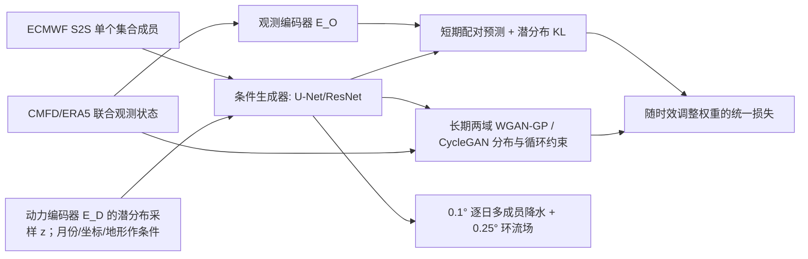

# GAN-W2C：用天气尺度配对约束与气候分布约束连接 S2S 降水集合订正

> Wen Shi、Baoxiang Pan、Jianbin Huang、Tingfeng Dou、Jie Feng、Huihui Yuan 等，*Distribution-Guided Ensemble Postprocessing for S2S Precipitation Forecasts: A Seamless Pathway Using Deep Generative Models*，*JGR: Machine Learning and Computation*，2026-05-06，[正式论文及补充材料入口](https://agupubs.onlinelibrary.wiley.com/doi/full/10.1029/2025JH000993)，[正式 PDF](https://agupubs.onlinelibrary.wiley.com/doi/pdf/10.1029/2025JH000993)。复核日期：2026-09-25；[作者代码固定提交](https://github.com/sw-meteo/GAN_weather2climate/tree/f7f2fff4469c2671a79ccff95de912dad4df8a6d)。

**证据边界**：按正式论文 19 页、Figures 1–9 和作者固定版本源码核验；官方 Supporting Information S1 的下载端本次返回 403，因此不将未亲见的 Table S1/Text S5 中实验超参数冒充已知值。下文区分“论文报告的实验”“公开代码默认值”“仍需取得的配置”。

## 1. 研究问题与方法

在短期，ECMWF 再预报与验证场仍可配对回归；到数周后，混沌使逐日配对误差不再是合理的唯一训练信号。纯回归后处理会向条件均值收缩，导致雨区模糊、极端偏弱、集合欠离散；纯气候分布匹配又可能失去天气初值信息。GAN-W2C 让**天气尺度的配对预测损失随 lead time 衰减**，通过对抗与循环一致性约束长期气候分布，并以潜分布 KL 保留随机成员生成机制；它逐个处理输入集合成员，再为每个动力成员生成小集合。这里“预测损失衰减”不意味着 KL 必然使用同一个 lead 权重。[Methods 2、Discussion](https://agupubs.onlinelibrary.wiley.com/doi/pdf/10.1029/2025JH000993)

方法图据原文 Figure 2 和作者源码自绘；观测编码器在训练中为潜分布对齐提供目标，推理只需动力编码器和正向生成器。判别器采用 PatchGAN 与 WGAN-GP 约束局地真实性，生成器是卷积 U-Net/ResNet 类骨架。论文报告训练、验证、测试分别为 **2002–2013、2014–2016、2017–2018**；评估主要在中国南方的 **0.1° CMFD** 格点。它是区域下尺度/后处理，不是全球原生 10 km 动力预报。[Methods 2.3–2.4](https://agupubs.onlinelibrary.wiley.com/doi/pdf/10.1029/2025JH000993)

### 结构和训练期/推理期网络

每个 ECMWF 动力集合成员按一张每日联合状态场独立进入正向路径。`E_D` 根据粗格点动力状态输出潜分布参数，重参数化抽样得到不同 `z`；`G_D2O` 将状态、`z` 和辅助条件映射成细格点降水与环流。训练还有 `E_O` 从观测状态产生潜分布供 KL 对齐，`G_O2D` 执行观测→动力逆映射，`D_O` 和 `D_D` 分别判别两域联合状态，约束 `D→O→D` 和 `O→D→O` 两个循环。推理不运行 `E_O`、逆生成器或判别器；对同一动力成员重复从 `E_D` 抽样，形成 mini-ensemble。[正文 Figure 2](https://agupubs.onlinelibrary.wiley.com/doi/pdf/10.1029/2025JH000993)；[模型模块](https://github.com/sw-meteo/GAN_weather2climate/blob/f7f2fff4469c2671a79ccff95de912dad4df8a6d/scripts/3.train/plmodules.py#L1240-L1355)

作者实现的 `D2O_Net` 有共同的 1° 特征主干、分叉至 0.25° 环流头和 0.1° 降水头；默认类定义是主干 256 通道/4 个残差块、环流头 64 通道/2 块、降水头 16 通道/2 块，降水头以 `PixelShuffle(5)` 放大并用 ReLU 保证非负。逆向 `O2D_Net` 将两类不同分辨率输入下采样并合并，输出粗格点状态。**这些是公开类定义默认值，不等于本文最终训练配置**；正文只确认 U-Net 式上下采样、ResNet 块和 PatchGAN。尤其 `Dis_O_Net` 代码默认 `out_mode='scalar'`，与正文的二维 PatchGAN 图不同；缺最终实验配置，不能据默认值推定正式模型结构。[模型源码](https://github.com/sw-meteo/GAN_weather2climate/blob/f7f2fff4469c2671a79ccff95de912dad4df8a6d/scripts/3.train/models.py#L457-L805)

### 资料链与预处理

| 来源 | 分辨率/年份 | 模型角色 |
|---|---|---|
| ECMWF IFS CY47R3 的 2022 业务版本“按需生成”回报 | 原始约 1°；回报覆盖 2002–2021；最长 46 天 | 条件输入及动力集合，避免把跨多年不同业务版本混成训练集 |
| ERA5 | 0.25° | 环流变量的验证参考 |
| CMFD 降水 | 0.1°，陆地；可用至 2018 | 中国南方 21–33°N、106–122°E 的降水目标和主评测网格 |
| ETOPO 2022/ERA5 静态地形 | 分别 0.1°/0.25° | 基岩高程及坡度、粗糙度等下垫面条件 |

环流输入包含 2 m 气温、海平面气压、500/700/850 hPa 的风、温度、湿度、位势高度，以及 200 hPa 纬向风和位势高度；所有非静态变量聚合为日统计量。环流、地形、经纬坐标采用 `[0,1]` min–max 缩放。**正式 PDF 明确给出降水变换 `x' = 5 ln(x+1)`**，日降水 `x` 用 mm/d，意在压缩长尾而保留极端的相对次序。CMFD 原资料为 mm/h 时，[作者单位转换](https://github.com/sw-meteo/GAN_weather2climate/blob/f7f2fff4469c2671a79ccff95de912dad4df8a6d/utils/var_transform_method.py)先乘 24；位势高度也列出乘 `g = 9.80665` 的单位对齐。代码预处理另外列有 `log(x+1)`→逐变量 min–max→乘 5，预测端逆序变换，**与正文的单式不完全同一口径**；缺各变量的训练期极值文件，不可直接用单式重现作者存档数组。训练损失在各资料原分辨率计算，主降水评分在 0.1° CMFD 网格上；原动力场为了比较被双线性插值至该网格。[正式论文 §2.3–2.4](https://agupubs.onlinelibrary.wiley.com/doi/pdf/10.1029/2025JH000993)

代码数据集类显示，降水域使用 CMFD 陆地有效格点掩膜，无效格点置零；预存多源数组按元数据指针及 `valid_year`、时效等条件选择，再把地形、有效格点、坐标和时间辅助特征与动力/观测状态一起读出。异常数值通过 `nan_to_num` 和范围裁剪处理；公开默认 `precip_bnd=[0,10]`、`circu_bnd=[0,1]`，但这是**读取已变换数据后的代码默认裁剪**，不能误作原始雨量上限 10 mm/d。辅助特征可含有效月份与 lead day；主模型默认不把 lead 直接嵌入网络，时效变化主要由损失权重和样本重采样体现。[数据集源码](https://github.com/sw-meteo/GAN_weather2climate/blob/f7f2fff4469c2671a79ccff95de912dad4df8a6d/scripts/3.train/dataset.py)

### 训练流程、损失、参数与微调

完整目标的作用要分开理解：配对预测/身份项 `Lpred` 在短 lead 将生成结果贴近对应真值；`Ladv` 用两域判别器学习真实联合场分布；`Lcycle` 要求正反映射往返可重构；`Linv` 在粗化后的环流上施加保形锚点，避免“雨变真实却跟错环流”；`LKL` 对齐动力与观测编码器的潜分布。代码的 `CvaeGanModule_v2` 更细：一次训练步对一个样本生成多个成员，**身份与循环损失施于生成成员的均值，观测域对抗与环流保形施于各成员**，KL 约束编码分布。这样避免把每个随机成员都强迫为唯一配对真值、直接抹去随机性；但未取得最终配置，不能认为“用代码默认值就复现了论文”。[正文 §2.1](https://agupubs.onlinelibrary.wiley.com/doi/pdf/10.1029/2025JH000993)；[作者训练步](https://github.com/sw-meteo/GAN_weather2climate/blob/f7f2fff4469c2671a79ccff95de912dad4df8a6d/scripts/3.train/plmodules.py#L1614-L1800)

随 lead 递减的短期监督是方法关键，而不是把天气模型和气候模型分别训练后拼接。论文称配对损失采用二次下降并在长时效归零；公开函数写作 `w(τ) = (λ₀/100)(τ−T)²`（`τ<T`），否则为 0。**代码仅在 `lambda_id='function'` 时启用该函数，类默认阈值 `T=3` 且默认 `lambda_id=1`**，不能仅凭默认值断言正式实验的真实阈值/初始权重。`Linv` 的粗环流比较还有 `ReLU(MSE−delta_inv)` 容差截断，允许细尺度调整而限制大尺度漂移。[正文 §2.1](https://agupubs.onlinelibrary.wiley.com/doi/pdf/10.1029/2025JH000993)；[日程函数](https://github.com/sw-meteo/GAN_weather2climate/blob/f7f2fff4469c2671a79ccff95de912dad4df8a6d/scripts/3.train/func.py)；[训练模块](https://github.com/sw-meteo/GAN_weather2climate/blob/f7f2fff4469c2671a79ccff95de912dad4df8a6d/scripts/3.train/plmodules.py#L1680-L1735)

训练流程是按日期/lead 组合准备 ECMWF 再预报、CMFD 和 ERA5 对应数组及有效格点；逐动力成员作为独立样本，抽潜变量生成小集合；四类优化器分别更新逆向生成器＋双编码器、动力域判别器、正向生成器＋双编码器、观测域判别器。WGAN-GP 在真实/生成场插值上惩罚判别器梯度范数偏离 1。论文按 2014–2016 验证分数及生成形态择优，保留 2017–2018 独立测试。没有独立的基础模型预训练→下游微调阶段；训练后的生成器直接后处理再预报，讨论中跨区域部署需**重新训练并调超参**，不能误写为已经给出低成本微调方案。[正文 §2、§4](https://agupubs.onlinelibrary.wiley.com/doi/pdf/10.1029/2025JH000993)；[优化器分组源码](https://github.com/sw-meteo/GAN_weather2climate/blob/f7f2fff4469c2671a79ccff95de912dad4df8a6d/scripts/3.train/plmodules.py#L1600-L1609)

| 公开训练项 | 值/做法 | 尚须核对 |
|---|---|---|
| 优化器与选模 | 论文明确 Adam；按 2014–2016 验证数值与生成场形态择优 | 正文未给最终学习率、β、batch、epoch、更新比；应见 Supporting Information Table S1/Text S5，但下载端本次返回 403 |
| 训练年份 | 2002–2013 | 测试独立留出 2017–2018 |
| 短期样本再权重 | **所有 lead ≤3 天**的样本采样频率增至 3 倍 | 旧稿误写成只有“第 3 天”；也不能与配对损失权重函数混为一谈 |
| 集合规模 | 原始动力 11 成员，每个动力成员生成 10 个后处理成员；完整产品可达 110 个生成场 | EMOS 抽样时匹配最终输出规模；不同基线仍需清楚报告成员口径 |
| 软件入口 | `CvaeGanModule_v2` 是主模型，`DetermModule` 是 MOS；PyTorch Lightning 1.9.5 | 公开仓库的 `base.yaml` 选择 `AdversarialModule_v1`/`senario: MOS`，并非最终实验配置；`train.py` 默认期待未公开的 `cfg/cfg.base.yaml` 与 `trainset_config` |
| 代码默认值，**非论文最终配置** | `BaseModule` 默认 `lr=1e−5`、Adam β 可选 `.5/.999`、`lambda_gp=10`、`n_opt_G=1`/`n_opt_D=5`；主模型默认潜维 `nz=8`、循环权重 10、KL 权重 .01 | 不能将类默认值冒充 Table S1；`base.yaml` 还写 batch 64/1000 epoch/debug=true，但仅是基础配置 |
| 年份冲突 | 正文报告训练 2002–2013；当前公开 `train.py` 硬编码训练 2010–2013 | 现行脚本不能原样重现正文 12 年训练期，应先询问/核对最终配置 |

作者仓库 README 明确区分 `CvaeGanModule_v2`（本文生成模型）与 `DetermModule`（MOS 确定性对照），有助于复现时避免混用训练损失。[作者代码仓库](https://github.com/sw-meteo/GAN_weather2climate)

上述代码默认值及年份对照依据[固定提交的基础配置](https://github.com/sw-meteo/GAN_weather2climate/blob/f7f2fff4469c2671a79ccff95de912dad4df8a6d/scripts/3.train/base.yaml)、[训练入口](https://github.com/sw-meteo/GAN_weather2climate/blob/f7f2fff4469c2671a79ccff95de912dad4df8a6d/scripts/3.train/train.py#L35-L90)和[主模型构造函数](https://github.com/sw-meteo/GAN_weather2climate/blob/f7f2fff4469c2671a79ccff95de912dad4df8a6d/scripts/3.train/plmodules.py#L1250-L1305)，不能替代原实验配置。公开仓库也不含完整 ECMWF/ERA5/CMFD 训练数组和统计极值文件；可复现前必须锁定资料版本、年份及地域裁切。

## 2. 原文图表结果与反例

| 原文证据 | 报告值/现象 | 解释 |
|---|---|---|
| Figure 4：所有时效平均 CRPS | GAN-W2C 为原始动力集合的 **92.9%** | CRPS 越低越好，即相对减少约 7.1%；不等于技巧提高 92.9% |
| Figure 4：q90 / q95 极端 BS | 分别为原始动力集合的 **89.4% / 91.0%** | BS 分数相对减少约 10.6% / 9.0% |
| Figure 4：胜过气候态的时效 | 概率 CRPS 约可到 **第 3 周**；MOS 约 pentad 3，原始动力约 pentad 2–3 | 指特定区域、2017–2018 样本与该气候态构造；第 4–6 周没有由此证明持续可用 |
| Figure 4：SRR 集合可靠性 | 前 7 天校准改善约 **22.5%**；较长时效 SRR 降为动力产品的 **93.8%** | 长时效仍有欠离散问题，不能说始终完美校准 |
| Figure 5–7：空间与物理结构 | 比 MOS 保留高波数雨区细节；降水—850 hPa 水汽输送 EOF 模态更一致 | 不能修正根本错误的大尺度环流 |
| Figure 9：消融 | 仅 weather 约束 GAN-W、仅 climate 约束 GAN-C 均不及完整 GAN-W2C | 两路互补有证据，但只在此区域/资料协议内成立 |

数值与图意据[正式 PDF Results 3.2–3.6](https://agupubs.onlinelibrary.wiley.com/doi/pdf/10.1029/2025JH000993)整理。Figure 4 横轴先逐日列 1–5 天，随后按 pentad/周聚合；92.9%、89.4%、91.0% 是**跨时效相对原动力产品的平均比例**，不是第 21 天的单点成绩。概率气候态由其他年份同历日前后 ±15 天样本抽取 30 成员，因此“胜气候态”依赖这个参考构造。EMOS 每个 lead、每个格点分别拟合零膨胀偏态分布，并按 GAN-W2C 输出规模抽样，但不保留空间相干性；论文不将其放入谱图比较。[正文 §2.2、Figure 4](https://agupubs.onlinelibrary.wiley.com/doi/pdf/10.1029/2025JH000993)

原文也承认 EMOS 在少数时效 CRPS/Brier 有边际优势，MOS 在部分 RMSE/MAE 最佳；故“GAN-W2C 所有指标全面领先”不准确。SRR 对有限集合大小做校正，1 才是离散度与误差统计匹配；前 7 天相对改善 22.5% 不等于提高 22.5 个百分点。Figure 5 的第 3–6 周秩直方图/发生概率可靠性出现轻度正偏，长时效仍欠离散；1° 网格与三日累计降水的 Figure S4–S8 只是辅助稳健性检验，不是另一套原生 1° 模型。[Results 3.2–3.3](https://agupubs.onlinelibrary.wiley.com/doi/pdf/10.1029/2025JH000993)

Figure 6 按格点比较降水日比例（阈值 >0.25 mm/d）、湿日均值、标准差及 q33/q66/q90/q99，检验空雨与强雨分布能否同时贴近 CMFD。Figure 7 将降水异常与 850 hPa 水汽输送做联合 EOF；GAN-W2C 主模态比只改降水的 MOS 更自洽，但 EOF 一致只是**线性共变的必要条件**，论文明确承认并未证明环流技巧提升。Figure 8 用空间块内极大不确定度与极大误差作相关散点，报告总与分量的相关通常 `r>0.70`、传播分量约 `r≈0.72`；相关部分来自二者同随天气异常大小变化，不能解释成误差已被无偏预测。[Results 3.4–3.6](https://agupubs.onlinelibrary.wiley.com/doi/pdf/10.1029/2025JH000993)

## 3. 不确定性解释、局限和复现

方法将动力集合成员间差异解释为传播不确定性，将同一动力成员内的多个生成样本差异解释为后处理不确定性。前者随 lead 增长，到约第三个 pentad 趋于饱和；后者总体较平稳。这样的拆分可帮助定位“应改善动力核心还是降水参数化”，但二者并非统计独立、也不自动是严格因果分解。[原文 Figure 8](https://agupubs.onlinelibrary.wiley.com/doi/full/10.1029/2025JH000993)

复现时需要固定 ECMWF S2S 系统版本、CMFD 参考资料、地形和训练/测试年份；先取得论文 Supporting Information S1 的最终 Table S1，再确认公开代码的 2010–2013 训练年份、`base.yaml` MOS 配置和 PatchGAN 输出形式如何改成正文实验。所有方法匹配输出集合规模，分别计算原始、MOS、EMOS、GAN-W、GAN-C、GAN-W2C 的 CRPS/BS/ACC/SRR；按原文的 0.1° 日场、1° 场、三日累计及不同季节分开评价。重点外部验证应放到别的气候区和近年业务资料，并以可靠性图、分位极端、空间谱和降水—环流一致性同时报告，避免只用 CRPS 掩盖极端/结构缺陷。论文讨论称完整起报约 10 秒可在消费级 GPU 推理，但训练/存储成本高且新区域要重训；该速度不含业务资料下载、预处理和验证流水线。[Discussion](https://agupubs.onlinelibrary.wiley.com/doi/pdf/10.1029/2025JH000993)

[返回首页](../../README.md) · [返回总表](../../气象大模型_中期预报论文追踪.md)
