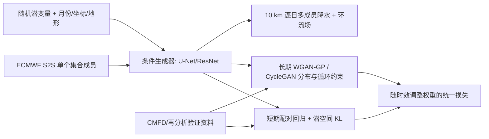

# GAN-W2C：用天气尺度配对约束与气候分布约束连接 S2S 降水集合订正

> Wen Shi、Baoxiang Pan、Jianbin Huang、Tingfeng Dou、Jie Feng、Huihui Yuan 等，*Distribution-Guided Ensemble Postprocessing for S2S Precipitation Forecasts: A Seamless Pathway Using Deep Generative Models*，*JGR: Machine Learning and Computation*，2026-05-06，[DOI:10.1029/2025JH000993](https://agupubs.onlinelibrary.wiley.com/doi/full/10.1029/2025JH000993)。阅读日期：2026-09-24；[作者代码](https://github.com/sw-meteo/GAN_weather2climate)。

## 1. 研究问题与方法

在短期，ECMWF 再预报与验证场仍可配对回归；到数周后，混沌使逐日配对误差不再是合理的唯一训练信号。纯回归后处理会向条件均值收缩，导致雨区模糊、极端偏弱、集合欠离散；纯气候分布匹配又可能失去天气初值信息。GAN-W2C 让**天气尺度的配对回归/潜空间约束随 lead time 衰减**，同时通过对抗与循环一致性约束长期气候分布，逐成员处理输入集合并可为每个动力成员再生成多个后处理成员。[Methods 2、Discussion](https://agupubs.onlinelibrary.wiley.com/doi/full/10.1029/2025JH000993)

方法图据原文 Figure 2 自绘。判别器采用 PatchGAN 和 WGAN-GP 以保留局部空间细节，生成器是卷积 U-Net/ResNet 类骨架。训练、验证、测试分别为 **2002–2013、2014–2016、2017–2018**；评估主要在中国南方的 **0.1° CMFD** 格点。它是区域下尺度/后处理，不是全球原生 10 km 动力预报。[Methods 2.3–2.4](https://agupubs.onlinelibrary.wiley.com/doi/full/10.1029/2025JH000993)

### 资料链与预处理

| 来源 | 分辨率/年份 | 模型角色 |
|---|---|---|
| ECMWF IFS CY47R3 的 2022 业务版本“按需生成”回报 | 原始约 1°；回报覆盖 2002–2021；最长 46 天 | 条件输入及动力集合，避免把跨多年不同业务版本混成训练集 |
| ERA5 | 0.25° | 环流变量的验证参考 |
| CMFD 降水 | 0.1°，陆地；可用至 2018 | 中国南方 21–33°N、106–122°E 的降水目标和主评测网格 |
| ETOPO 2022/ERA5 静态地形 | 分别 0.1°/0.25° | 基岩高程及坡度、粗糙度等下垫面条件 |

环流输入包含 2 m 气温、海平面气压、500/700/850 hPa 的风、温度、湿度、位势高度，以及 200 hPa 纬向风和位势高度；所有非静态变量聚合为日统计量。环流、地形、经纬坐标采用 `[0,1]` min–max 缩放；降水则做专门的长尾压缩变换。**网页 HTML 的公式在该处没有正确渲染，不能从网页臆测变换的精确函数与参数**，需参考原 PDF/补充材料或作者代码。训练各损失在资料本身的原始分辨率上计算，主降水评分在 0.1° CMFD 上；原始动力场为了比较被双线性插值至该网格。[官方论文 §2.3–2.4](https://agupubs.onlinelibrary.wiley.com/doi/full/10.1029/2025JH000993)

### 训练流程、损失、参数与微调

生成器、判别器和编码器都采用卷积骨架，带 U-Net 式下采样/上采样和 ResNet block；月份、经纬度及地形作条件。PatchGAN 判别器给出二维局地判别分数，WGAN-GP 的梯度惩罚稳定对抗训练。短 lead 的配对轨迹损失与潜变量约束帮助保留天气初值信息，长 lead 的分布/循环约束帮助生成气候上合理的雨区；所有网络本体对 lead time 共用参数，但损失权重与样本采样会随 lead 调整。这是**从回报和参考场训练的生成式后处理**，未报告先在其他基础模型预训练、再做微调；也不能把对抗训练的交替更新误写成微调。[官方论文 §2.1–2.4](https://agupubs.onlinelibrary.wiley.com/doi/full/10.1029/2025JH000993)

| 公开训练项 | 值/做法 | 尚须核对 |
|---|---|---|
| 优化器 | Adam，用 2014–2016 验证集数值与生成场形态选模型 | 官方 HTML 未列明确学习率、β、batch、epoch、判别器/生成器更新比 |
| 训练年份 | 2002–2013 | 测试独立留出 2017–2018 |
| 短期样本再权重 | 第 3 天样本采样频率增至 3 倍 | 平衡短/长期贡献，不代表所有 lead 等频 |
| 集合规模 | 原始动力 11 成员，单动力成员可采 10 个后处理成员 | 评价时应匹配最终输出规模，不能把成员膨胀当算法技巧 |
| 软件入口 | 作者仓库 `scripts/3.train/plmodules.py` 的 `CvaeGanModule_v2`；PyTorch Lightning 1.9.5 | 超参数更细项在论文 Supporting Information Table S1/Text S5 与代码中 |

作者仓库 README 明确区分 `CvaeGanModule_v2`（本文生成模型）与 `DetermModule`（MOS 确定性对照），有助于复现时避免混用训练损失。[作者代码仓库](https://github.com/sw-meteo/GAN_weather2climate)

## 2. 原文图表结果与反例

| 原文证据 | 报告值/现象 | 解释 |
|---|---|---|
| Figure 4：所有时效平均 CRPS | GAN-W2C 为原始动力集合的 **92.9%** | CRPS 越低越好，即相对减少约 7.1%；不等于技巧提高 92.9% |
| Figure 4：q90 / q95 极端 BS | 分别为原始动力集合的 **89.4% / 91.0%** | BS 分数相对减少约 10.6% / 9.0% |
| Figure 4：胜过气候态的时效 | 概率 CRPS 约可到 **第 3 周**；MOS 约 pentad 3，原始动力约 pentad 2–3 | 第 4–6 周没有由此证明持续可用 |
| Figure 4：SRR 集合可靠性 | 前 7 天校准改善约 **22.5%**；较长时效 SRR 降为动力产品的 **93.8%** | 长时效仍有欠离散问题，不能说始终完美校准 |
| Figure 5–7：空间与物理结构 | 比 MOS 保留高波数雨区细节；降水—850 hPa 水汽输送 EOF 模态更一致 | 不能修正根本错误的大尺度环流 |
| Figure 9：消融 | 仅 weather 约束 GAN-W、仅 climate 约束 GAN-C 均不及完整 GAN-W2C | 两路互补有证据，但只在此区域/资料协议内成立 |

数值与图意据[论文 Results 3.2–3.6](https://agupubs.onlinelibrary.wiley.com/doi/full/10.1029/2025JH000993)整理。原文也承认 EMOS 在少数时效 CRPS/Brier 有边际优势，MOS 在部分 RMSE/MAE 最佳；故“GAN-W2C 所有指标全面领先”不准确。Figure 5 的第 3–6 周概率可靠性出现轻度正偏；这是长时效可预报信号不足的提醒。[Results 3.3、Conclusion](https://agupubs.onlinelibrary.wiley.com/doi/full/10.1029/2025JH000993)

## 3. 不确定性解释、局限和复现

方法将动力集合成员间差异解释为传播不确定性，将同一动力成员内的多个生成样本差异解释为后处理不确定性。前者随 lead 增长，到约第三个 pentad 趋于饱和；后者总体较平稳。这样的拆分可帮助定位“应改善动力核心还是降水参数化”，但二者并非统计独立、也不自动是严格因果分解。[原文 Figure 8](https://agupubs.onlinelibrary.wiley.com/doi/full/10.1029/2025JH000993)

复现时需要固定 ECMWF S2S 系统版本、CMFD 参考资料、地形和训练/测试年份；所有方法匹配输出集合规模，分别计算原始、MOS、EMOS、GAN-W、GAN-C、GAN-W2C 的 CRPS/BS/ACC/SRR。重点外部验证应放到别的气候区和近年业务资料，并以可靠性图、分位极端、空间谱和降水—环流一致性同时报告，避免只用 CRPS 掩盖极端/结构缺陷。

[返回首页](../../README.md) · [返回总表](../../气象大模型_中期预报论文追踪.md)
