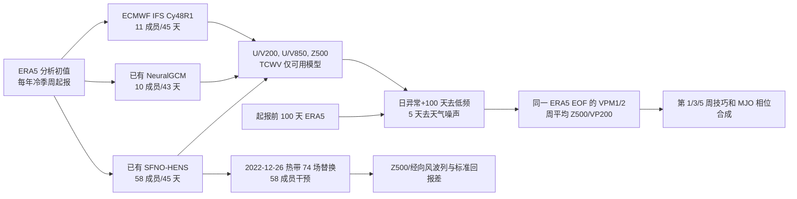

# SFNO-HENS 与 NeuralGCM 的次季节 MJO 遥相关评估：长滚动是否仍有物理过程？

> Yannick Peings、Cameron Dong、Ankur Mahesh、Michael Pritchard、William D. Collins、Gudrun Magnusdottir，*Subseasonal Forecasting and MJO Teleconnections in Machine Learning Weather Prediction Models*，*Journal of Geophysical Research: Atmospheres* 131(3)，e2025JD044910，[期刊 DOI 页](https://agupubs.onlinelibrary.wiley.com/doi/10.1029/2025JD044910)，首次在线 2026-01-30；[加州大学 eScholarship 开放的 43 页同行评审稿及 PDF](https://escholarship.org/uc/item/9s82223j)。2026-09-24 依据开放全文重新核对 §1–4、表 1 和图 1–13，将旧版摘要/图注稿升级为完整正文精读。期刊列有单独的 Supporting Information S1，但本轮未取得其独立 PDF；正文对 S 图的定性叙述可核验，S 图本身的数值不冒充已亲自读图。

## 一、研究问题和真正的贡献

这不是一篇开发全新预报网络或重新训练天气基础模型的论文，而是问：为 6 小时天气预测训练的模型在滚动到**第 3–6 周**之后，是否仍能预测热带 MJO、它穿越海洋大陆的传播以及对北太平洋—美国西部环流与水汽输送的遥相关？比较对象是全机器学习的 **SFNO-HENS**、可微动力核与学习型物理参数化组成的 **NeuralGCM**，以及 ECMWF IFS 的 S2S 回报；重点地区 ENP-WNA（东部北太平洋与北美西部）关系到美国西部冷季风暴、空气河与水资源。研究最后用 SFNO-HENS 的“热带初值去异常”干预，检验一次可预报的连续湿润事件的热带影响链。[开放全文 §1、§3–4](https://escholarship.org/uc/item/9s82223j)

主要结论有两层、不能拆开引用：两套 ML 模型在 MJO 双变量指标及北太平洋周平均 Z500 上**总体与 ECMWF 相近**，热带信号传播和部分遥相关合成颇真实；但到第 3 周以后，西美国水汽输送的**绝对技巧仍有限**，更不能从环流相关推断其逐日降水已可靠。作者没有为本文产出降水预报评分，SFNO-HENS 甚至不输出降水或 OLR；“学到物理过程”指对初值扰动呈现合理的波列响应，不是证明其显式求解/识别了完整因果定律。[正式摘要](https://agupubs.onlinelibrary.wiley.com/doi/10.1029/2025JD044910)｜[开放正文 §3.3–4](https://escholarship.org/uc/item/9s82223j)

## 二、模型、数据与 447 次回报到底怎样构成

| 对象 | 已有模型权重与本文输入 | 本文回报设计 | 训练外年份/证据边界 |
| --- | --- | --- | --- |
| SFNO-HENS | 采用 Mahesh 等发布的球面傅里叶神经算子集合配置，**1979–2015 ERA5 逐 6 h、74 个气象字段训练**；该配置以加大嵌入宽度、降低谱截断、多个 checkpoint 与 bred vectors 改善长期离散度。本文以 ERA5 起报，保存 U/V850、U/V200、Z500、TCWV，并从 U/V200 算 VP200。 | 2004–2023 ONDJFM 共 **447 次**；每次 **29 个 checkpoint × 每个 2 个 bred-vector 扰动 = 58 成员**，最长 **45 天**。 | 原模型的 2016–17 测试年之外，本文严格无训练重叠的验证范围为 **2018–2023**。**329/25,926 成员（约 1.3%）**出现近地面非物理发散/低于绝对零度温度而被剔除。不能写成 58 个成员在所有样本/时效都有效。 |
| NeuralGCM | 用随机版的动力方程核 + 神经参数化物理；在每时间步注入噪声组成集合。原模型 ERA5 训练到 **2019 年**，其天气训练使用 6 h 至 5 天的多步优化与概率/谱保真目标；这些是**已有模型的设计背景**，非本论文重训参数。 | 同样 447 次，各 **10 成员、43 天**；与 IFS 同日初始化，比 SFNO-HENS **早一日**。保存可用的共同变量，但论文 Fig. 8/10 的 TCWV 合成没有 NeuralGCM。 | 此文的严格训练外子样本只有 **2020–2023**。不能用 2004–2023 全样本直接标注“独立测试”。 |
| ECMWF IFS S2S | 物理模型 **Cy48R1** 的 ECMWF S2S 回报，逐周起报；同样提取 U/V850、U/V200、Z500、TCWV。 | 与 NeuralGCM 同日期；**11 成员**（1 control + 10 perturbations），**45 天**。 | 版本和集合规模与 ML 模型不同；其 2004–2023 历史回报不是与 AI 同种训练外概念。 |

每年 2004–2022 的 10–12 月 13 次、1–3 月 10 次，共 23 次；2023 仅 1–3 月 10 次，算得 **19×23+10=447**。表 1 中 SFNO 的 1 月首个日期为 01-02，NeuralGCM/IFS 为 01-01，十月至十二月也相差一天；各自对对应日 ERA5 验证，而不是强行当成同一初值完全配对。图 1 正文一句称 JFM Z500 每格点序列有“447”个数据点，但**表 1 的 447 是 ONDJFM 全季总数**，JFM 约 20 年×10 次=200；此处是正文口径自相矛盾，读图时以表 1 和具体季节筛选为准，不能默默给 JFM 填 447。全部样本和模型数字见[开放正文 §2.1、表 1](https://escholarship.org/uc/item/9s82223j)。

本论文没有公布**新的**优化器、学习率、batch、训练 epoch、层宽、LoRA 或全量微调配置，因为没有重训两套权重。若想复现底座训练，需查 SFNO-HENS/[Huge Ensembles Part 1](https://gmd.copernicus.org/articles/18/5575/2025/) 与 [NeuralGCM 正式论文](https://www.nature.com/articles/s41586-024-07744-y)，并分别记录它们的训练阶段；不可把那些超参数写成 Peings 等的本次回报工作。本文真正新增的参数属于**起报样本、集合生成/筛选、异常处理和诊断流程**。[§2.1](https://escholarship.org/uc/item/9s82223j)

### 数据处理：从天气场到 MJO 指数

RMM 通常需要 OLR，而 SFNO-HENS/NeuralGCM 在此配置不提供 OLR，所以作者采用 **velocity-potential MJO（VPM）**：由 U200/V200 反演 VP200，联合 VP200、U850、U200 在 **15°S–15°N** 纬带平均后的日异常，投影到 ERA5 1980–2017 年求出的多变量前两个 EOF，形成共同基底上的 VPM1/VPM2。两系统都使用**同一 ERA5 EOF**，避免各自旋转坐标后相位不可比；因此本稿测试偏向 MJO 的风场/上层辐散分量，非完整的 OLR 对流或实测降水指标。[§2.2](https://escholarship.org/uc/item/9s82223j)

每个起报日前 **100 天 ERA5 日异常**先拼接到模式预测序列；逐日去过去 100 天的移动均值抑制 ENSO/季节低频，再加 **5 天移动平均**抑制天气噪声，不能用需未来时刻的带通滤波假装实时结果。日异常使用各模型**按预报 lead 的 2004–2023 模式气候态**去偏漂移，并用 ERA5 2004–2023 气候态参照；作者又用 ERA5 1991–2020 长期气候态重做，称主要结论相近，但那种处理不再消除模式随 lead 的系统漂移。归一化采用 ERA5 各字段跨经度标准差。MJO 事件阈值 **VPM 振幅 >0.7**，相邻事件至少隔 **5 天**；合成字段也走 100/5 天滤波。ENP-WNA 框定义 **180°E–90°W、25–65°N**，热带 IO-WP 框为 **40°E–145°W、25°S–25°N**。[§2.2](https://escholarship.org/uc/item/9s82223j)

上图按[§2–3](https://escholarship.org/uc/item/9s82223j)重绘的是**评估与干预链**，不是 SFNO 或 NeuralGCM 的内部网络结构。图示三行共同初值只是“ERA5 来源相同”，表 1 的实际起报日有一天差异。

## 三、评分定义和图 1–6：热带有信号，但不是无条件胜出

| 图/实验 | 原文数值或可核验现象 | 关键读法 |
| --- | --- | --- |
| 图 1、补图 S1–S3，JFM 周均 Z500 | 第 **3 周为 lead 14–21 天**，ENP-WNA 逐格点异常相关区均约 **0.5**；第 **5 周为 28–35 天**，约 **0.2**。2020–23 训练外子集相对全期第 3/5 周均约低 **0.1**；OND 第 3 周约 **0.4**。第 1 周在全期高于 0.98，训练外高于 0.97。 | 三模式分布和平均技巧相近，并没有 ML 大幅超越 IFS；2020–23 ECMWF 也下降，故下降不能单归因于训练重叠，但 4 年小样本仍限制显著性。OND 与 JFM 不同季节不能合并报告。 |
| 图 2a，ONDJFM VPM 双变量相关 | 全 2004–23 样本 **R=0.5** 阈值：NeuralGCM/IFS 约 **31 天**，SFNO-HENS **33 天**；仅 2020–23 子集分别约 **32/33/34 天**。 | 这些阈值衡量风场型 MJO 指数，不是降水技巧日，也非 FuXi-S2S 使用 OLR/RMM 指数时效的同口径比较。 |
| 图 2b，40 点滑动相关 | 第 25 天按相邻 **40 个 hindcast**逐次滑窗，三个系统曲线均强烈波动，SFNO 进入验证段一度下降、最末期恢复。 | 滑窗大量重叠，不是数百个独立实验；“模型训练外必然坏/好”的简单归因不成立。用 SFNO 仅前 10 成员算指标，作者称与 58 成员结论相近，但未在图中展示。 |
| 图 3，JFM 热带 VP200 | IO-WP 第 3 周相关约 **0.7**，第 5 周约 **0.4**；第 5 周 NeuralGCM 约 **0.35**，SFNO/IFS 各约 **0.45**。2020–23 第 3 周三个模式约 **0.6**。 | 不可只看 MJO 单指数图 2 就说三个系统每个热带场均同等：NeuralGCM 第 5 周空间 VP200 明显稍差。 |
| 图 4a，447 次 ONDJFM 振幅 | IFS 的**集合均值** VPM 振幅在前 10 天衰减更快，SFNO/NeuralGCM 保持较久；画的是各起报集合均值的分布及 10/90 分位。 | 不能把 ensemble mean 的振幅衰减写成“每个成员的 MJO 物理振幅都减半”。高成员离散度本就会抵消集合均值相位。 |
| 图 4b，spread/error | 前几天三系统均稍欠离散，之后 SFNO-HENS 约 **1**，NeuralGCM 约 **0.9**，IFS 前 **10 天 >1**（过离散）。 | 这是 VPM 二维指数的一项校准诊断，并非所有变量/区域/极端事件的可靠性证明。SFNO 不稳定成员已删除，样本和成员大小须固定。 |
| 图 5–6，MJO 传播 | 起始相位 2/3 与 6/7 的 VP200、U200 事件合成：两 ML 模式穿越海洋大陆的传播速度和相位较合理；SFNO 稍强、NeuralGCM 稍弱；IFS 的印度洋异常幅度偏弱。 | 合成事件按 >0.7 阈值挑选，不是所有相位所有季节的个案准确率；2020–23 合成事件太少，正文不据此做强比较。 |

图值与限定均来自[开放正文 §3.1–3.2、图 1–6](https://escholarship.org/uc/item/9s82223j)。这里“相关约 0.5/0.2”是空间框内对逐格点相关的平均，不是 Z500 ACC>0.5 的独立可用预报天数。作者的“Full 2004–23 vs only 2020–23”还需注意 SFNO 的 2018–19 是训练外、但 NeuralGCM 不是；选择 2020–23 是为了三者共同的严格训练外窗口。

## 四、图 7–10：遥相关、背景偏差与水汽的正负结果

作者针对 JFM 将**相位 2/3 减去相位 6/7**的 MJO 事件合成，选事件后 **5–9 天**的 Z500、VP200、850 hPa 风及可得模型的 TCWV，模拟 Rossby 波传播到中纬度的时间延迟。图 7/8 选择**初值当天**的 MJO 活动，主要检验第 1 周/第 2 周起点的机制；图 9/10 则在起报**第 14 天**根据 ERA5 识别强 MJO，合成落在第 19–23 天，是第 3 周末/第 4 周初结果。不能把“lead 14 的 MJO 信号”误写为“合成也在第 14 天”。所有事件按 ERA5 VPM 阈值选取，使不同模式对同一观测事件的响应可比较。[§3.3.1–3.3.2](https://escholarship.org/uc/item/9s82223j)

| 图 | 本文实得的物理/性能内容 | 负面与因果边界 |
| --- | --- | --- |
| 图 7（第 1 周 Z500/VP200/U850） | 印度洋辐散与热带太平洋辐合的 VP200 偶极触发东亚急流入口至北太平洋—北美的脊槽波列；三模式第 5–9 天大尺度反应与 ERA5 较一致。 | IFS 在这么短的 lead 已低估热带 MJO 幅度；不能把“波列方向正确”当成降水或每次空气河登陆位置正确。 |
| 图 8（第 1 周 TCWV） | 脊压制部分中纬风暴/空气河入侵，美国西部显示干的柱水汽异常。 | **NeuralGCM 的 TCWV 不可用**，只有 SFNO、IFS、ERA5 三列；这不是 NeuralGCM TCWV 表现为零或一定更差。 |
| 图 9（第 3 周 Z500/VP200/U850） | 三模式大体保留波列；IFS 的热带 VP200 异常约为 ML 的一半、北太平洋脊较弱，东亚急流附近 U200 平均态偏差较明显；ML 的该处系统漂移较轻。 | 较少偏差未转化为图 1 平均 Z500 技巧的显著优势，不能写成“AI 一定通过更少背景偏差赢 IFS”。NeuralGCM 仍有小正 U200 偏差，SFNO 更西侧亦有偏差。 |
| 图 10（第 3 周 TCWV） | SFNO 捕捉西南美国偏干，但**低估太平洋西北部干异常**；IFS 也捕捉西南干异常但振幅不足，还把西北部算成偏湿。 | 这是 TCWV 事件合成，不是逐站降水验证；NeuralGCM 无该字段；西北部符号错误说明“所有中纬遥相关均真实”的说法不成立。 |

冷季内部还要分季节：作者在正文叙述补图 S11–S14 指出 **OND** 的 ERA5 对应波列不同，西南美国仍偏干，但太平洋西北部**偏湿**，与 JFM 相反；第 3 周两 ML 对 Alaska/北美脊槽幅度偏弱，IFS 的湿度方向亦可能错误。仅 2020–23 的 JFM 合成所含 MJO 事件约第 1 周 **8**、第 3 周 **7**，不足以稳健排序。因为补充材料原图本轮未取得，这些是正文已发表的作者叙述，非我们独立重新读图得出的补图数值。[§3.3.2–3.3.3](https://escholarship.org/uc/item/9s82223j)

## 五、图 11–13：2022 年湿润事件的 58 成员热带干预

选择 2022-12-26 00 UTC 起报，因为后续东部北太平洋出现持续槽、美国西海岸约三周湿润，起报时 MJO 位于较强 **相位 5/6**，标准 SFNO-HENS 在第 2 周 ENP-WNA Z500 的空间 ACC **0.89**，第 3 周仍 **0.78**。干预并非训练模型或运行中同化：作者**只在初始时刻**将全球所有经度、约 **25°S–15°N** 的 **74 个 6h 输入场**替换为 SFNO 训练期 **1979–2015** 的 6 小时气候值；边界另用约 **5° 纬向缓冲**和 **11 格点移动平均**消除锐利接缝。域外初始场完全相同，两个配置都跑 **58 成员**。本文没有报告再调权重或特殊损失函数。[§3.4、图 11–12](https://escholarship.org/uc/item/9s82223j)

去掉热带初值异常后，第 2 周环流 ACC 从 **0.89 降至 0.18**；原来东太平洋的槽与波列变成偏离观察的脊/偶极，第 1 天差异几乎局限热带，第 1 周在热带外出现波列，第 2 周可见自西太平洋副热带向 ENP 的经向风 Rossby 波传播信号，第 3 周上游波列转弱但 ENP 槽差仍存。这个干预对“本次湿润窗口受到热带初值/MJO 相关变率贡献”的机制解释很有力，同时有三条限制：一次个例、把**全部**热带变量同时替成气候态，故不能把效应唯一归于 MJO；这是脱离训练分布的非自然初值；SFNO 本文没有降水输出，作者关于干湿后果是由环流推断，不是直接雨量技能结果。[§3.4、图 11–13](https://escholarship.org/uc/item/9s82223j)

## 六、复现清单与对其他 S2S 论文的关系

复验须固定三套权重和各自训练截止年、447 个周起报日期（尤其 SFNO 与另两者错开一天）、SFNO 剔除的 329 个成员处理规则、58/10/11 的集合大小、Cy48R1、43/45 天长度、74 字段中可用的共同诊断、VP200 反演、ERA5 1980–2017 EOF、100 天追溯+5 天平滑、逐模型逐 lead 气候态、MJO 阈值 0.7 和相隔 5 天事件筛选。最好额外在统一初始化和成员数、统一相位/季节、独立 2020–23 及后续年份、直接降水/空气河观测上重评；公开大容量 hindcast 未上库，只能向通讯作者索取，故“照文复现”不等于下载三个现成回报包。[方法与 Open Research](https://escholarship.org/uc/item/9s82223j)

本稿是**S2S 过程评估**，与[FuXi-S2S 重新训练 42 天日均集合](40-fuxi-s2s.md)、[AIFS-SUBS 重新训练 24 小时步长和 2–6 周评分](53-aifs-subs.md)不同。它采用 VP200/U200/U850 的 VPM，FuXi-S2S 原文常用含 OLR 的 RMM；不同气候季节、训练/验证期、指数、初始化和成员数意味着“31–34 天 R=0.5”不能直接与 FuXi 的“30/36 天”排名。这篇最重要的负面结果恰是：即使 MJO 传播与热带源较好，第 3 周西部水汽输送仍对北太平洋脊槽的小位置误差敏感，尚未形成稳定的降水业务技巧。[讨论与结论](https://escholarship.org/uc/item/9s82223j)

[返回首页](../../README.md) · [返回总表](../../气象大模型_中期预报论文追踪.md)
