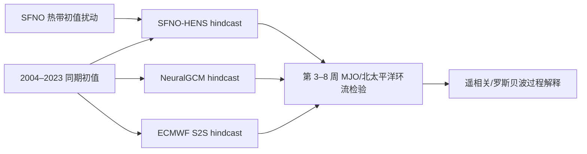

# SFNO-HENS 与 NeuralGCM 的 S2S/MJO 评估：模型是否学到遥相关过程？

> Yannick Peings、Cameron Dong、Ankur Mahesh、Michael Pritchard、William D. Collins、Gudrun Magnusdottir，*Subseasonal Forecasting and MJO Teleconnections in Machine Learning Weather Prediction Models*，*JGR: Atmospheres*，首次发表 2026-01-30，[DOI:10.1029/2025JD044910](https://agupubs.onlinelibrary.wiley.com/doi/10.1029/2025JD044910)。阅读日期：2026-09-24；[作者/机构页面](https://research.nvidia.com/labs/climate/publication/peings-2026-subseasonal/)。**证据级别：期刊摘要、Data Availability 与出版方开放的前页/图注；尚未获得可读的完整方法与补充材料，不能视为已核验全部实验参数。**

## 1. 论文定位

这是**对现有模型的过程评估**，不是提出第三个预报模型。问题是：中期天气 ML 模型长期积分不崩溃，是否意味着第 3–8 周仍保持 MJO 信号和北太平洋—北美遥相关？作者对 2004–2023 年做大量 S2S hindcast，比对全 ML 的 SFNO-HENS、混合动力/ML 的 NeuralGCM 与 ECMWF S2S；重点是 10–3 月的美国西部水汽输送、MJO、北太平洋大尺度环流。2004–2023 的整体回报与 **2020–2023 的仅验证期**必须分开阅读，因为早期时段对某些 ML 系统并非严格训练外评测。[期刊摘要](https://agupubs.onlinelibrary.wiley.com/doi/10.1029/2025JD044910)｜[出版方图 2 图注预览](https://www.researchgate.net/figure/a-Skill-in-predicting-the-Madden-Julian-oscillation-between-October-and-March-ONDJFM_fig2_400258983)

这张图据论文研究设计重绘，不是原文网络结构图。三组 hindcast 的目标是比较物理过程而非一个单一全球 RMSE 排名；SFNO 的热带初值扰动可检验热带信号改变后，中纬度是否表现出合理的波列响应。[期刊摘要和 Plain Language Summary](https://agupubs.onlinelibrary.wiley.com/doi/10.1029/2025JD044910)

### 数据与评测流程：目前能核实到哪一步

ERA5 是验证参考；ECMWF S2S 回报是动力基线，SFNO-HENS 与 NeuralGCM 使用公开模型权重，但本文生成的海量 hindcast 不开放下载、可向通讯作者索取。图注给出两种季节子样本：MJO 指标主要看 **ONDJFM（10–3 月）**，北太平洋 Z500 图主要看 **JFM（1–3 月）**；不得把两个季节样本当作同一总体。图 4 说明 ONDJFM 共有 **447 次 hindcast**，MJO 指标计算前还把负 lead 的 ERA5 接到各模型集合均值序列上，做滤波后才形成 velocity-potential MJO（VPM）指数。这种拼接会影响短 lead 的滤波边界，因此复验不能只从 t=0 截断计算。[期刊 Data Availability](https://agupubs.onlinelibrary.wiley.com/doi/10.1029/2025JD044910)｜[出版方图 4 图注预览](https://www.researchgate.net/figure/a-Distribution-of-the-amplitude-of-the-ensemble-mean-velocity-potential-MJO-VPM_fig4_400258983)

本文不是模型开发论文；没有报告为此次评估重新训练 SFNO-HENS 或 NeuralGCM，也没有可以归于本文的新网络层数、学习率或微调日程。SFNO-HENS 的训练和集合扰动应追溯其原论文，NeuralGCM 的训练应追溯各自公开的模型文章；把它们的超参数混写成 Peings 等的实验设置会导致出处错误。可核验的本文新增流程是多年回报、MJO/遥相关检验及热带初值敏感性实验；**起报频率、各模型集合成员数、热带扰动区域和振幅、数据重网格及滤波窗的具体实现**在当前开放资料中未见到，暂不猜测。[期刊摘要与 Data Availability](https://agupubs.onlinelibrary.wiley.com/doi/10.1029/2025JD044910)

### 图表阅读路线：每张图究竟测什么

| 原文图注 | 变量/样本/指标 | 可支持的解读与禁止外推 |
|---|---|---|
| 图 1 | JFM 2004–2023，第 3 和第 5 周的**周平均 Z500**，ERA5 对集合均值的逐格点相关；框内为东部北太平洋—北美西部区域平均 | 比较中纬度环流的空间技巧；不是逐日降水 RMSE，也不是直接的水汽输送技巧 |
| 图 2a/b | ONDJFM 的 ERA5 对预报 VPM 双变量相关，画 0.5 阈值；全 2004–2023 为实线、2020–2023 为虚线；另算第 25 天、40 个起报样本滑动相关 | 观察训练外时段与长期平均差异，避免用整体曲线冒充独立测试成绩；滑动相关是时间变化检验，不能当作独立 40 次试验 |
| 图 3 | JFM，第 3 和第 5 周平均的 200 hPa 速度势 VP200（m²/s），ERA5 对集合均值格点相关；框内为印度洋—暖池 | 检查热带对流相关的大尺度势场，不能直接解释为局地降水概率 |
| 图 4a/b | 447 个 ONDJFM hindcast 的 VPM 集合均值振幅分布及 10/90 分位；集合 spread 与集合均值 RMSE 之比 | 同时读信号强弱和概率离散度；spread/error 接近 1 只是必要校准诊断，不等于整套概率预报可靠 |
| 图 5 | MJO 第 2/3 相位条件合成：SFNO-HENS、NeuralGCM、ECMWF 对 ERA5 的 VP200 异常阴影与 U200 异常等值线 | 检查穿越海洋大陆的传播和高层环流相位，而不是从单个合成图证明所有事件的遥相关都正确 |

表格是根据原文出版方公开图注重新整理的**图意导航**，不是原图复制或未读数值的重建。[图 1](https://www.researchgate.net/figure/Grid-point-correlation-between-observed-ERA5-and-ensemble-mean-prediction-of-average_fig1_400258983)｜[图 2](https://www.researchgate.net/figure/a-Skill-in-predicting-the-Madden-Julian-oscillation-between-October-and-March-ONDJFM_fig2_400258983)｜[图 3](https://www.researchgate.net/figure/Grid-point-correlation-between-observed-ERA5-and-ensemble-mean-prediction-of-average_fig3_400258983)｜[图 4](https://www.researchgate.net/figure/a-Distribution-of-the-amplitude-of-the-ensemble-mean-velocity-potential-MJO-VPM_fig4_400258983)｜[图 5](https://www.researchgate.net/figure/Madden-Julian-oscillation-MJO-propagation-from-phases-2-and-3-in-ONDJFM-for_fig5_400258983)

## 2. 可核验结果与解释

| 原文研究维度 | 结论 | 应避免的推断 |
|---|---|---|
| 第 3 周及以后 MJO | 两种 ML 系统与 ECMWF 有可竞争的 MJO 技巧，并再现穿越海洋大陆的传播 | 不能说所有周、所有相位都胜 ECMWF |
| 北太平洋环流/美国西部水汽 | 对大尺度环流及相关遥相关与 ECMWF 大体相当 | 中纬度 S2S 的绝对技巧总体仍低；相当不等于高业务可用性 |
| SFNO-HENS 热带初值敏感性 | 热带扰动引发的中纬度响应与 Rossby 波传播机制相容 | 干预试验支持模型含有过程响应，但不等于完全学到因果物理方程 |
| 2004–2023 hindcast | 多年回报减小“单个漂亮长滚动个例”的偶然性 | 模式版本、再分析和 ECMWF 基线设置仍需一致核对 |

这里没有从无法精确读数的图中臆造百分比。期刊摘要明确同时说“与 ECMWF 大致相当”和“中纬度次季节总体技巧低”；两句必须一起引用。[期刊官方摘要](https://agupubs.onlinelibrary.wiley.com/doi/10.1029/2025JD044910)

## 3. 为什么重要、仍欠缺什么

对比只看全球均方误差，该文把 S2S 可预测性拆成热带 MJO 源、海洋大陆传播、北太平洋波列和北美水汽输送等链条，是衡量“长滚动是否还具天气信号”的更严肃路径。它提醒我们：AI 模型在第 3 周之后的价值应由多年份 hindcast、遥相关指数和事件条件技巧共同判断，不能只凭模型输出仍像天气图。

复验需要相同起报日、模型自有气候态/ERA5 参考、同集合成员数和同季节子集；应将 MJO 相位、振幅、传播速度与北太平洋/美国西部降水按 lead week 拆开，并检验 2004–2023 各年代系统差异。原文称 hindcast 数据过大、可向主作者索取，公开模型权重与 ERA5/ECMWF 数据入口可用于部分复验。当前尚缺全文方法和补充材料，因此最优先的后续核验是这些设置与图中的精确数值；**在取得全文前，此篇仍为“证据受限解读”，不是完整精读结案**。[期刊 Data Availability](https://agupubs.onlinelibrary.wiley.com/doi/10.1029/2025JD044910)

[返回首页](../../README.md) · [返回总表](../../气象大模型_中期预报论文追踪.md)
