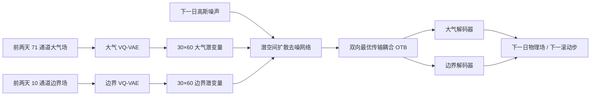

# TianXing-S2S：多圈层潜空间扩散、最优传输耦合与 45 天逐日集合预报

> Bin Mu、Yuxuan Chen、Shijin Yuan、Bo Qin、Hao Guo，*Skillful Subseasonal-to-Seasonal Forecasting of Extreme Events with a Multi-Sphere Coupled Probabilistic Model*；[arXiv:2512.12545v1](https://arxiv.org/abs/2512.12545)，2025-12-14 提交；[作者公开全文](https://www.researchgate.net/publication/398719894_Skillful_Subseasonal-to-Seasonal_Forecasting_of_Extreme_Events_with_a_Multi-Sphere_Coupled_Probabilistic_Model)。阅读日期：2026-09-24。以下区分作者报告与我的复验判断，数值和方法以 v1 为准。

## 1. 问题、输出和比较边界

TianXing-S2S 要解决的是全球 **1.5°、逐日平均、45 天、51 成员**的概率预报，不是单一的第 3–4 周平均场预报。它同时预测 71 个大气变量和 10 个海洋/陆面/通量变量：后一组不是外部固定边界，而是随时间由模型共同演化。每一步取前两天场预测下一天；潜空间扩散以不同噪声采样生成成员。论文也展示 180 天滚动的季节循环稳定性，但**180 天不等于 180 天逐日可用预报技巧**。[论文摘要](https://arxiv.org/abs/2512.12545) · [全文 Methods/Discussion](https://www.researchgate.net/publication/398719894_Skillful_Subseasonal-to-Seasonal_Forecasting_of_Extreme_Events_with_a_Multi-Sphere_Coupled_Probabilistic_Model)

## 2. 数据与预处理：哪些量实际进入模型

| 组别 | 变量 | 通道数 | 选择理由 |
|---|---|---:|---|
| 高空大气 | 比湿 Q、温度 T、纬向/经向风 U/V、位势 Z，各 13 层：50、100、150、200、250、300、400、500、600、700、850、925、1000 hPa | 65 | 表征动力、热力、水汽与平流层信号 |
| 地面大气 | T2M、OLR、TP、MSLP、U10、V10 | 6 | 近地面与对流、降水目标 |
| 海洋/海冰 | SST、SIC | 2 | 慢变下边界 |
| 陆面 | 0–7、7–28、28–100 cm 的土温和土壤水分 | 6 | 土壤记忆与陆气反馈 |
| 界面通量 | 平均地表潜热、感热通量 | 2 | 地气交换 |

作者以 ERA5 小时数据构造逐日平均，所有 81 通道插值到 1.5°×1.5°，得到 `(81,121,240)` 场。数据范围 1979–2021；训练 1979–2015、验证 2016–2017、测试 2018–2021。论文明确了时间平均、网格、变量和划分；**未在正文足够明确给出**每通道标准化统计的精确定义、插值核、降水累计量转日值的细节及缺测/海陆掩膜处理，不能把常用做法冒充作者方法。实现复现时这几项需要核对代码或补充材料。[全文 Datasets](https://www.researchgate.net/publication/398719894_Skillful_Subseasonal-to-Seasonal_Forecasting_of_Extreme_Events_with_a_Multi-Sphere_Coupled_Probabilistic_Model)

评估时的 ECMWF S2S 对照使用 CY48R1 回报，11 成员、每周二/周五初值、最长 46 天；FuXi-S2S 为另一个学习型对照，最长 42 天。共同测试 2018–2021；计算异常量时各模型分别以其 2003–2017 回报构造日历日气候态，再用中心 31 日（±15 日）平滑。因此异常相关不能简单用一个通用 ERA5 气候态重算并声称复现。也须将 TianXing 51 成员与 ECMWF 11 成员的集合大小差异作为比较限制。[全文 Datasets](https://www.researchgate.net/publication/398719894_Skillful_Subseasonal-to-Seasonal_Forecasting_of_Extreme_Events_with_a_Multi-Sphere_Coupled_Probabilistic_Model)

## 3. 架构：分开压缩、耦合去噪、滚动生成

流程图为据原文 Figure 6 与 Methods 自绘，非原图复制。第 1 阶段有**两套参数独立的 VQ-VAE**，分别编码大气与边界通道；编码器把 121×240 网格压至约 30×60，最近邻 codebook 量化，解码回原网格。训练损失包含纬度加权重建误差与 VQ/codebook 相关项。论文讲述 codebook 项的形式，但正文没有可直接复现的 codebook 条目数、嵌入维度与所有损失权重；不要推断出具体值。[全文 Stage 1](https://www.researchgate.net/publication/398719894_Skillful_Subseasonal-to-Seasonal_Forecasting_of_Extreme_Events_with_a_Multi-Sphere_Coupled_Probabilistic_Model)

第 2 阶段把下一天的两组潜变量加噪，网络以过去两天潜变量为条件学习去噪。**OTB** 在大气与边界潜特征间构造基于余弦相似度的代价矩阵，用 Sinkhorn 近似求传输，并分别学习大气→边界、边界→大气两种方向；经传输矩阵调制特征，再加残差。这是将多圈层交互作为结构显式放入去噪器，区别于把 81 通道直接拼接；但最优传输权重不能自动解释为因果关系。去噪损失在潜空间计算，作者说明未使用纬度加权。采样时前两日场编码、抽高斯噪声、迭代去噪、解码一天、滑动输入窗口，重复到 45 天；不同随机噪声重复 51 次。[全文 Stage 2/Inference](https://www.researchgate.net/publication/398719894_Skillful_Subseasonal-to-Seasonal_Forecasting_of_Extreme_Events_with_a_Multi-Sphere_Coupled_Probabilistic_Model)

## 4. 训练与微调：论文公开的逐阶段参数

| 阶段 | 优化与设置 | 目的和权重关系 |
|---|---|---|
| 两套 VQ-VAE 预训练 | PyTorch；8× NVIDIA A800 80GB；AdamW β₁=0.9、β₂=0.99；batch 4；200 epoch；余弦学习率 `1e-4 → 5e-6`；约 10 天 | 将各组物理场压缩并重建，得到后续扩散的编码器/解码器。作者未报告编码器冻结策略的逐层清单。 |
| 扩散单步预训练 | AdamW β₁=0.9、β₂=0.95；batch 8；150 epoch；学习率 `1e-4 → 1e-5` | 从真实前两日潜态学习下一日的去噪条件分布。 |
| **自回归微调** | 在单步扩散模型权重上继续训练；带 replay buffer；滚动训练跨度**渐增 1→10 步**，每一跨度 30 epoch；恒定学习率 `2e-5`；batch 1（显存限制）；第 2 阶段合计约 14 天 | 用模型自身滚动状态作为训练语境缓解长时误差累积，属于论文明确给出的多步微调，而不是另一个任务的数据集适配。 |

以上数值直接来自作者的 Training details。论文给出核心优化超参数和多步微调日程，但没有把 weight decay、随机种子、混合精度、梯度累计、replay buffer 容量/采样规则、扩散噪声日程与采样步数 `N` 全部以可复现数值列齐；这些应列为复现缺口，而不是填经验默认值。也没有说明对特定极端事件另行微调，因此热浪/强降水结果应视为**同一模型的诊断**。[全文 Training details](https://www.researchgate.net/publication/398719894_Skillful_Subseasonal-to-Seasonal_Forecasting_of_Extreme_Events_with_a_Multi-Sphere_Coupled_Probabilistic_Model)

## 5. 模型性能与图表阅读

| 原文图 | 画的是什么 | 读图结论与边界 |
|---|---|---|
| Figure 1 | 逐日 CRPS，主要变量，对 ECMWF S2S 与 FuXi-S2S | 作者报告 10 天后多变量对 ECMWF 的 CRPS 最多约改善 12%；30 天后 Z、MSLP、TP 等对 FuXi-S2S 在部分区间仅相近，不宜概括为每个变量/时效全胜。 |
| Figure 2 | 集合均值 RMSE/ACC、集合离散度与 SSR | 评估了平均误差和可靠性两方面；FuXi-S2S 对部分时效欠离散，TianXing 的 spread–skill 较接近 1。但 SSR≈1 不是尾部概率校准的充分证据。 |
| Figure 3 | 高温/降水阈值事件概率与 Brier skill | 作者报告在东亚极端事件案例上较强的 q95/q99 识别，须区分个案可视化和跨多年阈值检验。 |
| Figure 4 | 分组扰动重要性和土壤水分 Grad-CAM | 扰乱陆面变量会抬高案例 RMSE；2018 热浪之前的四川盆地负土壤湿度异常与显著性相伴。相关与显著性不是因果归因证明。 |
| Figure 5 | OTB 消融：SimVP、跨注意力替换、完整 OTB；第 4 周 T2M/MSLP CRPS；传输矩阵空间图 | 完整 OTB 优于替换版本，说明模块在该评估中有增益；图中传输权重由局地向远端扩展，只是模型内部模式，并非独立物理观测。 |

这是图表内容的文字化同步，不复制原论文图像。论文仍应按变量、区域、初值季节绘制不确定度区间，以判断改善是否稳定；不同集合人数可通过子抽样做公平敏感性检查。[全文 Results/Figures](https://www.researchgate.net/publication/398719894_Skillful_Subseasonal-to-Seasonal_Forecasting_of_Extreme_Events_with_a_Multi-Sphere_Coupled_Probabilistic_Model)

## 6. 我的复现/研究判断

最值得借鉴的是把慢变海陆条件**作为预测目标持续更新**，再以单步预训练→多步自回归微调处理长滚动，最后用集合概率指标而非仅看集合均值。要独立复验，应先复建 81 通道 ERA5 日平均和 2018–2021 共同初值清单，再确认降水与通量符号/单位、异常气候态、集合人数、CRPS/SSR/Brier 的算法。随后做 OTB 替换消融与土壤水分组扰乱；后者只能支持“模型依赖此输入”，尚不足以断言发现真实因果前兆。论文对逐日 45 天性能给出图形和若干相对结论，却没有提供全部逐变量原始数值表；这里不从低分辨率图上伪造精确读数。[原文](https://arxiv.org/abs/2512.12545)

[返回首页](../../README.md) · [返回总表](../../气象大模型_中期预报论文追踪.md)
