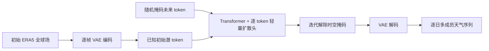

# OmniCast：空间—时间联合掩码生成怎样跨越中期与 S2S

> Tung Nguyen、Tuan Pham、Troy Arcomano、Veerabhadra Kotamarthi、Ian Foster、Sandeep Madireddy、Aditya Grover，*OmniCast: A Masked Latent Diffusion Model for Weather Forecasting Across Time Scales*，[arXiv:2510.18707v1](https://arxiv.org/html/2510.18707v1)，2025-10-20；NeurIPS 2025 版本，复核日期：2026-09-25。[作者公开仓库](https://github.com/tung-nd/omnicast)。早期 SeasonCast 属于同一研究路线，不重复计篇。

## 1. 核心机制与任务差异

长自回归容易让每步误差级联；OmniCast 先用逐帧 VAE 把 69 通道天气场压缩，再让带逐 token 扩散头的 Transformer 学习被掩掉的未来潜 token 分布。推理时逐批解除随机掩码，联合产生整个未来时空序列。在 S2S 实验中，它直接生成**1–44 天逐日场**；在高分辨率中期实验中则用 12 小时步长递归滚动。这两种部署方式不是同一配置下“同时直接预测所有尺度”。[Methods/Experiments](https://arxiv.org/html/2510.18707)

方法图据论文 Figure 2–3 自绘。1.40625° S2S 配置把 `69×128×256` 压到 `1024×8×16`，空间两轴各缩 16 倍；44 天预测含 45 帧、总 5760 潜 token，推理 44 次解除掩码、每初值 50 成员。中期 0.25° 配置则压到 `256×45×90`，并用递归预测 12 小时两步。[Experiments 5.1–5.2、Appendix A](https://arxiv.org/html/2510.18707)

### 数据字段、时间切分与两种分辨率

69 个变量并非泛指 69 类传感器，而是五类高空变量（位势、温度、纬向风、经向风、比湿）× 13 个气压层（50、100、150、200、250、300、400、500、600、700、850、925、1000 hPa），再加 2 m 气温、10 m 两个风分量及海平面气压四个地面通道。输入/目标均来自 ERA5，但 S2S 经 ChaosBench 重网格到 1.40625°；中期沿 WeatherBench 2 保留 0.25°。[实验 §5](https://arxiv.org/html/2510.18707v1)

| 协议 | 时间划分与初值 | 输出与评测 |
|---|---|---|
| S2S | 1979–2020 训练、2021 验证、2022 测试；00 UTC 初值 | 逐 24 小时生成第 1–44 天瞬时场；论文主图仅核 T850、Z500、Q700 |
| 中期 | 1979–2018 训练、2019 验证、2020 测试；00/12 UTC 初值 | 训练 12 小时两步，推理自回归至 15 天；WB2 集合 RMSE、CRPS、SSR |

逐日**瞬时场**与 FuXi-S2S 所用的**日平均场**是不同标签；即使都称 3–6 周，也不能仅比较分数大小。原文明确给出 69 个变量、ERA5 来源、时间切分、分辨率及起报时刻，却**没有**完整列出每个变量的标准化常数、缺测插补、静态场或海陆掩膜处理配置；这些项目不能照搬其他 WeatherBench 2 模型。作者仓库当前可见 `train_image_klvae.py` 和 `weather_mae/` 等 VAE 相关文件，但本次未在仓库目录核实完整生成 Transformer 的训练入口、数据预处理配置及模型检查点，不能把该链接称作“代码与权重已开放”或据此声称端到端复现。[实验 §5.1–5.2](https://arxiv.org/html/2510.18707v1)、[作者仓库](https://github.com/tung-nd/omnicast)

### 模型细节与生成流程

逐帧连续 VAE 的 U-Net 输入/输出都是 69 通道，卷积核 3、padding 1、stride 1，基通道 256，层级宽度倍率 `[1,2,4,4,8]`，每层两个 block，无注意力、无 dropout。S2S 版本编码成 `1024×8×16`；中期版本同为 16 倍空间降采样，却只需 `256×45×90` 潜变量。VAE 是每帧编码，不在编码器中跨时间压缩，因而未来时间相关性主要由 Transformer 学习。[方法 §4.1、附录 A.1](https://arxiv.org/html/2510.18707v1)

Transformer 使用 MAE 风格编码器—解码器：编码器看初值和可见未来 token，解码器加入可学习掩码 token；两者各 16 层、16 头、宽度 1024、dropout 0.1，均为双向全注意力，加入空间和时间位置嵌入。训练时未来 token 的随机掩码率从 `[0.5,1.0]` 均匀采样；推理从全掩码开始，按余弦日程逐步释放，释放顺序跨空间和时间随机化，默认迭代次数等于预测帧数。[方法 §4.2–4.3](https://arxiv.org/html/2510.18707v1)

每个被掩 token 的条件分布由**独立的小型扩散头**采样，而非每一步让大型 Transformer 完整去噪。该头有六个宽 2048 的残差 MLP block，使用 LayerNorm、线性层、SiLU，并通过 AdaLN 注入扩散时间条件；训练使用线性噪声日程 1000 步，采样重取为 100 步。主损失为潜变量噪声预测 MSE；辅助确定性头对前 10 帧施加潜空间 MSE，帧权重 `exp(-k)`，更远帧置零并重新归一。这样短期保留配对预测能力，长期由概率模型表达不确定性。[方法 §4、附录 A.2](https://arxiv.org/html/2510.18707v1)

### 训练阶段、超参数及有无微调

| 阶段 | 原文具体设置 | 作用与限制 |
|---|---|---|
| VAE 预训练 | KL 权重 `5×10^-5`；Adam、200 epoch、batch 32、基础学习率 `2×10^-4`、β=(0.9,0.95)、权重衰减 `10^-5`；前 20 epoch 线性升温、后 180 余弦衰减 | 先建立可重建的连续潜空间；重建误差是下游预测误差下界之一 |
| OmniCast 生成模型 | AdamW、100 epoch、batch 32、基础学习率 `2×10^-4`、β=(0.9,0.95)、权重衰减 `10^-5`；前 10 epoch 升温、后 90 余弦衰减 | 主训练同时更新 Transformer、扩散头与辅助确定性头 |
| S2S 采样 | 一次产生 44 帧；44 次解除掩码；温度 `τ=1.3`；每初值 50 成员 | 成员差异来自扩散噪声与随机解除掩码顺序 |
| 中期采样 | 每次预测两个 12 小时步长，递归滚动；每帧一次解除掩码；`τ=1.0`；50 成员 | 与 S2S 的全序列直接生成是不同配置 |

论文报告 OmniCast 训练用 32 张 NVIDIA A100、历时约四天，并强调 0.25° 模型为单分辨率训练；它**没有**采用 GenCast 的 1° 预训练再 0.25° 微调阶段。这里 VAE 先训练再训练生成器，是模型内部两阶段训练，不能称作跨任务微调；S2S 与中期又分别训练配置，不能误写成同一套权重零样本切换。[实验 §5.3、附录 A](https://arxiv.org/html/2510.18707v1)

## 2. 两套评测不能混在一起

| 项目 | S2S/ChaosBench | 中期/WeatherBench 2 |
|---|---|---|
| 分辨率/样本 | 1.40625°；1979–2020 训练、2021 验证、2022 测试 | 0.25°；1979–2018 训练、2019 验证、2020 测试 |
| 时效 | 第 1–44 天，逐日；重点 T850/Z500/Q700 | 约 15 天，12 小时递归；多变量 CRPS/RMSE/SSR |
| 基线 | Pangu、GraphCast、UKMO/NCEP/CMA/ECMWF 集合 | GenCast、IFS-ENS |
| 作者报告 | Figure 4–6：第 10 天以后 RMSE 进入前两名；**第 15 天以后** CRPS 超 ECMWF-ENS；早期略差 | Figure 7：接近 IFS-ENS，**略逊 GenCast** |

这张比较表按[原文 §5](https://arxiv.org/html/2510.18707)重排。作者明确说明未把 FuXi-S2S 纳入 S2S 同表，因为 FuXi-S2S 的**日均**预测目标与 OmniCast 的逐时点天气场不一致；GenCast/NeuralGCM 在其 S2S 对照中也因计算负担未运行。故“在所有 AI S2S 模型中第一”不是公平的全集结论。

Figure 8 的 15 天推理时间：0.25° OmniCast **29 秒/A100**，GenCast **480 秒/TPUv5**；1.0° 同硬件对比约 **11 秒 vs 224 秒**。跨硬件的 29/480 不能直接归为纯算法加速；同硬件也要核对成员数、批处理和 I/O。Figure 9 消融显示完全不用确定性 MSE 伤害短期 RMSE/CRPS，把 MSE 施加所有远期帧也有害；只强调前 10 帧更平衡。附录的“100 年稳定 rollout”是长积分形态稳定，不是逐日 100 年天气技巧。[Results 5.3–5.4、Appendix B](https://arxiv.org/html/2510.18707)

附录 Table 2 将**编码器本身的重建误差**单列出来，这些数值不是预测 RMSE，不能拿来和 Figure 4 的预报技能混用：

| S2S 1.40625° VAE 潜通道数 | T2m | U10 | V10 | Z500 | T850 |
|---|---:|---:|---:|---:|---:|
| 256 | 0.96 | 0.65 | 0.62 | 48.72 | 0.77 |
| 512 | 0.80 | 0.51 | 0.48 | 35.42 | 0.64 |
| 1024（主配置） | **0.71** | **0.43** | **0.40** | **27.34** | **0.57** |

同一 Table 2 右半部另给出**中期 0.25° 主配置、潜通道 256** 的重建误差；不同分辨率的数字不可解释为同一数据上仅更换潜维度的消融：

| 中期 0.25° VAE 潜通道数 | T2m | U10 | V10 | Z500 | T850 |
|---|---:|---:|---:|---:|---:|
| 256（主配置） | 0.55 | 0.25 | 0.23 | 18.77 | 0.37 |

论文该表未逐列印单位，故这里只按原文转录“重建误差”，不自行指定五列的单位或误称它们为预报 RMSE。这两组数说明提高潜通道数能减轻低分辨率 VAE 的重建损失，但同时会增加生成模型的 token 维度与训练负担；原文未把通道数继续提高到 1024 以上。附录图 10–11 还显示解码场有轻微平滑。原文早期尝试的 VQ-VAE 在同等空间压缩下重建误差约是连续 VAE 的 2–3 倍，逐帧 VAE 也优于其尝试的时空联合 VAE，解释了当前架构选择。[附录 Table 2、B.1](https://arxiv.org/html/2510.18707v1)

Figure 9 的四组消融还分别讨论了训练序列长度、解除掩码顺序和扩散采样温度：较短序列训练有利短期，却在 S2S 长滚动中退化；完全随机的时空解除掩码比按帧依序解除掩码有更好的集合离散度；温度太低导致欠离散，太高（如 1.5）又损害 RMSE/CRPS，作者选择 S2S 的 1.3。附录 Figure 12 比较 ClimaX 和 Stormer：后者短中期较准，但长滚动技巧下降；ClimaX 的各 lead 专门微调不能与 OmniCast 单模型全序列生成视作相同训练预算。Figure 13 的初值高斯扰动实验（标准差 0–0.2）报告 RMSE/CRPS 对噪声相对稳定，但不能替代真正的观测误差或业务同化误差敏感性研究。Figure 14 报告增加成员数改善 SSR 和集合均值 RMSE，多于每帧一次的解除掩码迭代对 RMSE 影响较小、SSR 略改善；因此“44 次迭代”是默认采样预算，不是架构不可改变的常数。[Figure 9、附录 B.2–B.4](https://arxiv.org/html/2510.18707v1)

## 3. 阅读判断

OmniCast 最有价值的是**训练目标随时效改变**：短期保留确定性配对信号，远期允许生成式不确定性，并通过时空联合采样减轻级联误差。这与 Swift 的单步一致性加多步 CRPS、Marchuk 的潜空间批量流匹配形成清晰方法对照。局限是 VAE 有重建平滑，S2S 主任务只选三个变量，长滚动稳定性缺少独立过程与极端事件核验。复验建议在同初值/同成员数/同分辨率下比较 GenCast、AIFS ENS 与 FuXi-S2S，同时单独区分日均和瞬时场，补充可靠性、频谱和极端事件命中率。[原文 §5–6](https://arxiv.org/html/2510.18707)

[返回首页](../../README.md) · [返回总表](../../气象大模型_中期预报论文追踪.md)
