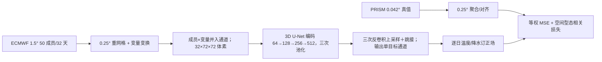

# 西部美国 3D U-Net：把预报时效本身作为卷积维度的 S2S 降尺度

> Jihun Ryu、Hisu Kim、Shih-Yu (Simon) Wang、Jin-Ho Yoon，*Increasing resolution and accuracy in sub-seasonal forecasting through 3D U-Net: the western US*，*Geoscientific Model Development* 19, 27–39 (2026)，2026-01-05 正式发表；[论文](https://gmd.copernicus.org/articles/19/27/2026/)｜[17 页正式补充材料](https://gmd.copernicus.org/articles/19/27/2026/gmd-19-27-2026-supplement.pdf)｜[作者代码 Zenodo v1.0](https://doi.org/10.5281/zenodo.14776781)。初读 2026-09-24，正式补充材料及归档代码复核 2026-09-25。**下文严格区分论文方案与早于正式论文发布的代码快照。**

## 1. 数据与问题

输入是 ECMWF S2S 实时扰动集合：1.5°、50 成员、每周两次起报、最长 **32 天**，覆盖 2015-01 至 2023-12、CY40R1–CY48R1 多业务版本；地面温度/总柱水汽是日均，其他变量多为 6 小时。目标是美国西部 PRISM 日气温、降水及高程场（原始 0.042°，约 4 km），同期覆盖 2015-01 至 2024-01。模型目标不是延长全球动力预报，而是对已有 ECMWF 序列做区域订正和降尺度。[期刊 §2.1](https://gmd.copernicus.org/articles/19/27/2026/)

这里的“50 成员输入”并不表示网络给出了校准过的 50 成员输出：E50 把各成员作为**输入通道**，E50M 先取成员均值，E01 只用第一成员；本研究的网络输出仍是确定性场。三者构成集合信息输入方式的消融，而非三个概率预报系统。训练与测试跨多个 ECMWF 业务版本，若不按版本/年份再分层，网络改进与基础 NWP 的周期升级有混淆风险。[期刊 §2.1–2.2](https://gmd.copernicus.org/articles/19/27/2026/)

## 2. 预处理与训练流程

两边数据都重网格到 **0.25°**，也就是 ECMWF 从粗网格插值、PRISM 从细网格降采样；不要误说最终模型输出仍是 PRISM 原生 4 km。正文方案是降水/总柱水汽先把负值置零并做守恒插值，其他变量线性插值。降水/总柱水汽取 `log10(x+1)` 后标准化，其他连续变量直接 z-score；**正文未明确标准化统计期**，不能擅自写成“仅用训练统计量”，归档代码的实际风险见下文。作者从 16 个候选变量按跨天气/S2S 尺度的目标相关性挑选附加预测因子。[期刊 §2.3](https://gmd.copernicus.org/articles/19/27/2026/)

归档的 [PRISM 预处理脚本](https://zenodo.org/records/14776781) 展示原始 `.bil` 中 `-9999→NaN`、日均温转 **K（+273.15）**、经度转 0–360°、使用 xESMF 把 4 km 温度/高程双线性插值而降水守恒重网格到 0.25°，最后裁取西部美国；这补足正文未写明的单位与缺测标记。归档代码主要是可改写模板，若干输入路径仍是 `Input_path`、`initial_time_list` 等占位符，不能直接运行得到论文结果。正式补充 Table S1 将 PRISM 一栏泛列 `tcw/mslp/u/v/z` 等字段，但正文与可下载 PRISM 产品在本研究实际目标中是温度、降水与高程；不应把那一行误解为这些大气三维场由 PRISM 提供。[正式补充材料 Table S1](https://gmd.copernicus.org/articles/19/27/2026/gmd-19-27-2026-supplement.pdf)。

研究区域经度 235.5–253.25°E、纬度 31.25–49°N，重网格后为 `72 × 72`；lead day 1–32 作为第三个卷积维度，因此一个样本的主轴是 `32 × 72 × 72`，成员数和气象变量数并入通道。例如 E50V8 有 400 输入通道，E50MV2 有 2 通道。16 个候选变量包含 2 m 气温、降水、总柱水汽、海平面气压、10 m `u/v`、高程、位势及 850/500/200 hPa 风；每个目标先计算跨天气和 S2S 两类时效的平均场空间相关，再取绝对相关的均值排序，选择 V1/V2/V4/V8 配置。[期刊 §2.2–2.3 与 Table 2](https://gmd.copernicus.org/articles/19/27/2026/)

这套筛选是基于资料中的均值相关，并非神经网络端到端自动选择；复现时应确认筛选用的时间段不含 2023 测试目标，以免把未来真值的统计关系提前注入特征选择。原文没有给出训练统计量的逐变量数值。原始 PRISM 的 4 km 细节在聚合到 0.25° 后已被部分抹去，论文里的“提高分辨率”应理解为相对于 1.5° ECMWF 输入提高，而非重建完整的原生 PRISM 小尺度信息。[期刊 §2.3](https://gmd.copernicus.org/articles/19/27/2026/)

此图依据原文 Figure 1/§2 与归档 `model/IRnAF.py` 自绘，不复制原图。网络每个卷积单元依次为 `Conv3d(3×3×3)→BatchNorm3d→GELU`，四个尺度通道数为 **64/128/256/512**；三次 2 倍 `AvgPool3d` 和三次 `ConvTranspose3d`，在匹配尺度拼接 skip 特征，末端 3D 卷积输出 **1 个目标场通道**。输入形状以时效 32 × 纬度 72 × 经度 72 组织，集合成员与变量并作通道；E01、E50、E50M 分别用单成员、50 成员和集合均值，V1/V2/V4/V8 用不同数量的变量。训练按起报日分：2015–2020 训练、2021-03 至 2022-02 验证、2023 全年测试。Adam 初始学习率 **1e-4**、batch **11**、最多 **100 epochs**、验证损失 patience **10** 早停；MSE 与空间型态相关两项等权。[期刊 §2.2](https://gmd.copernicus.org/articles/19/27/2026/)；[代码归档](https://doi.org/10.5281/zenodo.14776781)。

作者的训练流程是将已发布的 ECMWF 预报与 PRISM 有效日对齐，按起报日期划分，再对各 E/V 组合**分别从头训练** 3D U-Net。它不是先训练天气基础模型、再对区域微调；本文未报告跨地区预训练或参数高效微调。100 epoch 是上限，patience 10 可使某个配置提前停止；论文未给出所有配置实际停在第几轮、随机种子数和权重衰减，不能补写成固定值。MSE 重视量值，空间型态相关损失重视形状；两项等权是作者的经验选择，未给出系统超参数搜索。[期刊 §2.2](https://gmd.copernicus.org/articles/19/27/2026/)

代码把各成员/变量 `stack` 后重排为 `(样本, 成员, 变量, 32, 72, 72)`，再由网络合并前两维。温度 V1/V2/V4/V8 依次从 `t2m, u500, z200, v200, z500, mslp, elevation, tcw` 取前 1/2/4/8 项；降水依次从 `pr, mslp, z500, z200, u850, tcw, v500, v10` 取前项，符合“按相关排名逐步增加变量”的设计。归档训练脚本 `unit=64`、`Adam(lr=1e-4)`、`MSELoss`，再加逐样本逐 lead 的 `1−Pearson` 项；相关项先用 `cos(latitude)` 乘预测与真值再算乘积，相当于权重在协方差中出现两次，**不是**简单的标准面积加权相关。训练 DataLoader 的 `shuffle=False`，无可见学习率调度器。脚本的早停函数仅当最近 10 个验证损失**全部**比 10 轮前高出 `0.001` 才触发，不完全等价于标准“连续 10 轮无改善”；每轮保存 checkpoint 并另记最优 epoch。脚本定义了 `USE_DROPOUT=True` 标志，但模型类中没有 dropout 层，不能记作实际生效的正则化；也未见独立微调阶段。[Zenodo v1.0 模型和训练代码](https://doi.org/10.5281/zenodo.14776781)。

**复现风险，不等同于对论文主结果的事实判定。**归档 `preprocess/ECMWF_data.py` 中，`combined_indices` 把 train、validation、test 的索引连接后求标准化均值/标准差；对目标 `t2m/pr` 的部分统计还同时纳入 NWP 和 PRISM 真值。若不改代码、按原数据运行，就可能让评测期统计进入训练变换。该脚本的年份注释与正文年份也不一致，不能用注释替代实际 `time` 坐标；应在复现实验前按日期打印并断言切分、且仅以训练窗拟合统计量。`concat_single` 中 `pr` 的守恒插值分支紧跟独立的 `tcw` 判断和 `else: bilinear`，因此公开代码路径对 `pr` 会**覆盖成双线性插值**，与论文“降水守恒重网格”的文字不一致。归档早于正式稿，未提供生成主文结果的固定运行日志，故这里指出可复现性缺口，而不武断认定论文图表用错预处理。[期刊 §2.3](https://gmd.copernicus.org/articles/19/27/2026/)；[Zenodo v1.0 代码](https://doi.org/10.5281/zenodo.14776781)。

## 3. 结果表格与负结果

| 证据 | 结果 | 限制 |
|---|---|---|
| 摘要，32 天空间型态相关 | 优选的集合均值+目标变量方案，相对输入数值预报：温度 **+0.12**，降水 **+0.19** | 是相关系数绝对差值，不是 RMSE 百分比 |
| 结论，32 天空间型态相关 | 温度 **+0.12**，降水 **+0.18**；RMSE 约分别下降 **31% / 22%** | 摘要降水写 +0.19、结论写 +0.18，论文自身口径差 0.01，不能不注明就合并成唯一数值 |
| Figure 2，集合敏感性 | E50 与 E50M 差异很小；E01 较差；附加 10/20 成员与 50 成员接近 | 只在此 3D U-Net/区域/变量下成立，不代表集合不重要 |
| Figure S3/S4，天气变量 | 多数组合温度/降水相关和 RMSE 改善 | 降水 `E_pre` 多数没有改善甚至显著退化 |
| 区域检验 | 县域温度结构有增益 | 海岸和山地**极端降水仍偏低**，不宜直接作洪水告警 |

原文坦率列出降水 `E_pre` 的混合甚至恶化：12 个配置中 5 个无显著改善、7 个显著退化。不能只报告摘要的型态相关增加而忽略对振幅/方差的不足。[期刊 Results §3.1](https://gmd.copernicus.org/articles/19/27/2026/)

表内结论数值来自[正式论文 §4](https://gmd.copernicus.org/articles/19/27/2026/)，不是从曲线估读。补充材料只有 Table S1 数据来源与图 S1–S15，没有逐 lead 的数值表；对 Figures 2–3/S3–S9 只能定性陈述趋势，不能凭肉眼把曲线位置伪装为精确 RMSE。主文 Figure 2 的三组集合实验是对 V1/V2/V4/V8 的汇总，Figure 3 的变量数量实验又是对 E01/E50/E50M 的汇总；单配置结论须回看 S3，不能直接把汇总曲线当作 E50M V1。额外的 **10/20 成员试验**在补充 Figure S9 使用 ERA5 训练/测试、2022 预报，属于补充协议，不等同 2023 PRISM 主评测。[正文 §3.1](https://gmd.copernicus.org/articles/19/27/2026/)；[补充材料 Figures S3/S9](https://gmd.copernicus.org/articles/19/27/2026/gmd-19-27-2026-supplement.pdf)。

`E_pre` 不是集合 CRPS：它综合预测/观测空间标准差比与型态相关，理想值为 0，越大说明差异越大。输入虽有 50 个集合成员，模型输出仍为确定性，所以论文并未提供概率可靠性、集合覆盖率或 Brier score。Figure 2 按 E01/E50/E50M 比较，Figure 3 按 V1/V2/V4/V8 比较；Figure 4–5 将 2023 年 **104 次起报**平均，分别在第 1、11、21、31 天展示降水与气温的区域误差图，这些图不能当成极端单次过程的评估。[期刊 §2.4、Figure 2–5](https://gmd.copernicus.org/articles/19/27/2026/)

原文 Figure 6 另选 2023-03-06 起报的 3 月 7–13 日加州降水个例：网络改善了部分雨带空间定位，却普遍低估强降水量值，海岸和山地偏差突出。县域 Figure 7 的五个区域是旧金山、橙县农区、盐湖城、西雅图与华盛顿州小麦产区；气温改善比降水更稳定，西雅图与华盛顿州两个区域的 S2S 降水相关没有持续优势。Figure 8 的极端样本是测试期各类分布尾部的 39 个案例，作者也没有声称网络全面击败 NWP。必须把“平均图的空间型态改善”与“个例极端强度预测可靠”分开。[期刊 §3.2–3.3](https://gmd.copernicus.org/articles/19/27/2026/)

补充图按任务分工：S1 定位五个县域；S2 是候选预测因子与温度/降水空间平均态的相关排序；S3 展开全部 12 个 E×V 组合；S4/S5 按 DJF/MAM/JJA/SON 分季，**春夏降水 E_pre 例外**；S6–S8 按三类主要土地覆盖评价；S10/S11 给出 2023 年 104 次起报的各 lead 预报场（不同于正文 Figure 4/5 的偏差场），S12/S13 分别为 2023 年 7 月高温和 2 月低温个例，S14 展开县域配置，S15 给极端筛选分布。正文 Figure 8 将高温 `tx90`、低温 `tx10` 和降水 `px90` 分开；其“39 个案例”是作者的极端子样本，不应误作所有县域/三种类型合计一定只有 39 个彼此独立过程。[补充材料页 3–17](https://gmd.copernicus.org/articles/19/27/2026/gmd-19-27-2026-supplement.pdf)；[正文 Figure 8](https://gmd.copernicus.org/articles/19/27/2026/)。

## 4. 阅读判断

“时效作为第三维”能利用前期较可靠的结构辅助远期订正，工程上简单，但也可能使长 lead 借用短 lead 的气候模式，而非真正增加独立可预报信号。多业务循环混用可能引入系统版本非平稳；2022 年整年未列入训练/验证/测试的原因亦需复核。复现时应重报各业务版本、按年份阻断、实际 0.25° 输出分辨率、降水极端 q95/q99 与可靠性，避免将空间下采样后的型态优势解释为原生 4 km 细节。[期刊 Methods/Conclusions](https://gmd.copernicus.org/articles/19/27/2026/)

[返回首页](../../README.md) · [返回总表](../../气象大模型_中期预报论文追踪.md)
