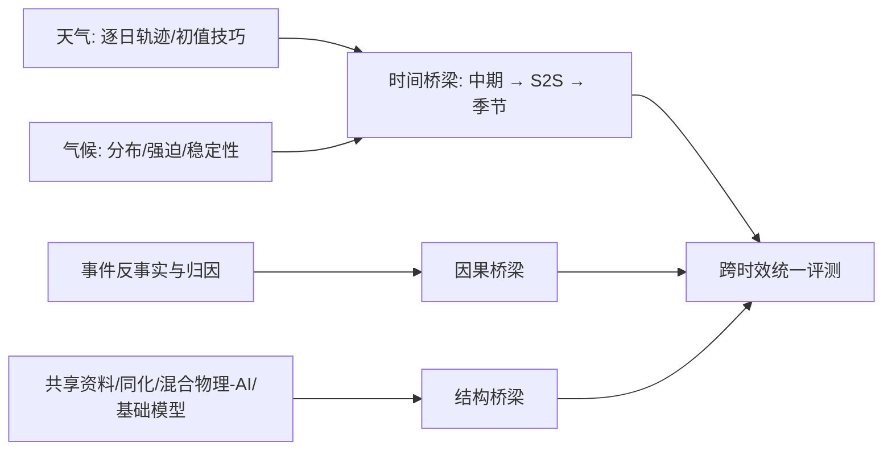

# 从天气到气候：AI 跨时效统一的观点文章该如何读

> Gustau Camps-Valls、Alberto Carrassi、Francisco de Melo Viríssimo、Kevin Debeire、Miguel-Ángel Fernández-Torres、Philipp Hess 等，*Bridging the weather and climate divide with artificial intelligence*，*Nature Communications* **Perspective**，2026-08-18，[DOI:10.1038/s41467-026-75787-y](https://www.nature.com/articles/s41467-026-75787-y)。阅读日期：2026-09-24。**非原创模型实验论文，不存在该文自有训练数据/超参数/性能成绩。**

## 1. 文章论点和 S2S 联系

传统天气研究强调初始值、逐日轨迹与可验证短期精度；气候研究更强调强迫、统计分布和长期稳定性。作者认为 AI 正在让两类目标共享数据、结构和方法。S2S 是时效上的桥梁：中期后初始大气信号衰减，而海陆慢变量与 MJO 等逐渐主导，是检验“基础模型是否真能跨尺度”的天然场景。[期刊全文“Three AI-mediated bridges”](https://www.nature.com/articles/s41467-026-75787-y)

图依据原文 Figure 3 的概念**重新组织**，非原图复制。三座桥分别是：时间桥梁（从中期到 S2S/气候的连续体）、因果桥梁（极端事件和长期强迫间的反事实联系）、结构桥梁（同化、参数化、生成式建模和基础模型组件复用）。这是研究议程，不是某个统一模型已经被实验验证。[期刊 Figure 3 与正文](https://www.nature.com/articles/s41467-026-75787-y)

## 2. 数据、训练与“性能表”应如何记录

| 问题 | 本文有的内容 | 本文没有的内容 |
|---|---|---|
| 数据 | 梳理再分析、数值模拟、卫星/地面观测、异构地球系统数据的角色 | 一个该文训练/测试的新数据集与固定切分 |
| 数据处理 | 讨论缺测填补、偏差校正、降尺度和跨模态融合方法的类别 | 可复现的该文预处理脚本/标准化常数 |
| 训练流程 | 对混合物理-AI、生成式模型、迁移/基础模型作方法综述 | 该文新模型的网络、损失、优化器、学习率 |
| 图表 | Fig. 2 为精度—稳定性权衡概念图；Fig. 3 是三桥框架；Table 2/3 为挑战与方法分类 | 新模型对 IFS、AIFS、FuXi 的逐日 RMSE/CRPS 对照 |

将综述/观点文章写成“新模型性能领先”是类别错误。本文 Table 2 强调稀疏有偏数据、非平稳过程和多区域公平性；Table 3 汇总预处理/后处理、同化、生成式和因果方法。作者也提示信任、透明、能耗与全球研究资源不均等治理问题，不能仅用“统一模型”宣传词掩盖外部评测的缺失。[期刊 Table 2–3、Outlook](https://www.nature.com/articles/s41467-026-75787-y)

## 3. 对本仓库实证论文的可操作检查表

1. **时间桥梁**：分开报 1–10 天、11–15 天、第 3/4/5/6 周，量化逐日技巧和气候态差异；“能滚到 100 年”只能证明稳定，不能证明预测 100 年天气。
2. **因果桥梁**：检验 MJO、海温、土壤湿度或极端归因时，给出初值/边界条件扰动实验，不能只用注意力权重作物理因果证明。
3. **结构桥梁**：说明基础模型预训练语料、观测/再分析/模拟的配比、微调目标、资料时间交叉和超参数；不同模型比较需统一分辨率、起报日和评分目标。
4. **可信度**：可靠性图、集合离散度、极端尾部、能耗与跨区域表现要和 RMSE 同时报，尤其关注低观测密度地区。

这些是依据作者框架推导的**本仓库评读准则**，不是文章本身公布的实验数字。该 Perspective 适合放在 S2S 目录的“概念框架”位置，与 FuXi-S2S/OmniCast 等模型实证条目保持证据等级区分。[期刊正文](https://www.nature.com/articles/s41467-026-75787-y)

[返回首页](../../README.md) · [返回总表](../../气象大模型_中期预报论文追踪.md)
