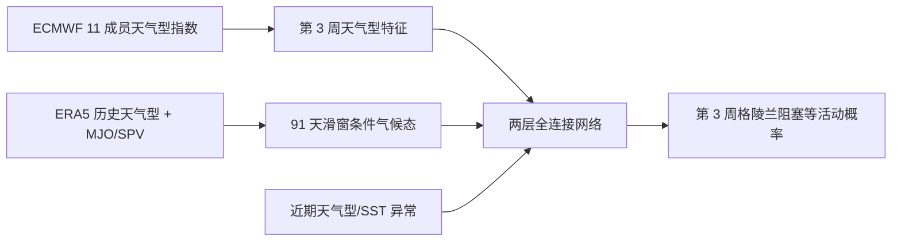

# 第 3 周欧洲天气型机会窗：MJO/SPV 条件气候态加神经网络

> Fabian Mockert、Christian M. Grams、Sebastian Lerch、Julian Quinting，*Windows of opportunity in subseasonal weather regime forecasting: A statistical-dynamical approach*，[arXiv:2505.02680v1](https://arxiv.org/html/2505.02680)，2025-05-05。阅读日期：2026-09-24。

## 1. 研究对象与资料

不是预测全球逐格点天气，而是预测第 **3 周**北大西洋—欧洲天气型的活动程度，尤其格陵兰阻塞。输入 ECMWF Cy46R1/Cy47R1 的 11 成员回报，每周一/四起报，0–46 天覆盖，合计约 **4000 初始日**；统一重网格到 1°。ERA5 作验证，并可为不使用 NWP 的网络提供 1979–2021 每日资料。研究仅限北半球延长冬季 **11–3 月**，不宜外推全球夏季。[Methods 2.1](https://arxiv.org/html/2505.02680)

作者对 500 hPa 位势高度做季节气候态异常、10 天低通与标准化，投影到七个天气型原型得到指数；用周平均活跃指标或一周中有多少天活跃来定义目标。MJO 采用 OLR-based MJO Index 而不是常见 RMM，SPV 用平流层极涡强度。91 天滑动气候窗构造条件气候态；MJO 初态相近样本用相位角 ±45°、振幅≥1 筛选，并排除初值附近 ±45 天以减轻资料重用。[Methods 2.2–2.6](https://arxiv.org/html/2505.02680)

SPV 条件气候态的选样规则与 MJO 不同：在 91 天季节窗内选历史 SPV 指数**距离当前值最近的 5%**，且剔除当前季节循环，随后平均对应的天气型活跃度。这相当于用近邻模拟大尺度强迫条件，而不是把天气场直接送入神经网络。MJO 使用的是 OLR 异常的前两个主成分；如果改用 RMM，机会窗相位不可机械沿用。[方法 §2.6](https://arxiv.org/html/2505.02680v1)

该图据原文 Figure 1–2 与 Methods 自绘。作者区分“气候机会窗”（该相位历史发生率高）和“模式机会窗”（模式在该相位同时有更高命中且不以更高误报为代价），以 hit rate、false alarm rate、Peirce skill 及 1000 次 bootstrap 的 90% 区间识别。[Methods 2.5](https://arxiv.org/html/2505.02680)

## 2. 神经网络训练参数

每个天气型/lead 单独训练一个全连接模型：两隐藏层 **64、16**，ReLU，层间 dropout **0.2**，sigmoid 单输出。最多 **50 epochs**、验证 early-stop patience **10**、初始学习率 **0.001**，5 个 epoch 无改善则×0.5，最低 **1e-6**，batch **32**。冬季 1720 样本分成四个连续块，每折 1290 训练/430 测试，训练内部不打乱取 20% 验证；10 个独立随机初始化网络的输出取均值。逐步特征选择在不同 lead/天气型独立进行。作者还分别训练 `NN_all`、`NN_NWP+WR`、`NN_noNWP`，隔离 NWP 输入的贡献。[Methods 2.7、Table 3](https://arxiv.org/html/2505.02680)

| 网络版本 | 使用的特征池 | 训练资料差异 |
|---|---|---|
| `NN_all` | 季节气候态/条件气候态、初态 MJO/SPV/SST 等、ECMWF 天气型预报、近期天气型活动 | 依赖 ECMWF 回报期 |
| `NN_NWP+WR` | ECMWF 预报和近期观测/ERA5 天气型 | 不使用条件气候态与初态因子 |
| `NN_noNWP` | 气候态、初态因子、近期天气型；**不用 ECMWF** | 可用 ERA5 1979–2020 的更长每日训练期资料 |

逐步特征选择先单变量训练，再逐项加入使交叉验证 MSE 最低的变量，不同天气型可选中不同驱动。例如格陵兰阻塞的 `NN_all` 首要特征是 ECMWF 第 3 周天气型相关指标，随后有 NAO、气候态、年内日期和 SPV/QBO；虽然 MJO 条件分析显著，最终格陵兰阻塞特征选择并**没有保留 MJO 特征**。这说明统计“机会窗”不自动意味着它在有 NWP 输入时有独立增益。[方法 §2.7、结果 §3.3](https://arxiv.org/html/2505.02680v1)

该研究不是天气基础模型的预训练—微调流程：它在固定回报/ERA5 特征上为每个天气型与 lead 从头训练小型后处理网络。10 个初始化的均值只减少网络随机性，不是 10 个 NWP 物理扰动成员。[方法 §2.7](https://arxiv.org/html/2505.02680v1)

## 3. 结果及边界

| 原文证据 | 结论 | 限定 |
|---|---|---|
| 摘要/§3.1 机会窗 | 格陵兰阻塞历史发生率在 MJO 7/8/1 和弱 SPV 后偏高；ECMWF 真正的模式技巧提升主要在 MJO 8/1 和弱 SPV | 高发生率不自动带来可预报性；须同时看误报 |
| §3.2 条件气候态 | 只用 MJO/SPV 条件资料也出现可用信号 | 不是端到端深度天气模型，应与常规气候态比较 |
| §3.3 统计—动力融合 | 神经网络对优势天气型分类的**绝对准确率 +2.9 个百分点**（相对 ECMWF） | 不是“准确率提高 2.9 倍”，也非所有指标同增益 |
| 指标机制 | PSS = hit rate − false alarm rate | 防止靠增加预报频率伪造命中提升 |

原文强调模型和气候的机会窗不完全重合，这比单个总平均技巧更有业务价值：可在 MJO 8/1、弱极涡背景下提高对欧洲阻塞的关注，同时不把 MJO 7 的历史高发生率误说成 ECMWF 高技巧。[Results/Conclusion](https://arxiv.org/html/2505.02680)

## 4. 复现风险

四折连续块交叉验证比随机划分更合理，但论文**明确承认**特征选择先跨所有折汇总、再在相同折上训练评价，存在轻微信息泄漏；作者认为影响小，严格外推检验仍应在外层测试折之外嵌套特征选择。条件气候态和网络标准化也应逐折只用训练资料重算。ECMWF 仅两个旧业务循环、11 成员，近年系统未验证；应以新循环回报和实时起报测试，并把格陵兰阻塞、其他六天气型的季节分项与概率可靠性一起报告。作者的神经网络是低维后处理器，不能当作已解决逐日 3 周天气场的证据。[方法 §2.7、结果 §3.3](https://arxiv.org/html/2505.02680v1)

[返回首页](../../README.md) · [返回总表](../../气象大模型_中期预报论文追踪.md)
