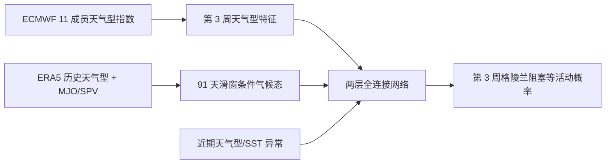

# 第 3 周欧洲天气型机会窗：MJO/SPV 条件气候态与统计—动力神经网络

> Fabian Mockert、Christian M. Grams、Sebastian Lerch、Julian Quinting，*Windows of opportunity in subseasonal weather regime forecasting: A statistical–dynamical approach*，*Quarterly Journal of the Royal Meteorological Society* **152(776)**, e70090，[正式开放全文](https://doi.org/10.1002/qj.70090)，**2026-01-02 首次在线发表**；同一成果于 [2025-05-05 arXiv:2505.02680v1](https://arxiv.org/abs/2505.02680)首发，不重复计篇。期刊在线版注明 **2026-01-22 更正 Figure 8**；本笔记 2026-09-25 以更正后的期刊正文、图 1–9 及[作者公开代码固定提交](https://github.com/fmockert/windowsofopportunity_WR/tree/5a4d545bd224f984a9e908d7b739af088c0895ec)复核，以下成绩**不再沿用旧预印本数字**。本文属**次季节预报**，不是 10–15 天逐格天气基础模型。

## 1. 研究对象与资料

研究问题不是“神经网络能否独立预报三周后的完整天气场”，而是：初始 MJO/平流层极涡（SPV）状态如何改变第 **3 周**北大西洋—欧洲天气型（尤其格陵兰阻塞）的发生率；ECMWF 集合预报是否在这些状态下真正更有技巧；条件气候态与 NWP 后处理能否改善预报。输入 ECMWF Cy46R1/Cy47R1 的 11 成员回报，每周一/四起报，0–46 天覆盖，合计约 **4000 初始日**。回报原始水平格距第 15 天前约 16 km、此后约 32 km，统一重网格到 1°；ERA5 重映射到相同网格、按起报和 lead 对齐作验证。研究只讨论延长冬季 **11–3 月**，第 3 周分析有 **21 个冬季、1720 次起报**；`NN_noNWP` 可利用 1979–2020/2021 更长的 ERA5 逐日资料。[方法§2.1、结果§3.1](https://arxiv.org/html/2505.02680v1)

天气型诊断区为 30–90°N、80°W–40°E。作者对 1979–2019 年 6 小时 Z500 做相对 91 天滑动季节气候态的异常、季节标准化和 **10 天截止周期的 Lanczos 低通**；取前七个 EOF 后 `k=7` 聚类成七个原型，再投影、归一化为七维天气型指数 IWR。这里的“10 天截止周期”不能误写成“20 天滤波宽度”。再预报与 ERA5 分别用模式自身 1999–2015、ERA5 1979–2019 的 91 天气候态订正，避免把模式 Z500 偏差误作天气型活动。气旋性型为 Atlantic Trough（AT）、Zonal Regime（ZO）、Scandinavian Trough（ScTr）；反气旋性型为 Atlantic Ridge（AR）、European Blocking（EuBL）、Scandinavian Blocking（ScBL）、Greenland Blocking（GL）。ZO/GL 近似 NAO 正/负位相，但七型不是一维 NAO 的另一种写法。[正式版 §2.2](https://rmets.onlinelibrary.wiley.com/doi/10.1002/qj.70090)

目标量有三个，不能混为一谈。`WRact_mean` 是先求一周七天 IWR 均值，再以大于 1 记该型活动；ERA5/单成员是 0 或 1，11 成员平均形成以 1/11 为步长的事件概率。`WRact_agg` 是七天中逐日 IWR 大于 1 的**日数占比**，ERA5/单成员以 1/7 递增，11 成员平均以 1/77 递增。七型可同时活跃；`WRact_max` 再从七型中选最大 `WRact_agg` 作唯一主导型，并列时取持续最长者。正式版的 **+5.8 个百分点**指这个七分类，不是逐格天气场。[正式版 §2.3、图 1/9](https://rmets.onlinelibrary.wiley.com/doi/10.1002/qj.70090)

MJO 采用 OLR 异常两主成分构造的 OMI，而不是包含 850/200 hPa 风的 RMM。91 天滑动气候窗内，选与当前 OMI 方向相差不超过 45°、振幅至少 1 的历史样本，并排除当前日期附近 ±45 天；以这些初始日相隔三周后的 `WRact_agg` 均值作 MJO 条件预报。SPV 则从同一季节窗中选与当前 SPV 数值最近的 5%，排除当前季节循环后求均值。二者都是**不依赖 NWP 的历史条件频率**，并非神经网络微调。[方法§2.6、图 2](https://arxiv.org/html/2505.02680v1)

SPV 条件气候态的选样规则与 MJO 不同：在 91 天季节窗内选历史 SPV 指数**距离当前值最近的 5%**，且剔除当前季节循环，随后平均对应的天气型活跃度。这相当于用近邻模拟大尺度强迫条件，而不是把天气场直接送入神经网络。MJO 使用的是 OLR 异常的前两个主成分；如果改用 RMM，机会窗相位不可机械沿用。[方法 §2.6](https://arxiv.org/html/2505.02680v1)

该图据原文方法及图 1–2、6–8 自绘。作者区分“气候机会窗”（初始相位之后的基础发生率 BR 变化）与“模式机会窗”（模式命中率 HR、虚警率 FAR 和 `PSS=HR−FAR` 相对中性状态的变化）。按起报日重抽样 1000 次、用 90% bootstrap 区间判断差异。**Type 2** 是 BR/HR/PSS 均上升；**Type 1** 是 BR/HR 上升但 PSS 下降；**Type 3** 则 BR 下降而 HR/PSS 上升。因而原文把弱 SPV 也称一种“model window”，不代表有真正更高的区分技巧。[方法§2.4–2.5、图 4](https://arxiv.org/html/2505.02680v1)

## 2. 神经网络训练参数

每个天气型/lead 单独训练一个全连接模型：两隐藏层 **64、16**，ReLU，层间 dropout **0.2**，sigmoid 单输出 `[0,1]` 活动度。输入每条特征序列只用**训练折**的最小/最大值缩放至 `[0,1]`，测试折可以超出此区间。最多 **50 epochs**、验证 early-stop patience **10**、初始学习率 **0.001**，5 个 epoch 无改善则×0.5，最低 **1e-6**，batch **32**。冬季 1720 样本分成四个连续块，每折 1290 训练/430 测试（1290 中还要分出内部验证），训练内部不打乱取 20% 验证；10 个独立随机初始化网络的输出取均值。正式正文没写明优化器与损失的最终选择，但[作者固定提交的训练脚本](https://github.com/fmockert/windowsofopportunity_WR/blob/5a4d545bd224f984a9e908d7b739af088c0895ec/05_run_neural_network_models.py)在主程序的**绝对活动度输出**支路使用 Keras `Adam(lr=0.001)`、`binary_crossentropy`，另记录 MSE 作指标，并设置 TensorFlow/NumPy 随机种子 **42**；网络也有未在主程序启用的线性输出误差支路。该仓库 README 说明**未含数据且路径/参数需适配**，所以源码默认值是公开实现证据，不能脱离发布 checkpoint/运行记录断言就是论文所有实验的逐次最终配置。论文/此脚本未显式给出权重衰减或总参数量。[正式版 §2.8](https://rmets.onlinelibrary.wiley.com/doi/10.1002/qj.70090)

| 网络版本 | 使用的特征池 | 训练资料差异 |
|---|---|---|
| `NN_all` | 季节气候态/条件气候态、初态 MJO/SPV/SST 等、ECMWF 天气型预报、近期天气型活动 | 依赖 ECMWF 回报期 |
| `NN_NWP+WR` | ECMWF 预报和近期观测/ERA5 天气型 | 不使用条件气候态与初态因子 |
| `NN_noNWP` | 气候态、初态因子、近期天气型；**不用 ECMWF** | 可用 ERA5 1979–2020 的更长每日训练期资料；与前两者训练样本量不等 |

逐步特征选择先单变量训练，再逐项加入使交叉验证 MSE 最低的变量，不同天气型/lead 单独执行。**正式版 §3.4.1/图 7**将 GL 的首选写为 ECMWF 第 3 周 **IWR 均值**，其紧随其后的同周 `WRact_agg` 因与 IWR 相关而未同时选入；第二个重要入选项是 **10 hPa SPV 条件气候态**，第三是起报 NAO，后续关键项还包括 **MJO/QBO/ONI 条件气候态**、PNA 和前两周 IWR 趋势。旧预印本解读曾写“最终未保留 MJO 特征”，**不能用于正式版**；不过 MJO 也并非 GL 入选顺序最前项，统计机会窗不等于在已有 NWP 信息时一定独立主导。其他型可纳入 AAO/ENSO 等，七型特征序列并不相同；周 2 趋势或相邻起报变化等直觉特征有时很靠后、有时被排除。[正式版 §3.4.1、图 7](https://rmets.onlinelibrary.wiley.com/doi/10.1002/qj.70090)

该研究不是天气基础模型的预训练—微调流程：它在固定回报/ERA5 特征上为每个天气型与 lead 从头训练小型后处理网络。10 个初始化的均值只减少网络随机性，不是 10 个 NWP 物理扰动成员。[方法 §2.7](https://arxiv.org/html/2505.02680v1)

## 3. 机会窗、条件发生率与模型性能逐图解读

| 原图/表 | 可核的图表内容 | 不应推出的结论 |
|---|---|---|
| 图 1 / 表 1–2 | 对照周均阈值 `WRact_mean` 与活跃天数占比 `WRact_agg`；表 1 给二值/概率列联表，表 2 给 BR、HR、FAR、PSS、Precision、F1。 | 把“命中多”直接等同“技巧高”，漏看误报和基础发生率。 |
| 图 2 | OMI 二维位相中的 ±45°、振幅至少 1 和当前日期 ±45 天剔除示意。 | 将 OMI 位相不加转换地套用 RMM 遥相关位相。 |
| 图 3 | 格陵兰阻塞 `WRact_mean` 整体观测/预报率约 **15%**、不活跃 MJO 约 **14%**；MJO 3 的观测率约 **6%**，MJO 8 约 **28%**。每位相起报样本远少于总计 1720。 | 用这些百分比作为全年或其他地区的固定阈值。 |
| 图 4 | MJO 7/8/1、弱 SPV 为**气候**高发生率窗口。MJO **8/1** 的 BR′、HR′、PSS′同为正，为 Type 2，但三项都显著仅位相 **1**。MJO **4** 在 GL 较少时 HR/PSS 却较高，为 Type 3。**弱 SPV** 虽 BR/HR 升，FAR 也升、`PSS′<0`，是 Type 1；**最弱 10% SPV** 则可呈 Type 2，不能混用两档。 | 把一般弱 SPV 的命中率改善说成 ECMWF 有更高辨识技巧。 |
| 图 5 | 无条件 GL `WRact_agg` 在冬季约 **15%–18%**。MJO 8 条件曲线从约 **12%（12 月）→30%（3 月）**；MJO 1 从约 **14%（12 月中）→23%（1 月）**、随后到 3 月约保持 20%。弱 SPV 提高 GL 活动，强 SPV 降低活动。 | 把群体条件发生率当个例校准概率，或混同图 3 的周均二值事件。 |
| 正式图 6，事件合成 | 对真实 GL 起始对齐后，NWP 信号一般最强；固定第 3 周约 **18 天 lead** 的相邻起报合成中，NWP 对 onset 的提升约晚 2 天，预测峰约在 onset 后第 **5 天**，ERA5 峰约第 **3 天**。MJO 条件气候态信号比 SPV 清楚。 | 合成只选**真实发生的 GL**，没有虚警案例；观测/预报采用不同纵轴，不能从合成图推断全样本技巧。 |
| 正式图 7 | GL 首选 NWP 第 3 周 IWR 均值，继以 10 hPa SPV 条件气候态、起报 NAO，后续含 MJO 条件气候态；七型特征排序不同。 | 特征入选不证明因果关系，也不说明 MJO 普遍主导所有天气型。 |
| **2026-01-22 更正后的正式图 8** | `MSESS_NWP=1−MSE_model/MSE_NWP`。`NN_all` 七型活动 MSE 均优于原始 NWP，降 **3.1%–11.0%**，ScBL 最大。原 NWP 对 EuBL/ScBL 难胜普通气候态，`NN_noNWP` 在两者上也胜 NWP；`NN_NWP+WR` 增益较小。对本来较有技巧的 GL，只有 `NN_all` 继续改善。 | 不能把单型最大增益说成所有型都改善 11%；无 NWP 版本使用更长训练期。期刊明确对**此图**有发表后更正，不用早期图直接读数。 |
| 正式图 9 | 主导型七分类 `WRact_max` 总准确率 **28.7%→34.5%**，即 **+5.8 个百分点**、约 **+20% 相对改善**。除 ScTr 外各型 HR 上升；FAR 在 ZO/ScTr/EuBL/ScBL/**GL** 降，AT/AR 反而升。 | 旧预印本解读的 31.6% / +2.9 点不是正式版结果；七分类改进不等于每型所有指标或逐格温度/降水技巧提高。 |

上述百分比按[正式版 §3 与图 1–9](https://rmets.onlinelibrary.wiley.com/doi/10.1002/qj.70090)正文明确印出的数字转录，不从曲线像素估造小数。特别须分开图 3–5 的**条件发生/辨识**、更正后的图 8 的**连续活动度 MSE**与图 9 的**主导型七分类准确率**：目标量和分母各异。`NN_noNWP` 对部分阻塞型有效很有启发，但训练资料比依赖 ECMWF 回报的网络更长，不能把网络间差异纯粹解释为某一输入源的因果效应。旧笔记的 **3.0%–9.7%**、**28.7%→31.6%** 已由正式版 **3.1%–11.0%**、**28.7%→34.5%** 取代，不能在索引中混用。

## 4. 复现风险

四折连续块交叉验证比随机划分更合理，但论文**明确承认**特征选择先跨所有折汇总、再在相同折上训练评价，存在轻微信息泄漏；作者认为影响小，却没有完全独立的外层测试来证明。严格外推应把特征选择嵌套在训练折内，条件气候态、归一化与超参也逐折只用训练资料重算。MJO 单个位相样本少、显著性采用 90% 而非 95% 区间；仅两个旧 ECMWF 业务循环、11 成员，不能代表近年系统。弱 SPV 情况尤其需同时报告预报频率、命中、虚警、PSS 和可靠性，避免把高基础率/高命中伪装成更高技巧。作者的神经网络是低维后处理器，不能当作已解决逐日 3 周天气场或局地极端值的证据。[方法§2.7、结果§3.1–3.3](https://arxiv.org/html/2505.02680v1)

对本库后续 AI 模型评估的直接启发是：在相同 ERA5 真值、冬季起报与七型指标下，对 MJO 与 SPV 分层，分别报告基础发生率/预报率、HR/FAR/PSS、连续活动 `WRact_agg` 的 MSE 技巧和唯一主导型的七分类准确率，并把动力集合成员与统计模型随机种子区分。这是依据论文机制提出的**评测建议**，不是作者已经完成的 AI 大模型跨模型比较。

[返回首页](../../README.md) · [返回总表](../../气象大模型_中期预报论文追踪.md)
