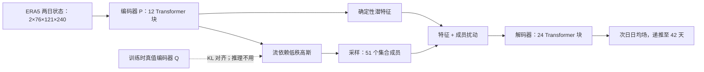

# FuXi-S2S：从日均场到 42 天的流依赖集合预报

> Lei Chen、Xiaohui Zhong、Hao Li、Jie Wu 等，*A machine learning model that outperforms conventional global subseasonal forecast models*，*Nature Communications* 15 (2024)，[正式论文](https://www.nature.com/articles/s41467-024-50714-1)；方法核查用 [arXiv:2312.09926v2，2024-07-05](https://arxiv.org/html/2312.09926)。首版预印本在 2023 年，按 **2024 年正式发表**纳入 2024–2026 目录；阅读于 2026-09-24。它与 15 天 FuXi / FuXi-ENS 是不同论文、不同任务。

## 一、科学问题与主要判断

第 3–6 周的日天气细节难以确定，但周平均降水、MJO 和遥相关可能保留可预报信号。FuXi-S2S 输出全球**逐日日均** 42 天集合：编码器同时读前两日 76 变量场，生成确定性特征和流依赖高斯潜分布；在潜空间采样后经解码器输出新一天。作者报告降水、OLR 的周平均技巧显著优于 ECMWF S2S 回报，但 2 米气温和 Z500 不具有同样显著的整体优势。MJO 有技巧预报时效从对照约 **30 天**推到 **36 天**，这是本文真正值得进一步验证的机制信号，而非“全部变量统治 42 天”。[摘要、结果 2.1–2.4](https://arxiv.org/html/2312.09926)

## 二、输入、架构、训练

ERA5 1950–2016 的 67 年逐日统计训练，2017–2021 五年测试；“72 年”指训练+评估总覆盖，不是 72 年训练。网格 1.5°（121×240），5 个高空量×13 层加 11 个地表量，共 76 通道，其中 SST 作为慢变量、OLR 关联 MJO。模型编码器 P 读前两天，12 个 Transformer 块生成 1536×60×120 特征及低秩高斯参数；从高斯中取样得到流依赖扰动，叠加到特征，再由 24 个 Transformer 块解码。训练时另有利用真值的编码器 Q，以 KL 距离约束 P 的分布；推理时只用 P，绝不可把 Q 的未来资料泄漏进回测。[方法 4.1–4.2、图 5](https://arxiv.org/html/2312.09926)

结构示意依论文图 5 独立重绘；保留“Q 仅训练使用”这个易被忽略的边界。单成员 42 天推理约 7 秒/A100，作者主实验取 51 成员，附录称 101 成员可继续改善，但不能直接与 11 成员 ECMWF 回报作完全同成员的技能比较。[方法和讨论](https://arxiv.org/html/2312.09926)

## 三、数据及公平比较

主比较使用 2017–2021 相同起报日期的 FuXi-S2S **51 成员**与 ECMWF C47r3 **11 成员回报**，重点是第 3 周（15–21 天）、4 周、5 周、6 周及跨周均值。异常气候态按模型分别建；2022 巴基斯坦洪水是实时模型个例，不能与主回报实验混合计算。降水可用 GPCP 独立资料核查；MJO 由卫星 OLR 与 U850/U200 构造 RMM 指数。[结果 2、方法 4.1/4.4](https://arxiv.org/html/2312.09926)

| 图表 / 指标 | 原文结论 | 反例与解释 |
| --- | --- | --- |
| 图 1，周平均 TCC | TP、OLR 相对 ECMWF S2S 的总体改善显著 | T2M、Z500 整体**不显著**；Z500 第 6 周和第 5–6 周可更差 |
| 图 2，三分类 RPSS 与第 90 百分位降水 BSS | 降水在更多热带及部分温带区域较气候态有技巧 | 两模型在许多温带地区 RPSS 仍非正；“较对手好”不等于“较气候态有技巧” |
| MJO RMM 技巧 | 约 **36 天 vs 30 天** | 与特定 MJO 指数、季节/初始化样本有关，应单独报告振幅和相位 |
| 2022 巴基斯坦洪水 / 显著性图 | 有可解释的前兆区域信号 | 单一事件、梯度显著图是关联性分析，不能证明因果机制 |

原文还指出 1.5° 明显粗于 ECMWF S2S 的物理网格，日均量缺乏 Tmax/Tmin，50 hPa 以上也未覆盖，ERA5 降水与地面实测可能偏离。独立复现应固定同起报、同回报气候态、同成员数抽样、GPCP 对照及区域分层；同时输出各周 TCC/RPSS/BSS 和可靠性，而非仅复述摘要的“全球优于”。[结果与讨论](https://arxiv.org/html/2312.09926)

[返回首页](../../README.md)
