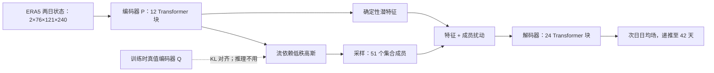

# FuXi-S2S：从日均场到 42 天的流依赖集合预报

> Lei Chen、Xiaohui Zhong、Hao Li、Jie Wu 等，*A machine learning model that outperforms conventional global subseasonal forecast models*，*Nature Communications* 15 (2024)，[正式论文](https://www.nature.com/articles/s41467-024-50714-1)；方法核查用 [arXiv:2312.09926v2，2024-07-05](https://arxiv.org/html/2312.09926)。首版预印本在 2023 年，按 **2024 年正式发表**纳入 2024–2026 目录；阅读于 2026-09-24。它与 15 天 FuXi / FuXi-ENS 是不同论文、不同任务。

## 一、科学问题与主要判断

第 3–6 周的日天气细节难以确定，但周平均降水、MJO 和遥相关可能保留可预报信号。FuXi-S2S 输出全球**逐日日均** 42 天集合：编码器同时读前两日 76 变量场，生成确定性特征和流依赖高斯潜分布；在潜空间采样后经解码器输出新一天。作者报告降水、OLR 的周平均技巧显著优于 ECMWF S2S 回报，但 2 米气温和 Z500 不具有同样显著的整体优势。MJO 有技巧预报时效从对照约 **30 天**推到 **36 天**，这是本文真正值得进一步验证的机制信号，而非“全部变量统治 42 天”。[摘要、结果 2.1–2.4](https://arxiv.org/html/2312.09926)

## 二、输入、架构、训练

ERA5 1950–2016 的 67 年逐日统计训练，2017–2021 五年测试；“72 年”指训练+评估总覆盖，不是 72 年训练。网格 1.5°（121×240），5 个高空量×13 层加 11 个地表量，共 76 通道，其中 SST 作为慢变量、OLR 关联 MJO。模型编码器 P 读前两天，12 个 Transformer 块生成 1536×60×120 特征及低秩高斯参数；从高斯中取样得到流依赖扰动，叠加到特征，再由 24 个 Transformer 块解码。训练时另有利用真值的编码器 Q，以 KL 距离约束 P 的分布；推理时只用 P，绝不可把 Q 的未来资料泄漏进回测。[方法 4.1–4.2、图 5](https://arxiv.org/html/2312.09926v2)

### 原始数据、预处理与训练/验证边界

| 环节 | 论文实际设置 | 为什么影响复现 |
| --- | --- | --- |
| 高空场 | ERA5 日统计的 Z、T、U、V、Q，各取 50、100、150、200、250、300、400、500、600、700、850、925、1000 hPa | 5×13=65 个高空通道；与原 FuXi 6 小时高分辨率目标不同 |
| 地表场 | T2M、D2M、SST、OLR、U10、V10、U100、V100、MSL、TCWV、TP | 共 11 通道；OLR 在 ERA5/ECMWF 命名对应负的顶层净热辐射 TTR |
| 空间与时间 | 全局 1.5°、121×240；连续两日状态输入，预测下一日日均场，迭代 42 天 | 直接评价日均/周均目标，不等于预报每日极值或逐 6 小时演变 |
| 年份 | 1950–2016 训练；2017–2021 主测试；2022 巴基斯坦洪水为另一个实时系统个例 | 测试期与洪水个例的 ECMWF 对手并不相同 |
| 归一化 | 对输入和输出变量做 z-score；高空每一气压层单独计算均值/标准差，且只用训练集统计量 | 不可把测试期统计量带回训练；也不能把所有垂直层共享一组尺度 |
| 异常基线 | 2017–2021 主评估用 2002–2016 模型各自回报气候态；2022 个例用 2002–2021 基期 | 以各模型自己的气候态消除平均偏差；基期更换会改变异常和技巧 |

ERA5 逐日资料源于 Copernicus CDS；作者另给出 NOAA CPC OLR 和 GPCP 降水的独立参考。ECMWF C47r3 回报覆盖 2002-01-03 至 2021-12-29、每周两次起报，FuXi-S2S 专门匹配相同起报日，并生成 2002–2016 的自身回报来建气候态。这些步骤决定了“相同日期比较”是否成立，而不只是表格里的两个最终分数。[方法 4.1、Data Availability](https://arxiv.org/html/2312.09926v2)

结构示意依论文图 5 独立重绘；保留“Q 仅训练使用”这个易被忽略的边界。单成员 42 天推理约 7 秒/A100，作者主实验取 51 成员，附录称 101 成员可继续改善，但不能直接与 11 成员 ECMWF 回报作完全同成员的技能比较。[方法和讨论](https://arxiv.org/html/2312.09926)

### 训练目标、课程学习与微调

编码器 P 从历史/预测状态估计低秩高斯分布，编码器 Q 在**训练**时用真值 `(X^t, X^{t+1})` 估计教师分布。每一步将 Q 采样的潜扰动送入解码器，优化 `L1(预测, 真值) + 10^-4 × KL(P,Q)`；推理改由 P 采样，所以 Q 不是推理依赖。作者还把当前 forecast lead 加入 P 的输入，让模型显式感知长滚动中逐步累积的误差；潜扰动是流依赖的，而不是对初值套固定噪声。[方法 4.2、式 1](https://arxiv.org/html/2312.09926v2)

| 训练参数 | 论文公开值 | 解读 |
| --- | ---: | --- |
| 自回归课程 | 从 1 步逐步增加到 17 步；每个阶段 1000 次梯度更新，共 **17,000 次** | 逐步优化多日 rollout，而非只训练单步后直接滚 42 天 |
| 优化器 | AdamW；β₁=0.9、β₂=0.95 | 与简单写“Adam”不同 |
| 初始学习率、权重衰减 | `2.5×10^-4`、`0.1` | 调度曲线和其余实现应以附录/代码再核对 |
| batch/硬件 | 8 张 NVIDIA A100；每卡 batch=1 | 文中没有在此声明混合精度、梯度累积与随机种子 |
| KL 权重 | `1×10^-4` | 太小/太大都会改变流依赖扰动与重建之间的平衡 |
| 主集合 | 51 成员 | 随潜分布重复采样；不能将成员数优势混同架构优势 |

论文没有写“从 15 天 FuXi 已训练权重微调出 FuXi-S2S”的微调流程；它说明的是 FuXi 风格的多步损失与**FuXi-S2S 自身的课程训练**。因此本笔记不把课程训练称作预训练后微调。作者报告潜特征中的流依赖扰动优于 Perlin 初值噪声加固定潜扰动；51 成员条件下额外 Perlin 噪声不再提高技巧，这也是集合构造的关键消融。[方法 4.2](https://arxiv.org/html/2312.09926v2)

## 三、数据及公平比较

主比较使用 2017–2021 相同起报日期的 FuXi-S2S **51 成员**与 ECMWF C47r3 **11 成员回报**，重点是第 3 周（15–21 天）、4 周、5 周、6 周及跨周均值。异常气候态按模型分别建；2022 巴基斯坦洪水是实时模型个例，不能与主回报实验混合计算。降水可用 GPCP 独立资料核查；MJO 由卫星 OLR 与 U850/U200 构造 RMM 指数。[结果 2、方法 4.1/4.4](https://arxiv.org/html/2312.09926)

评测前对 42 天输出逐变量去线性趋势：在 2002–2016 回报期拟合“年内第几周→周均趋势”，再将估得趋势从 2017–2021 的预报和观测同时减去。集合均值的 TCC 使用纬度加权；概率 RPSS 用**三分类**（各模型及观测按周/双周平均分别确定 tercile 边界）相对气候态评估，BSS 用第 90 百分位阈值的极端降水事件。MJO RMM 使用 OLR、U850、U200 的 15°N–15°S 平均，先把两模型重网格到 2.5°，再投影到观测 EOF；以双变量相关 `COR=0.5` 作为技巧阈值，同时拆看振幅和相位。图上浅色/打点是 **1000 次 bootstrap、97.5% 置信水平**的显著性编码，不是颜色深浅直接代表业务价值。[方法 4.4、图 1–3 图注](https://arxiv.org/html/2312.09926v2)

| 图表 / 指标 | 原文结论 | 反例与解释 |
| --- | --- | --- |
| 图 1，周平均 TCC | TP、OLR 相对 ECMWF S2S 的总体改善显著 | T2M、Z500 整体**不显著**；Z500 第 6 周和第 5–6 周可更差 |
| 图 2，三分类 RPSS 与第 90 百分位降水 BSS | 降水在更多热带及部分温带区域较气候态有技巧 | 两模型在许多温带地区 RPSS 仍非正；“较对手好”不等于“较气候态有技巧” |
| MJO RMM 技巧 | 约 **36 天 vs 30 天** | 与特定 MJO 指数、季节/初始化样本有关，应单独报告振幅和相位 |
| 2022 巴基斯坦洪水 / 显著性图 | 有可解释的前兆区域信号 | 单一事件、梯度显著图是关联性分析，不能证明因果机制 |

原文还指出 1.5° 明显粗于 ECMWF S2S 的物理网格，日均量缺乏 Tmax/Tmin，50 hPa 以上也未覆盖，ERA5 降水与地面实测可能偏离。独立复现应固定同起报、同回报气候态、同成员数抽样、GPCP 对照及区域分层；同时输出各周 TCC/RPSS/BSS 和可靠性，而非仅复述摘要的“全球优于”。[结果与讨论](https://arxiv.org/html/2312.09926)

[返回首页](../../README.md)
