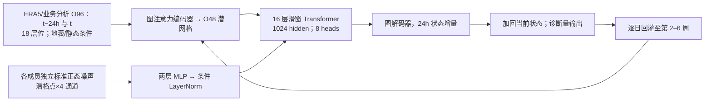

# AIFS-SUBS：把 AIFS-CRPS 改造为第 2–6 周概率预报

> Jakob Schloer、Steffen Tietsche、Christopher D. Roberts、Lorenzo Zampieri、Simon Lang、Gert Mertes、Gareth Jones、Matthew Chantry、Frederic Vitart，*AIFS-SUBS: Extending Data-Driven Forecasting to Sub-Seasonal Timescales*，[arXiv:2607.05100v1，2026-07-06](https://arxiv.org/abs/2607.05100)；[全文与附录](https://arxiv.org/html/2607.05100v1)。2026-09-24 核对全文、图 1–7、补图 A.1–A.2 和附录评分定义。它和[AIFS-CRPS 中期集合](../medium-range/37-aifs-crps.md)有方法继承，但属于**不同训练数据、步长、变量与评测目标**的独立 S2S 论文；不能重复充作 AIFS ENS v1/v2 的业务结果。

## 一、要解决的 S2S 难题与真实时效

研究目标是第 **2–6 周，约第 8–42 天**全球概率预报，论文还报告 46 天单成员推理的能耗。中期模型若保持 6h 步，至六周须约 240 次自回归；步数多、误差与偏差积累，且 MJO、平流层突然增温（SSW）等少数慢模态的独立样本本来就少。作者选择每日一步，把六周 rollout 降到约 42 步，并扩展平流层层次及向外长波辐射相关诊断；这是针对周尺度信号而设计，不等于把原中期模型直接无改动跑到 46 天。[引言、§2.2](https://arxiv.org/html/2607.05100v1)

两个名称必须区分：**AIFS-SUBS-ERA5** 从预训练到 rollout 微调始终使用 ERA5，作为竞赛条目 **AIFSgaia**；**AIFS-SUBS** 最后混合 ERA5 与 ECMWF 业务分析微调，面向以后用业务分析实时初始化。正文长期回报主图多用后者，2025–26 实时 AI Weather Quest 正式参赛的是前者。图 6 的带星号 AIFS-SUBS* 是前者以外的**非业务初始化对照**，不能把其名次当正式提交成绩。[§2.1、§3.4](https://arxiv.org/html/2607.05100v1)

## 二、数据年份、字段、网格和配准

| 资料/字段 | 使用方法 | 关键注意 |
| --- | --- | --- |
| ERA5 全球场 | 原资料 6h，重网格到 **O96 约 0.9°**；输入选两帧 `t−24h,t`，目标 `t+24h`。单步训练 **1979–2006、2012–2024**，整段 **2007–2011 留出**，任何阶段都不训练。 | 留出五年位于训练期两段之间，避免同年样本进入梯度，但**不是严格只用过去预测未来**的时间因果切分。ERA5 既可作模型初值又作多数验证真值；不能声称是完全独立观测验证。 |
| ERA5.1 平流层修正 | **2000–2006 年、≤300 hPa** 的 ERA5 数据换为 ERA5.1，修正原资料下平流层暖偏。 | 湿度仅用 **≥150 hPa**；100 hPa 及更高不使用湿度，作者称其分析质量会伤害训练。 |
| 高空预报/输入 | z、T、u/v 覆盖 2、5、10、30、50、70、100、150、200、250、300、400、500、600、700、850、925、1000 hPa，合计 **18 个层位**；q 在 ≥150 hPa 层。垂直速度 w 为诊断输出。 | 变量类型以原文表 1 为准，不能按“18 层”误说 q 在全部 18 层。 |
| 单层变量 | 10m u/v、2m T/露点、MSLP、地面气压、整层水汽、低/中/总云量、皮肤温度等为预报状态；降水、降雪、辐射等作为诊断输出；日照、海陆、地形及亚格点地形统计是强迫/静态输入。 | 表 1 在 HTML 中把部分云量又列入“诊断”行，且摘要称顶层净长波 `ttr` 为“predictor”，表 1 却列为 **diagnostic（仅输出）**。笔记保留这处文内口径冲突，不臆断它一定参与下一步状态回灌。 |
| 业务分析 | 面向实时报时的模型，rollout 微调用 **2020–2024** ECMWF 业务分析，并与 **2015–2019 ERA5** 样本混合、打乱组成 minibatch。 | 两来源的分辨率与海温/海冰下边界不同：ERA5 由 IFS 41r2、约 31km、外部日 SST/海冰；较新业务分析约 9km、50r1 使用耦合海洋/海冰。资料域移是关键干扰因素。 |

上表按[§2.1、表 1、§2.3](https://arxiv.org/html/2607.05100v1)逐项整理。原文没有公布每个变量的数值标准化均值、标准差、缺测填补代码和全部格点插值权重；不能把 AIFS-CRPS 的前代配置自动当成 SUBS 的全部细节。

## 三、结构、随机集合与相对于 AIFS-CRPS 的改动

整体为 graph-transformer 编码/解码 + **16 层滑动窗口 Transformer** 处理器，O96 数据映到 **O48 潜网格**，处理器 hidden 1024、**8 注意力头**，约 **230M 可训练参数**。每个成员抽标准正态噪声，维度为潜网格 × **4 噪声通道**，经两层 MLP 再通过条件 LayerNorm 注入处理器各层。模型对两帧状态输出 24h **增量**，加回当前状态；每个成员独立噪声并自回归到长期时效。随机噪声+概率损失使集合分布可训练，而非只对同一确定性模型反复改变初值。[§2.2](https://arxiv.org/html/2607.05100v1)

示意图按[§2.2](https://arxiv.org/html/2607.05100v1)重绘；回灌时仍需构成两帧状态，不代表直接把第 1 天的诊断降水当下一步 prognostic 输入。相较中期 AIFS-CRPS 的主要变化是 **6→24 h 步长、O96 数据/O48 潜格、平流层新层、顶层热辐射相关诊断和 S2S 验证方案**。论文没有说使用此前 AIFS-CRPS 已训练权重直接迁移；它明确重新做单步预训练，故“基于 AIFS-CRPS 架构/目标”不能写成已证实的权重级微调。[§1–2](https://arxiv.org/html/2607.05100v1)

## 四、训练和微调：完整日程与仍未公开的参数

| 阶段 | 资料与损失/目标 | 已公开配置 | 版本关系 |
| --- | --- | --- | --- |
| 24h 单步预训练 | 1979–2006、2012–2024 ERA5（指定层用 ERA5.1 修正），学 `t−24h,t→t+24h`；沿 AIFS-CRPS 使用基于 almost-fair CRPS 的集合目标，而不是确定性 MSE。 | 集合大小 **4**、有效 batch **16**、**300,000 iterations**、**16×A100**、约 **4 天**；AdamW + cosine，peak LR `1e−3`，warmup **1000 iterations**；全程维护 EMA 权重。 | 两版共同起点，未触碰 2007–2011。论文未说明是否加载独立 AIFS-CRPS 的公开预训练 checkpoint。 |
| ERA5-only rollout 微调 | **2015–2024 ERA5**，在自身预报上跑 **3 步/3 天**，AIFS-SUBS-ERA5。 | **50,000 iterations**、peak LR `5e−5`，同 batch 和硬件设置；EMA 延续。 | 仍是参数继续优化而非冻结主干；AI Weather Quest 用此版，AIFSgaia。 |
| 混合资料 rollout 微调 | **2015–2019 ERA5 + 2020–2024 业务分析**，样本打乱混合，3 步/3 天，AIFS-SUBS。 | 优化日程同上一行；业务分析包含多个 IFS cycle，有助减少单版依赖。 | 面向未来业务分析初始化；历史验证仍以 ERA5 为初值/真值，存在域移。 |

作者消融发现 rollout 超过 3 步**并未改善**评分，因此不能把“最大预报 42 天”误读成训练时 BPTT 42 步。原文未在此稿细列 weight decay、AdamW `β`、EMA decay、梯度裁剪、完整归一化统计、噪声 MLP 宽度、随机种子；若复现需从配置文件另查，不能照抄其他 AIFS 版本。[§2.3](https://arxiv.org/html/2607.05100v1)

## 五、验证协议为什么不能只看一个排行榜

**历史回报**：2007–2011 五年留出，每月 **1、7、13、19、25 日**起报，**10 成员**，周平均而非逐日瞬时场。各模型以自己的回报气候态作异常，使用“by-member–other-years”方法从剩余四年构造本年参照，减少短回报样本的偏差。平均绝对偏差 MAB/MABS 衡量长期系统偏移；异常集合用 finite-ensemble 修正的 fair CRPS/fCRPSS，看概率分布。面积权重按纬度余弦；**偏差改善与异常概率技巧改善是两件事**，不能互换。[§2.4、附录 A.1.2–A.1.3](https://arxiv.org/html/2607.05100v1)

**实时竞赛**：2025-08 中旬至 2026-02 中旬共 **29 个逐周起报**，第 3/4 周的陆地 2m 温、全球 MSLP、陆地总降水，以各自回报气候态划分**五分位概率**并算相对均匀气候态的 RPSS。每个目标日期用过去 **20 年**、同月日的 `−4,−2,0,+2,+4` 五个起报日期，每个 **10 成员**构建 **1000 个回报气候样本**；实时正式预测为 **200 成员**。29 期的 90% 置信区间来自 **1000 次起报日 bootstrap**，但六个月样本仍小。[§3.4、附录 A.1.1](https://arxiv.org/html/2607.05100v1)

对照 IFS 是业务 **49r1、51 成员**；FuXi-S2S 是竞赛中名为 Fengshun 的外部提交而非作者重新训练。带星号 AIFS-SUBS* 与 AIFS-ENS-v2* 被迫以 ERA5 初值回报/实时测试，尽管其业务预期是 50r1 分析初值；因此图 6 中带星号曲线仅作域移诊断，**不构成公平的业务优劣排名**。IFS 与 AIFS 的算力比较也非同分辨率/同垂直层：前者 O320/137 层、CPU，后者 O96/18 层、GPU；所报单成员 46 天 **约 200 倍低能耗、约 920 倍快**不能解释为同规格架构效率比。[§2.2、§3.4](https://arxiv.org/html/2607.05100v1)

## 六、图 1–7 与补图的性能和不利结果

| 图 | 已核验结论 | 证据边界 |
| --- | --- | --- |
| 图 1，训练/气候态流程 | 2007–2011 留出、24h 单步→3 天 rollout、历史回报气候态与实时预测的关系。 | “前后年份训练、中间年份验证”不等于前向时间测试；真正未来样本是 2025–26 竞赛。 |
| 图 2，五年回报偏差与 fCRPSS | 北半球/热带多数变量周 1–6 偏差低于 IFS；热带部分偏差改善 **>5%**。异常 fCRPSS 在北半球第 3 周后**多为与 IFS 相当**，热带对流层周 1–2 改善，平流层长时效改善较稳。 | 热带 **Z500 偏差更差**、MSLP 周 3 后相当；热带 T2m/T850/Z500 **周 5–6 概率技巧更差**。不能把“偏差小”概括为“所有周、所有变量概率技巧更好”。 |
| 图 3，MJO RMM/OLR | 全 RMM 相关大体不低于 IFS，但 fCRPSS **第 12 天后差异不显著**；只看 OLR 对流分量，相关>0.5 技巧 **33 天 vs IFS 25 天**，提高 **8 天**，幅度偏差也较小。 | 八天不是整个多变量 MJO 指数的统一延长值；仅五年、事件数少，作者明确提醒稳健性尚需更多实时样本。 |
| 图 4、A.1，MJO—热带气旋关系 | ERA5-only 版重现不同 MJO 相位下台风活动区域迁移，IBTrACS 为观测参考。 | 南太平洋 2–3 相位增强、西北太平洋北部 6–7 相位减弱不足；相位相关统计不等于逐个气旋路径/强度技巧。 |
| 图 5、A.2，SSW | 2009-01-13 起报案例中，AIFS-SUBS 约半数成员预测极涡破裂、IFS 0；五年 DJF 回报内 AI **112** 次日 10–36 SSW、**49%** 有强地表影响，IFS 为 **98/51%**。 | 独立验证期实际大事件仅四次，案例不能推为全样本显著胜出；复合的北欧冷干/南欧暖湿与 IFS 相近，不能只报 112>98。 |
| 图 6，29 周竞赛 | 三变量平均 RPSS，AIFS-SUBS-ERA5 略高于 IFS、显著高于 FuXi-S2S；MSLP 与 IFS 接近。 | **T2m 周 3/4 是 IFS 更好；降水周 3 AI 高于 IFS，但 FuXi-S2S 在周 3/4 的降水中央 RPSS 最高**。不是所有变量/周都夺冠。 |
| 图 7，周 3 空间分布 | 欧洲/欧亚 T2m 和 MSLP 有些显著有利区，亚洲热带降水有利。 | **热带太平洋 T2m/MSLP 显著退步**；部分干旱区低气候降水会放大相对技巧。图 7 格点 90% 显著与图 6 汇总 bootstrap 不可混为一指标。 |

图意均来自[原文 §3 与附录](https://arxiv.org/html/2607.05100v1)，表是独立汇整，不复制图片，不从曲线估读伪精确小数。尤其要把“集合训练大小 4、历史验证 10、竞赛实时 200、回报气候态每日期 1000”看成**四个不同目的的样本量**。

## 七、个人判断与可复现性清单

这篇最有价值的不是“全球第 3–6 周全面击败物理模式”，而是给出一条可核验的中期概率模型→S2S 变体路线：大步长减少递推次数、平流层与辐射变量补慢模态信息、按自身回报气候态评分，并把业务分析微调和 ERA5-only 实时竞赛版本拆开。平流层/OLR 成绩强，但地表变量晚周及热带太平洋存在明确失败区域；大步长还牺牲日变化，模型没有显式可演化陆面/海洋/海冰记忆。[§4](https://arxiv.org/html/2607.05100v1)

复现至少需锁定 O96→O48 网格映射、2000–06 ERA5.1 层替换、湿度层筛选、24h 两帧时间配对、4 通道随机噪声和 EMA、300k+50k 优化、两个微调资料混合方案、2007–11 五年封存、10 成员历史回报与 200 成员竞赛预测、1000 样本气候态及各对照 IFS 版本。还应从作者配置核对 `ttr` 及重复云字段究竟是否作 prognostic 回灌；原文 HTML 表与正文措辞在此有冲突，不能擅自填平。欲判断 S2S 全球可用性，需更长的严格前向、独立观测与气候年代/ENSO/SSW 分层验证，特别是周 5–6 地表和热带太平洋不利区域。

[返回首页](../../README.md)
